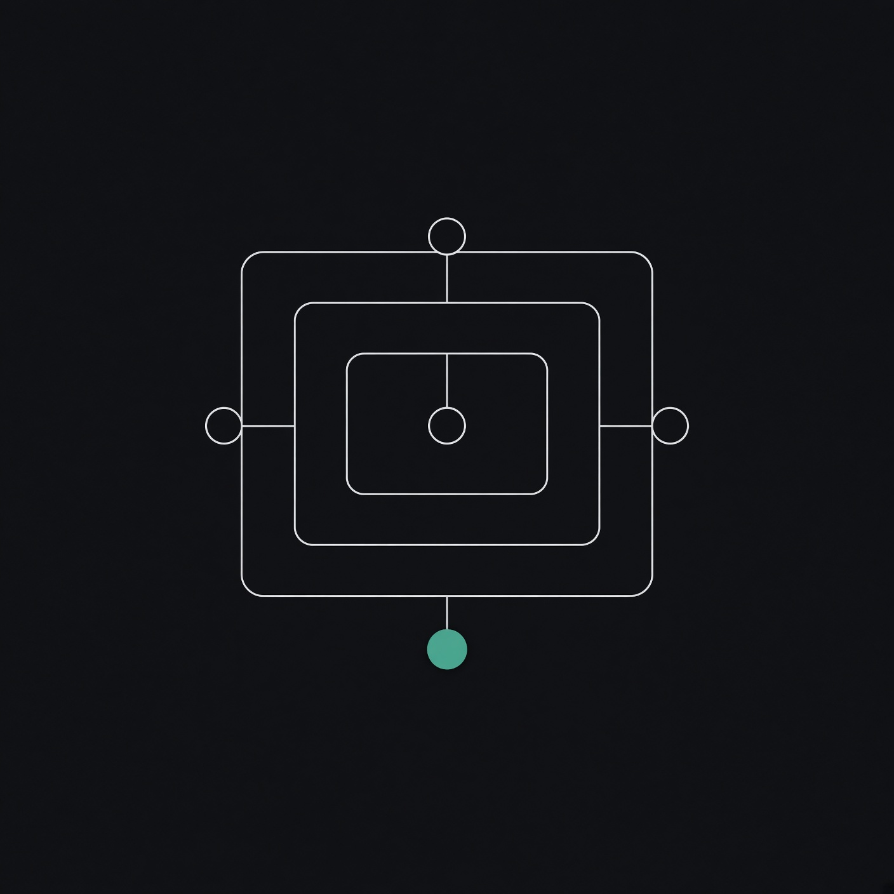
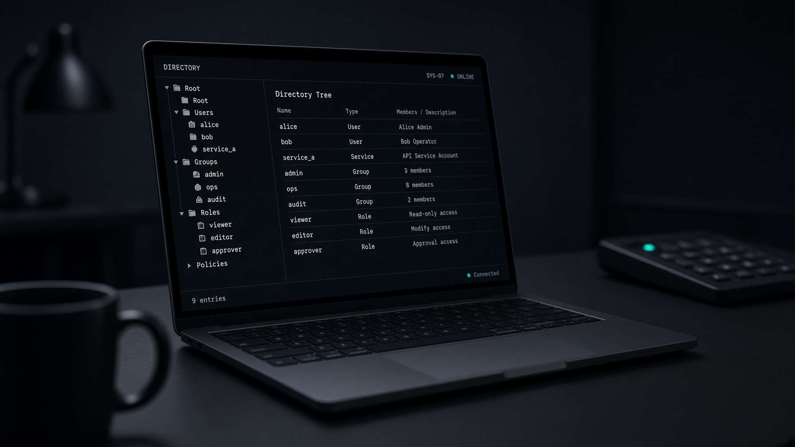

<p align="center">
  
</p>

<h1 align="center">LabLDAP</h1>

<p align="center">
  <strong>A disposable LDAP laboratory.</strong><br />
  Real LDAP on the wire. A Go control plane for REST, MCP, and a browser UI.<br />
  Directory Manager never touches the long-running service.
</p>

<p align="center">
  <a href="https://hilather.github.io/go-lab-ldap-mcp/">Site</a> ·
  <a href="docs/guides/quickstart.md">Quick start</a> ·
  <a href="docs/guides/user-guide.md">User guide</a> ·
  <a href="docs/guides/scenario.md">Scenario YAML</a> ·
  <a href="docs/guides/deploy.md">Deploy</a> ·
  <a href="docs/mcp/catalog.md">MCP catalog</a>
</p>

<p align="center">
  
  
  
  
</p>



LabLDAP is a control plane around a directory engine. v0.3.0 ships the
Go-native engine (`labldapd`) as the **default** and keeps pinned **389
Directory Server** as the oracle and rollback (`engine: 389ds`) with
[LabLDAP-surface parity](docs/design/native-engine-parity-contract.md)
([ADR-0008](docs/adr/0008-dual-directory-engines.md)).

The Go process bootstraps a lab suffix, then exposes the same authorized
operations over HTTPS, Model Context Protocol, and an embedded UI. Directory
Manager never touches the long-running control service.

Use it when you need a **real directory** to exercise clients, agents, bind
paths, ACIs, and schema — without standing up production 389 DS by hand, and
without giving Directory Manager to a daemon that lives for the rest of the
afternoon.

## Why this exists

Most LDAP “labs” are one of two things: an in-memory fake that lies about the
protocol, or a raw 389 DS container that leaves Directory Manager sitting in an
environment variable forever.

LabLDAP splits the job the way an operator would:

| Role | Process | Privilege |
| --- | --- | --- |
| **directory** | long-running `labldapd` (default) or 389 DS | owns `/data` |
| **bootstrap** | one-shot `labldap-bootstrap` | Directory Manager, via a secret file, then exits |
| **control** | long-running `labldap` | restricted service account. No DM secret. No Docker socket. |

REST, MCP, and the UI call the same application services and the same scope
policy. Create a user in the browser, fetch it over `/api/v1`, search it with
`ldapsearch`, and an agent can see it through `ldap_get_entry`.

## Quick start

You need Docker Engine 24+ and Compose v2.24+. From a clone:

```bash
git clone https://github.com/hilather/go-lab-ldap-mcp.git
cd go-lab-ldap-mcp
make compose-up
```

That builds the local images, mints lab secrets and a lab CA, starts
`labldapd`, runs bootstrap, and brings the control plane up. Use
`make compose-up-389ds` for the pinned 389 DS stack.

| Surface | Where |
| --- | --- |
| UI | https://127.0.0.1:8443/ |
| REST | https://127.0.0.1:8443/api/v1 |
| MCP (HTTP) | `POST https://127.0.0.1:8443/mcp` |
| LDAP / StartTLS | `ldap://127.0.0.1:3389` |
| LDAPS | `ldaps://127.0.0.1:3636` |
| Health | `GET /health` · ready: `GET /health/ready` |

Sign in to the UI with the contents of `secrets/token-admin` (generated, gitignored).
The same value is the bearer for REST and HTTP MCP.

```bash
TOKEN=$(tr -d '\n' < secrets/token-admin)
curl -sk -H "Authorization: Bearer $TOKEN" \
  https://127.0.0.1:8443/api/v1/users
```

Tear it down with `make compose-down`. Wipe the lab with `make compose-reset`.

Full walkthrough: **[docs/guides/quickstart.md](docs/guides/quickstart.md)**.

## What you get

- **A real LDAP engine.** Default is `labldapd` (bbolt store). 389 DS is
  still first-class (`engine: 389ds`, pinned by digest). Users, groups,
  memberships, and passwords live in the directory — not in Go maps.
- **A browser UI.** Users, groups, search, bind test, schema, audit, LDIF
  export, and a gated soft reset.
- **A versioned REST API.** OpenAPI 3 at [`api/openapi.yaml`](api/openapi.yaml).
- **MCP, two transports.** Streamable HTTP (`POST /mcp`) and `labldap mcp-stdio`.
  Read tools are on by default. Mutations, passwords, reset, and export register
  only when you ask for them.
- **Declarative labs.** A `labldap.dev/v1alpha1` scenario file is the baseline.
  Users, groups, ACLs, and tokens live in YAML. Soft reset restores it. Hard
  reset is Compose volume removal, not an API. See
  **[docs/guides/scenario.md](docs/guides/scenario.md)**.
  A published or LAN `Host` needs `spec.management.allowedHosts` (ADR-0010).
- **Ephemeral or persistent.** Default `make compose-up` uses tmpfs-backed
  `/data`. `make compose-up-persistent` keeps a named volume.

## Talk to it from an agent

```bash
labldap mcp-stdio --config /path/to/scenario.yaml --token-file secrets/token-admin
```

Protocol bytes go to stdout. Logs go to stderr. Missing credentials exit
before the protocol starts. Point an MCP client at that command, or at
`POST /mcp` with `Authorization: Bearer`.

Read tools (`ldap_search_entries`, `ldap_get_entry`, capabilities, baseline)
are registered when MCP is enabled. Write, password, reset, and export tools
stay off until `spec.management.mcp.register*` is set in the scenario.

Catalog: **[docs/mcp/catalog.md](docs/mcp/catalog.md)**.

## Declare users and groups

The lab tree is a YAML scenario, not a Go map. Bootstrap compiles
[`deploy/compose/scenario.yaml`](deploy/compose/scenario.yaml) into real
directory entries.

```yaml
spec:
  directory:
    suffix: "dc=example,dc=test"
  users:
    - id: alice
      uid: alice
      passwordFile: /run/secrets/user-alice
      enabled: true
      attributes:
        givenName: Alice
        sn: Anderson
  groups:
    - id: staff
      members:
        - user: alice
```

Passwords are file references, never inline. Groups cannot be empty
(`groupOfNames`). The UI and REST can add more users after start; soft reset
restores this file. Full rules and ACL example:
**[docs/guides/scenario.md](docs/guides/scenario.md)**.

## Safety model

LabLDAP is a laboratory. It is not a production identity system.

1. **LDAP bind is against the directory engine, not the Go control plane.** Point `ldapsearch`, apps, and simple bind at `ldap://127.0.0.1:3389` / `ldaps://127.0.0.1:3636`. The control plane is HTTPS only (UI, REST, MCP). It is an LDAP *client*. The default listener is `labldapd`; in 389 mode it is 389 DS. Neither `labldap` nor `labldap-bootstrap` listens for LDAP.
2. The selected engine is the source of truth for users, groups, memberships, and passwords.
3. The control plane never mounts the Docker socket.
4. Directory Manager is bootstrap-only.
5. Static bearer tokens are an explicit lab mode, not an accident.
6. Ephemeral tmpfs is not a forensic wipe — host swap can still hold pages.
7. Soft reset restores the compiled suffix. It does not delete the volume.
8. First usable release: one engine instance. `spec.directory.suffix` is the primary managed suffix; optional `additionalSuffixes` add sibling naming contexts in the same lab (ADR-0011). Engine default is `labldapd` (v0.3.0). Set `engine: 389ds` to keep 389 DS.
9. Active Directory emulation is out of scope.
10. Native Go engine (`labldapd`) is the omitted-field default under ADR-0008. It is a laboratory directory, not a production identity system. 389 DS remains the behavioral oracle.

Management TLS in the shipped compose stack is a **lab certificate**. Trust
`secrets/tls/ca.crt` on the default native stack (ephemeral and persistent).
The 389 rollback stack uses `secrets/tls/instance-ca.crt` for ephemeral
and `secrets/tls/ca.crt` for persistent. Bind the management listener to
loopback, which compose already does.

## Documentation

| Guide | For |
| --- | --- |
| [Quick start](docs/guides/quickstart.md) | First lab in one sitting |
| [User guide](docs/guides/user-guide.md) | UI, REST, LDAP clients, MCP, reset, export |
| [Deploy](docs/guides/deploy.md) | Images, compose modes, secrets, TLS, operations |
| [Operator guide](docs/operations/operator-guide.md) | Day-2 limits and failure modes |
| [Troubleshooting](docs/operations/troubleshooting.md) | Ready checks, TLS, tokens, vanished entries |
| [MCP catalog](docs/mcp/catalog.md) | Tools, resources, scopes |
| [Release notes](docs/release/notes.md) | v0.3.0 contents and residuals |

Architecture and design live under [`docs/`](docs/). Contributing:
[`CONTRIBUTING.md`](CONTRIBUTING.md).

## Develop

```text
make verify              # format, lint, generate, unit, security, SBOM, arch
make test-integration    # real 389 DS (Docker)
make test-integration-native  # same suite against in-process labldapd
make image               # labldap-control:dev
make image-bootstrap     # labldap-bootstrap:dev
```

Images are local (`labldap-control:dev`, `labldap-bootstrap:dev`). They are
not pushed to a public registry.

## Status

**v0.3.0** — omitted `spec.directory.engine` and `make compose-up` now
select native `labldapd`. 389 DS remains available as `engine: 389ds` /
`make compose-up-389ds`. See [release notes](docs/release/notes.md).

No project license file yet; treat it as source-available until one is added.

```
github.com/hilather/go-lab-ldap-mcp
```
