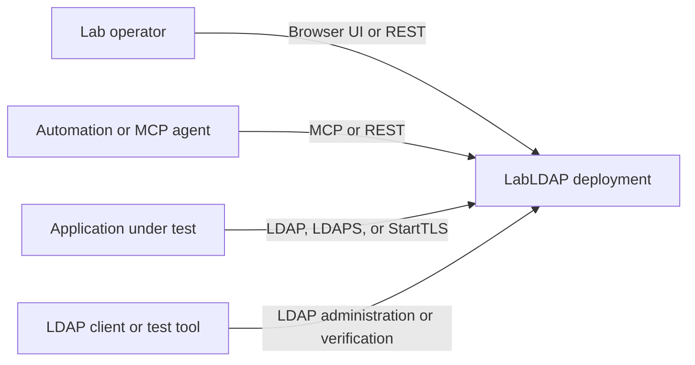
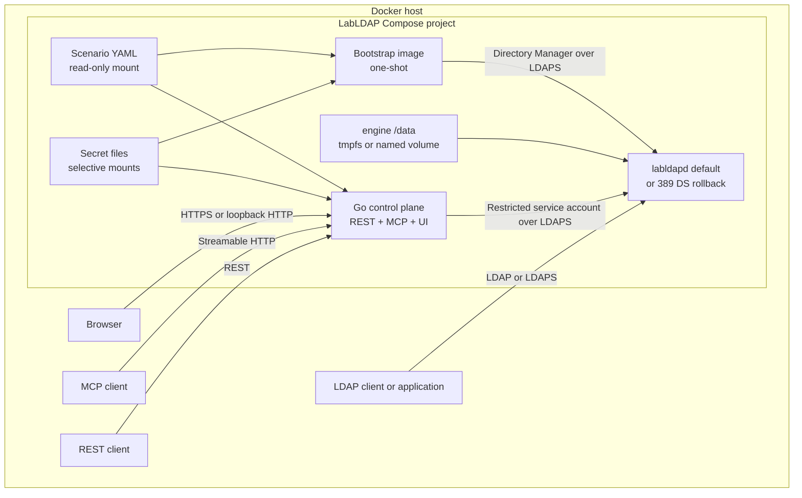
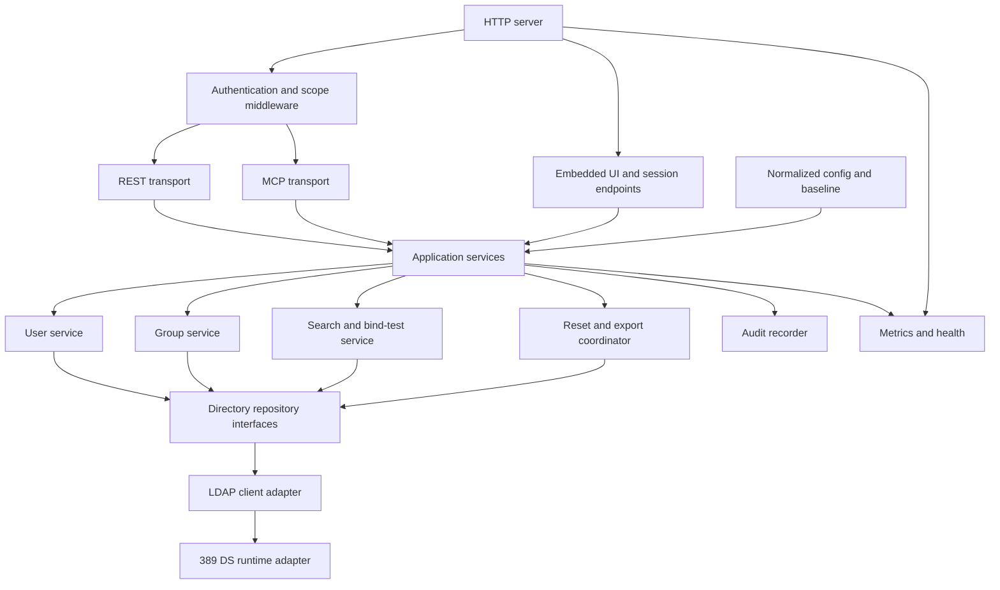
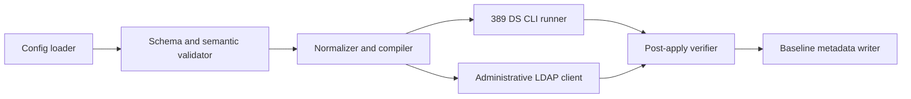
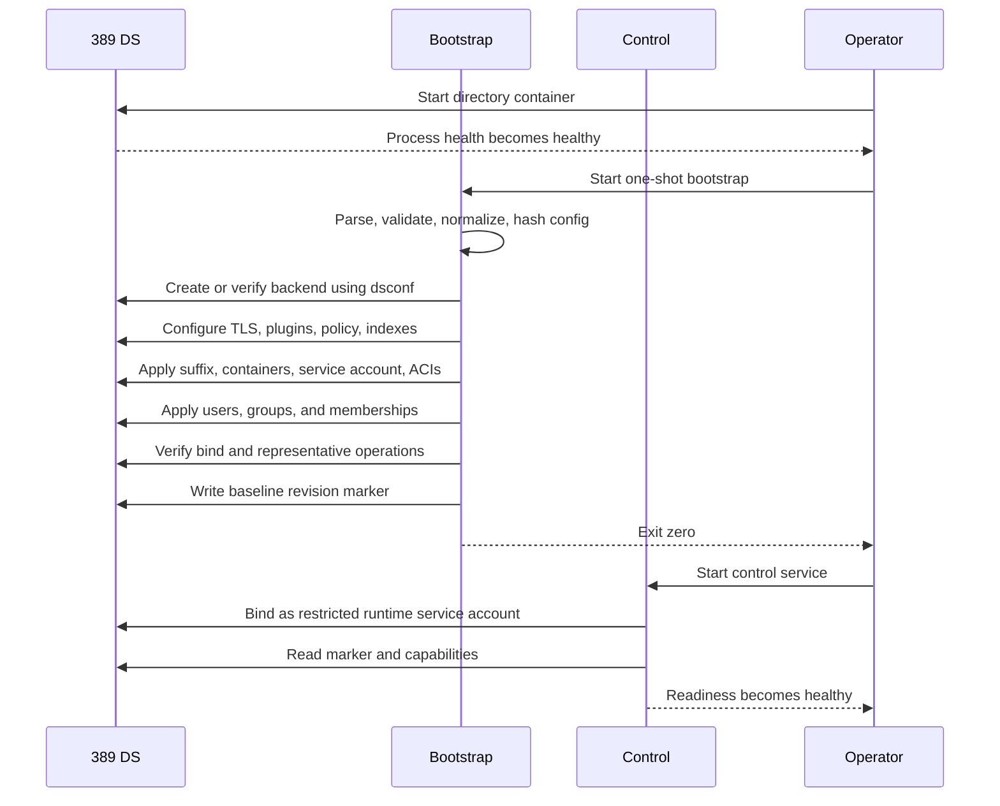
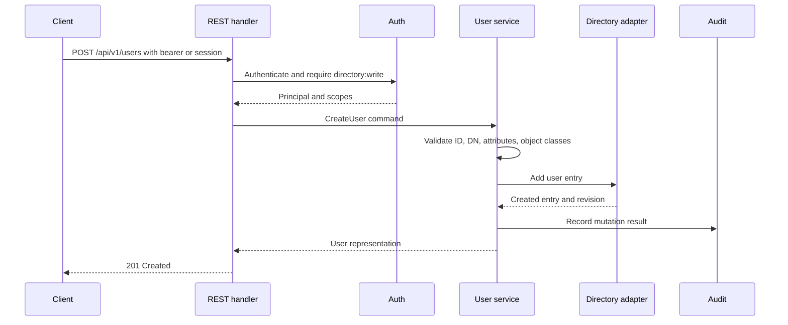
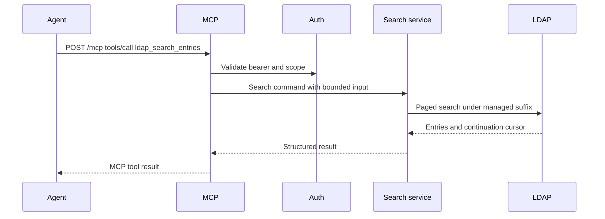
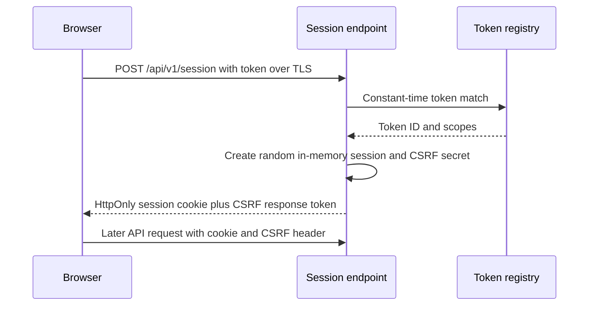
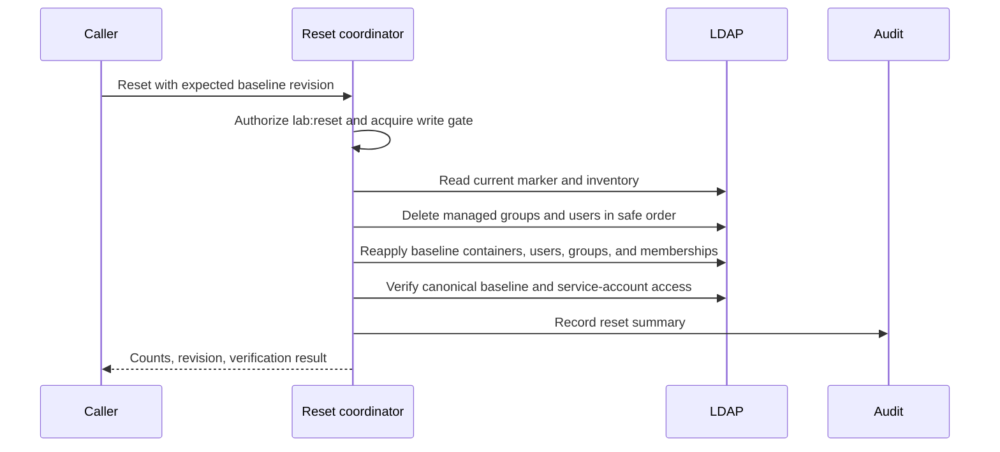

# System Architecture

## 1. Architecture summary

LabLDAP is a control plane around a directory engine. The architecture deliberately separates engine bootstrap privileges from runtime management privileges. The omitted-field default is the native engine (`labldapd`). [ADR-0008](adr/0008-dual-directory-engines.md) keeps pinned 389 Directory Server as the behavioral oracle and first-class rollback (`engine: 389ds`). Both engines share the same three lifecycle roles.

There are three lifecycle roles:

- **Directory:** the long-running engine (389 DS or `labldapd`) and the authoritative data store.
- **Bootstrap:** a one-shot process that validates configuration, creates the backend, configures engine features, applies baseline data, creates the runtime service account, and verifies the resulting system.
- **Control:** the long-running Go service that serves REST, MCP, UI assets, sessions, audit, health, and metrics while reading and writing directory data with a restricted LDAP identity.

## 2. Architecture principles

1. Use the mature directory engine for protocol, policy, schema, and access-control behavior.
2. Keep one source of truth for all clients.
3. Separate bootstrap authority from runtime authority.
4. Keep transport adapters thin and share application services.
5. Make configuration compilation deterministic and testable without LDAP.
6. Make every external operation bounded, cancellable, authorized, and auditable.
7. Favor a small supported domain API over an unrestricted LDAP proxy.
8. Treat reset as a coordinated application operation, not container control.
9. Expose capabilities instead of pretending all engines or versions support identical behavior.
10. Default to secure behavior, with explicit lab-only exceptions.

## 3. System context



## 4. Container architecture



### Container privilege separation

| Secret or capability | Directory | Bootstrap | Control |
| --- | ---: | ---: | ---: |
| Directory Manager password | Yes | Yes | No |
| Runtime LDAP service password | No, except as stored hash | Yes | Yes |
| Seed user password files | No, except as stored hashes | Yes | Yes only when soft reset is enabled |
| Management API token files | No | No | Yes |
| Docker socket | No | No | No |
| Write to engine `/data` | Engine only | No direct filesystem write | No |
| LDAP write to managed suffix | Engine | Yes | Yes, restricted |
| LDAP write to `cn=config` | Engine | Yes during bootstrap | No |

## 5. Go control-plane component architecture



### Component responsibilities

#### HTTP server

- Listen on the configured management address.
- Apply request IDs, panic recovery, size limits, timeouts, security headers, logging, and metrics.
- Route `/api/v1`, `/mcp`, `/health`, `/metrics`, and UI assets.
- Shut down gracefully on process cancellation.

#### REST transport

- Decode and validate HTTP-specific inputs.
- Map authenticated principal and request metadata to application commands.
- Render typed responses and problem details.
- Enforce HTTP preconditions such as `If-Match`.
- Contain no LDAP filters or directory-specific mutation logic.

#### MCP transport

- Register tools and resources with the official Go SDK.
- Convert MCP inputs to application commands.
- Map application errors to structured tool failures.
- Apply tool metadata and scope requirements.
- Contain no REST client and no direct LDAP access.

#### Web and session layer

- Serve embedded frontend assets with SPA fallback.
- Exchange a valid static token for a short-lived server-side session.
- Set secure, HTTP-only cookies and enforce CSRF protections for cookie-authenticated mutations.
- Never return or persist raw bearer tokens.

#### Application services

- Enforce domain validation, scopes, mutation locks, reset exclusivity, audit behavior, and business rules.
- Call directory repository interfaces.
- Produce transport-neutral result types.
- Own user, group, membership, search, bind test, reset, export, capability, and baseline use cases.

#### Directory repository interfaces

- Define user, group, entry, schema, search, bind, reset-support, and export operations.
- Hide LDAP library types from the application layer.
- Return structured errors such as not found, conflict, invalid credentials, constraint violation, unavailable, and forbidden.

#### LDAP client adapter

- Manage connection creation, TLS, bind, pooling, cancellation, paging, escaping, and LDAP result-code mapping.
- Enforce base-DN boundaries and operation limits.
- Provide low-level primitives used by the 389 DS runtime adapter.

#### 389 DS runtime adapter

- Map domain user and group operations to the configured object classes and attributes.
- Read Root DSE, schema, capabilities, operational attributes, and password/account state.
- Implement managed-suffix inventory, dependency-safe deletion, baseline apply, and export.

#### Audit recorder

- Record security and mutation events with actor, action, target, result, request ID, source, and duration.
- Redact credentials and secret values.
- Use structured logs in the first release; permit a persistent sink later.

## 6. Bootstrap component architecture



Bootstrap has two classes of operation:

1. **Engine operations:** backend creation, plugin configuration, password policy, indexes, and other 389 DS-specific settings. These may use `dsconf` in the bootstrap image with password-file authentication.
2. **Directory-data operations:** suffix root, containers, service account, ACIs, users, groups, memberships, and metadata. These use LDAP operations with the Directory Manager identity.

The bootstrap process writes a metadata entry beneath the managed suffix containing the normalized configuration revision and applied version. The control plane reads this marker at readiness time.

## 7. Data ownership

| Data | Authoritative owner | Notes |
| --- | --- | --- |
| User and group entries | 389 DS managed suffix | Includes runtime mutations. |
| Group membership | 389 DS group `member` attributes | `memberOf` is derived by plugin. |
| Password hashes and account state | 389 DS | Never returned by APIs. |
| Directory ACIs | 389 DS entries | Generated at bootstrap from configuration. |
| Password policy | 389 DS configuration | Changed only through bootstrap in the first release. |
| Normalized baseline | Control process memory | Recompiled from YAML and secret references at startup. |
| Baseline revision marker | 389 DS metadata entry | Contains no secrets. |
| Management tokens | Secret files and control memory | Raw values never written to 389 DS. |
| Browser sessions | Control process memory | Lost on restart by design. |
| Audit events | Structured process output | Persistent sink deferred. |
| UI assets | Embedded in Go binary | Built from frontend lock file. |

## 8. State model

### 8.1 Engine state

389 DS stores all instance state beneath `/data` in the container integration. Deployment selects:

- `ephemeral`: `/data` is a tmpfs mount.
- `persistent`: `/data` is a named or host-managed volume.

The application never assumes that ephemeral state survives container recreation. Persistent state must be reconciled according to the configured startup mode.

### 8.2 Configuration state

The configuration loader creates:

1. Raw parsed configuration.
2. Defaulted configuration.
3. Semantically validated configuration.
4. Normalized configuration with resolved DNs and ordered attributes.
5. Compiled engine plan and baseline directory plan.
6. A revision hash over the non-secret normalized structure and secret content fingerprints.

Secret values are included in the revision through a one-way digest so password changes can trigger a new baseline revision without exposing the values.

### 8.3 Runtime state

Runtime-created or modified users and groups are ordinary entries in 389 DS. The Go process maintains no authoritative object cache. It may cache schema and capabilities with bounded lifetime.

### 8.4 Reset state

Reset uses a process-wide write gate with states:

```text
Ready -> PreparingReset -> Resetting -> Verifying -> Ready
                         \-> Failed
```

Reads may remain available during parts of reset only if they can be made semantically clear. The first release should return `503 reset_in_progress` for directory reads and writes once mutation begins to avoid inconsistent results.

## 9. Key sequences

### 9.1 Cold start and bootstrap



If bootstrap exits non-zero, Compose must not start the control service as ready.

### 9.2 REST user creation



### 9.3 MCP search



### 9.4 Browser token exchange



### 9.5 Soft reset



## 10. Trust boundaries

1. **External network to management plane:** untrusted HTTP and MCP inputs.
2. **External network to LDAP:** untrusted LDAP clients and applications.
3. **Control plane to directory:** authenticated LDAPS with limited service-account rights.
4. **Bootstrap to directory:** temporary high-privilege administrative channel.
5. **Host to containers:** operator-controlled configuration, secrets, mounts, and network publication.
6. **Browser to UI session:** cookie and CSRF boundary.

The security document defines controls at each boundary.

## 11. Availability and readiness

### Liveness

The control process is live when its main event loop and HTTP listener are operational. Liveness must not depend on LDAP availability, or an LDAP outage could cause restart loops.

### Readiness

The control service is ready only when:

- Configuration is valid.
- The runtime LDAP bind succeeds.
- The managed suffix and baseline marker exist.
- The applied revision matches the expected revision under the selected startup mode.
- Required capabilities are present.
- No reset is active.

### Degraded mode

When LDAP becomes unavailable after startup:

- Health liveness remains healthy.
- Readiness becomes unhealthy.
- UI assets and a diagnostic status endpoint remain available.
- Directory operations return a stable `directory_unavailable` error.
- The client adapter reconnects with bounded exponential backoff and jitter.

## 12. Failure modes

| Failure | Required behavior |
| --- | --- |
| Invalid YAML or semantic configuration | Bootstrap exits before mutation with field-level errors. Control refuses readiness. |
| 389 DS process not reachable | Bootstrap retries within configured startup deadline, then fails. |
| Backend exists with different suffix | Fail safely and report conflict; do not repurpose it. |
| Applied revision differs in `validate` mode | Report drift and exit non-zero without mutation. |
| Applied revision differs in `merge` mode | Upsert configured objects and preserve extras. |
| Applied revision differs in `reset` mode | Replace managed data with baseline. |
| Runtime service account cannot bind | Bootstrap fails; control never receives Directory Manager fallback. |
| ACI compiler output rejected | Bootstrap fails and reports ACL name and server diagnostic. |
| Reset interrupted | Service remains not-ready; next startup uses configured reconciliation mode to recover. |
| Export exceeds limits | Abort with explicit limit error; do not return partial success silently. |
| Browser session lost on restart | User returns to login; directory state is unaffected. |
| Token file unreadable | Control fails closed and reports the token ID and file path, not content. |

## 13. Concurrency model

- User and group operations may run concurrently when they affect independent entries.
- Membership updates on the same group are serialized by a keyed lock or optimistic revision check.
- Reset acquires an exclusive global mutation gate.
- Export takes a consistent best-effort read and records the start revision; a fully transactional snapshot is not promised in the first release.
- Connection-pool size and concurrent LDAP operations are bounded by configuration.
- Every operation carries context deadlines.

## 14. Scalability assumptions

The first release is optimized for disposable labs rather than high availability:

- One control replica.
- One 389 DS instance.
- Up to approximately 10,000 users and 1,000 groups in the reference test profile.
- Paginated UI and API lists.
- Bounded exports and searches.
- No distributed session store or distributed reset lock.

A future multi-replica control plane would require shared sessions or stateless browser authentication, a distributed mutation/reset lock, and careful readiness behavior. That is explicitly deferred.

## 15. Extension points

- `DirectoryRepository` allows a second in-repo engine (`native` / `labldapd`, ADR-0008) and future OpenLDAP, Samba AD, or embedded-test implementations.
- Capability reporting allows engine-specific UI and tool behavior. Vendor strings differ by engine (parity Delta D1).
- `TokenAuthenticator` allows OAuth-compatible resource-server validation later.
- `AuditSink` allows file, syslog, OpenTelemetry, or database sinks.
- `SecretResolver` allows Docker secrets, environment variables for development, or external secret stores.
- Configuration `apiVersion` supports future migration.

## 16. Architecture validation checkpoints

Before moving to the next implementation milestone, prove:

1. The configuration compiler is deterministic.
2. A real 389 DS backend can be created from an empty container using the bootstrap image.
3. The runtime service account can perform allowed operations and is denied `cn=config` access.
4. The same application command can be invoked by a unit test, REST handler, and MCP tool without transport coupling.
5. Reset restores the baseline after direct LDAP and API mutations.
6. The control container has no Directory Manager secret and no Docker socket.
7. When native mode is enabled, Contract-tier behaviors in `docs/design/native-engine-parity-contract.md` match 389 DS (oracle) in `test/parity`.
