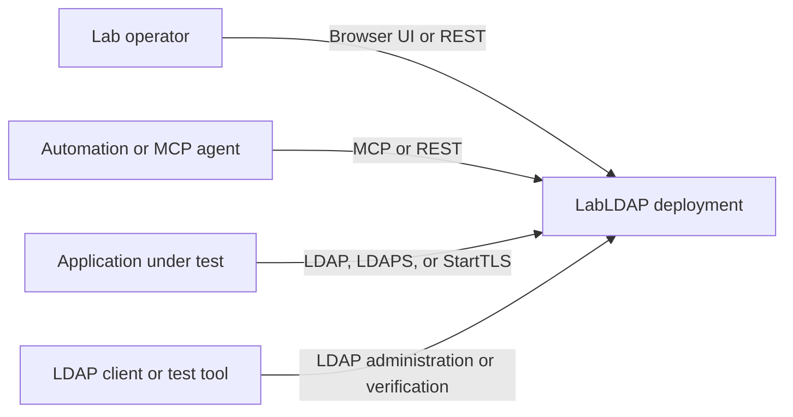
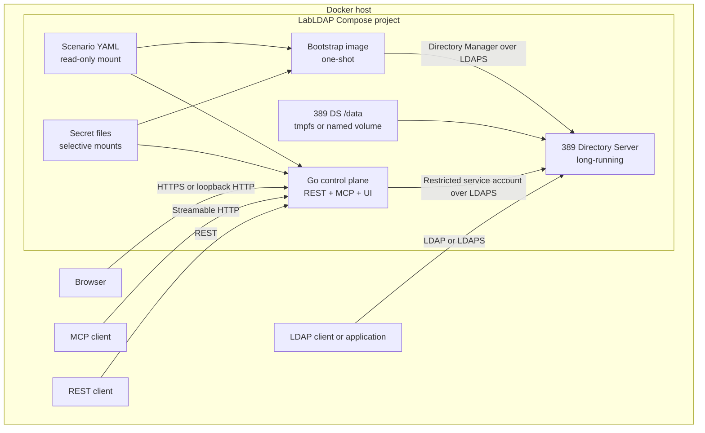
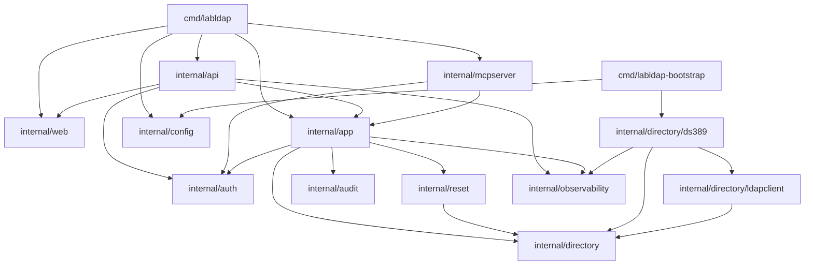
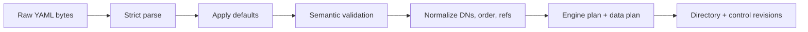
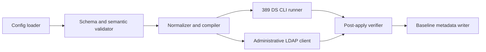
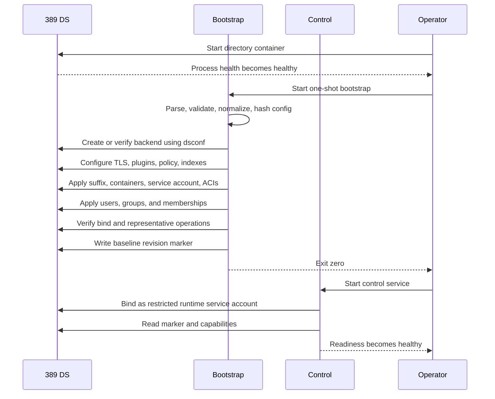
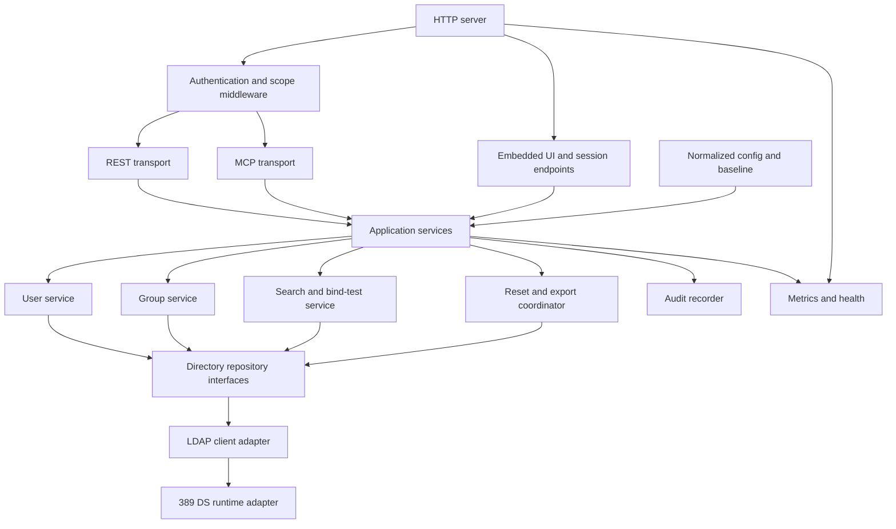
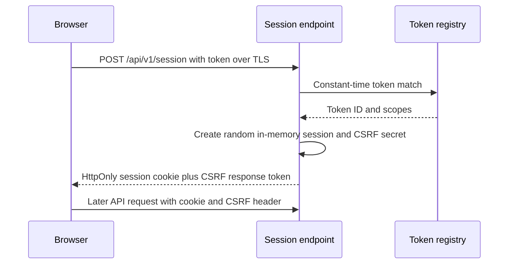
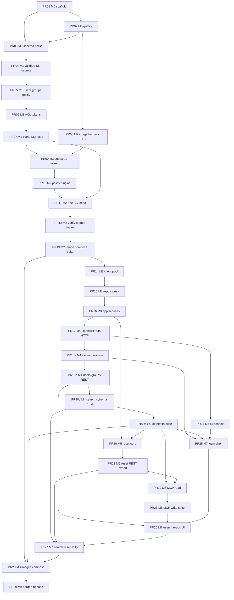

# LabLDAP Implementation Design

| Field | Value |
| --- | --- |
| Document title | LabLDAP Implementation Design |
| Author | Design synthesis (from LabLDAP source package) |
| Date | 2026-08-12 |
| Status | Draft (revised after review 2026-08-12) |
| Product | LabLDAP — disposable laboratory LDAP environment |
| Working names | LabLDAP / `labldap` / `labldap-bootstrap` (OD-001 default) |
| Implementation workspace | `/home/mbrewer/projects/go-lab-ldap-mcp` |
| Git remote (inspected) | `https://github.com/hilather/go-lab-ldap-mcp.git` |
| Go module (OD-002 applied) | `github.com/hilather/go-lab-ldap-mcp` |
| License | Privately owned; do **not** invent a LICENSE file (OD-003) |
| Local images | `labldap-control:dev`, `labldap-bootstrap:dev` (do not push; OD-004) |
| Source package | `/home/mbrewer/Downloads/ldap-mcp` — 8 files on disk (7 inventoried package docs + `MANIFEST.md`); **18** inventoried documents absent |
| Specification baseline | MCP 2026-07-28; official MCP Go SDK v1.7.0+; Go 1.26.x language / toolchain go1.26.5; React 19.2; Node.js 22.12+ |
| Target | **First usable release** = README definition + all P0 tasks + any P1 that a P0 `Depends on` range names (see §19). **Package-complete** = implementation plan §16 (all P0+P1 + recovered 00/12 evidence). |

This document is the **single implementation contract** for the empty target repository. It synthesizes the files that actually exist in the source package. It does **not** invent the contents of the 18 inventoried documents referenced by `MANIFEST.md` but absent from the download (`00`, `02`–`09`, `11`, `12`, and ADR 0001–0007).

An engineer or execute-plan agent must be able to implement **M0** and the **M2 image/harness pin** from present files without waiting for recovered contracts. **M1 public schema and the T-018 ACI compiler are a recorded stand-in**, not a recovered 02-doc — they must be locked as a dated `v1alpha1` stand-in note (not an accepted ADR) and are expected to churn if `docs/02` arrives. M3–M8 then follow `TASKS.md` plus this design’s **proposed** contracts. Where a later milestone needs a contract that only a missing document would have specified, this document either (1) records the decision already present in the available files, or (2) lists a residual design gap and a TASKS-driven way to proceed.

`AGENTS.md` ranks **accepted ADRs** first. Those files are **not on disk** — only MANIFEST titles exist. Title-only stubs are **not** accepted ADRs and **do not** occupy rank 1. Until recovered ADR text exists, the **binding stack** is:

1. README ten non-negotiables + `AGENTS.md` implementation rules (layout, package boundaries, coding standards, definition of done).
2. `docs/01-system-architecture.md` (present).
3. `docs/13-open-decisions.md` owner/verification/agent defaults (present).
4. `TASKS.md` (present), including remapped acceptance where this design notes a missing 02/04/05 checkbox.
5. This design’s **proposed** contracts (`v1alpha1` keys, most REST paths, most MCP tool names, `directory:read`). Proposed text never outranks (1)–(4).

When a real ADR file is recovered, it enters the AGENTS rank-1 slot and replaces the matching stub. If implementation discovery requires a design change to a **public** contract, write a **new** ADR (full text, accepted by review) **before** changing that contract — do not promote a stub.

---

## Overview

Lab teams need a disposable, deterministic LDAP laboratory they can start from one YAML file plus secret files, bind to with real LDAP clients, mutate users and groups at runtime through UI / REST / MCP, and reset to an exact baseline — without granting the management plane Docker or Directory Manager privileges, and without writing a new LDAP server.

LabLDAP is a **control plane around 389 Directory Server**, not an LDAP implementation. Three Compose lifecycle roles:

1. **`directory`** — long-running `quay.io/389ds/dirsrv` (pinned by digest). Source of truth for every user, group, membership, password hash, ACI, and runtime mutation.
2. **`bootstrap`** — one-shot Go command (`labldap-bootstrap`) that receives the Directory Manager secret, creates the backend, configures engine features, seeds the managed suffix, creates the restricted runtime service account, verifies allow/deny, and writes a baseline-revision marker.
3. **`control`** — long-running Go process (`labldap`) that serves REST (`net/http`, OpenAPI-first), MCP (official `go-sdk` over Streamable HTTP), and an embedded React 19 UI. It binds to 389 DS as the restricted service account. It **never** receives the Directory Manager secret and **never** mounts the Docker socket.

The Go service uses `github.com/go-ldap/ldap/v3` behind project interfaces. REST, MCP, and the UI share one application-service layer and one authorization policy. Static bearer tokens are an explicit lab mode. Runtime reset is a soft data reset of the single managed suffix; a full engine reset is an operator Compose operation.

The target workspace is an empty git repo on `main` with **no commits** and remote `origin` → `https://github.com/hilather/go-lab-ldap-mcp.git`. First code lands there under module path `github.com/hilather/go-lab-ldap-mcp`. Keep imports mechanically replaceable (no scattered stringly module aliases) so an owner rename (OD-001/OD-002) is a scripted rewrite.

---

## Background & Motivation

### Why this exists

Typical lab LDAP setups fail in one or more of these ways:

- Someone stands up a raw 389 DS / OpenLDAP container and then hand-runs `dsconf` / `ldapadd` with no repeatable baseline.
- A “helpful” Go process pretends to be an LDAP server, or keeps users in an in-memory map that drifts from what `ldapsearch` sees.
- Management APIs, MCP tools, and a UI each grow their own mutation rules and auth checks.
- Reset means “delete the volume and hope bootstrap is idempotent,” which requires Docker socket access inside the app or operator tribal knowledge.
- Directory Manager credentials leak into the long-running management container.

The source package already chose the product: a three-role Compose lab, 389 DS as the only directory authority, privilege-separated bootstrap, a small domain API (not an LDAP proxy), and transport-neutral application services.

### Current state of the implementation destination

| Fact | Value |
| --- | --- |
| Workspace | `/home/mbrewer/projects/go-lab-ldap-mcp` |
| Contents | `.git` only |
| Branch | `main`, no commits |
| Remote | `origin` `https://github.com/hilather/go-lab-ldap-mcp.git` (fetch + push) |
| Source on disk | 8 files under `/home/mbrewer/Downloads/ldap-mcp` (7 inventoried + `MANIFEST.md`) |
| Missing inventoried documents | **18**: `docs/00`, `02`–`09`, `11`, `12`, and ADR 0001–0007 |

Pain this design removes for implementers:

- Re-deriving the three-role topology and privilege matrix from scattered notes.
- Guessing package boundaries and import rules (they are specified in `AGENTS.md`).
- Starting with UI or MCP before the compiler and real 389 DS adapter exist.
- Blocking **M0** or the **M2 image/harness pin** on missing later-contract documents. M1 schema/ACI work proceeds only as a dated stand-in (see §7.2).
- Re-asking owner decisions that already have agent defaults (OD-001 naming, `net/http`, `pnpm`, static tokens, read-only MCP default, no hard reset via API).

### Version baseline (verified 2026-08-12)

| Component | Design baseline | Verification on 2026-08-12 |
| --- | --- | --- |
| Go | 1.26.x; 1.26.5 current stable | Confirmed: Go 1.26.5 released 2026-07-07 (`https://go.dev/doc/devel/release`) |
| MCP spec | 2026-07-28 | Current selected spec |
| Official MCP Go SDK | v1.7.0 or later | Confirmed: `v1.7.0` is latest and supports 2026-07-28 (`https://github.com/modelcontextprotocol/go-sdk`) |
| React | 19.2 | Record exact patch at T-095 / T-002 |
| Node.js | 22.12+ | Host has Node v22.14.0; pin exact version in `.nvmrc` / `package.json` `engines` at T-002 |
| Frontend package manager | `pnpm` (OD-010) | Pin exact pnpm via `packageManager` field |
| 389 DS image | `quay.io/389ds/dirsrv` by digest | Digest is a T-024 verification decision (OD-006); do not invent one here |
| LDAP client | `github.com/go-ldap/ldap/v3` | Pin exact version at T-002 or when first imported (T-046) |

The implementing agent must re-verify available versions at repository bootstrap, pin exact versions in lock files, and document any deviation in an ADR.

---

## Goals & Non-Goals

### Goals (first usable release)

An operator can:

1. Write one YAML configuration containing a base DN, users, non-empty static groups, password policy, directory ACLs, and scoped management tokens.
2. Run one Docker Compose command.
3. Bind to LDAP or LDAPS with a configured user.
4. Search the directory and observe correct group membership and `memberOf` behavior.
5. Create, edit, disable, delete, and reset users and groups through the UI, REST, or MCP as permitted by scopes.
6. Confirm that a runtime-created entry is visible through direct LDAP and every management interface.
7. Reset the managed suffix to the exact configured baseline.
8. Export the current managed suffix as LDIF.
9. Run in ephemeral or persistent storage mode.
10. Pass the test matrix and produce pinned, reproducible container images.

Architectural goals that enable that product:

- Keep 389 DS as the only source of truth for directory entries and runtime mutations.
- Separate Directory Manager bootstrap authority from the restricted runtime identity.
- Compile configuration deterministically without connecting to LDAP.
- Share one application-service layer and one authorization policy across REST, MCP, and UI.
- Bound, cancel, authorize, and audit every external operation.
- Favor a small supported domain API over an unrestricted LDAP proxy.
- Treat reset as a coordinated application operation, not container control.
- Default to secure behavior, with explicit lab-only exceptions.

### Non-goals (first release)

- Implementing an LDAP listener, BER codec, or any LDAP wire-protocol engine in Go.
- Storing users, groups, or memberships in an application-only in-memory map.
- Mounting `/var/run/docker.sock` or otherwise controlling the container runtime from the app.
- Giving Directory Manager credentials to the long-running control service.
- A raw arbitrary LDAP modification API.
- Multiple managed suffixes or multiple 389 DS instances.
- Active Directory emulation. A Samba AD profile, if ever added, is a **separate engine adapter** behind `DirectoryRepository` and requires an ADR.
- Hard engine reset (`/data` wipe) through REST or MCP.
- Distributed/multi-replica control plane, shared session store, or distributed reset lock.
- OAuth-compatible MCP authorization as the initial remote-management mode (leave room; do not implement as default).
- Publishing images or inventing a public registry namespace (OD-004).
- Inventing a distribution license (OD-003).
- A large UI design system (OD-011).
- Empty `groupOfNames` groups (reject; do not insert a fake member) (OD-018).
- Enabling anonymous bind in the default example (OD-022).

---

## Key Decisions

These are binding. Changing any of them requires an ADR before code.

### KD-1 — Go does not implement the LDAP wire protocol

**Decision:** The Go control plane is a management plane. LDAP protocol, schema enforcement at the wire, password hashing, and engine ACIs live in 389 DS.

**Rationale:** Building a correct LDAP server is out of scope and would duplicate a mature engine. `github.com/go-ldap/ldap/v3` is a client only, hidden behind `internal/directory` interfaces.

**Source:** README non-negotiable 1; ADR 0001 title; `AGENTS.md`.

### KD-2 — 389 DS is the source of truth

**Decision:** All users, groups, memberships, and runtime mutations are 389 DS entries under the single managed suffix. The Go process may cache schema/capabilities with a bounded TTL. It must not keep an authoritative object cache.

**Rationale:** Direct `ldapsearch` and the management APIs must see the same data. Reset and export read the directory, not an overlay.

**Source:** README non-negotiable 2; ADR 0002 title; architecture §7–§8.

### KD-3 — Control plane must not control the container runtime

**Decision:** No Compose service mounts the Docker socket. Full engine reset is `make compose-reset` / operator volume replacement. REST and MCP expose only suffix-scoped soft reset.

**Rationale:** A lab management API that can destroy host containers is a privilege-escalation surface.

**Source:** README non-negotiable 3, 8; ADR 0007 title; OD-019.

### KD-4 — Directory Manager credentials are bootstrap-only

**Decision:** Only the one-shot `labldap-bootstrap` process receives the DM password (via secret file, never argv). The long-running `labldap` process binds as a restricted service account created at bootstrap. No DM fallback.

**Rationale:** Privilege separation. A compromised control process cannot reconfigure `cn=config`.

**Source:** README non-negotiable 4; ADR 0003 title; architecture §4 privilege table.

### KD-5 — One application service layer, one authorization policy

**Decision:** REST handlers, MCP tools, and UI-facing session routes call `internal/app` interfaces. Transports must not call each other. Transports contain no LDAP filters or directory mutation logic. Every application mutation checks authorization even if transport middleware also checks.

**Rationale:** Prevents scope drift and REST-as-internal-API. Same command is unit-testable without HTTP or MCP.

**Source:** README non-negotiable 5; ADR 0006 title; `AGENTS.md` package boundaries.

### KD-6 — Static bearer tokens as explicit lab mode

**Decision:** High-entropy token secrets from files; constant-time compare; expose only a non-secret token ID. Browser: exchange token for in-memory `HttpOnly` cookie session + CSRF; never store the bearer token in browser storage. Leave `TokenAuthenticator` open for later OAuth-compatible MCP.

**Rationale:** Labs need something that works without standing up an IdP. The mode must be labeled lab-only and not silently become a production default.

**Source:** README non-negotiable 6; ADR 0005 title; OD-013, OD-014.

### KD-7 — Ephemeral vs persistent storage

**Decision:** Ephemeral mode mounts 389 DS `/data` as tmpfs. Persistent mode uses a named or host-managed volume. Documentation **must** warn that host swap can persist tmpfs pages unless the host is configured otherwise. Default shipped example is ephemeral, with a separate persistent Compose profile.

**Rationale:** Disposable labs should vanish; some labs need restart survival. The swap caveat is a non-negotiable documentation requirement.

**Source:** README non-negotiable 7.

### KD-8 — Soft reset vs engine reset

**Decision:** Runtime reset deletes managed users/groups in safe order and reapplies the compiled baseline using the restricted identity and seed password files. Full wipe of `/data` is a deployment operation. Interrupted reset leaves the service not-ready; recovery uses the configured startup reconciliation mode.

**Rationale:** Control cannot (and must not) recreate the 389 DS instance.

**Source:** README non-negotiable 8; ADR 0007 title; OD-019; architecture §8.4, §9.5.

### KD-9 — First release topology

**Decision:** Single managed suffix. Single 389 DS instance. Single control replica. Reference profile up to ~10,000 users and ~1,000 groups. Paginated lists. Bounded exports and searches. No distributed session store.

**Rationale:** Optimized for disposable labs, not HA.

**Source:** README non-negotiable 9; architecture §14.

### KD-10 — No Active Directory emulation

**Decision:** Out of scope. Future Samba AD would be a separate adapter behind `DirectoryRepository`.

**Source:** README non-negotiable 10.

### KD-11 — Module path and names

**Decision:**

- Product/executables: `LabLDAP`, `labldap`, `labldap-bootstrap` (OD-001).
- Go module: `github.com/hilather/go-lab-ldap-mcp` because a real git remote exists (OD-002 applied; do **not** use `labldap.local/labldap`).
- Images: `labldap-control:dev`, `labldap-bootstrap:dev`; do not push (OD-004).
- License: none; treat as privately owned (OD-003).

**Rationale:** Follow owner-decision defaults and the inspected remote. Isolate imports so a later public-name/module change is mechanical.

### KD-12 — HTTP stack and frontend toolchain

**Decision:** Go `net/http` + middleware as `http.Handler` (OD-008). No third-party router without an ADR. Frontend: `pnpm`, TypeScript strict, React 19.2, Vite, TanStack Query, React Router, React Hook Form, Zod (OD-010, README). UI: semantic HTML + small headless primitives; no large design system (OD-011).

### KD-13 — MCP exposure

**Decision:** Official SDK only (`github.com/modelcontextprotocol/go-sdk` v1.7.0+). Streamable HTTP on `/mcp`. No legacy unauthenticated HTTP+SSE endpoint. Register **read tools by default**; register mutation, password, reset, and export tools only when enabled; always enforce distinct scopes in `internal/app` (OD-016). Optional stdio is P1 (T-093).

### KD-14 — Empty groups

**Decision:** Reject empty `groupOfNames` groups in `v1alpha1`. Do not insert a dummy member (OD-018). Changing object class or group strategy requires an ADR.

### KD-15 — Metrics and anonymous bind

**Decision:** Prometheus-compatible metrics without identity labels (no DNs, usernames, filters, tokens, passwords) (OD-021). Anonymous LDAP bind disabled in the default example (OD-022).

### KD-16 — Configuration is versioned, compiled, and LDAP-free

**Decision:** `internal/config` parses, defaults, validates, normalizes, hashes, and compiles. It **must not** connect to LDAP. Public YAML types are separate from immutable normalized types. `apiVersion` starts at `v1alpha1`. Breaking config changes require a new `apiVersion`.

**Source:** ADR 0004 title; `AGENTS.md` package boundaries; T-009–T-023.

### KD-17 — Engine operations vs directory-data operations

**Decision:** Bootstrap uses `dsconf` (argument vector + password file, never a shell) for engine operations (backend, plugins, password policy, indexes). Directory-data operations (suffix root, containers, service account, ACIs, users, groups, memberships, marker) use LDAP with the Directory Manager identity.

**Source:** architecture §6; `AGENTS.md` non-negotiables.

### KD-18 — Source package files that exist are copied into the repo

**Decision:** T-001 copies the available design package into the repository (`AGENTS.md`, `AGENT_PROMPT.md`, `TASKS.md`, `docs/01`, `docs/10`, `docs/13`, `MANIFEST.md`). For the seven known ADR **titles**, write `docs/adr/000N-TITLE.stub.md` files that quote only the MANIFEST title plus the matching README non-negotiable. Stubs are **not** accepted ADRs and **do not** enter the AGENTS rank-1 slot. Missing documents (`00`, `02`–`09`, `11`, `12`, full ADR bodies) are **not** fabricated; residual gaps stay listed in this design and in `docs/13-open-decisions.md`.

---

## Proposed Design

### 1. System context



### 2. Container architecture and privilege matrix



| Secret or capability | Directory | Bootstrap | Control |
| --- | ---: | ---: | ---: |
| Directory Manager password | Yes | Yes | **No** |
| Runtime LDAP service password | No, except as stored hash | Yes | Yes |
| Seed user password files | No, except as stored hashes | Yes | Yes only when soft reset is enabled |
| Management API token files | No | No | Yes |
| Docker socket | **No** | **No** | **No** |
| Write to 389 DS `/data` | Engine only | No direct filesystem write | No |
| LDAP write to managed suffix | Engine | Yes | Yes, restricted |
| LDAP write to `cn=config` | Engine | Yes during bootstrap | **No** |

Compose must not start control as ready if bootstrap exits non-zero. Control liveness must **not** depend on LDAP (avoid restart loops). Readiness requires valid config, successful runtime bind, managed suffix + baseline marker, revision match under the selected startup mode, required capabilities, and no active reset.

### 3. Target repository layout

Converge on this tree (`AGENTS.md`). A different layout requires an ADR and must preserve package boundaries.

```text
.
|-- AGENTS.md
|-- AGENT_PROMPT.md
|-- TASKS.md
|-- README.md
|-- Makefile
|-- go.mod                          # module github.com/hilather/go-lab-ldap-mcp
|-- go.sum
|-- .gitignore
|-- .github/workflows/
|-- cmd/
|   |-- labldap/                    # long-running control: serve, validate, plan, version
|   `-- labldap-bootstrap/          # one-shot: apply, validate, plan
|-- internal/
|   |-- api/                        # HTTP transport only
|   |-- app/                        # use cases, policy, transactions, reset, audit calls
|   |-- audit/                      # structured security and mutation events
|   |-- auth/                       # token registry, scopes, sessions, middleware
|   |-- config/                     # parse/default/validate/normalize/hash/compile; NO LDAP
|   |-- directory/
|   |   |-- ldapclient/             # conn, escaping, controls, error translation
|   |   `-- ds389/                  # 389 DS bootstrap + runtime capability implementation
|   |-- mcpserver/                  # MCP transport only
|   |-- observability/              # slog, request IDs, metrics, build info
|   |-- reset/                      # mutation gate + reset state machine
|   `-- web/                        # embedded static assets + SPA fallback
|-- api/
|   |-- openapi.yaml
|   `-- generated/                  # committed generated Go + notes; never hand-edit
|-- config/
|   |-- schema/                     # JSON Schema for v1alpha1
|   `-- examples/
|-- frontend/                       # React 19 + Vite + pnpm (placeholder until M7)
|-- deploy/
|   |-- compose/
|   |-- docker/
|   `-- examples/
|-- test/
|   |-- integration/
|   |-- e2e/
|   |-- compatibility/
|   `-- fixtures/
|-- docs/
|   |-- 01-system-architecture.md
|   |-- 10-implementation-plan.md
|   |-- 13-open-decisions.md
|   |-- residual-design-gaps.md     # pointer to gaps in this design
|   `-- adr/
|       |-- README.md               # "stubs — titles only; not accepted ADRs"
|       |-- 0001-use-go-control-plane-with-389ds.stub.md
|       |-- 0002-389ds-is-the-single-source-of-truth.stub.md
|       |-- 0003-separate-bootstrap-and-runtime-privileges.stub.md
|       |-- 0004-versioned-declarative-configuration-and-reconciliation.stub.md
|       |-- 0005-static-bearer-token-as-explicit-lab-mode.stub.md
|       |-- 0006-rest-and-mcp-share-application-services.stub.md
|       `-- 0007-soft-reset-not-container-control.stub.md
`-- tools/
```

Do **not** add a `LICENSE` file.

### 4. Module path and toolchain pins

```go
// go.mod (T-001 / T-002)
module github.com/hilather/go-lab-ldap-mcp

go 1.26

toolchain go1.26.5
```

Language version is `go 1.26` (README baseline is Go 1.26.x). Pin the **toolchain** to 1.26.5 (current stable as of 2026-08-12). Re-verify at T-002. If CI cannot use 1.26.5, document the deviation; do not invent a 1.26.5-only language requirement.

Also commit:

- `.nvmrc` / `frontend/package.json` `engines.node` = `>=22.12.0` and pin the exact Node used in CI (host currently has 22.14.0).
- `frontend/package.json` `"packageManager": "pnpm@<exact>"` and a committed `pnpm-lock.yaml` once the workspace exists.
- A `tools/tools.go` or `Makefile` pin file for linters, generators, and govulncheck — **no floating versions**.

Initial Go dependencies (add when first needed, not as unused requires):

| Dependency | First needed | Constraint |
| --- | --- | --- |
| `gopkg.in/yaml.v3` (or equivalent with unknown-field / duplicate-key control) | T-011 | Must support strict decode |
| `github.com/go-ldap/ldap/v3` | T-046 / bootstrap LDAP in M2 | Behind `internal/directory` only |
| `github.com/modelcontextprotocol/go-sdk` v1.7.0+ | T-085 | Official SDK only |
| OpenAPI generator (OD-009 verification) | T-060 | Deterministic; OpenAPI 3.1 or chosen compatible subset |

Prefer the standard library for CLI dispatch, HTTP, JSON, hashing, and TLS. A third-party router or CLI framework requires demonstrated value **and** an ADR.

### 5. Package boundaries and import rules



Hard rules:

| Package | May do | Must not do |
| --- | --- | --- |
| `internal/config` | Parse, default, validate, normalize, hash, compile, redact | Connect to LDAP; import `ldapclient`, `ds389`, `api`, `mcpserver` |
| `internal/directory` | Transport-neutral interfaces and domain types | Import HTTP, MCP SDK, or `go-ldap` types on public interfaces |
| `internal/directory/ldapclient` | Dial, TLS, bind, pool, escape, page, map result codes | Contain user/group business rules |
| `internal/directory/ds389` | Bootstrap engine ops + runtime mapping to 389 object classes | Be called from REST/MCP handlers directly |
| `internal/app` | Use cases, scopes, locks, reset orchestration, audit | Import `net/http` request types or MCP SDK types |
| `internal/api` | HTTP decode/encode, If-Match, problem details | LDAP filters, DN mutation, MCP types |
| `internal/mcpserver` | Tool/resource registration, SDK mapping | REST client, direct LDAP |
| `internal/auth` | Tokens, sessions, CSRF, middleware | Directory writes |
| `internal/audit` | Structured events, redaction, ring buffer | Persist secrets |
| `internal/web` | `embed.FS` and hashed-asset HTTP helpers only | Import `internal/app`, sessions, or any business logic. SPA-fallback routing and session endpoints live in `cmd/labldap` / `internal/api`. |
| `internal/reset` | Gate + state machine | Docker / `dsconf` |

Acceptance from T-001: **no application package imports HTTP and MCP transport types together.**

Constructor-injected dependencies. No process-global clients, loggers, or token registries.

### 6. Process binaries

#### `cmd/labldap`

Long-running control and offline config tools. Suggested subcommands (stdlib dispatch; names may be refined but must stay stable once documented):

| Subcommand | Role | First task |
| --- | --- | --- |
| `serve` (default) | HTTP + MCP + UI | T-063 / T-108 |
| `validate` | Compile config, exit non-zero on errors | T-022 |
| `normalize` | Emit redacted normalized JSON | T-022 |
| `plan` | Emit redacted engine+data plan | T-022 |
| `version` | Build information | T-005 |

`--help` must be useful at T-001 (even if `serve` is a stub that listens and shuts down on SIGINT).

#### `cmd/labldap-bootstrap`

One-shot. Subcommands from T-027:

| Subcommand | Role |
| --- | --- |
| `apply` | Reconcile engine + data per startup mode |
| `validate` | Report drift; no writes |
| `plan` | Show compiled plan against live engine where safe |

Directory Manager password **only** via file (`--directory-manager-password-file` or equivalent). Never argv. Every phase reports duration and safe counts. Any failed phase → non-zero exit + stable error code.

### 7. Configuration compiler (`internal/config`) — M1, no LDAP

This is the first real product surface and the start of the critical path after scaffolding (`T-001 → T-009 → T-014 → T-020`).

#### 7.1 Pipeline



States the loader must be able to materialize (architecture §8.2):

1. Raw parsed configuration.
2. Defaulted configuration.
3. Semantically validated configuration.
4. Normalized configuration with resolved DNs and ordered attributes.
5. Compiled engine plan and baseline directory plan.
6. Revision hashes over the non-secret normalized structure and secret content fingerprints.

Secret values enter the revision only as a one-way digest so a password change produces a new baseline revision without exposing the value.

#### 7.2 Public types vs normalized types

- Public YAML types live under a versioned package, e.g. `internal/config/v1alpha1`.
- `apiVersion` + `kind` dispatch (T-009). Unsupported versions/kinds → stable errors.
- Immutable normalized model is internal and is what plans and hashes consume.
- Sensitive fields use explicit secret-reference types (path to file), never inline passwords/tokens in committed examples.

**Residual gap:** the exact `kind` string, top-level YAML keys, ACL DSL syntax, and JSON Schema were specified in missing `docs/02-configuration-and-domain-model.md`. Implementers **must not** pretend that document exists. M1 can still proceed, but the public compiler is a **recorded invention**, not *the* 02-doc compiler.

**v1alpha1 stand-in schema (dated 2026-08-12) — not an accepted ADR.** Lock T-009/T-010/T-018 against this stand-in and the field inventory below. Commit `config/schema/v1alpha1-stand-in.md` (or equivalent) stating: invented on 2026-08-12 because 02 is absent; expected to churn if 02 is recovered; a rename requires a **new** ADR, not promotion of this note. Do not put these dispatch values in `docs/adr/*.stub.md`.

**Proposed (not recovered, not binding) dispatch values** for T-009, isolated for replacement:

```yaml
# PROPOSED stand-in — not a recovered 02-doc contract
apiVersion: labldap.dev/v1alpha1
kind: LabScenario
```

Binding names that *are* recovered from present files include `v1alpha1` as the TASKS version token, `groupOfNames`, and the ten README non-negotiables — not `labldap.dev` and not `LabScenario`.

#### 7.3 Field inventory derived from present sources

These concepts **are** specified and must appear in `v1alpha1`. Exact YAML key names in `snake_case` are an implementation choice to lock in T-009/T-010 and test via schema-enum drift (T-010). The ACL row is a **capability list**, not a recovered DSL grammar — T-018 must invent a small, injection-safe emitter and golden-test it; treat the syntax as stand-in.

**T-035 “raw entries”:** the task **title** says “Apply baseline users, raw entries, groups, and memberships.” Deliverables and acceptance in present files define users, groups, memberships, and the marker only. That passthrough object almost certainly lived in missing 02/03. **Do not** add a `rawEntries:` (or equivalent) key to the stand-in schema. Implement users/groups/memberships/marker only unless recovered 02/03 defines a passthrough object.

| Area | Required concepts (from TASKS / architecture / README) | Task |
| --- | --- | --- |
| Dispatch | `apiVersion`, `kind` | T-009 |
| Directory identity | Single base / managed suffix DN; generated user/group DNs; optional explicit ID, `uid`, RDN, DN with inconsistency checks | T-013, T-015, T-016 |
| Users | Object classes, allowlisted attributes, password **file** reference, enablement, managed-field set; forbid supplying `userPassword`, `memberOf`, operational attributes in normal attributes | T-015 |
| Groups | Static DN groups; user and group member references; duplicate removal; nesting-cycle detection; nested-group flag; **reject empty `groupOfNames`** | T-016, OD-018 |
| Password policy | Portable fields including warning age ≤ max age; lockout values required+positive when enabled; storage-scheme allowlist; unsupported fields fail closed | T-017 |
| ACLs | Principal, target, permission, attribute, condition; deterministic 389 DS ACI emitter named by stable ACL ID; raw-ACI gate; cannot grant runtime `cn=config` via normal DSL | T-018 |
| Tokens | Token ID, secret file, scope set; duplicate ID/value detection; `directory:write` does **not** imply password, reset, or export | T-019 |
| Transport / auth / lifecycle | Secure transport required unless explicit insecure lab mode; LDAP/LDAPS/StartTLS; anonymous bind default **off**; startup mode `validate` \| `merge` \| `reset`; storage `ephemeral` \| `persistent` | T-012, T-030, T-038, OD-022 |
| Limits | Duration, port, address, page, body, concurrency, rate limits — all bounded | T-012 |
| Management / HTTP | Listen address, TLS (generated vs supplied certs), CORS/Origin defaults (same-origin), session idle+absolute lifetimes | T-012, OD-014, OD-017 |
| Runtime service account | Explicit in compiled plan; not auto-placed in application groups | T-020, T-033 |
| Metadata marker | Protected entry under managed suffix; revision, apply version, timestamp; no secrets | T-021, T-039, OD-012 |

Illustrative skeleton (keys are **proposed stand-in**, values show required concepts). Binding recovered names in this block: `groupOfNames` empty-member rule; scopes `directory:write`, `directory:password`, `lab:reset`, `lab:export`, `schema:read`, `audit:read`. `directory:read`, `apiVersion` host, and `kind` are proposed.

```yaml
# PROPOSED v1alpha1 stand-in (2026-08-12) — not recovered from docs/02
# Do not add rawEntries: (T-035 title only; see residual gap)
apiVersion: labldap.dev/v1alpha1   # proposed
kind: LabScenario                  # proposed
metadata:
  name: example-lab
spec:
  directory:
    suffix: "dc=example,dc=test"
    # storageMode / startupMode live in deploy + config; must be coherent (T-012)
  users:
    - id: alice
      uid: alice
      passwordFile: /run/secrets/user-alice
      enabled: true
  groups:
    - id: staff
      members:
        - user: alice          # empty members MUST fail for groupOfNames
  passwordPolicy:
    minLength: 12
    # lockout fields required if lockout enabled
  acls:
    - id: staff-read
      # stand-in only: principal / target / permission / attributes / conditions
      # T-018 invents the actual DSL; 02-doc syntax is missing
  tokens:
    - id: admin
      secretFile: /run/secrets/token-admin
      scopes:
        - directory:read       # PROPOSED name (not in source files)
        - directory:write      # recovered
        - directory:password   # recovered
        - lab:reset            # recovered
        - lab:export           # recovered
        - schema:read          # recovered
        - audit:read           # recovered
```

Committed examples **must** use secret **paths**, never real secret bytes.

#### 7.4 Revisions

| Revision | Covers | Changes when |
| --- | --- | --- |
| Directory / baseline revision | Canonical non-secret directory data + seed-password fingerprints | User/group/ACL/policy/suffix/seed password change |
| Control revision | Directory revision inputs + token IDs/scopes/token-value fingerprints + management settings that affect control | Token value or scope change **without** changing directory revision if directory data is unchanged (T-021) |

Hash over canonical JSON with sorted maps. Input map order must not change either revision. Compiler-contract version is part of the hash inputs so emitter bugfixes can be versioned.

#### 7.5 Plans

`T-020` produces:

- **Engine plan:** backend/suffix, TLS/auth settings, plugins, password policy, indexes.
- **Data plan:** create/update/delete ordering (parents before children on create; reverse on delete), preserved-entry list, managed-field ownership, runtime service account handling, marker handling.
- Redacted plan rendering that is byte-identical across repeated compilations.

#### 7.6 CLI contract (T-022)

- `--redact` is **default**. No flag prints passwords or tokens.
- Human and JSON modes. JSON stable enough for CI.
- Invalid config exits non-zero and reports **multiple** field paths with stable codes where possible.
- No secret value in parse diagnostics (T-011).

### 8. Bootstrap (`cmd/labldap-bootstrap` + `internal/directory/ds389`) — M2



#### 8.1 Cold start



#### 8.2 `dsconf` runner

- `exec.CommandContext` + argument vector. **Never** `sh -c`.
- Password-file authentication. **Never** put DM password on the command line.
- Parse JSON output. Classify errors.
- T-029: create backend with configured suffix; accept matching existing backend; **fail** on name/suffix conflict without repurposing data.

#### 8.3 Phases (must be reported)

Order implied by T-027–T-039:

1. Load / validate / compile config.
2. Wait for engine (bounded retry + jitter); Root DSE; LDAPS or StartTLS; DM bind (T-028).
3. Inspect/reconcile backend and suffix (T-029).
4. Reconcile TLS and authentication (anonymous bind, cleartext bind policy, SASL) (T-030).
5. Password policy via `dsconf pwpolicy` + read-back (T-031).
6. MemberOf, referential integrity, account-disable mechanism (T-032).
7. Base tree + runtime service account (T-033).
8. Apply ACIs; read-back canonical compare (T-034).
9. Apply users, groups, memberships; secure password set (T-035). The task **title** also says “raw entries”; present files do not define that object — skip unless 02/03 is recovered. Do not invent a raw-LDIF config stanza.
10. Runtime allow/deny probes including `cn=config` deny (T-036).
11. Application bind, lockout, disablement, MemberOf checks (T-037).
12. Mode-specific reconcile: `validate` / `merge` / `reset` (T-038).
13. Write metadata marker **last** after verification (T-039).

Verification failure **prevents** marker commit and success exit (T-036, T-040).

#### 8.4 Startup / reconcile modes

| Mode | Behavior |
| --- | --- |
| `validate` | No writes. Report drift. Non-zero if applied revision differs. |
| `merge` | Upsert configured objects; preserve unconfigured runtime entries and unknown unmanaged attributes. |
| `reset` | Replace managed data with baseline (used for recovery and operator-requested engine-adjacent reset at bootstrap). |

Runtime (control-plane) reset is the **soft** suffix reset in M5, using the restricted identity — not DM, not Docker.

#### 8.5 Image contract (T-024, T-041)

- Pin `quay.io/389ds/dirsrv` by **immutable digest**. No floating tag in release Compose.
- Commit a versioned contract file (e.g. `deploy/docker/dirsrv-image-contract.md` or YAML) with: digest, version, architectures, entrypoint, ports, `/data` behavior, available CLI (`dsconf`, etc.), user IDs, secret-input findings (`_FILE` vs entrypoint wrapper — OD-007).
- Bootstrap image: multi-stage; add static `labldap-bootstrap` binary **onto** the pinned 389 DS image so `dsconf` remains available (T-041).
- Control image (M8): multi-stage frontend + Go; non-root; read-only root; no DM secret; no Docker socket; no source or package-manager cache (T-108).

**Do not invent a digest in this document.** Selecting and recording it is T-024.

### 9. Runtime control plane — M3–M6

#### 9.1 Component architecture



HTTP listener routes (architecture §5): `/api/v1`, `/mcp`, `/health`, `/metrics`, UI assets. Configure read-header, read, write, idle, and shutdown timeouts.

#### 9.2 Directory interfaces (T-045)

Consumer-owned, small, mockable. **No** `go-ldap`, HTTP, or MCP types on the public interface.

Sketch (names may be split further; this is the intended surface):

```go
package directory

type UserRepository interface {
    List(ctx context.Context, q UserListQuery) (UserPage, error)
    Get(ctx context.Context, id UserID) (User, error)
    Add(ctx context.Context, u UserSpec) (User, error)
    Modify(ctx context.Context, id UserID, patch UserPatch) (User, error)
    SetEnabled(ctx context.Context, id UserID, enabled bool, rev Revision) (User, error)
    Delete(ctx context.Context, id UserID, rev Revision) error
    SetPassword(ctx context.Context, id UserID, password Secret, rev Revision) error
}

type GroupRepository interface {
    List(ctx context.Context, q GroupListQuery) (GroupPage, error)
    Get(ctx context.Context, id GroupID) (Group, error)
    Add(ctx context.Context, g GroupSpec) (Group, error)
    Modify(ctx context.Context, id GroupID, patch GroupPatch) (Group, error)
    Delete(ctx context.Context, id GroupID, rev Revision) error
    AddMembers(ctx context.Context, id GroupID, members []MemberRef, rev Revision) (MembershipChange, error)
    RemoveMembers(ctx context.Context, id GroupID, members []MemberRef, rev Revision) (MembershipChange, error)
    ReplaceMembers(ctx context.Context, id GroupID, members []MemberRef, rev Revision) (MembershipChange, error)
}

type SearchRepository interface {
    Search(ctx context.Context, q SearchQuery) (SearchPage, error)
}

type BindTester interface {
    BindTest(ctx context.Context, identity string, password Secret, transport Transport) (BindTestResult, error)
}

type SchemaRepository interface {
    RootDSE(ctx context.Context) (RootDSE, error)
    Schema(ctx context.Context) (Schema, error)
}

type ResetSupport interface {
    Inventory(ctx context.Context) (ManagedInventory, error)
    Export(ctx context.Context, w io.Writer, opts ExportOptions) error
}

type CapabilityInspector interface {
    Capabilities(ctx context.Context) (Capabilities, error)
}
```

Structured errors at this boundary (architecture + T-006/T-045): not found, conflict, invalid credentials, constraint violation, unavailable, forbidden, plus configuration / auth / reset / export / bootstrap categories. Error identity must survive wrapping.

#### 9.3 LDAP client (`internal/directory/ldapclient`)

- LDAPS and StartTLS. CA + name verification. Wrong CA / wrong name fail closed (T-026, T-046).
- Simple bind **never** before configured TLS protection.
- Bounded pool: max connections, idle/lifetime, wait queue, broken eviction, shutdown (T-047).
- Context cancellation invalidates blocked connections.
- Filter/DN escaping; no string concatenation of untrusted values into filters, DNs, ACIs, URLs, or shell.
- Enforce base-DN boundaries and server size/time limits on every search (T-050).
- Bind-test uses a **disposable** connection that is never returned to the pool (T-051). Unknown user vs wrong password are **not** distinguished externally by default.
- Operational and secret attributes filtered on the way out. Passwords never returned.

#### 9.4 Application services (`internal/app`)

Own: user, group, membership, search, bind test, reset, export, capability, baseline.

Rules:

- Usable from unit tests with fakes; no HTTP/MCP import.
- Password failure after create performs documented compensation (T-054).
- Membership updates on the same group serialized by keyed lock or optimistic revision (architecture §13, T-058).
- Reset acquires exclusive global mutation gate (T-076).
- Every mutation emits success or failure audit intent with request ID, actor (non-secret token/session ID), action, target, result, revisions — no secrets (T-058, T-071).
- Authorization checked **inside** the service (T-057), not only in middleware.

#### 9.5 Scope registry (lock in T-019 / T-057)

Recovered from present files: `directory:write`, `directory:password`, `lab:reset`, `lab:export`, `schema:read`, `audit:read`. Architecture 9.2 requires `directory:write` for user create. TASKS says a read-only token cannot mutate and that `directory:write` does not imply password, reset, or export.

| Scope | Status | Implied by | Grants |
| --- | --- | --- | --- |
| `directory:read` | **Proposed** (not in the eight source files) | “read-only token”; MCP read tools | List/get/search/baseline/capabilities as designed. Lock the string in T-019; rename if 04/05/02 recover a different read scope. |
| `directory:write` | Recovered | T-019, T-066, T-081 | User/group/membership mutations **not** password/reset/export |
| `directory:password` | Recovered | T-067, T-091 | Set password, bind-test |
| `lab:reset` | Recovered | T-081, T-092 | Soft reset |
| `lab:export` | Recovered | T-083, T-092 | LDIF export |
| `schema:read` | Recovered | T-070 | Root DSE / schema |
| `audit:read` | Recovered | T-071, T-104 | Audit query |

`directory:write` does **not** imply password, reset, or export. Missing-scope errors name the required scope safely (no token IDs).

#### 9.6 Reset state machine (M5)

```text
Ready -> PreparingReset -> Resetting -> Verifying -> Ready
                         \-> Failed
```

Once mutation begins, first release returns `503` / `reset_in_progress` for directory reads and writes to avoid inconsistent results (architecture §8.4).

Soft reset sequence (architecture §9.5): authorize `lab:reset` + expected baseline revision + exact scenario confirmation → acquire write gate → inventory → delete managed groups/users in safe order (preserve runtime service account and required containers) → reapply baseline with seed passwords → verify canonical baseline + service-account access → commit marker last → audit summary.

Partial failure: do not commit new marker; readiness stays false; reset-mode startup recovers supported partial states (T-080).

Hard engine reset: Compose / `make compose-reset` only.

#### 9.7 Export (T-082, T-083)

- Deterministic streaming LDIF (RFC-compatible, base64, line folding, sorted DN/attributes).
- Omit password and secret attributes by default.
- Do not load all entries into memory.
- Byte and entry limits; abort with explicit limit error (never silent partial success).
- Client disconnect cancels directory reads.
- Requires `lab:export`.

### 10. REST, sessions, security (M4)

#### 10.1 Transport rules

- OpenAPI-first (`api/openapi.yaml`). Generated types committed; generation-drift CI (T-060, OD-009).
- `net/http` only (OD-008).
- Strict JSON: unknown fields and trailing content fail (T-063).
- Same-origin default. Wildcard credentialed CORS is **impossible**.
- Problem Details for errors; request ID on every error (T-065).
- ETag + `If-Match` for user/group/membership mutations.
- Pagination via protected cursors (integrity + expiry; not reusable across queries) (T-053, T-065).
- Rate limits: especially password and bind-test, per-IP and per-actor (T-069).
- Sensitive responses: `Cache-Control: no-store`.
- Request bodies for bind-test / password **excluded** from logs.

#### 10.2 REST surface (lock in T-060)

**Legend.** Only architecture-cited prefixes/paths are **binding**: `/api/v1`, `POST /api/v1/users`, `POST /api/v1/session`, `/mcp`, `/health`, `/metrics`. HTTP methods and path suffixes for enable/disable/export/search/schema/audit/reset/diagnostics are **T-060 choices**, not a recovered `docs/04-rest-api.md` contract. Architecture documents `/health` as a **single prefix**, not a live/ready URL split — implement liveness vs readiness as a subdivision under `/health` (for example `/health` + a readiness subresource, or distinct handlers on that prefix). Do not treat `/health/live` and `/health/ready` as recovered.

**TASKS remapping (04 absent):** T-060 acceptance item 1 (“Every endpoint in `docs/04-rest-api.md` is represented or explicitly marked deferred”) is satisfied, while 04 is missing, by (1) implementing the architecture-named routes above and (2) implementing the **proposed** rows below, each non-architecture path marked `proposed` in the OpenAPI `description` or a vendor extension (e.g. `x-labldap-contract: proposed`). Do **not** treat this table as recovered spec. If `docs/04-rest-api.md` arrives later, diff and ADR any rename.

| Method | Path | Contract | Task | Scope (min) |
| --- | --- | --- | --- | --- |
| GET | `/health` (prefix; live/ready as implementation subdivision) | **Binding prefix** | T-064, T-073 | none |
| GET | `/metrics` | **Binding prefix** | T-074 | network policy / optional auth; document |
| GET | `/api/v1/version` | proposed | T-064 | TBD; prefer authenticated |
| GET | `/api/v1/capabilities` | proposed | T-064 | `directory:read` (**proposed** scope) |
| GET | `/api/v1/baseline` | proposed | T-064 | `directory:read` (**proposed** scope) |
| POST | `/api/v1/session` | **Binding** | T-062, T-064 | token in body; returns cookie |
| GET | `/api/v1/session` | proposed sibling | T-064 | session |
| DELETE | `/api/v1/session` | proposed sibling | T-064 | session |
| POST | `/api/v1/users` | **Binding** | T-066 | `directory:write` |
| GET | `/api/v1/users` | proposed sibling | T-066 | read |
| GET/PATCH/DELETE | `/api/v1/users/{id}` | proposed | T-066 | read / write |
| POST | `/api/v1/users/{id}/password` | proposed (method/path are T-060) | T-067 | `directory:password` |
| POST | `/api/v1/users/{id}/enable` | proposed (method/path are T-060) | T-067 | `directory:write` |
| POST | `/api/v1/users/{id}/disable` | proposed (method/path are T-060) | T-067 | `directory:write` |
| GET | `/api/v1/users/{id}/groups` | proposed | T-067 | `directory:read` (**proposed** scope) |
| GET/POST | `/api/v1/groups` | proposed | T-068 | read / write |
| GET/PATCH/DELETE | `/api/v1/groups/{id}` | proposed | T-068 | read / write |
| POST/DELETE/PUT | `/api/v1/groups/{id}/members` | proposed | T-068 | `directory:write` |
| POST | `/api/v1/search` | proposed (method is T-060) | T-069 | `directory:read` (**proposed** scope) |
| POST | `/api/v1/auth-tests` | proposed (method/path are T-060) | T-069 | `directory:password` |
| GET | `/api/v1/rootdse` | proposed | T-070 | `schema:read` |
| GET | `/api/v1/schema` | proposed | T-070 | `schema:read` |
| GET | `/api/v1/schema/objectclasses/{name}` | proposed | T-070 | `schema:read` |
| GET | `/api/v1/schema/attributes/{name}` | proposed | T-070 | `schema:read` |
| GET | `/api/v1/audit` | proposed | T-071 | `audit:read` |
| POST | `/api/v1/reset` | proposed | T-081 | `lab:reset` |
| GET | `/api/v1/reset` | proposed | T-081 | `lab:reset` or read status scope |
| GET | `/api/v1/export` | proposed (method is T-060) | T-083 | `lab:export` |
| GET | `/api/v1/diagnostics` | proposed | T-073 | restricted; no secret paths/values |

Create user returns `201` + `Location` + `ETag`. Empty group create → field error. Bind-test invalid credentials are an **authorized diagnostic result**, not HTTP 401.

#### 10.3 Token and session design (OD-013, OD-014, T-061, T-062)



- Tokens: high entropy from files; keep only derived lookup material + minimum comparison representation in memory; constant-time compare; expose non-secret token ID only.
- Missing/malformed/invalid bearer → 401 **without** revealing token IDs.
- Sessions: opaque CSPRNG ID; `HttpOnly`; `Secure` when TLS; `SameSite=Strict`; idle timeout + absolute lifetime (configurable, conservative lab defaults); count limit; not persisted (lost on restart by design).
- Login rotates session and **never** returns the raw token.
- Cookie-authenticated mutations require CSRF + Origin.
- Logout/expiry invalidate session and clear UI query cache (T-096).
- Do not store bearer tokens in `localStorage`, `sessionStorage`, IndexedDB, URL parameters, or browser logs.

### 11. MCP (M6)

Do not start until compiler + 389 DS adapter + application services exist (README first path; critical path `T-085` after `T-080`).

#### 11.1 Transport

- Official SDK v1.7.0+; protocol record 2026-07-28 (OD-015).
- Mount Streamable HTTP at `/mcp`.
- **Every** HTTP MCP request requires valid bearer authorization (T-086).
- No legacy unauthenticated SSE endpoint.
- Host/Origin checks, body limits, cancellation propagation.
- Request ID in application logs and tool results.

**Verification note:** MCP 2026-07-28 is a **stateless** model (`server/discover` rather than the older `initialize` handshake). T-085 wording (“initializes and negotiates a supported version”) means “SDK client connects using the current SDK/spec,” not “reimplement the 2025 handshake.” Follow the pinned SDK. Record the actual RPC names used in the protocol-version file.

#### 11.2 Tool catalog (T-087)

Table-driven. Every tool: unique name, description, input/output schema, scopes, read-only vs destructive hints, redaction coverage.

Architecture names one tool explicitly: **`ldap_search_entries`**. That name is **binding**. Other names below are **proposed** `ldap_*` siblings. If missing `docs/05-mcp-api.md` is recovered, it wins; diff and ADR — do not treat this catalog as recovered spec.

**TASKS remapping (05 absent):** T-087 “Tool names are unique and match design” is satisfied, while 05 is missing, by (1) the binding name `ldap_search_entries` and (2) the proposed catalog below, recorded in a T-087 lock note (`docs/` or `internal/mcpserver` catalog comment) that lists each name as `binding` or `proposed`. Do not mark T-087 blocked on the missing 05 file.

| Tool | Contract | Task | Default registered | Scope |
| --- | --- | --- | --- | --- |
| `ldap_search_entries` | **Binding** | T-088 | yes | read |
| capabilities / baseline / get-entry | proposed | T-088 | yes | read / schema as appropriate |
| user create/update/delete/set-password | proposed | T-089 | only if mutations enabled | write / password |
| group create/update/delete/add/remove/replace | proposed | T-090 | only if mutations enabled | write |
| bind-test | proposed | T-091 | only if password tools enabled | `directory:password` |
| reset / export | proposed | T-092 | only if enabled | `lab:reset` / `lab:export` |

Destructive tools require confirmation + accurate metadata. A user created via MCP must be visible via REST and direct LDAP (T-089).

Stdio mode (T-093, P1): protocol **only** on stdout; logs on stderr; same scopes as HTTP.

### 12. Web UI (M7)

Do not begin feature UI before REST contracts exist. Frontend **scaffolding** against generated/mock OpenAPI may start after M1 contracts stabilize (implementation plan §13) but feature completion waits for M4.

Stack: React 19.2, TypeScript strict, Vite, TanStack Query (server state only), React Router, React Hook Form, Zod, generated OpenAPI client, `pnpm`. Go `embed` of production build + SPA fallback (T-095). Semantic HTML + small headless primitives (OD-011).

Derived routes (missing `docs/07-web-ui.md`; lock in T-095–T-105):

| Proposed route | Task |
| --- | --- |
| `/login` | T-096 |
| `/` dashboard (ready + degraded) | T-097 |
| `/users`, `/users/new`, `/users/:id` | T-098, T-099 |
| `/groups`, `/groups/new`, `/groups/:id` | T-100, T-101 |
| `/search` | T-102 |
| `/auth-test`, `/schema` | T-103 |
| `/audit` | T-104 (P1) |
| `/reset`, `/export`, `/diagnostics` | T-105 |

UI rules:

- Token absent from all browser storage after login.
- Password inputs cleared after success and failure.
- Search does not auto-run on typing.
- Mutations send current revision; conflicts offer refresh, never silent overwrite.
- Delete user requires exact user ID confirmation; reset requires exact scenario name + current revision + `lab:reset`.
- Treat all server strings as untrusted text (no `dangerouslySetInnerHTML`).
- Production CSP: no unsafe-inline script exception (T-106).
- Status not by color alone. Keyboard, focus, labels, contrast, live regions.

### 13. Data ownership

| Data | Authoritative owner | Notes |
| --- | --- | --- |
| User and group entries | 389 DS managed suffix | Includes runtime mutations |
| Group membership | 389 DS `member` | `memberOf` derived by plugin |
| Password hashes and account state | 389 DS | Never returned by APIs |
| Directory ACIs | 389 DS entries | Generated at bootstrap from ACL DSL |
| Password policy | 389 DS configuration | First release: bootstrap only |
| Normalized baseline | Control process memory | Recompiled from YAML + secret refs at startup |
| Baseline revision marker | 389 DS metadata entry | No secrets; OD-012 may require private OID |
| Management tokens | Secret files + control memory | Raw values never written to 389 DS |
| Browser sessions | Control process memory | Lost on restart |
| Audit events | Structured process output + bounded in-memory ring | Persistent sink deferred |
| UI assets | Embedded in Go binary | Built from frontend lock file |

### 14. Concurrency, scale, readiness

- Independent user/group ops may run concurrently.
- Same-group membership: keyed lock or optimistic revision.
- Reset: exclusive global gate.
- Export: best-effort consistent read; record start revision; **no** fully transactional snapshot in first release.
- Pool size and concurrent LDAP ops bounded by config. Every op has a context deadline.
- Scale target: 1 control, 1 389 DS, ~10k users / ~1k groups, paginated UI/API.

**Liveness:** HTTP listener up. Independent of LDAP.

**Readiness:** valid config + runtime bind + suffix + marker + revision match + capabilities + no reset.

**Degraded:** liveness healthy; readiness unhealthy; UI assets + diagnostic status remain; directory ops return stable retryable `directory_unavailable`; reconnect with bounded exponential backoff + jitter.

### 15. Failure modes (required behavior)

| Failure | Required behavior |
| --- | --- |
| Invalid YAML or semantic config | Bootstrap exits before mutation with field-level errors. Control refuses readiness. |
| 389 DS unreachable | Bootstrap retries within startup deadline, then fails. |
| Backend exists with different suffix | Fail safely; do not repurpose. |
| Revision differs in `validate` | Report drift; exit non-zero; no mutation. |
| Revision differs in `merge` | Upsert configured objects; preserve extras. |
| Revision differs in `reset` | Replace managed data with baseline. |
| Runtime account cannot bind | Bootstrap fails; control never gets DM fallback. |
| ACI compiler output rejected | Bootstrap fails; report ACL name + safe server diagnostic. |
| Reset interrupted | Not-ready; next startup uses configured reconcile mode. |
| Export exceeds limits | Abort; explicit limit error. |
| Browser session lost on restart | Login again; directory unaffected. |
| Token file unreadable | Control fails closed; report token ID and path, not content. |

### 16. Extension points (do not implement now)

- `DirectoryRepository` — future OpenLDAP / Samba AD / test fakes.
- Capability reporting — engine-specific UI/tool behavior.
- `TokenAuthenticator` — OAuth resource-server later.
- `AuditSink` — file, syslog, OTel, DB.
- `SecretResolver` — Docker secrets, dev env vars, external stores.
- Configuration `apiVersion` migration.

### 17. Make targets and definition of done

Stable commands (`AGENTS.md` / T-003):

```text
make format
make lint
make generate
make test
make test-unit
make test-integration
make test-e2e
make test-security
make compose-up
make compose-down
make compose-reset
make image
make verify
```

`make verify` is the release gate and must be CI-suitable. Integration/e2e may be explicit pending gates in M0.

A task is done only when (`AGENTS.md`):

- All task-specific acceptance criteria pass.
- New public behavior is documented.
- New configuration fields have defaults, validation, schema, examples, and compatibility notes.
- New API operations appear in OpenAPI and generated clients.
- New MCP operations have input/output schema, scopes, annotations, and tests.
- Sensitive data is covered by logging-redaction tests.
- Errors are stable and actionable.
- Implementation works in both ephemeral and persistent Compose modes when applicable.
- `make verify` passes.
- No new high or critical vulnerability from dependency scanning.

Do not mark complete when integration or acceptance tests were skipped.

### 18. Agent execution protocol

Copied as binding from `AGENT_PROMPT.md` / `AGENTS.md`:

1. Read `README.md`, `AGENTS.md`, `docs/13-open-decisions.md`, ADRs, then the next eligible `TASKS.md` item.
2. Work in task-ID order unless a task explicitly permits parallel work.
3. Confirm every dependency task is complete.
4. Restate acceptance criteria in the PR.
5. Tests first when practical; smallest change that satisfies the task.
6. Run format, lint, unit, and relevant integration tests. Update generated files only via committed generate commands.
7. If a task cannot be completed without violating an architecture rule, **stop** and write a design-decision proposal.
8. Blocked only for: missing credentials, owner-only decisions, unsupported environment, or accepted-ADR change. Mark `[!]`, continue only with non-conflicting work.

Per-task report format:

```text
Task: T-XXX
Result: complete | partial | blocked
Requirements covered: ...
Files changed: ...
Tests run: ...
Acceptance criteria: pass/fail by item
Security notes: ...
Design deviations or ADRs: ...
Follow-up tasks: ...
```

Multiple agents may own separate packages only after public interfaces and generated contracts are merged. Do not invent overlapping user, group, auth, or error models in parallel.

### 19. Critical path and milestone gates

```text
T-001 -> T-009 -> T-014 -> T-020 -> T-024 -> T-029 -> T-034 -> T-041
      -> T-045 -> T-049 -> T-054 -> T-060 -> T-064 -> T-069 -> T-076
      -> T-080 -> T-085 -> T-089 -> T-095 -> T-099 -> T-108 -> T-120
```

| Milestone | Tasks | Exit gate |
| --- | --- | --- |
| M0 Repository foundation | T-001–T-008 | `make format lint generate test-unit verify`; pinned toolchain; no plaintext secrets |
| M1 Configuration compiler | T-009–T-023 | Deterministic plans/revisions; examples validate; unknown fields fail; ACI golden+injection tests |
| M2 389 DS bootstrap | T-024–T-044 | Fresh container → working directory; idempotent re-apply; runtime CRUD allowed; `cn=config` denied; marker after verify |
| M3 Runtime services | T-045–T-059 | All domain ops via app services on real 389 DS; no transport coupling |
| M4 REST and security | T-060–T-075 | OpenAPI complete; scope matrix; CSRF/Origin; no secrets in logs |
| M5 Reset and export | T-076–T-084 | Deterministic reset after REST/app/direct LDAP mutations; streaming redacted LDIF |
| M6 MCP | T-085–T-094 | Official SDK Streamable HTTP; same scopes as REST; no unauthenticated SSE |
| M7 Web UI | T-095–T-107 | Product acceptance scenario in browser; token not in storage |
| M8 Deployment and release | T-108–T-120 | Hardened pinned images; ephemeral + persistent; `make verify` from clean checkout |

Design review checkpoints: end of M1 (config/ACL), M2 (engine + privilege proof), M4 (REST/token/session/audit), M5 (reset failure), M6 (MCP conformance), M7 (UI security/a11y), M8 (release evidence).

**Do not begin UI feature work or MCP tool registration before the configuration compiler and 389 DS adapter are proven by integration tests.** Implementation plan §13 allows **frontend scaffolding** against mock OpenAPI after M1 contracts stabilize — not login/shell/dashboard features (those wait for T-064 and T-073).

**P1-on-P0 rule.** Any P1 task that appears in a P0 task’s `Depends on` range is **not deferrable** unless a **new** ADR also rewrites that P0 task’s dependency list. Applying the rule:

| Blocking P1 | P0 dependents | Consequence |
| --- | --- | --- |
| T-074 (metrics) | T-075 (M4 gate), T-108 (control image) | Implement a real (minimal, bounded) metrics surface in M4. A “skip T-074” ADR must also amend T-075 and T-108. |
| T-093 (stdio MCP) | T-094 (M6 gate) | Implement stdio or ADR-rewrite T-094’s `T-085 to T-093` range. |
| T-104 (audit UI) | T-106, then T-107 (M7 gate) | Implement audit UI or ADR-rewrite T-106’s `T-096 to T-105` range. |
| T-116, T-117, T-118 | T-119 (T-120 already allows “accepted deferrals”) | T-119 does **not** say “or accepted deferrals.” Implement T-116–T-118 or ADR-rewrite T-119. T-008 is P1 and is **not** in a P0 depends-on range — it may stay optional. |

**Two completion bars** (do not conflate):

| Bar | Definition |
| --- | --- |
| **First usable release** (README + this design’s target) | Every P0 task + every P1 named by a P0 `Depends on` range (unless an ADR rewrote that range). |
| **Package-complete** (implementation plan §16) | All P0 **and** all P1, every milestone exit criterion, and the end-to-end product acceptance scenario from the (missing) PRD captured as an automated release test. Requires recovered `00`/`12` evidence or an explicit stand-in traceability note. |

### 20. First implementation path (this empty repo)

1. Copy `AGENTS.md`, `AGENT_PROMPT.md`, `TASKS.md`, present `docs/*`, and **title-only** `docs/adr/000N-*.stub.md` files into the repo (T-001). Stubs are not accepted ADRs.
2. Scaffold module `github.com/hilather/go-lab-ldap-mcp`, `cmd/labldap`, `cmd/labldap-bootstrap`, internal package stubs, frontend placeholder, Make targets, CI (M0).
3. Implement `internal/config` against the dated **v1alpha1 stand-in** (M1). **No LDAP.** Treat ACL DSL and YAML keys as invented; expect churn if 02 is recovered.
4. Pin 389 DS digest; harness (unblocked); bootstrap against a real container; prove backend, TLS, seed, restricted account, `cn=config` deny (M2). Seed apply is users/groups/memberships/marker only — no invented raw-entry stanza.
5. Directory interfaces + LDAP client + app services (M3).
6. OpenAPI + tokens + sessions + REST (M4).
7. Reset + export (M5).
8. MCP on the same services (M6).
9. UI on the generated client (M7).
10. Images, Compose profiles, compatibility, release (M8).

---

## API / Interface Changes

This is a greenfield repository: every interface is new. The public contracts that must be introduced, in order:

| Contract | When locked | Notes |
| --- | --- | --- |
| Go module path | T-001 | `github.com/hilather/go-lab-ldap-mcp` |
| CLI `--help` surfaces | T-001, T-022, T-027 | Both binaries |
| Config `v1alpha1` Go types + JSON Schema | T-009, T-010 | **Stand-in** (dated 2026-08-12). Residual: exact keys + ACL DSL vs missing 02-doc |
| Config CLI JSON (validate/normalize/plan) | T-022 | Redacted by default |
| Directory repository Go interfaces | T-045 | No LDAP/HTTP/MCP types. Depends on T-044 (PR13) |
| Error code taxonomy | T-006, T-045, T-065 | Stable codes + Problem Details |
| OpenAPI 3.x `/api/v1` | T-060 | 04 absent: remap — architecture routes + §10.2 **proposed** table, each non-architecture path marked `proposed` |
| Session cookie/CSRF contract | T-062 | Not a bearer-in-JS contract |
| MCP tool catalog | T-087 | 05 absent: remap — binding `ldap_search_entries` + proposed catalog in a T-087 lock note |
| Image/Compose contracts | T-041, T-108–T-111 | Digests only |
| Scope strings | T-019 | Recovered names in §9.5; `directory:read` is **proposed** |

Change management (`AGENTS.md`):

- Backward-compatible config additions may stay on current `apiVersion`.
- Breaking config → new `apiVersion` + migration notes.
- Breaking REST → new URL version.
- Breaking MCP tool → new tool name or documented transition.
- Security defaults may tighten in a minor release; insecure behavior must never become the silent default.

---

## Data Model Changes

No pre-existing application schema. Authoritative models:

### 389 DS (runtime SoT)

- One backend / one suffix (configured).
- Suffix root, organizational containers, runtime service account, generated ACIs.
- Users (configured object classes; enable/disable via adapter-selected mechanism — T-032).
- Groups as `groupOfNames` with at least one `member`.
- Membership via `member`; `memberOf` via plugin; referential integrity enabled.
- Password policy in engine config (bootstrap only in v1).
- Metadata marker entry under the managed suffix: expected/applied revision, apply version, timestamp. **No secret digests that aid credential recovery** (T-039). OD-012: prototype with namespaced attributes; register a private OID before stable release if standard attributes cannot represent this safely.
- **No raw-entry / passthrough object** in the stand-in model. T-035’s title mentions “raw entries”; present files do not define the schema. Do not add a config key or LDAP apply path for operator-supplied LDIF unless recovered 02/03 specifies it.

### Control process (ephemeral)

- Compiled baseline + both revisions.
- Token comparison material.
- In-memory sessions + CSRF secrets.
- Audit ring buffer.
- LDAP pool + schema/capability cache (TTL).
- Reset gate state.

### Secret files (host / Compose secrets)

- Directory Manager password (bootstrap only).
- Runtime service-account password (bootstrap + control).
- Seed user passwords (bootstrap; control if soft reset enabled).
- Management token values (control only).

### Migration

- Empty repo: no data migration.
- Persistent volume across versions: T-120 requires a persistent-volume upgrade test. Additive config is same `apiVersion`; breaking changes need a new `apiVersion` and documented operator steps. Soft reset restores baseline; it is not a config migrator.

---

## Alternatives Considered

### A1 — Implement LDAP in Go (or embed an LDAP library server)

| | |
| --- | --- |
| Approach | Speak LDAP in-process; optional persistence. |
| Pros | Single binary; no 389 DS image contract. |
| Cons | Protocol/schema/ACI/password-policy correctness is a multi-year project; violates KD-1/KD-2. |
| Outcome | **Rejected for v0.1.0** (control plane must not speak LDAP; no in-memory SoT). **Superseded in scope by [ADR-0008](../adr/0008-dual-directory-engines.md):** a separate `labldapd` daemon may implement LDAP; `labldap` still must not. |

### A2 — Single container with Directory Manager in the control process

| | |
| --- | --- |
| Approach | One image runs 389 DS + Go; DM password always available for reset/export. |
| Pros | Simpler Compose; trivial hard reset. |
| Cons | Compromised HTTP/MCP surface is a full directory compromise; violates KD-3/KD-4. |
| Outcome | **Rejected.** Three lifecycle roles. ADR 0003. |

### A3 — Application-memory overlay as source of truth (TacLab-style)

| | |
| --- | --- |
| Approach | YAML baseline + in-memory runtime overlay; LDAP is a projection. |
| Pros | Instant reset; no engine dependency for unit tests. |
| Cons | `ldapsearch` and APIs diverge; MemberOf/lockout/policy become fiction. |
| Outcome | **Rejected.** 389 DS is SoT. Overlay is allowed only as a cache of schema/capabilities. |

### A4 — Control plane mounts Docker socket for “real” reset

| | |
| --- | --- |
| Approach | API stops/recreates the directory container. |
| Pros | True engine reset from UI. |
| Cons | Container-escape / host-control surface; violates KD-3/KD-8. |
| Outcome | **Rejected.** Soft suffix reset in-app; hard reset is operator Compose. ADR 0007. |

### A5 — Third-party HTTP router / large UI kit / unofficial MCP SDK

| | |
| --- | --- |
| Approach | Echo/Chi/Gin, MUI/Chakra, community MCP library. |
| Pros | Faster scaffolding. |
| Cons | Extra supply chain; OD-008/OD-011/`AGENTS.md` forbid unless ADR + demonstrated value. Official MCP Go SDK is required for 2026-07-28. |
| Outcome | **Rejected** for first release. `net/http`, semantic HTML, official SDK. |

### A6 — OAuth-only management auth from day one

| | |
| --- | --- |
| Approach | Require an IdP for REST/MCP. |
| Pros | Closer to production MCP authorization spec. |
| Cons | Blocks the disposable-lab UX; no IdP in the first-release topology. |
| Outcome | **Deferred.** Static tokens as explicit lab mode; `TokenAuthenticator` extension point. ADR 0005. |

### A7 — Allow empty groups via `groupOfUniqueNames` or a dummy member

| | |
| --- | --- |
| Approach | Different object class or `cn=nobody` placeholder. |
| Cons | Dummy members leak into labs; object-class change needs compatibility tests. |
| Outcome | **Rejected for v1alpha1.** Fail closed (OD-018). Revisit only with ADR. |

---

## Security & Privacy Considerations

Full threat model lives in missing `docs/06-security-and-threat-model.md`. The following is **only** what available files already require. Do not claim a complete STRIDE analysis.

### Trust boundaries (architecture §10)

1. External network → management plane (untrusted HTTP/MCP).
2. External network → LDAP (untrusted LDAP clients).
3. Control → directory (LDAPS, restricted service account).
4. Bootstrap → directory (temporary high privilege).
5. Host → containers (operator-controlled config, secrets, mounts, published ports).
6. Browser → UI session (cookie + CSRF).

### Required controls (from `AGENTS.md`, architecture, ODs, TASKS)

| Control | Requirement |
| --- | --- |
| Privilege separation | No DM secret in control. No Docker socket anywhere. |
| Secret I/O | Password-file options; never secrets on argv when a file option exists. |
| Comparison | Constant-time static token compare. |
| Injection | No concatenation of untrusted strings into LDAP filters, DNs, ACIs, shell, or URLs. Escape in `ldapclient`. ACI compiler golden + injection tests (T-018). |
| Logging | Never log tokens, passwords, bind credentials, session IDs, complete Authorization headers, or secret-file content. Redaction tests (T-005, T-072). |
| Repo hygiene | Do not commit plaintext secrets or generated test credentials. CI secret scan (T-007). |
| HTTP | Timeouts, body limits, panic recovery, security headers, same-origin CORS, Host/Origin policy. |
| Sessions | HttpOnly, Secure-when-TLS, SameSite=Strict, CSRF, idle+absolute expiry. |
| Browser | No bearer in web storage. Passwords cleared. Server strings as text. |
| LDAP writes | Runtime identity cannot write outside managed suffix; cannot modify `cn=config`. |
| Destructive ops | `lab:reset` + expected revision + exact scenario string. Rate limit. Audit. |
| Metrics | No identity labels (OD-021). |
| Images | Non-root control, read-only root, dropped caps, no-new-privileges, pinned digests (T-108–T-114). Default published ports bind **loopback**. |
| Anonymous bind | Disabled in default example (OD-022). |
| Memory | Zero/release sensitive buffers where practical; document that Go cannot guarantee erasure. |
| Ephemeral mode | Document host-swap persistence caveat. |

### Threats already named by available sources

| Threat | Severity | Mitigation |
| --- | --- | --- |
| Control process obtains DM or Docker | Critical | Compose inspect tests (T-114); no secret mount; no socket |
| Authz bypass / scope drift across REST vs MCP | High | Single `internal/app` + T-057 checks + scope matrix tests T-075/T-094 |
| Token/session leakage via logs or UI storage | High | T-072 log scanner; T-096 storage tests; typed sensitive wrappers |
| ACI injection / filter injection | High | Compiler escaping; fuzz YAML/DN/filter/ACI (T-023); no raw LDAP API |
| CSRF / wildcard CORS | High | T-062/T-063 negative tests |
| Reset without confirmation | High | Exact scenario + revision; T-081 |
| Partial reset corruption | High | Marker last; readiness false; T-080 failure injection |
| Bind-test user enumeration | Medium | Generic invalid-credential category (T-051) |
| Export/search resource exhaustion | Medium | Hard limits; paging; 503/explicit errors |
| tmpfs pages in host swap | Medium | Docs warning (non-negotiable 7) |
| Generated dev certificates treated as prod trust | Medium | OD-017 labeling |

### Residual security gap

Without `docs/06`, do not invent a full asset/actor catalog. T-007, T-072, T-075, T-106, T-114, and T-120 security gates are the executable stand-in. If 06 is recovered, run a gap review before M8.

---

## Observability

### Logging

- `log/slog` only. Human and JSON modes (T-005).
- Required fields: component, build version, request/operation ID.
- Request IDs propagate from HTTP or MCP into application and LDAP logs.
- Bootstrap: every phase duration + safe counts; no secret values.

### Metrics (T-074, OD-021; P1 but not deferrable — T-075 and T-108 depend on it)

Bounded-cardinality Prometheus text:

- HTTP request counts/latencies by route template + status class (not raw path with IDs).
- MCP call counts by tool name + outcome.
- LDAP pool: in-use, idle, wait, reconnects, errors (no DN labels).
- Auth: success/fail by reason class (not token ID).
- Reset/export: in-progress, outcomes, durations.
- Build info: version + source revision only.

No DN, user ID, request ID, token ID, session, filter, or password labels. Metrics may be disabled by configuration. Document whether `/metrics` is authenticated or network-restricted.

### Health

| Endpoint | Meaning |
| --- | --- |
| Liveness | Process + HTTP listener |
| Readiness | Config + bind + marker + revision + capabilities + not resetting |
| Diagnostics | Component status, pool, marker match; **no secret paths/values** (T-073) |

### Alerting (lab scale)

No paging service in-tree. Operators use Compose health + readiness. Structured logs are the audit sink for v1. `AuditSink` is the extension point.

### Audit (T-071)

Taxonomy covering every mutation and security event type named in architecture/TASKS: authenticate, session create/destroy, user/group/membership/password, search (optional/sampled — do not log filters that contain secrets), bind-test (no password, generic result), reset, export, authorization deny.

Bounded in-memory ring + structured log. Actor = non-secret token ID or session ID.

---

## Rollout Plan

This is a new repository with no production users. “Rollout” is milestone gating, not a traffic split.

### Feature flags / config switches (first release)

| Switch | Default | Notes |
| --- | --- | --- |
| Storage mode | ephemeral | Persistent via Compose profile |
| Startup reconcile | documented per profile | `validate` / `merge` / `reset` |
| Insecure lab transport | off | Must be explicit |
| Anonymous bind | off | Default example |
| MCP mutation/password/reset/export tools | off | OD-016 |
| Metrics | on, disable-able | OD-021 |
| Soft reset | available when seed secrets mounted | Refuse startup if reset enabled and files missing (T-078) |

No runtime flag to enable DM in control. No flag to expose hard reset over REST/MCP.

### Staged implementation rollout

Follow the PR Plan. Each PR is independently reviewable and mergeable. Do not merge M6/M7 before M2 integration proof.

### Images

- Dev: `labldap-control:dev`, `labldap-bootstrap:dev` (OD-004). Do not push.
- Release: pin by digest; multi-arch only where upstream 389 DS supports it (OD-005, T-116). Public registry namespace is owner-only (OD-004).

### Rollback

- Ephemeral: recreate Compose project; bootstrap reapplies baseline; runtime entries gone.
- Persistent: keep the volume; roll back the control/bootstrap image tags/digests; `validate` mode reports drift. Soft reset restores data baseline but not engine-config rollback — engine config changes are bootstrap-time and need a compatible bootstrap image.
- Interrupted reset: service stays not-ready; operator runs bootstrap `reset` mode or Compose recreate per docs.

### Release gate (T-120)

`make verify` from a clean checkout; REST + MCP + UI + direct LDAP acceptance on pinned artifacts; ephemeral and persistent lifecycle tests; no unapproved high/critical findings; release notes list versions, platforms, limitations, migration guidance.

---

## Open Questions

### Owner-only (do not silently invent)

| ID | Question | Temporary implementation behavior |
| --- | --- | --- |
| OD-001 | Final public product/executable name | Implement as LabLDAP / `labldap` / `labldap-bootstrap` |
| OD-002 | Final public module path / repo after any rename | Use `github.com/hilather/go-lab-ldap-mcp` now; keep imports replaceable |
| OD-003 | Distribution license | No LICENSE file; privately owned |
| OD-004 | Public registry namespace | Local `:dev` tags only; do not push |
| OD-022 | Whether any **published** example enables anonymous bind | Default example: disabled. Labeled compatibility example only if owner requires it |

### Verification decisions (agent resolves with the OD record format)

| ID | What to verify | When |
| --- | --- | --- |
| OD-006 | Exact `quay.io/389ds/dirsrv` digest and observed contract | T-024, T-108 |
| OD-007 | Directory container secret injection (`_FILE` vs thin entrypoint) | T-024–T-027 |
| OD-009 | OpenAPI generator (3.1 support, deterministic, TS client) | T-060, T-061 |
| OD-012 | Metadata entry attributes vs private OID | T-021, T-038; ADR before release |
| OD-015 | MCP SDK/protocol pin and conformance | T-085–T-094 |
| OD-017 | Generated vs operator PKI; LDAPS/StartTLS trust tests | T-029–T-033, T-113 |
| OD-018 | Confirm empty-group rejection against real 389 DS | T-016, T-050 |
| OD-020 | Minimum Docker/Compose versions for secrets, health, tmpfs, read-only | T-108–T-111 |

Verification record format (`docs/13-open-decisions.md` §6):

```text
Decision ID: OD-XXX
Pinned component/version/digest: ...
Environment tested: ...
Commands or tests: ...
Observed behavior: ...
Security implications: ...
Result: accepted default | ADR required
Related tasks: ...
```

### Residual design gaps caused by missing source documents

The download is **8 files on disk** (7 inventoried package docs + `MANIFEST.md`). `MANIFEST.md` inventories **25** documents excluding itself. **18** inventoried documents are absent. **Do not fabricate the missing files.** The table below is the honest residual.

**Unblocked vs stand-in (do not say “M0–M2 are not blocked” as a single claim):**

| Slice | Status |
| --- | --- |
| M0 (T-001–T-008) | **Unblocked.** Layout, toolchain, CI, logging, errors. |
| M2 image/harness (T-024–T-026) | **Unblocked.** Digest and contract are observed from the pinned image (OD-006). |
| M1 public schema + T-018 ACI compiler | **Stand-in, not recovered.** YAML keys, `kind`, and ACL DSL syntax are a dated invention. Expected to churn if `docs/02` is recovered. |
| T-035 “raw entries” | **Unspecified.** Implement users/groups/memberships/marker only. |
| Remainder of M2 apply/verify | Proceeds against the M1 stand-in + observed 389 DS contract. |

| Missing document | What implementers lack | How to proceed |
| --- | --- | --- |
| `docs/00-product-requirements.md` | Requirement IDs, user stories, NFR numbers | Use README first-release definition + TASKS acceptance as the PRD stand-in. Traceability matrix (also missing) cannot be filled with official IDs until 00/12 are recovered. |
| `docs/02-configuration-and-domain-model.md` | Exact YAML keys, identity model, **ACL DSL syntax**, examples, and any raw-entry/passthrough object (T-035 title) | Dated **v1alpha1 stand-in** (§7.2–7.3), not an accepted ADR. Invent a small injection-safe ACI emitter for T-018; golden tests are the stand-in contract. **Do not** add `rawEntries:`. If 02 is recovered, diff and ADR any rename — expect churn. |
| `docs/03-389ds-engine-adapter.md` | Exact `dsconf` invocations, plugin names, disable-mechanism, ACI apply details, capability matrix, raw-entry apply | T-024 inspects the pinned image. T-029–T-044 encode the adapter from observed CLI/LDAP plus TASKS acceptance. Record the image contract file. No raw-entry apply path unless 02/03 recovered. |
| `docs/04-rest-api.md` | Normative paths, problem codes, pagination/ETag details | **Remap T-060:** architecture-named routes + §10.2 proposed table, each non-architecture path marked `proposed` in OpenAPI. Do not treat §10.2 as recovered spec. If 04 arrives, diff and ADR. |
| `docs/05-mcp-api.md` | Normative tool names (except `ldap_search_entries`), resource URIs, error mapping | **Remap T-087:** binding `ldap_search_entries` + proposed catalog in a T-087 lock note. Do not mark the task blocked. If 05 arrives, diff and ADR. |
| `docs/06-security-and-threat-model.md` | Full STRIDE, session constants, TLS profile | Implement every control already listed in `AGENTS.md` + this Security section. Conservative defaults. |
| `docs/07-web-ui.md` | Exact routes, component tree, a11y spec | T-095–T-107 + §12 derived routes. |
| `docs/08-deployment-and-operations.md` | Exact Compose file names, resource numbers, runbooks | T-108–T-119 + architecture privilege table + Make targets. |
| `docs/09-testing-and-quality.md` | Named suites beyond TASKS | Follow TASKS test deliverables + `AGENTS.md` test-level rules. Real 389 DS for engine behavior; no mock substitution. |
| `docs/11-risk-register.md` | Official risk IDs | Use Risks below; merge if 11 is recovered. |
| `docs/12-traceability-matrix.md` | Requirement → task → test map | Cannot invent requirement IDs. Map TASKS → tests in CI until 12 exists. |
| `docs/adr/0001`–`0007` | Full ADR text | Write `000N-TITLE.stub.md` quoting MANIFEST title + matching README non-negotiable only. **Not** accepted ADRs; **not** rank 1. Do not invent rejected-options text. Recovered ADR text replaces the stub via the normal AGENTS hierarchy. |

### Other open implementation details (not owner-only)

- Exact session idle/absolute default durations: pick conservative lab defaults at T-062 (e.g. idle minutes, absolute hours) and make them configurable; record in schema.
- Assertion-control support for atomic updates: investigate in T-053; if unsupported, document residual race.
- Whether MCP export returns LDIF inline (byte-capped) or hands off to authenticated REST: T-092 allows either; prefer REST stream for large exports.
- T-108 / T-075 depend on T-074 (P1 metrics); T-094 on T-093; T-106/T-107 on T-104; T-119 on T-116–T-118. Those P1s are **not deferrable** without an ADR that rewrites the P0 dependency list (§19).
- T-035 “raw entries”: unspecified; no stand-in key.

---

## Risks

| Risk | Severity | Mitigation | Trigger |
| --- | --- | --- | --- |
| Missing contract docs cause REST/MCP/YAML churn | Medium | Lock contracts in T-009/T-060/T-087 with tests; ADR on rename | Recovered 02/04/05 disagree with implemented names |
| Pinned 389 DS image lacks assumed `dsconf`/secret `_FILE` behavior | High | T-024 first; OD-007 entrypoint wrapper if needed; no floating tags | Harness cannot create backend or pass password file |
| Overbroad runtime ACIs | High | T-036 allow/deny suite; marker only after verify | Runtime bind can write `cn=config` |
| Non-deterministic compiler → reset never converges | High | Canonical JSON, sorted maps, T-021/T-023 property tests | Two compiles, two revisions |
| Connection pool / goroutine leaks | High | T-047 soak; T-117 | Growing FDs in CI soak |
| Partial reset leaves unusable suffix | High | T-080 failure injection; readiness false; bootstrap `reset` recovery | Reset killed mid-delete |
| Secret leakage in tests/logs/traces | High | T-072 scanner; fail CI on canary | Scanner finds token/password |
| MCP 2026-07-28 stateless model misunderstood as 2025 initialize+SSE | Medium | Pin SDK v1.7.0; T-085 forbids legacy SSE | Someone adds GET SSE `/mcp` |
| Frontend starts before domain model exists | Medium | Sequencing rule; generated client only | Parallel agents invent user models |
| Host swap retains ephemeral lab data | Medium | README/operator warning | Operator assumes tmpfs == gone |
| T-074 P1 vs T-075/T-108; T-093 vs T-094; T-104 vs T-106/T-107; T-116–T-118 vs T-119 | Medium | P1-on-P0 rule (§19): implement the P1 or ADR-rewrite the P0 depends-on range | Agent “defers” a blocking P1 and marks a P0 gate complete |
| M1 stand-in schema later disagrees with recovered 02 | Medium | Dated stand-in note; expect churn; ADR on rename | `docs/02` arrives after T-023 |
| T-035 raw-entry path invented or omitted incorrectly | Low | No `rawEntries:` key unless 02/03 recovered | Seed apply invents LDIF passthrough |

---

## References

### Present on disk (authoritative for this design)

| Path | Role |
| --- | --- |
| `/home/mbrewer/Downloads/ldap-mcp/README.md` | Package entry, non-negotiables, first-release definition, version baseline |
| `/home/mbrewer/Downloads/ldap-mcp/AGENTS.md` | Binding layout, package boundaries, coding standards, DoD |
| `/home/mbrewer/Downloads/ldap-mcp/AGENT_PROMPT.md` | Autonomous execution protocol |
| `/home/mbrewer/Downloads/ldap-mcp/MANIFEST.md` | Full 25-doc inventory excluding itself; 18 of those files are absent from this download |
| `/home/mbrewer/Downloads/ldap-mcp/01-system-architecture.md` | Context, containers, components, sequences, state, failures |
| `/home/mbrewer/Downloads/ldap-mcp/10-implementation-plan.md` | M0–M8, critical path, exit criteria |
| `/home/mbrewer/Downloads/ldap-mcp/13-open-decisions.md` | OD-001–OD-022 |
| `/home/mbrewer/Downloads/ldap-mcp/TASKS.md` | T-001–T-120 |

Copy these into the implementation repo during T-001.

### Referenced by MANIFEST but **not** in the download (18 files)

`docs/00-product-requirements.md`, `docs/02-configuration-and-domain-model.md`, `docs/03-389ds-engine-adapter.md`, `docs/04-rest-api.md`, `docs/05-mcp-api.md`, `docs/06-security-and-threat-model.md`, `docs/07-web-ui.md`, `docs/08-deployment-and-operations.md`, `docs/09-testing-and-quality.md`, `docs/11-risk-register.md`, `docs/12-traceability-matrix.md`, `docs/adr/0001`–`0007`.

Known ADR **titles** (write `*.stub.md` quoting title + matching non-negotiable only; **not** accepted ADRs):

1. Use Go control plane with 389 DS.
2. 389 DS is the single source of truth.
3. Separate bootstrap and runtime privileges.
4. Versioned declarative configuration and reconciliation.
5. Static bearer token as explicit lab mode.
6. REST and MCP share application services.
7. Soft reset not container control.

### Upstream

- 389 DS docs: https://www.port389.org/docs/389ds/documentation.html
- 389 DS container state/ports: https://www.port389.org/docs/389ds/howto/howto-deploy-389ds-on-openshift.html
- 389 DS access control: https://www.port389.org/docs/389ds/howto/howto-accesscontrol.html
- 389 DS command design: https://www.port389.org/docs/389ds/design/dsadm-dsconf.html
- Official MCP Go SDK: https://github.com/modelcontextprotocol/go-sdk
- MCP Streamable HTTP (2026-07-28): https://modelcontextprotocol.io/specification/2026-07-28/basic/transports/streamable-http
- MCP authorization (2026-07-28): https://modelcontextprotocol.io/specification/2026-07-28/basic/authorization
- Docker Compose secrets: https://docs.docker.com/compose/how-tos/use-secrets/
- Docker tmpfs: https://docs.docker.com/engine/storage/tmpfs/
- Docker multi-stage builds: https://docs.docker.com/build/building/multi-stage/
- Go releases: https://go.dev/dl/
- React versions: https://react.dev/versions
- Vite: https://vite.dev/guide/
- `go-ldap`: https://github.com/go-ldap/ldap

### Implementation destination

- Workspace: `/home/mbrewer/projects/go-lab-ldap-mcp`
- Remote: https://github.com/hilather/go-lab-ldap-mcp.git

---

## PR Plan

Realistic incremental PRs (PR01–PR29, with PR18 split into 18a/18b/18c). Not 120 single-task PRs. Not one monolith. Each PR after the root commit is independently reviewable and mergeable onto `main`. Task IDs are the acceptance source; do not skip P0 acceptance items inside a cluster. PR01 is the **root commit**, not a GitHub PR.



### PR01 — M0: Scaffold repository and package boundaries

- **Tasks:** T-001
- **Depends on:** none
- **Files/components:** `go.mod` (`github.com/hilather/go-lab-ldap-mcp`, `go 1.26` + `toolchain go1.26.5`), `cmd/labldap`, `cmd/labldap-bootstrap`, `internal/{api,app,audit,auth,config,directory/{ldapclient,ds389},mcpserver,observability,reset,web}` stubs, `api/`, `config/`, `frontend/` placeholder, `deploy/`, `test/`, `docs/` (copy present design files + title-only `docs/adr/*.stub.md`), root `README.md`, `AGENTS.md`, `AGENT_PROMPT.md`, `TASKS.md`, `.gitignore` (no LICENSE)
- **Description:** **Root commit on `main`**, not a GitHub pull request (empty repo has no base ref). Both commands compile and print useful `--help`. Import-boundary smoke test: no package imports HTTP and MCP types together; `internal/web` does not import `internal/app`. Copy source-package docs that exist; write ADR stubs as titles + matching non-negotiable only; do not fabricate missing 00/02–09/11/12.

### PR02 — M0: Toolchain, Make, CI, logging, errors, scans

- **Tasks:** T-002, T-003, T-004, T-005, T-006, T-007, T-008 (T-008 is P1; include if cheap)
- **Depends on:** PR01
- **Files/components:** `Makefile`, toolchain pin files, `.github/workflows/`, `internal/observability`, error types + test helpers, vuln/secret/license scan jobs, contrib/ADR templates
- **Description:** Pin language `go 1.26` and `toolchain go1.26.5` (re-verify at T-002). Node ≥22.12 (record 22.14.0 or CI image), pnpm `packageManager`. All required Make targets exist; integration/e2e may be pending gates. `slog` + request IDs + redaction test. Structured errors with stable codes. CI format/lint/unit/generate-drift. No committed secrets. First **GitHub** pull request.

### PR03 — M1: Configuration types, JSON Schema, strict parser

- **Tasks:** T-009, T-010, T-011
- **Depends on:** PR01, PR02 (T-006)
- **Files/components:** `internal/config`, `internal/config/v1alpha1`, `config/schema/`, fixtures under `test/fixtures/`
- **Description:** Public YAML types vs immutable normalized types; **proposed** `apiVersion`/`kind` stand-in (`labldap.dev/v1alpha1` / `LabScenario`) recorded in a dated `v1alpha1-stand-in` note — **not** an accepted ADR. Secret-reference field types; JSON Schema + enum drift test; strict YAML (duplicate keys, unknown fields, trailing documents fail); no secrets in diagnostics. No `rawEntries` key.

### PR04 — M1: Transport/lifecycle validation, DN normalization, secret resolver

- **Tasks:** T-012, T-013, T-014 (critical path T-014)
- **Depends on:** PR03
- **Files/components:** `internal/config` validation, DN/RDN helpers, secret file resolver
- **Description:** Bounded limits; secure-transport-unless-explicit-insecure; coherent storage/startup modes. Canonical DN wrapper, safe RDN builder, structural descendant checks, operational-attribute deny list. File secrets with trailing-newline rule, stable digest, redacted `String`/`GoString`/`slog`.

### PR05 — M1: Users, groups, password policy

- **Tasks:** T-015, T-016, T-017
- **Depends on:** PR04
- **Files/components:** `internal/config` user/group/policy normalizers
- **Description:** Generated DNs; forbid `userPassword`/`memberOf`/operational attrs in user attributes; ordered immutable users. Resolve member refs; reject empty `groupOfNames`; detect cycles; honor nested-group flag. Portable password-policy model with cross-field validation and scheme allowlist.

### PR06 — M1: ACL DSL compiler and management tokens

- **Tasks:** T-018, T-019
- **Depends on:** PR05
- **Files/components:** ACI emitter + golden fixtures, token/scope registry
- **Description:** Invent a small, injection-safe ACI emitter (02-doc DSL is missing); golden + injection tests; runtime service cannot receive `cn=config` via DSL; raw-ACI gate. Record the emitter as part of the dated stand-in, not an accepted ADR. Token validation; recovered scopes plus **proposed** `directory:read`; `directory:write` does not imply password/reset/export; printable config never contains raw tokens.

### PR07 — M1: Plans, revisions, config CLI, compiler test suite

- **Tasks:** T-020, T-021, T-022, T-023 (critical path T-020)
- **Depends on:** PR06
- **Files/components:** plan types, revision hasher, `cmd/labldap` validate/normalize/plan, fuzz corpora
- **Description:** Engine+data plans with parent/child ordering and explicit service-account/marker handling. Directory vs control revisions (password changes directory rev; token changes only control rev). Redact-by-default CLI. Golden/property/fuzz suite. **M1 gate.**

### PR08 — M2: Pin 389 DS image, integration harness, test CA

- **Tasks:** T-024, T-025, T-026
- **Depends on:** PR02
- **Files/components:** `deploy/docker/dirsrv-image-contract.*`, `test/integration` harness, TLS fixture helper
- **Description:** Select and pin `quay.io/389ds/dirsrv` digest (OD-006). Harness starts the image, captures redacted logs, leaks no containers. LDAPS works with correct trust; wrong CA/name fail; keys never logged.

### PR09 — M2: Bootstrap command, wait/bind, backend/suffix

- **Tasks:** T-027, T-028, T-029 (critical path T-029)
- **Depends on:** PR07, PR08
- **Files/components:** `cmd/labldap-bootstrap`, `internal/directory/ds389` CLI runner + backend reconcile
- **Description:** `apply`/`validate`/`plan` with phase reporting and password-file DM auth. Bounded wait + TLS + DM bind. `dsconf` via argv; create or verify backend; conflict fails closed.

### PR10 — M2: Engine TLS/auth, password policy, plugins

- **Tasks:** T-030, T-031, T-032
- **Depends on:** PR09
- **Files/components:** `internal/directory/ds389` policy/plugin adapters, real-engine tests
- **Description:** Verify configured transports; reject cleartext bind when disabled. Apply/read-back password policy without logging passwords. MemberOf, referential integrity, account disablement proven on real 389 DS.

### PR11 — M2: Base tree, service account, ACIs, seed data

- **Tasks:** T-033, T-034, T-035 (critical path T-034)
- **Depends on:** PR10, PR07
- **Files/components:** `internal/directory/ds389` data reconciler
- **Description:** Idempotent containers; runtime account binds over TLS and is not auto-grouped. Deterministic ACI apply + read-back. Seed users can bind; groups match plan; password-set failure is explicit. **Do not** invent a raw-entry/LDIF passthrough path (T-035 title only).

### PR12 — M2: Runtime allow/deny, modes, marker, recovery

- **Tasks:** T-036, T-037, T-038, T-039, T-040
- **Depends on:** PR11
- **Files/components:** verifier, marker writer, mode planner, phase diagnostics
- **Description:** Runtime can do required CRUD and cannot touch `cn=config`. `validate`/`merge`/`reset` behaviors. Marker written last, no secret material. Failure injection per phase; later reset-mode recoverability.

### PR13 — M2: Bootstrap image, Compose topology, capability report, engine suite

- **Tasks:** T-041, T-042, T-043, T-044 (critical path T-041)
- **Depends on:** PR12
- **Files/components:** `deploy/docker` bootstrap Dockerfile, `deploy/compose` dev topology, capability JSON, `test/integration` suite
- **Description:** Bootstrap image contains `dsconf` + static binary. Compose: directory healthy → bootstrap zero → control starts; bootstrap failure leaves control not ready. Capability report from inspection. **M2 gate.** Placeholder control is acceptable until M4/M8.

### PR14 — M3: Domain interfaces, LDAP dialer, connection pool

- **Tasks:** T-045, T-046, T-047
- **Depends on:** PR13 (T-044 measured capability report is a hard prerequisite of T-045)
- **Files/components:** `internal/directory`, `internal/directory/ldapclient`
- **Description:** Transport-neutral interfaces and error taxonomy (no `go-ldap` on public types), including `CapabilityInspector` shaped by the T-044 report. TLS dial/bind/deadlines. Bounded pool, reconnect, leak protection, metrics hooks. Do not start this PR before the M2 capability contract exists.

### PR15 — M3: User, group, search, bind-test, schema repositories

- **Tasks:** T-048, T-049, T-050, T-051, T-052 (critical path T-049)
- **Depends on:** PR14
- **Files/components:** `internal/directory/ds389` runtime repos
- **Description:** Restricted-account CRUD on real 389 DS. Empty groups rejected. Constrained search (no escape from roots). Disposable bind-test. Schema/Root DSE with TTL cache.

### PR16 — M3: Revisions, application services, authz model, runtime suite

- **Tasks:** T-053, T-054, T-055, T-056, T-057, T-058, T-059 (critical path T-054)
- **Depends on:** PR15
- **Files/components:** `internal/app`, `internal/auth` policy types, `internal/audit` hooks, `internal/reset` gate interface
- **Description:** Entry revisions + protected cursors; assertion-control investigation. Transport-neutral user/group/search/bind/schema/capability/baseline services with in-service authz. Keyed locks + audit hooks. Full unit + real-engine suite. **M3 gate.** Direct LDAP mutations visible on fresh read.
- **Reviewability:** One merge, three stacked reviewable commits (not three GitHub PRs unless the diff is unreadable): (1) T-053 revisions/cursors, (2) T-054–T-056 services, (3) T-057–T-059 policy/locks/suite.

### PR17 — M4: OpenAPI pipeline, tokens, sessions, HTTP foundation

- **Tasks:** T-060, T-061, T-062, T-063 (critical path T-060)
- **Depends on:** PR16
- **Files/components:** `api/openapi.yaml`, `api/generated/`, `internal/auth`, `internal/api` server
- **Description:** OpenAPI + generator pin (OD-009) + drift CI. **T-060 remap:** architecture-named routes plus §10.2 proposed paths, each non-architecture operation marked `x-labldap-contract: proposed` (or equivalent). Static token registry + bearer middleware. In-memory sessions, CSRF, Origin. `net/http` timeouts, limits, recovery, same-origin CORS, security headers. Liveness independent of LDAP under the `/health` prefix.

### PR18a — M4: System, session, and HTTP helpers

- **Tasks:** T-064, T-065
- **Depends on:** PR17
- **Files/components:** `internal/api` system/session handlers, Problem Details / ETag / cursor helpers
- **Description:** Version, capabilities, baseline, session create/get/delete. Problem Details, pagination, ETag/`If-Match`. `/health` prefix (live/ready as implementation subdivision, not a recovered split). Required before UI login (T-096).

### PR18b — M4: User and group REST handlers

- **Tasks:** T-066, T-067, T-068
- **Depends on:** PR18a
- **Files/components:** `internal/api` user/group handlers
- **Description:** Users, password/enable/disable, groups/memberships. Enable/disable/password paths are **proposed** T-060 choices. Scope mapping matches §9.5 (`directory:read` still proposed). Real-engine handler tests.

### PR18c — M4: Search, bind-test, and schema REST handlers

- **Tasks:** T-069, T-070 (critical path T-069)
- **Depends on:** PR18b
- **Files/components:** `internal/api` search/schema handlers
- **Description:** Constrained search, bind-test, Root DSE/schema. Search/auth-test methods are T-060 choices.

### PR19 — M4: Audit, redaction, health, metrics, REST security suite

- **Tasks:** T-071, T-072, T-073, T-074, T-075
- **Depends on:** PR18c
- **Files/components:** `internal/audit`, `internal/observability` metrics, health/diagnostics, leak scanner
- **Description:** Audit taxonomy + ring buffer + query endpoint. Full-log leak tests with failing canary fixture. Liveness vs readiness vs degraded. **T-074 is P1 but not deferrable** (T-075 and T-108 depend on it): implement a bounded Prometheus surface (no identity labels). **M4 gate.**

### PR20 — M5: Reset gate, inventory, reapply, verify, failure recovery

- **Tasks:** T-076, T-077, T-078, T-079, T-080 (critical path T-076, T-080)
- **Depends on:** PR16, PR19
- **Files/components:** `internal/reset`, `internal/app` reset coordinator
- **Description:** Exclusive state machine; `503 reset_in_progress`. Dependency-safe delete plan that never leaves the managed containers and preserves the runtime account. Reapply with seed passwords. Marker last. Failure injection + recovery.

### PR21 — M5: Reset REST, streaming LDIF export, cross-interface tests

- **Tasks:** T-081, T-082, T-083, T-084
- **Depends on:** PR20, PR18c
- **Files/components:** reset/export handlers, LDIF encoder
- **Description:** Reset requires `lab:reset` + revision + exact confirmation. Deterministic streaming LDIF; omit passwords; memory-bounded. Export requires `lab:export`. Cross-interface tests (app, REST, direct LDAP). **M5 gate.**

### PR22 — M6: MCP SDK, auth, catalog, read tools

- **Tasks:** T-085, T-086, T-087, T-088
- **Depends on:** PR17, PR21 (app + HTTP + reset/export services exist)
- **Files/components:** `internal/mcpserver`, `go.mod` SDK v1.7.0+
- **Description:** Streamable HTTP `/mcp`; no legacy SSE. Every request authorized. Table-driven catalog. **T-087 remap:** binding name `ldap_search_entries` plus proposed siblings recorded in a lock note (`binding` vs `proposed`). Read tools registered by default.

### PR23 — M6: MCP mutation tools, stdio, protocol suite

- **Tasks:** T-089, T-090, T-091, T-092, T-093 (P1, **not deferrable** — T-094 depends on T-085–T-093), T-094 (critical path T-089)
- **Depends on:** PR22
- **Files/components:** `internal/mcpserver` tools, stdio in `cmd/labldap`
- **Description:** User/group/bind-test/reset/export tools; mutations only when enabled (OD-016). MCP user visible via REST and LDAP. Scope matrix matches REST. Stdio: protocol on stdout only (implement, or ADR-rewrite T-094). **M6 gate.**

### PR24 — M7: React scaffold, generated client, Go embed

- **Tasks:** T-095 only
- **Depends on:** PR17 (OpenAPI + HTTP foundation)
- **Files/components:** `frontend/`, `internal/web` (`embed` + hashed-asset helpers only; no `internal/app` import), generated TS client
- **Description:** React 19.2 + Vite + pnpm + TanStack Query + Router + RHF + Zod. Go embed + SPA-fallback routing in `cmd/labldap` / `internal/api`. **Scaffold only** — no login, shell, or dashboard features (implementation plan §13). May start after M1/PR17; must not implement T-096/T-097 here.

### PR25 — M7: Login, session, application shell, degraded dashboard

- **Tasks:** T-096, T-097
- **Depends on:** PR24 (T-095), PR18a (T-064), PR19 (T-073)
- **Files/components:** `frontend/src` login + shell; session endpoints already in `internal/api`
- **Description:** Session login/logout; token never in browser storage. Dashboard + degraded state + scope-aware actions. T-096 requires T-064; T-097 requires T-064 and T-073 — do not start before those REST/health surfaces exist.

### PR26 — M7: User and group workflows

- **Tasks:** T-098, T-099, T-100, T-101 (critical path T-099)
- **Depends on:** PR25, PR18b
- **Files/components:** `frontend/src` user/group routes
- **Description:** List/create/detail/edit/enable/disable/password/delete users; revision conflicts; exact-ID delete confirm. Groups require initial member; membership add/remove/replace with summaries and cycle errors.

### PR27 — M7: Search, bind-test, schema, audit, reset/export, a11y, Playwright

- **Tasks:** T-102, T-103, T-104 (P1, **not deferrable** — T-106 depends on T-096–T-105), T-105, T-106, T-107
- **Depends on:** PR26, PR21, PR18c
- **Files/components:** remaining UI pages, Playwright under `test/e2e`
- **Description:** Search console (no auto-run). Bind-test + schema browser. Audit page (implement T-104, or ADR-rewrite T-106). Reset/export/diagnostics with confirmations. CSP-safe build; a11y checks. Playwright product-acceptance + outage suite against real 389 DS Compose. **M7 gate.**

### PR28 — M8: Hardened images, Compose profiles, secret/TLS helpers

- **Tasks:** T-108, T-109, T-110, T-111, T-112, T-113
- **Depends on:** PR13, PR19 (T-074 metrics), PR27
- **Files/components:** `deploy/docker/*`, `deploy/compose/*`, `tools/` setup helpers
- **Description:** Non-root read-only control image; pinned bootstrap image. Ephemeral tmpfs `/data` and persistent volume profiles. Secret generator (no overwrite, no print by default). Lab CA/TLS helper. Control has no DM secret and no Docker socket.

### PR29 — M8: Hardening proof, compatibility, release package

- **Tasks:** T-114, T-115, T-116 (P1), T-117 (P1), T-118 (P1), T-119, T-120
- **Depends on:** PR28 and all P0 work. T-116–T-118 are **not deferrable for T-119** unless an ADR rewrites T-119. T-120 already allows “accepted deferrals” for its own depends-on clause only.
- **Files/components:** inspect tests, compatibility report, SBOM/scan workflow, operator docs, release notes
- **Description:** Automated mount/env/user/cap/port checks. LDAP client matrix (ldapsearch, independent Go/Python clients). Multi-arch, soak, and SBOM/provenance as required by T-119. Operator guide including tmpfs swap caveat and AD-emulation non-goal. `make verify` release run. **M8 / first usable release** (not package-complete unless all remaining optional P1s and recovered 00/12 evidence also land).

### Parallelism notes (from implementation plan §13)

After PR07 (M1 stand-in contracts) merges:

- PR24 **scaffold** (T-095 only) may start against generated/mock OpenAPI. PR25 login/shell waits for PR18a + PR19.
- PR08 image pin/harness may proceed in parallel with later M1 only if it does not depend on compiler output; T-027+ still wait for PR07.
- Security test harness (parts of PR19) can proceed beside later engine work.
- Docs/helpers can proceed beside M3.
- MCP catalog schema sketches may start after PR16, but PR22 must not land before M2/M3 proof.

Do **not** parallelize user/group semantics across REST, MCP, and UI before PR16.

### First commit vs first GitHub PR

The workspace has **no commits**. GitHub PRs need a base ref.

1. Land **PR01 (T-001) as the root commit on `main`** (or an empty root commit, then PR01 on a branch targeting that commit). T-001 acceptance is unchanged.
2. Start GitHub PR review at **PR02**. Subsequent PR02–PR29 are reviewable PRs onto `main`.

---

*End of LabLDAP Implementation Design. Implement from this document, `AGENTS.md`, and `TASKS.md`. Do not re-derive the ten non-negotiables. Do not fabricate missing package documents. Do not treat ADR stubs or proposed tables as accepted ADRs. Do not start MCP or UI **features** before M1 and M2 gates pass.*
