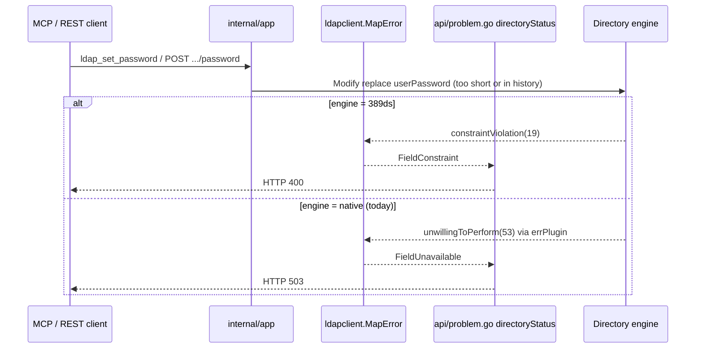
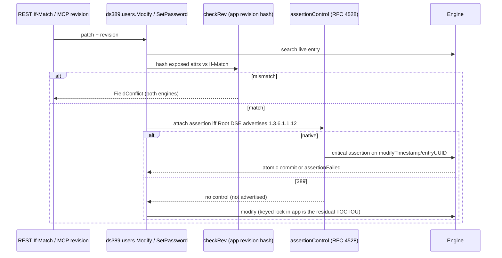
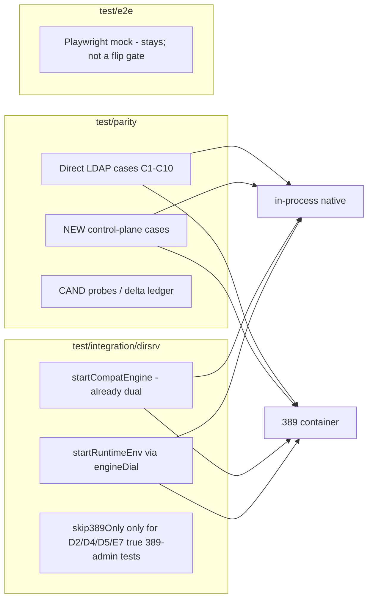
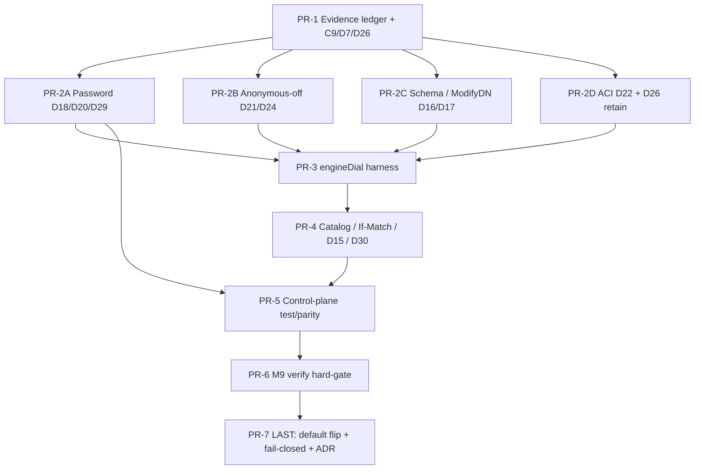

# Flip LabLDAP default directory engine from 389 DS to native (`labldapd`)

| Field | Value |
| --- | --- |
| **Status** | Default flip shipped in v0.3.0 by owner direction (2026-08-17). Residual parity PRs remain open. |
| **Author** | (implementation agent) |
| **Date** | 2026-08-16 |
| **Repo** | `go-lab-ldap-mcp` |
| **Related ADRs** | [ADR-0008](https://github.com/hilather/go-lab-ldap-mcp/blob/main/docs/adr/0008-dual-directory-engines.md), [ADR-0009](https://github.com/hilather/go-lab-ldap-mcp/blob/main/docs/adr/0009-native-engine-topology-and-storage.md) |
| **Contract** | `docs/design/native-engine-parity-contract.md` (`labldap.parity.v1`) |
| **Adjudication record** | `docs/design/parity-delta-log.md` |
| **Machine ledger (observation SoT)** | `test/parity/delta-ledger.json` + probe comments in `test/parity/probes.go` |
| **Oracle** | pinned 389 Directory Server 2.4.6 (`deploy/docker/dirsrv.digest`) |
| **Subject** | Go-native engine (`cmd/labldapd`, `internal/ldapserver`, bbolt store) |

This document is the implementable plan to reach **LabLDAP-surface parity** and then flip `spec.directory.engine` omitted → `native`. It is not a “good enough with residual deltas” plan. Residual deltas that change agent-visible MCP / REST / UI results are not acceptable for the default flip.

---

## Overview

LabLDAP today defaults to pinned 389 Directory Server. A Go-native engine exists as opt-in `engine: native` (ADR-0008 / ADR-0009). Dual-engine work is **LabLDAP-surface parity**, not literal 389 feature parity. The oracle remains 389 DS 2.4.6.

The native engine is already a real LDAPv3 server with a bbolt store, ACI evaluation, memberOf, referential integrity, password policy, and compose overlays. Wave 6 (T-147–T-150) landed the parity harness and a partial IT parametrization, but:

- T-147, T-149, and T-150 **acceptance checkboxes are still empty**. T-148’s three acceptance items are already `[x]` (compat matrix + skip ledger + 389-default IT).
- The M9 checklist is incomplete. README still says native is not advertised ready until M9 exit.
- The contract file is **stale**: section 3 stops at D14 and still lists Wave-1 CAND rows as “pending adjudication.” The living machine ledger (`test/parity/delta-ledger.json` + `probes.go`) has already adjudicated **D15–D30`. The human log (`parity-delta-log.md`) has two **narrative errors** (D7 “389 honors RFC 4528”; D26 engines swapped) — PR-1 must correct those from the JSON, not copy them.
- `test/parity` compares **direct LDAP only**. Contract §5 rule 2 (“where listed, through the control plane”) is not implemented.
- `startRuntimeEnv` → `Start()` **skips the entire control-plane IT surface** under `LABLDAP_IT_ENGINE=native` (MCP, REST handlers, app services, reset, export). T-148’s “12 pass / 51 delta-ID skips / 0 fail” (sentence in `TASKS.md`) is that skip, not parity.
- Several adjudicated deltas **leak through `ldapclient.MapError`** as different `apperr` field codes. Agents would see HTTP **503 / `FieldUnavailable`** vs **400 / `FieldConstraint`** for the same password-policy failure (`api/problem.go` `directoryStatus`).
- `make verify` treats `test/parity` as a **WARNING, not a gate** (`Makefile` 400–411). The comment above it claiming an ungenerated ledger is **stale** (the committed `delta-ledger.json` exists).

The plan: classify every Delta against the **machine ledger**, **close every agent-visible leak** (fix native to the 389 oracle, or normalize in the control plane and prove it), fill the missing regression surface on **both** engines, make `make verify` gate those tests, then flip the default in a last, independently reviewable PR. `engine: 389ds` remains a first-class oracle and rollback.

---

## Background & Motivation

### Current default

`internal/config/settings.go` `applyDefaults` sets omitted `spec.directory.engine` to `v1alpha1.Engine389DS`. JSON Schema `config/schema/v1alpha1.json` default is `"389ds"`. ADR-0008 decision 1 and decision 7 record 389 as default. Compose `deploy/compose/compose.yaml` pins the 389 image; native is an overlay (`compose.native.yaml` + `scenario.native.yaml`).

Native is lighter: 389 ephemeral `/data` is a **2 GiB tmpfs** because 512 MiB first-boot failed (OD-020). Native is a single `labldapd` process + `labldapd.bolt`. There is no in-repo RSS comparison; the operational motivation is real (no 389 container, no `dsconf`, no 2 GiB tmpfs).

### What “parity” means here

From ADR-0008 and `docs/design/native-engine-parity-contract.md`:

- **Contract** — both engines produce the same *directory-visible* result for LabLDAP clients and the control plane. 389 is oracle.
- **Delta** — intentional, documented difference. Native must not fake 389 identity.
- **Excluded (E1–E8)** — 389 surface LabLDAP does not expose. **Do not implement** (replication, SASL, RFC 3062, POSIX/AD, `dsidm`, indexes as a plan object).

LabLDAP-visible surface:

| Surface | Source of truth |
| --- | --- |
| REST | `api/openapi.yaml` (`/api/v1/users`, groups, search, bind-test, schema, reset, export, capabilities, …) |
| MCP tools / resources | `docs/mcp/catalog.md` / `internal/mcpserver/catalog.go` (16 tools, 7 resources) |
| UI | same `internal/app` services as REST |
| Bootstrap / reset / export | `labldap-bootstrap` data plane + `internal/app/reset.go` + LDIF export |
| Independent LDAP | `ldapsearch` / bind / memberOf / ACI / password-policy **effects** |

REST, MCP, and UI already share `internal/app`. Parity of transports is not the missing work. The missing work is **engine-identical directory effects** plus **proving them through the control plane**, not only through raw LDAP.

**Definition of done for “not agent-visible”:** a code-level LDAP delta may stay in section 3 only after dual-engine IT proves the same `apperr` field code, HTTP status (`api/problem.go`), and MCP error shape on the golden failure paths (see [Flip checklist](#flip-checklist-agent-visible-identity)). Documenting around a mismatch is not a close.

### Pain points (measured, not guessed)

1. **Stale contract vs living ledger.** Implementers reading only `native-engine-parity-contract.md` still see CAND-2/6/8–17 as pending. They have been adjudicated as D15–D30. The human D7/D26 sentences disagree with `delta-ledger.json`.
2. **Control-plane IT skips native.** `test/integration/dirsrv/harness.go` `Start()` calls `skip389Only(..., "D2/D4/D5/E7")` unconditionally. `startRuntimeEnv` in `repos_test.go` calls `Start()`. Therefore `TestMCPUserVisibleViaRESTAndLDAP`, `TestRESTHandlersOnEngine`, `TestCrossInterfaceResetAndExport`, `app_test.go`, `reset_test.go` never run on native. Those tests also call `ldapSearch` / `userBind` / `addExtraPerson`, which `docker exec` into the 389 container — they cannot run on native without a helper rewrite.
3. **Error-map leak.** `internal/directory/ldapclient/errors.go` `mapLDAP`:
   - LDAP `constraintViolation(19)` → `directory.FieldConstraint` → HTTP **400** (`directoryStatus`)
   - LDAP `unwillingToPerform(53)` → `directory.FieldUnavailable` → HTTP **503**
   Native password-policy writes abort through `op_write.go` `errPlugin` → 53. 389 returns 19 (D18). MCP `ldap_set_password` / REST `POST /users/{id}/password` therefore disagree. `MapError` does **not** set `Error.retry`; 503 is “retryable” only if the client treats 503 that way.
4. **Seed / merge / reset risk (D20, D29).** Native rejects re-setting the current password and rejects DM in-history resets. `internal/directory/ds389/seed.go` `replacePassword` as DM on merge, and `internal/app/reset.go` `upsertUser` → `SetPassword` when the seed user already exists, will fail native bootstrap/reset with the same seed secret. D29 cannot be implemented as “if `BypassACI`” today: `WriteEvent` is `{Op, Before, After}` only (`plugin.go`); `runPlugins` does not pass the bind subject.
5. **Anonymous-off is not fail-closed on native (D21, D24).** 389 with anonymous access off refuses unauthenticated ops (`inappropriateAuthentication(48)`), including Root DSE. Native evaluates ACI / answers Root DSE pre-bind (`searchRootDSE` comment even claims “Like 389”, which the oracle contradicted). Combined with `labldap:runtime-suffix-read` (`userdn="ldap:///anyone"`), independent `ldapsearch` without bind can read the suffix on native.
6. **`make verify` does not gate parity.** `Makefile` lines 400–411 print WARNING and continue. Lines 390–397 still claim T-147’s ledger is ungenerated; that comment is leftover T-150 text.

---

## Goals & Non-Goals

### Goals

1. **Native is the omitted-field default** (`spec.directory.engine` omitted → `native`) without silently weakening security defaults (anonymous bind remains off; cleartext simple bind remains off).
2. **True LabLDAP-surface parity** for REST, MCP tools/resources, UI-backed operations, bootstrap/reset/export, and independent LDAP clients.
3. **Every current Delta classified and resolved**: closed (native matches 389, or a 389 quirk is unobservable and we keep native’s better behavior only when LabLDAP clients cannot see it **and** the [flip checklist](#flip-checklist-agent-visible-identity) is green), or promoted to an explicit, reviewed, **identity-only or listing** Delta with golden payloads.
4. **Missing regression tests listed, assigned, and required** before the flip (see [Missing regression tests](#missing-regression-tests)).
5. **Default-flip is the last PR.** Preconditions: agent-visible ledger clean, native IT no longer skip-heavy for Contract tests, `make verify` includes the new gates, docs/examples/compose flip together, rollback is one scenario field (`engine: 389ds`).

### Non-goals

- Literal 389 feature parity. E1–E8 stay excluded.
- An LDAP listener in `labldap` / `labldap-bootstrap`. Production binaries must not import `internal/ldapserver`.
- In-memory maps as directory SoT.
- A third test stack. Extend `test/parity`, `LABLDAP_IT_ENGINE`, and the `startCompatEngine` pattern.
- Changing REST URL version or MCP tool names.
- Hard reset through REST/MCP.
- Shipping a silent insecure default (anonymous bind, cleartext bind, weaker password policy).
- Flipping the default while residual **agent-visible** deltas remain “documented.”
- Re-implementing T-147 Contract LDAP cases that already run in `test/parity/cases.go`.
- Implementing 389 `approxMatch` phonetics.

---

## Key Decisions

| ID | Decision | Rationale |
| --- | --- | --- |
| KD-1 | **Close agent-visible deltas by changing native (or a single `ldapclient`/`app`/`ParseFilter` map) before flipping the default.** Do not document around MCP/REST leaks. D15 `~=` and D30 schema listings are in the same bar as D18. | Owner requirement: “must get us to parity.” `MapError` already proves D18 is not identity-only. `SearchQuery.Filter` is a raw LDAP string on REST and `ldap_search_entries`. |
| KD-2 | **389 remains the oracle and a first-class rollback.** `engine: 389ds` stays in the enum. Compose keeps a 389 overlay. | ADR-0008 decision 2. Operators who depend on 389 quirks must not be silently migrated onto native bytes. |
| KD-3 | **Default flip is the last PR**, after ledger + tests + verify gates. | A default change with skip-heavy IT is a documentation lie. |
| KD-4 | **Stay on `apiVersion: labldap.dev/v1alpha1`.** Record the omitted-field default change as a **dated ADR-0008 amendment** that explicitly supersedes “breaking config → new apiVersion” for this one reinterpretation, **plus** a dated note in `config/schema/v1alpha1-stand-in.md`. Do **not** bump REST `/api/v1`. Do not bump `CompilerContract` (`labldap.config.v1alpha1.3`); the directory revision already mixes `engine`. Do **not** introduce `v1alpha2`. | Owner resolution (2026-08-16): stay on `v1alpha1`. The field and enum already exist (T-123). Forcing every file to change `apiVersion` is a larger break than adding `engine: 389ds`. |
| KD-5 | **Prefer fixing native at the LDAP result-code source** when 389’s code is what `MapError` already understands (D18 → return `constraintViolation(19)` from the password plugin). Use control-plane normalization for 389-absent features (D7/D28 assertion), honest listing (D1, D30), and caller filters the product does not want to implement twice (D15 reject `approxMatch`). | One map, two engines. Do not globally remap 53. |
| KD-6 | **When `allowAnonymousBind` is false, native must refuse unauthenticated directory operations** the way pinned 389 does (including Root DSE). | D21/D24 are a security widening, not a “native is better” Delta. Default labs ship `anyone` suffix-read ACIs. |
| KD-7 | **DM bypasses password history; re-setting the current password succeeds.** Match 389 (close D20, D29). | Bootstrap merge and soft-reset upsert re-apply the same seed secret. Native rejection is a product break. |
| KD-8 | **Extend existing harnesses.** Parametrize `startRuntimeEnv` via a shared `engineDial` and rewritten host-LDAP helpers (not `docker exec`). Add control-plane cases to `test/parity`. Do not invent `test/parity2`. | Contract §5; T-148 already chose `LABLDAP_IT_ENGINE`. |
| KD-9 | **Do not implement Excluded to “get parity.”** | Contract §4. Scope creep. |
| KD-10 | **`make verify` hard-gates** in-process native parity + `test-integration-native`. Dual-engine 389-oracle parity hard-gates when Docker is present; Docker-less machines skip the oracle leg with an explicit note (same as today for 389 IT), not a WARNING-on-failure. Delete the stale “ungenerated ledger” comment when the WARNING wrapper goes. | T-150 acceptance. |
| KD-11 | **Control plane stays an LDAP client.** Runtime remains `ds389.Runtime` + `ldapclient` pointed at whichever engine is listening (ADR-0009 decision 17). | No new native runtime adapter unless a measured gap forces an ADR. |
| KD-12 | **On-disk formats are not migrated.** Switching engine on an existing volume is a hard reset (`compose-reset`), not an import. `labldapd` must **fail closed** if `--data-dir` looks like a 389 nsslapd tree (see PR-7). | D4. `store.Open` today just `bolt.Open`s `labldapd.bolt` and would create a new file *beside* 389 files. |
| KD-13 | **D26: native retains leftover `nsmemberof` after last-member removal** to match 389 (oracle). Do **not** “add retract” — native already retracts (`memberof.go` `removeObjectClass`; `memberof_test.go`; ledger CAND-24 native post-retract has no `nsmemberof`; 389 still lists it). | `userFromEntry` copies `objectClass` onto `directory.User.ObjectClasses`; `RevisionOfUser` hashes that slice; REST/MCP search accepts `(objectClass=nsMemberOf)`. Leftover class is agent-visible. Stripping it in the control plane would still leak via raw search filters (C13). |
| KD-14 | **Control plane rejects `approxMatch` (`~=`)** in `config.ParseFilter` / `ds389.buildSearch` with a stable field (`filter` / `unsupported_filter`). Dual-engine REST+MCP IT **sends** `~=` and asserts the same problem. Direct LDAP `~=` remains D15 (identity-only). | Same bar as D18. Do not implement 389 approx phonetics. Do not “only test filters that avoid `~=`.” |
| KD-15 | **D29: add `Subject` (or `BypassPolicy`) to `WriteEvent`** and thread it from `handleAdd` / `handleModify` / `handleDelete` / `handleModifyDN`. `passwordEngine.AfterWrite` skips history iff that subject is DM. | `WriteEvent` today has no subject. `BypassACI` lives on the connection only. |

---

## Current-state inventory

### What is already done (M9 Waves 0–6)

- ADRs + contract + `spec.directory.engine` (`389ds` \| `native`, default `389ds`).
- `internal/ldapserver` + bbolt store + `cmd/labldapd`.
- Native bootstrap reconcilers (`internal/directory/native`) wait-and-read-back; data plane stays LDAP-as-DM (`internal/directory/ds389` seed/tree/ACI).
- Compose native overlays, `make compose-up-native`, native image.
- `test/parity`: Contract cases C1–C10 (direct LDAP), CAND-1…CAND-28 probes, committed `delta-ledger.json`, hermetic native leg, excluded-tier inertness.
- **T-148 is closed:** skip ledger D2/D4/D5/E7; compat matrix via `startCompatEngine`; `make test-integration` remains 389-default; native opt-in via `LABLDAP_IT_ENGINE=native`. The remaining hole is that **Contract control-plane tests were never parametrized**, not that T-148’s own acceptance is open.
- Differential harness `internal/ldapserver/differential_test.go` (D8–D14).
- If-Match path already exists: `ds389.Runtime.assertionEnabledOn` probes Root DSE for OID `1.3.6.1.1.12`; pinned 389 does **not** implement RFC 4528 (D28 / CAND-26); native advertises and honors it (D7 safety floor). Application `checkRev` always runs first.

### What is not done

| Item | Evidence |
| --- | --- |
| T-147 acceptance checkboxes | Still `[ ]`. Listed minimums (seed bind, memberOf, nsAccountLock, runtime ACI, paged, LDAPS) **already exist** in `cases.go`. Remaining: tick boxes from that evidence; attach redacted logs on failure; secret-scan-of-the-run. Do not re-write the LDAP cases. |
| T-148 | **Closed.** Do not re-open. |
| T-149 acceptance | `[ ]`. `make test-fuzz-short` and fuzz targets exist. Missing is the **CI-nightly contract**: PR-6 documents `make test-fuzz-short` as the nightly (chosen; no new job unless CI already has a nightly hook to attach). |
| T-150 acceptance | `[ ]` soak bound already has a target; real holes are verify WARNING and README advertising. |
| M9 checklist | `TASKS.md` “M9 P0 tasks T-122–T-150 are complete” is `[ ]`. |
| Contract file sync | Section 3 missing D15–D30; CAND table stale; C9 still claims assertion is Contract on both engines; human D7/D26 wrong. |
| Control-plane parity | No `test/parity` case goes through `internal/app`. |
| Runtime / MCP / reset IT on native | `startRuntimeEnv` → skip; helpers are `docker exec`. |
| README / architecture / `docs/13-open-decisions.md` **§4** | Still “389 default; native not ready until T-150” (ADR-0008 decision 1). Not OD-013 (that is the static token decision). |

### MCP / REST surface that must work on both engines

**MCP tools** (`internal/mcpserver/catalog.go`):

`ldap_search_entries`, `ldap_get_capabilities`, `ldap_get_baseline`, `ldap_get_entry`, `ldap_create_user`, `ldap_update_user`, `ldap_delete_user`, `ldap_set_password`, `ldap_create_group`, `ldap_delete_group`, `ldap_add_members`, `ldap_remove_members`, `ldap_replace_members`, `ldap_bind_test`, `ldap_reset_suffix`, `ldap_export_ldif`.

**MCP resources:** `labldap://capabilities`, `labldap://baseline`, `labldap://rootdse`, `labldap://schema`, `labldap://schema/objectclass/{name}`, `labldap://schema/attribute/{name}`, `labldap://entry{?dn}`.

**REST** (`api/openapi.yaml`): users CRUD + password/enable/disable + user groups; groups CRUD + members add/remove/replace; search; auth-tests; rootdse; schema; audit; reset; export; diagnostics; version/capabilities/baseline/session.

`ldap_update_group` / `PATCH /groups/{id}` remain omitted in v1.

Today almost all MCP catalog tests use fakes (`internal/mcpserver/*_test.go`). The one live MCP-over-engine IT is `TestMCPUserVisibleViaRESTAndLDAP` and it **skips on native**.

---

## Proposed Design

### Architecture (unchanged topology, flipped default)

```mermaid
flowchart TB
  subgraph clients [Clients]
    UI[Browser UI]
    REST[REST / MCP agents]
    LDAP[ldapsearch / apps]
  end

  subgraph control [Control plane - no LDAP listener]
    APP[internal/app]
    API[internal/api]
    MCP[internal/mcpserver]
    WEB[internal/web]
    LC[internal/directory/ldapclient]
    RT[ds389.Runtime]
    API --> APP
    MCP --> APP
    WEB --> API
    APP --> RT
    RT --> LC
  end

  subgraph engines [Directory engine - selected by spec.directory.engine]
    N[labldapd + bbolt DEFAULT]
    DS[389 DS 2.4.6 oracle / rollback]
  end

  UI --> WEB
  REST --> API
  REST --> MCP
  LDAP --> N
  LDAP --> DS
  LC -->|LDAP / LDAPS / StartTLS| N
  LC -->|LDAP / LDAPS / StartTLS| DS
  BS[labldap-bootstrap data plane as DM] --> N
  BS --> DS
```



Privilege rules do not change: no DM secret in long-running control; no Docker socket; soft reset is suffix-scoped; hard reset is compose/volume.

### How an agent-visible leak happens today



That is the definition of an unacceptable residual Delta. Closing it is KD-5: native password-policy abort returns 19, same as 389. `MapError` then already agrees.

### Delta classification (complete ledger)

**Convention**

| Disposition | Meaning | Default-flip effect |
| --- | --- | --- |
| **Fix native** | Native is wrong (or dangerously different) for LabLDAP-visible behavior. Change `internal/ldapserver`. Promote out of Delta (strike in the log). | **Blocks flip** until closed + tested. |
| **Normalize in control plane** | LDAP codes/attrs/filters may differ; MCP/REST/UI must not. Change `ldapclient` / `ds389.Runtime` / `app` / `ParseFilter` and prove with dual-engine IT. | **Blocks flip** until proven identical at the API/MCP layer. |
| **Reviewed listing Delta** | Honest publication difference (vendor, schema attr list). MCP/REST bodies **may** differ, but only on named fields, with golden payloads in the catalog IT. | Does not block flip **after** goldens exist. |
| **Identity-only Delta** | Storage/admin-plane/direct-LDAP-only difference. LabLDAP clients cannot observe a behavioral difference. | Does **not** block flip **only after** the [flip checklist](#flip-checklist-agent-visible-identity) proves the management APIs agree. |
| **Keep native-stricter (identity-only)** | Native fails closed where 389 is sloppy, and LabLDAP does not depend on the sloppiness. | Same proof bar as identity-only. |
| **Evidence missing** | Adjudicated at LDAP layer; control-plane effect not proven. | **Blocks flip** until a test exists. |

Observation SoT for “what each engine did” is `test/parity/delta-ledger.json` + `probes.go` comments, not the human D7/D26 sentences.

D1–D7 are design-time (contract §3) — D7’s *intent* (native must honor assertion; 389 may omit) is correct; the human log’s “389 honors RFC 4528” is **false**. D8–D14 from `TestDifferential389Oracle`. D15–D30 from T-147 probes. **There are no remaining pending CAND rows.**

#### Identity-only / reviewed listing (keep, with proof)

| ID | Topic | Why it may stay | Proof required before flip |
| --- | --- | --- | --- |
| **D1** | Vendor identity | Honest. Capabilities already expose `EngineVendor` / `EngineVersion`. MCP/REST **should** differ. | Golden capabilities payloads: native `LabLDAP` ≠ 389 `389-Directory`. |
| **D2** | Admin plane (`cn=config` / `dsconf`) | Native has no 389 tools. Control never calls `dsconf` at runtime. | Skip ledger stays D2 for `dsconf` tests only. |
| **D3** | Password hash encoding | Bind with plaintext; never compare hashes (contract §1). | C4 bind/modify effects + password API checklist. |
| **D4** | On-disk format | Engine-owned. | Fail-closed on nsslapd `/data` (KD-12 / PR-7). |
| **D5** | Backend CN `userroot` | Suffix is the contract. | Do not assert backend CN on native. |
| **D6** | Root DSE extra 389 attrs | Capability inspect is allowlisted. | Root DSE / capabilities IT uses allowlisted fields only. |
| **D8 / D23** | Malformed-DN bind 34 vs 49 | Bind-test parses DNs in-process (`lookupBindIdentity`); garbage DN → `invalid_credentials` **before** LDAP. | Dual-engine bind-test IT with a malformed identity string: same `BindOutcomeInvalidCredentials`. **Flip blocker until that test exists.** |
| **D9** | Anon bind disabled 48 vs 53 | Control never anonymous-binds. Both deny. | After KD-6, leftover code difference is identity-only. |
| **D10** | LDAPv2 bind 49 vs 2 | LabLDAP is LDAPv3. | None. |
| **D11** | ModifyDN out-of-suffix 71 vs 53 | Runtime does not call ModifyDN. | None on MCP/REST. |
| **D12** | Paged-cookie tamper: 389 accepts, native HMAC fails closed | Control-plane list/search/export use **process-local HMAC cursors** (`internal/config/cursor.go`). | None on MCP/REST. |
| **D13** | WhoAmI `dn: ` spacing/case | Rendering only (RFC 4532). | Compat `ldapwhoami` stays engine-tolerant. |
| **D14** | WhoAmI anonymous | After KD-6 this likely **collapses**. | Re-adjudicate in PR-2B. |
| **D15 (LDAP layer only)** | `approxMatch` folds to equality on native; 389 does real approx | Direct LDAP only after KD-14. | Control plane **rejects** `~=` (see normalize table). |
| **D25** | Compare absent attr 16 vs 5 | LabLDAP does not expose Compare. | None. |
| **D27** | `supportedLDAPVersion` includes `2` on 389 | Contract is “v3 is served.” | Capabilities must not require v2. |
| **D30** | Subschema publishes `pwdAccountLockedTime` on native only | Honest listing (native lockout attr). Same treatment as D1, **not** “optional if GET does not fail.” | Golden `GET /schema` / `labldap://schema` / `labldap://schema/attribute/pwdAccountLockedTime` payloads: native lists it; 389 does not. Catalog IT asserts that **named** inequality. Do not filter it away (bind-test depends on the attr on native). |

#### Fix native (block default flip)

| ID | Topic | 389 (machine ledger) | Native today (machine ledger / code) | Why it is LabLDAP-visible | Change |
| --- | --- | --- | --- | --- | --- |
| **D16** | ModifyDN rename into own subtree | Rejects `unwillingToPerform(53)`; tree intact | Allows; later subtree walks detach (`noSuchObject`) | Correctness bug; C1 | Dispatch guard in ModifyDN (`op_write.go`); store must not detach |
| **D17** | Schema MAY / unknown attributes | Rejects unknown; marker extras rejected (OD-012) | Accepts unknown attrs and marker extras | C13 + C5 | Enforce MUST/MAY + unknown-attr reject on writes. Marker stays `description` JSON. |
| **D18** | Password-policy write code | `constraintViolation(19)` | `unwillingToPerform(53)` via `errPlugin` | HTTP 400 vs 503 | Map `errPasswordTooShort` / `errPasswordInHistory` to 19 in `mapWriteError` (not generic `errPlugin` → 53) |
| **D20** | Re-set current password | Allowed (`success`) | Rejected as in-history, 53 | `ldap_set_password` / REST / reset upsert | Stop treating current hash as history (`password.go` `applyModify`) |
| **D21** | `anyone` / `all` / anonymous | Anon ops refused 48 when anonymous off | Pre-bind read of `anyone` ACI succeeds | Independent `ldapsearch` without bind | Fail-closed if `!AllowAnonymousBind` |
| **D22** | `groupdn` nesting | Nested `groupdn` grant resolves (CAND-17) | Direct `member`/`uniqueMember` only in `groupMemberA` | Operator ACLs + `nestedGroups: true`; compiler emits `groupdn` (`acl.go` `principalWho`) and allows group-in-group when the flag is on (`group.go`) | See [D22 walker](#d22-aci-groupdn-walker). `MemberOfPlugin` already nests when the flag is on — do **not** confuse the two. |
| **D24** | Pre-bind Root DSE, anonymous off | Refused 48 | Success | Independent clients; `searchRootDSE` comment is wrong vs oracle | Gate Root DSE / subschema with the same anonymous-off rule. Production inspect uses the **bound** runtime pool (`fetchRootDSE`). |
| **D26** | memberOf auxiliary OC after retract | **Keeps** leftover `nsmemberof` (ledger CAND-24 oracle post-retract) | **Already retracts** (`removeObjectClass`; ledger native post-retract has no class) | `User.ObjectClasses` + revision hash + `(objectClass=nsMemberOf)` search | **Retain** the class after last-member removal (stop calling `removeObjectClass` when the computed `memberOf` set is empty; still add on grant). Update `memberof_test.go`. Human-log sentence is inverted — correct in PR-1. |
| **D29** | DM password reset vs history | DM bypasses history | DM in-history reset rejected 53 | Bootstrap `replacePassword` on merge | `WriteEvent.Subject`; skip history when `BypassACI`. Probe 389 min-length-as-DM in the same PR. |

#### Normalize in control plane (block until proven)

| ID | Topic | LDAP-layer fact | Control-plane rule | Proof required |
| --- | --- | --- | --- | --- |
| **D7 / D28** | RFC 4528 | Pinned 389 does **not** implement assertion (`unavailableCriticalExtension(12)` on critical Modify; does not advertise the OID). Native advertises and honors it. D7 is the *absence path* (control uses `checkRev` + keyed lock when the OID is missing), not “389 honors assertion.” | `Runtime.assertionEnabledOn` already probes Root DSE. Never attach a critical assertion on 389. If-Match / MCP `revision` → same `FieldConflict` / 412. Amend contract **C9**: assertion is Contract on native; 389 omits; control is `assertionEnabledOn` + `checkRev`. | Dual-engine REST + MCP stale-revision test; concurrent If-Match (at most one success on native). |
| **D15 (management APIs)** | `approxMatch` | Native folds to equality; 389 applies real approx. `SearchQuery.Filter` is raw. | `ParseFilter` / `ParseFilterLimits` / `buildSearch` reject filters containing approx (`~=` / `FilterApproxMatch`) with `filter` / `unsupported_filter`. Both engines then return the same problem. | REST `POST /search` and `ldap_search_entries` send `(cn~=Alic Anderson)` → same field code + HTTP/MCP shape. |
| **D19** | Lockout bind code + lock markers | 389: 5th failure `constraintViolation(19)`, stamps `accountUnlockTime` / `passwordRetryCount`. Native: `invalidCredentials(49)`, stamps `pwdAccountLockedTime`. | **C4 (amended):** Contract is the lockout *effect* + bind-test `locked` outcome, not a single marker attribute. Native may keep extra lock attrs. Control plane **unions** `pwdAccountLockedTime` and `accountUnlockTime` (and any other observed lock stamp) in `lookupBindIdentity`. | Dual-engine `ldap_bind_test` / REST `/auth-tests` after N failures → `BindOutcomeLocked` both. |

#### Already Contract (do not re-open)

CAND-3, CAND-7, CAND-12, CAND-13, CAND-14, CAND-16, CAND-19 — engines agree; harness steps untagged.

#### Excluded (do not implement)

E1 replication, E2 SASL, E3 RFC 3062, E4 unused plugins, E5 AD/Samba, E6 ACI features the compiler does not emit, E7 `dsidm`/`dsctl`, E8 indexes as plan objects.

### D22 ACI `groupdn` walker

This is **not** the MemberOf plugin. `MemberOfPlugin` already walks nested `member` when `nestedGroups` is true (`memberof.go` frontier/seen). The hole is `aciEngine.groupMemberA` (`aci_eval.go`), which checks only the target group’s direct `member` / `uniqueMember` values.

Specify in PR-2D:

| Rule | Spec |
| --- | --- |
| Attributes walked | `member` and `uniqueMember` (same as `memberDNs` today). |
| Nesting on | When compiled `spec.directory.nestedGroups` is true, walk nested group DNs found as members. |
| Nesting off | Direct members only. **Product rule is flag-gated** (owner 2026-08-16). PR-2D still probes 389 with the flag off; if 389 nests anyway, **record a Delta** — do not change this product rule. |
| Cycles | `seen` set of folded group DNs; skip already-visited. |
| Max depth | Cap at 8 (or `limits` if one exists); exceed → deny + debug log, no unbounded walk. |
| Snapshot | Same `ReadTx` as the authorized op (already). |
| Reuse | Extract the memberOf frontier walker (or share a `groupGraph` helper) rather than a second graph implementation. |
| `allowRawACI` | Probe a raw ACI `groupdn` that points at a group-of-groups with YAML `nestedGroups: false`. Native must stay direct-only; if 389 nests, ledger a Delta (do not start nesting). |

Compiler *does* emit `groupdn` (`internal/config/acl.go` `principalWho`) and *does* allow group-in-group members when `nestedGroups: true` (`internal/config/group.go`).

### D29 plugin seam

```go
// internal/ldapserver/plugin.go
type WriteEvent struct {
    Op      WriteOp
    Before  *Entry
    After   *Entry
    Subject Subject // bind identity; BypassACI is DM
}
```

Thread from `handleAdd` / `handleModify` / `handleDelete` / `handleModifyDN` (those handlers already have `subj`). `passwordEngine.AfterWrite` skips history when `ev.Subject.BypassACI`. Unit-test DM vs runtime vs self. Probe 389: DM replace of an in-history password (expect success) and DM replace of a too-short password (record; match that result). FakePlugin tests must still compile (`WriteEvent{Op, After}` zero Subject is non-DM).

### Control-plane error normalization map

`internal/directory/ldapclient/errors.go` `mapLDAP` is the single choke point. After the native fixes above, remaining LDAP code deltas must not produce different field codes on management APIs:

| LDAP situation | 389 code | Native code (after fixes) | `MapError` / app | HTTP / MCP |
| --- | --- | --- | --- | --- |
| Password too short / in history | 19 | **19** (D18 closed) | `FieldConstraint` | 400 |
| Re-set current password | 0 | **0** (D20 closed) | success | 204 / MCP ok |
| Lockout bind | 19 | 49 (D19 remains) | bind-test uses attrs | `BindOutcomeLocked` |
| Disabled `nsAccountLock` | 53 | 53 | diagnostic **or** attr | `BindOutcomeDisabled` |
| Stale If-Match | `checkRev` (no assertion) | `checkRev` and/or `assertionFailed(122)` | `FieldConflict` | 412 |
| Unknown user / wrong password | 49 | 49 | `FieldInvalidCredentials` | indistinguishable |
| Malformed bind DN | 34 | 49 | bind-test short-circuits | `invalid_credentials` |
| `approxMatch` filter | n/a (never reaches engine) | n/a | `unsupported_filter` | 400 both |

Do **not** globally map 53 → constraint. 53 is also disabled-account, anonymous-disabled, StartTLS-disabled, plugin abort, paged-cookie reject.

### If-Match / revision (D7, D28)



Application revision (`internal/directory/revision.go`) hashes **exposed** user/group attributes including `ObjectClasses`. After KD-13 (retain leftover `nsmemberof` on both), membership retract does not fork revisions. Do not hash `entryCSN` / vendor extras.

**Must prove:** stale ETag → same HTTP 412 and same MCP error body on both engines; matching ETag succeeds; concurrent conflicting updates: at most one commit on native (txn); 389 may lose the race (documented residual, **not** an agent-visible code difference if the loser still sees conflict on retry).

### Soft reset, seed bind, export (C12) on native

`internal/app/reset.go`:

1. Inventory + dependency-safe delete (`executeDeletes`).
2. `reapply` → `upsertUser` (Add, or Modify + **SetPassword**) / `upsertGroup`.
3. Verify + `bindCheck` (seed users bind with seed passwords).
4. Marker last (existing rule).

If deletes remove seed users, Add path avoids D20. If a seed user **survives**, SetPassword of the same secret hits D20 today. Bootstrap merge always hits D29 as DM.

**After D20/D29 fixes**, add dual-engine IT (today `reset_test.go` / `cross_reset_export_test.go` skip on native):

- Soft reset on a dirty tree (extra user + extra group + leftover membership).
- Seed alice binds with seed password after reset.
- Export LDIF after reset; no secrets; marker revision matches.
- Second reset is idempotent (same seed password again).

C13 helpers used by those tests must speak **host** LDAP (see harness), not `docker exec`.

### C13 cross-visibility on native

Contract C13: user created through REST or MCP is visible to `ldapsearch`; user added as DM via `ldapmodify` is visible through REST.

`TestMCPUserVisibleViaRESTAndLDAP` is exactly this and **skips on native**. After `startRuntimeEnv` is parametrized **and** `userBind`/`ldapSearch` use `engineDial`, this test is the C13 native proof. Extend it:

- MCP create → REST get → host `ldapsearch` (runtime + DM).
- REST create → MCP `ldap_get_entry` → host `ldapsearch`.
- DM `ldapadd` via go-ldap → REST get → MCP get.
- Same for a group + membership (`memberOf` on the user).

### Test harness design



**Shared fixture (both engines, one YAML):** do **not** reuse `seedYAML("merge")` (`historyCount: 0`, alice+staff) for `startRuntimeEnv`, and do **not** keep 389 on `stageApply` (minimal, no policy) while native uses a different tree.

New `runtimeYAML()` compiled once:

- suffix `dc=example,dc=test`; runtime account `rt` / `secrets/runtime-ldap`
- **no** extra seed users (existing IT creates its own alice/h-alice/…)
- `passwordPolicy.minLength: 12`
- `passwordPolicy.historyCount: 4` (required so PR-4 D20 proofs are not hidden)
- lockout enabled with the same `maxFailures` the bind-test IT already assumes (or the value `testRuntimeBindTest` will be updated to)
- LDAPS + StartTLS; anonymous/cleartext off

389 path: `Start()` + host-side `labldap-bootstrap apply` **or** existing in-container apply of **that same YAML** (not `stageApply`’s minimal snippet). Native path: `startNative(t, runtimeYAML())`. Unifying **will** change today’s 389 `startRuntimeEnv` tree (it gains history/lockout). That is acceptable: current user/group tests Add their own entries; they must not re-set the same password unless they are the D20 case.

**`engineDial` (required; `compatEnv` can embed or alias this):**

```go
// engineDial is the engine-neutral LDAP endpoint. C12/C13 helpers
// use this — never docker exec — so native and 389 share one code path.
type engineDial struct {
    engine     string // Engine389DS | EngineNative
    ldapAddr   string
    ldapsAddr  string
    caFile     string
    serverName string
    dmPassword string
}

type runtimeEnv struct {
    dial engineDial
    inst *Instance // non-nil only on 389; D2/D4/D5 tests only
    rt   *ds389.Runtime
    pool *ldapclient.Pool
}
```

**Helper rewrites (first-class PR-3 files, not “etc.”):**

| Today | Problem | After |
| --- | --- | --- |
| `ldapSearch(t, inst *Instance, …)` `plugins_test.go` | `docker exec ldapsearch` | `ldapSearch(t, d engineDial, …)` via go-ldap or **host** `ldapsearch` + `--cacert` |
| `ldapSearchAllowMissing` | same | same rewrite |
| `userBind(t, inst, dn, pw)` | docker/in-container bind | go-ldap `DialTLS` to `d.ldapsAddr` |
| `addExtraPerson(t, inst, dn)` | `docker exec ldapadd` | go-ldap Add as DM |
| `runtimeReplace(t, inst, …)` | `docker exec ldapmodify` | go-ldap Modify as runtime or DM |

Call sites to update: `repos_test.go`, `app_test.go`, `handlers_test.go`, `mcp_mutate_test.go`, `reset_test.go`, `cross_reset_export_test.go`, plus any C13 assertion those files make via `env.inst`.

`skip389Only` remains valid **only** for tests that truly need `dsconf` / image lifecycle / backend CN / in-container `ldap*` against `cn=config` (D2/D4/D5/E7): `backend_test.go`, `bootstrap_image_test.go`, `recover_test.go`, `wait_test.go`, `dsconf` JSON slices of `pwpolicy_test.go` / `plugins_test.go`.

| File | Today | After |
| --- | --- | --- |
| `repos_test.go`, `app_test.go`, `handlers_test.go`, `mcp_mutate_test.go`, `reset_test.go`, `cross_reset_export_test.go` | `startRuntimeEnv` → skip | dual via `engineDial` |
| `compat_test.go`, some `tls_test.go` | already dual | keep; may embed `engineDial` |
| `aci_test.go`, `tree_test.go`, `seed_test.go`, `marker_test.go`, `ldapclient_test.go` | `Start()` | split: LDAP-as-DM cases → `engineDial`; `dsconf` stay skipped |
| `plugins_test.go`, `pwpolicy_test.go` | `Start()` + dsconf | effect-level cases on `engineDial`; dsconf JSON 389-only |
| `verify_test.go` | bootstrap binary in 389 container | native: in-process `labldapd` + host `labldap-bootstrap` (T-144/T-146) |

### Control-plane cases in `test/parity`

Add a `controlplane.go` (integration tag) that, for each engine fixture, constructs `ds389.Runtime` + `app.New` (no HTTP) and records outcomes in the same `opOutcome` shape:

| Case | Contract | Operations |
| --- | --- | --- |
| `cp-create-user-visible` | C13 | `Users.Add` → LDAP search as DM |
| `cp-ldapadd-visible` | C13 | LDAP add as DM → `Users.Get` |
| `cp-set-password` | C4, C11 | `SetPassword` short → `FieldConstraint`; valid → bind success |
| `cp-approx-rejected` | D15 | Search `(cn~=x)` → `unsupported_filter` both |
| `cp-bind-test` | C3 | unknown ≡ wrong; lockout → `locked`; disable → `disabled`; malformed identity → `invalid_credentials` |
| `cp-if-match` | C9/D7 | stale rev → `FieldConflict`; good rev → modify |
| `cp-memberof` | C7 | add member → user `memberOf` on Get; after retract, `ObjectClasses` still contain `nsmemberof` on **both** (D26 retain) |
| `cp-reset-seed-bind` | C12 | reset service + seed bind (may live in dirsrv IT if too heavy) |

Rule 2 of contract §5 becomes real.

### Flip checklist (agent-visible identity)

PR-7 cannot merge until dual-engine IT (PR-4 + PR-3) asserts **identical** `apperr` field code, HTTP status, and MCP error shape on these golden paths. Remaining LDAP code deltas are identity-only only after this proof exists.

| Path | Stimulus | Same on both engines |
| --- | --- | --- |
| REST + MCP set password | too short | `FieldConstraint` / 400 |
| REST + MCP set password | in history | `FieldConstraint` / 400 |
| REST + MCP set password | current password re-set | success |
| REST If-Match + MCP `revision` | stale | `FieldConflict` / 412 |
| REST + MCP bind-test | unknown user | `invalid_credentials` ≡ wrong password |
| REST + MCP bind-test | after lockout | `BindOutcomeLocked` |
| REST + MCP bind-test | malformed identity | `invalid_credentials` |
| REST + MCP search | `(cn~=…)` | `unsupported_filter` / 400 |
| REST + MCP user get after membership retract | objectClasses / revision | leftover `nsmemberof` present (D26 retain) |
| REST `GET /schema` + `labldap://schema` | attributeTypes listing | D30 golden: native has `pwdAccountLockedTime`; 389 may not — **asserted**, not ignored |
| REST + MCP capabilities | vendor | D1 golden inequality |
| REST + MCP create user | then LDAP search | C13 visible |
| REST + MCP reset + export | seed bind after reset | C12 |

### Missing regression tests

Assigned to PRs in the [PR Plan](#pr-plan).

| ID | Gap | Engine | Home | PR |
| --- | --- | --- | --- | --- |
| R1 | `engineDial` + helper rewrite + shared `runtimeYAML()` | both | `repos_test.go`, `native.go`, `engine.go`, `plugins_test.go` helpers | PR-3 |
| R2 | Existing app/handlers/MCP/reset/export IT run on native (no skip) | native | those `*_test.go` | PR-3 |
| R3 | MCP catalog tools + resources against **both** engines; **same problem codes/bodies** on golden paths | both | `mcp_catalog_it_test.go` | PR-4 |
| R4 | C13 MCP ↔ REST ↔ host LDAP on native | native | `mcp_mutate_test.go` | PR-3 / PR-4 |
| R5 | Soft reset + seed bind + export after reset on native | native | `reset_test.go`, `cross_reset_export_test.go` | PR-3 |
| R6 | If-Match / revision identical at REST + MCP | both | `handlers_test.go` + MCP | PR-4 |
| R7 | Password-policy errors: short / history → 400 / `FieldConstraint` | both | handlers + MCP | PR-2A + PR-4 |
| R8 | Re-set current password succeeds both engines | both | same | PR-2A + PR-4 |
| R9 | Bind-test lockout + malformed identity | both | bindtest + MCP | PR-4 |
| R10 | Control-plane cases in `test/parity` | both | `test/parity/controlplane.go` | PR-5 |
| R11 | T-147/T-149/T-150 checkboxes + verify hard-gate + delete stale Makefile comment | CI | `TASKS.md`, `Makefile` | PR-6 |
| R12 | Nested `groupdn` walker + `allowRawACI` probe | both | `aci_eval.go`, parity | PR-2D |
| R13 | Unknown-attr reject + ModifyDN-into-self reject | both | parity CAND-6/8 → Contract | PR-2C |
| R14 | Anonymous-off: pre-bind suffix + Root DSE fail both | both | CAND-15/22 re-adjudicate | PR-2B |
| R15 | D26 **retain** leftover `nsmemberof` (not retract) | both | `memberof.go`; CAND-24 → Contract | PR-2D |
| R16 | DM merge re-applies same seed password | native | seed/bootstrap IT | PR-2A |
| R17 | Mock Playwright stays (T-107). **No** live native browser smoke as a flip gate | n/a | `test/e2e` | none (owner: REST/MCP IT is enough) |
| R18 | T-147 paperwork only (cases already run) | both | `TASKS.md` | PR-6 |
| R19 | Reject `~=` on REST/MCP both engines | both | `filter.go`, `buildSearch`, catalog IT | PR-4 |
| R20 | D30 schema listing goldens | both | catalog IT | PR-4 |
| R21 | `labldapd` fail-closed on nsslapd `/data` | native | `cmd/labldapd`, `store`, IT | PR-7 |

### Default-flip mechanics (last PR only)

1. `applyDefaults`: omitted engine → `v1alpha1.EngineNative`.
2. `config/schema/v1alpha1.json` `"default": "native"`.
3. Tests: invert `TestEngineDefaultAndRedactedPlan`; add “explicit `389ds` still 389” and “omitted directory revision == explicit native.”
4. Examples: `config/examples/example-lab.yaml`; `deploy/compose/scenario.yaml` omit or set `native`.
5. Compose: fold today’s native overlay into `compose.yaml`. New `compose.389ds.yaml` + `scenario.389ds.yaml`. `compose.native.yaml` becomes an alias or is deleted with a README pointer.
6. Make: `compose-up` → native. `compose-up-389ds` → oracle/rollback. Keep `compose-up-native` as an alias for one release.
7. Docs: README, `docs/01-system-architecture.md`, `docs/13-open-decisions.md` §4, `AGENTS.md`, `config/schema/v1alpha1-stand-in.md` **dated compatibility note**, bootstrap usage text (T-146 leftover).
8. **Dated ADR-0008 amendment:** decision 1 default becomes native; decision 7 “defaulting to 389ds” superseded for the omitted field; the amendment **explicitly** records that this one omitted-field reinterpretation does not take a new `apiVersion` (supersedes the AGENTS.md letter for this change only). Explicit `389ds` unchanged.
9. Security defaults unchanged. Ephemeral tmpfs size **stays 2 GiB** until a post-flip first-boot smoke; do not shrink in PR-7.
10. **`labldapd` fail-closed** if `--data-dir` contains 389 markers (`container.inf`, `config/container.inf`, `slapd-*` NSS/db layout) **or** if `labldapd.bolt` exists but is not a bbolt file. Exit with a stable, secret-free diagnostic naming `compose-reset` and `engine: 389ds`. IT: point the daemon at a fake nsslapd tree.

### Compatibility, apiVersion, and migration

**This is a behavior change** for existing scenario files that omit `engine`. It is not a silent security-default change.

| Artifact | Change? |
| --- | --- |
| `apiVersion` | Stay `labldap.dev/v1alpha1` (KD-4; owner 2026-08-16). No `v1alpha2`. |
| REST version | No. |
| MCP tool names | No. |
| `CompilerContract` | No bump (`labldap.config.v1alpha1.3`). Engine is already in the directory revision hash. |
| Persistent `/data` | **Not portable.** Fail-closed + hard reset. |
| Operators who need 389 | `spec.directory.engine: 389ds` + `compose-up-389ds`. |
| Insecure defaults | Unchanged. |

**Migration checklist (operator-facing, lands in the flip PR README):**

1. If you already set `engine: native` or `engine: 389ds`, no default change applies.
2. If you omitted `engine` and run 389 today: add `engine: 389ds` **before** upgrading, or accept a new directory revision and a **hard reset** of `/data`.
3. Do not point native `labldapd` at an existing 389 `/data` volume — the daemon must refuse to start.
4. Tokens, TLS, ports, MCP flags, password policy YAML: unchanged.

---

## API / Interface Changes

No new REST paths. No new MCP tools.

| Interface | Change |
| --- | --- |
| `v1alpha1.Directory.Engine` zero value | Default `native` instead of `389ds` (PR-7) |
| JSON Schema default | `"native"` |
| `GET /api/v1/capabilities` / `ldap_get_capabilities` | `engineVendor` is `LabLDAP` on the default engine (D1 goldens) |
| `GET /schema` / `labldap://schema` | D30 listing goldens |
| `config.ParseFilter` | Reject `approxMatch` (`unsupported_filter`) |
| `ldapclient.MapError` | No new public API; D18 fix is on the server. Bind-test also reads `accountUnlockTime` (D19) |
| `ldapserver.WriteEvent` | **Add `Subject`** (KD-15) |
| `ldapserver` write results | Password-policy errors → 19; DM history bypass via `Subject`; current-password re-set allowed |
| `ldapserver` bind/search | Unauthenticated ops fail closed when anonymous bind is off |
| `MemberOfPlugin` | **Retain** leftover `nsmemberof` after last-member removal (do not retract) |
| `aciEngine.groupMemberA` | Nested walk **only** when `nestedGroups` is true ([D22 walker](#d22-aci-groupdn-walker)) |
| `labldapd serve` | Fail-closed on nsslapd `/data` |

Example defaulting (today → after flip):

```go
// internal/config/settings.go
if d.Engine == "" {
    d.Engine = v1alpha1.EngineNative // was Engine389DS
}
```

---

## Data Model Changes

No LDAP schema invention. No new scenario fields required.

- Directory revision hash already includes `engine`. Default flip ⇒ new hash for omitted-engine labs ⇒ marker mismatch ⇒ bootstrap/reset must re-apply (correct).
- On-disk: default labs use `/data/labldapd.bolt` (0600). Ephemeral tmpfs **stays 2 GiB** until a later first-boot smoke (not PR-7). Persistent volume meaning unchanged.
- No migration of entries between engines.
- `WriteEvent` grows a `Subject` field (in-process only).

---

## Security & Privacy Considerations

| Threat | Mitigation |
| --- | --- |
| Default flip silently enables anonymous or cleartext bind | It must not. Defaults stay off. Flip-PR test: compiled transport flags unchanged when only the engine default changes. |
| Native anonymous-off still answers `anyone` ACIs (D21) | KD-6 / PR-2B **before** flip. |
| Native accepts unknown attributes (D17) | Reject on write (PR-2C). |
| Password-policy failure looks like HTTP 503 on native (D18) | Return 19 → 400 / `FieldConstraint`. |
| Omitted-engine lab boots native against a 389 volume | Fail-closed diagnostic (PR-7); no bolt create-beside. |
| Privilege separation | Unchanged. |
| Pre-auth BER surface | Already accepted in ADR-0008. Fuzz: `make test-fuzz-short` as nightly (PR-6). |
| Logging | Same redaction. Fail-closed message must not include file contents. |
| Hard reset exposure | Still compose-only. |

---

## Observability

- Capabilities: `engineVendor` / `engineVersion` distinguish engines (D1 goldens).
- Schema listings: D30 goldens.
- Metrics: keep engine-agnostic labels (no DNs). Optional bounded `engine=native|389ds`.
- Bootstrap diagnostics: flip PR updates usage strings that still say “389 Directory Server.”
- Fail-closed: stable `apperr.CodeConfiguration` (or bootstrap-equivalent) with field `dataDir` / `engine_data_mismatch`.
- Parity failures: attach redacted engine logs (T-147 checkbox). Secret scan stays in verify.

---

## Rollout Plan



**Feature flag:** none beyond the existing `spec.directory.engine` field.

**Staged rollout:** merge PRs 1–6 with default still 389. Only then PR-7.

**Rollback:** `engine: 389ds`, `compose-up-389ds`, hard-reset `/data`.

**Abort criteria for PR-7:** flip checklist red; verify WARNING still present; README still saying “native not ready”; fail-closed IT missing.

---

## Alternatives considered

### A1. Keep 389 as default forever; native opt-in (status quo)

**Reject for the owner’s goal.** Native stays second-class; skip-heavy IT never gets paid down.

### A2. Flip default now with residual deltas documented

**Reject.** D18 already changes MCP/REST problem codes. D15 `~=` and D30 schema listings are the same class of leak. D20/D29 break seed merge/reset. D21 widens anonymous read.

### A3. Close agent-visible deltas + fill regression holes, then flip default with `engine: 389ds` still supported (this design)

**Recommend.**

### A4. Dual-default by compose flavor only (do not change YAML default)

**Not enough.** Agents and `labldap serve --config` without compose would still default to 389.

### A5. New `apiVersion` (`v1alpha2`) whose only change is the engine default

**Rejected by owner (2026-08-16).** Stay on `v1alpha1` with a dated ADR-0008 amendment + `v1alpha1-stand-in.md` note (KD-4). Do not implement `v1alpha2`.

### A6. D26: keep native retract and strip `nsmemberof` in the control plane

**Reject.** Raw `SearchQuery.Filter` can still ask `(objectClass=nsMemberOf)` (C13). Oracle-matching retain is one code path.

### A7. D15: fold `~=` to equality in the control plane instead of rejecting

**Reject.** Silent rewrite would make REST disagree with independent `ldapsearch` on 389 (C13). Rejecting on both engines is the same problem everywhere.

---

## Risks

| Risk | Severity | Mitigation |
| --- | --- | --- |
| Operators with omitted `engine` and a persistent 389 volume upgrade and boot native against nsslapd files | High | **PR-7 fail-closed** (not docs-only); marker/revision; compose-reset |
| D19 bind-test still differs after attr union | Medium | Union lock attrs in bind-test (PR-4); C4 is effect + `locked` outcome (PR-1) |
| D22: 389 nests `groupdn` even when `nestedGroups: false` | Medium | PR-2D probes 389; if it nests with the flag off, **record a Delta** — native stays flag-gated |
| Fixing D21/D24 breaks a path that relied on pre-bind Root DSE | Low | Production inspect uses bound pool |
| Shared `runtimeYAML()` changes 389 IT (history/lockout on) | Medium | Tests already Add their own users; update any that re-set the same password |
| `engineDial` rewrite misses a `docker exec` helper | Medium | PR-3 file list is exhaustive; `rg docker exec` in `test/integration/dirsrv` on Contract files |
| Verify hard-gate flakes on Docker-less agents | Low | Native parity + native IT are in-process |
| Scope creep into E1–E8 | High | Contract + this design |
| Calendar: split PRs stall the flip | Medium | 2A–2D are parallel after PR-1; do not merge flip early |

---

## Resolved questions

Owner decisions 2026-08-16. Final. Do not re-open.

| ID | Question | Owner choice | Consequence for PRs |
| --- | --- | --- | --- |
| RQ-1 | `apiVersion` vs ADR amendment | Stay on `v1alpha1`. Dated ADR-0008 amendment + `config/schema/v1alpha1-stand-in.md` note. No `v1alpha2`. | PR-7 ships those two docs only. No converter, no schema fork. |
| RQ-2 | D19 / C4 wording | Amend **C4** to lockout *effect* + bind-test `locked` outcome. Native may keep extra lock attrs; control plane unions them. | PR-1 amends C4. PR-4 `lookupBindIdentity` reads `pwdAccountLockedTime` **and** `accountUnlockTime`. |
| RQ-3 | D22 `groupdn` vs `nestedGroups` | Nest ACI `groupdn` **only** when YAML `nestedGroups` is true. | PR-2D implements flag-gated walk. If the 389 probe nests with the flag off, ledger a Delta — do not start nesting. |
| RQ-4 | Live Playwright | Dual-engine REST/MCP IT is enough. Mock Playwright stays. | PR-6 does **not** add a live native browser smoke. Not a flip gate. |
| RQ-5 | Native ephemeral tmpfs size | Keep **2 GiB** until smoked. Do not shrink in PR-7. | PR-7 leaves compose tmpfs size unchanged. A later follow-up may drop to ~256 MiB after first-boot smoke. |

---

## References

- `docs/adr/0008-dual-directory-engines.md`
- `docs/adr/0009-native-engine-topology-and-storage.md`
- `docs/design/native-engine-parity-contract.md`
- `docs/design/parity-delta-log.md` (human log; **not** observation SoT for D7/D26)
- `test/parity/delta-ledger.json`, `test/parity/README.md`, `cases.go`, `probes.go`
- `docs/13-open-decisions.md` **§4** (engine default, M9) — not OD-013
- `docs/10-implementation-plan.md` §11a
- `docs/mcp/catalog.md`
- `api/openapi.yaml`, `internal/api/problem.go`
- `TASKS.md` T-121–T-150 (T-148 closed)
- `AGENTS.md` architecture rules
- `internal/directory/ldapclient/errors.go`
- `internal/directory/ds389/runtime.go` (`assertionEnabledOn`, `checkRev`)
- `internal/directory/ds389/users.go` `userFromEntry` (copies `objectClass`)
- `internal/directory/revision.go` (`RevisionOfUser` hashes `ObjectClasses`)
- `internal/directory/ds389/bindtest.go`
- `internal/app/reset.go`
- `internal/ldapserver/plugin.go` (`WriteEvent` has no Subject today)
- `internal/ldapserver/password.go`, `op_write.go`, `op_search.go`, `aci_eval.go`, `memberof.go`
- `internal/config/filter.go`, `acl.go`, `group.go`
- `test/integration/dirsrv/engine.go`, `harness.go`, `native.go`, `repos_test.go`, `mcp_mutate_test.go`, `compat_test.go`, `plugins_test.go` (`ldapSearch` docker exec)
- `deploy/compose/compose.yaml`, `compose.native.yaml`
- `config/schema/v1alpha1.json`, `v1alpha1-stand-in.md`
- `Makefile` `verify` / `verify-native` / `test-parity`

---

## PR Plan

Each PR is independently reviewable and mergeable with default still `389ds` until PR-7. Do not combine PR-7 with delta fixes. PR-2 is split so a flake in schema work cannot revert anonymous-off.

### PR-1 — Evidence-sync the parity contract (correct D7/D26; amend C9)

- **Title:** `docs: sync parity contract to delta-ledger.json and correct D7/D26`
- **Files / components:** `docs/design/native-engine-parity-contract.md` (§3 D15–D30, §2 C4 + C9 amendments, §7 amendment log), `docs/design/parity-delta-log.md` (fix D7 “389 honors RFC 4528” → 389 omits; fix D26 to “389 keeps leftover `nsmemberof`; native retracts today”), `test/parity/README.md` if needed
- **Dependencies:** none
- **Description:** Observation SoT is `delta-ledger.json` + `probes.go`, **not** the current human D7/D26 sentences. Promote D15–D30 with **correct** polarity. Strike stale CAND pending table. Amend **C9**: native advertises/honors RFC 4528; pinned 389 returns `unavailableCriticalExtension(12)` and does not advertise the OID; control uses `assertionEnabledOn` + `checkRev`. Amend **C4**: Contract is lockout *effect* + bind-test `locked` outcome (RQ-2); native may publish extra lock attrs. Do not change engine code in this PR.

### PR-2A — Password family (D18, D20, D29)

- **Title:** `ldapserver: password policy codes, current-password re-set, DM history bypass`
- **Files / components:** `internal/ldapserver/plugin.go` (`WriteEvent.Subject`), `op_write.go` (`runPlugins` threading; `mapWriteError` 19 for policy errors), `password.go` / `password_test.go`, `fakes.go` / `fakes_test.go`, seed/bootstrap IT for DM merge, `test/parity` ledger regen for CAND-9/11/27
- **Dependencies:** PR-1
- **Description:** KD-5, KD-7, KD-15. Probe 389 min-length-as-DM in this PR. Do not touch ACI, anonymous, or memberOf.

### PR-2B — Anonymous-off fail-closed (D21, D24, D14)

- **Title:** `ldapserver: refuse unauthenticated ops when anonymous bind is off`
- **Files / components:** bind/search/extended dispatch, `op_search.go` (`searchRootDSE` / subschema), unit tests, CAND-15/22/20 re-adjudication
- **Dependencies:** PR-1
- **Description:** KD-6. Parallel with 2A/2C/2D. Re-adjudicate D14 after the gate.

### PR-2C — Schema MAY/unknown + ModifyDN-into-self (D16, D17)

- **Title:** `ldapserver: reject unknown attributes and rename-into-self`
- **Files / components:** `schema_registry.go` / write path, `op_write.go` ModifyDN guard, unit tests, CAND-6/8 → Contract
- **Dependencies:** PR-1
- **Description:** Parallel slice. Marker remains `description` JSON.

### PR-2D — ACI `groupdn` nesting + D26 retain leftover `nsmemberof`

- **Title:** `ldapserver: nest groupdn; retain nsmemberof after retract`
- **Files / components:** `aci_eval.go` (`groupMemberA` + shared walker), `memberof.go` / `memberof_test.go` (**stop** `removeObjectClass` on empty set), CAND-17/24 ledger, `allowRawACI` nested `groupdn` probe
- **Dependencies:** PR-1
- **Description:** KD-13 + D22 walker spec. Nest `groupdn` **only** when YAML `nestedGroups` is true (RQ-3). Probe 389 with the flag off; if 389 still nests, record a Delta — do not change the product rule. Do **not** “add retract.”

### PR-3 — `engineDial` harness: stop skipping Contract IT on native

- **Title:** `test: engineDial runtime fixture and host-LDAP helpers`
- **Files / components:** new `engine_dial.go` (or expand `engine.go` / `compat_test.go`), `runtimeYAML()`, rewrite `ldapSearch`, `ldapSearchAllowMissing`, `userBind`, `addExtraPerson`, `runtimeReplace` to `engineDial`; `repos_test.go` `startRuntimeEnv` / `runtimeEnv`; call sites in `app_test.go`, `handlers_test.go`, `mcp_mutate_test.go`, `reset_test.go`, `cross_reset_export_test.go`; split effect-level cases in `aci_test.go`, `tree_test.go`, `seed_test.go`, `marker_test.go`, `ldapclient_test.go`, `plugins_test.go`, `pwpolicy_test.go`
- **Dependencies:** PR-2A (reset/seed passwords), PR-2B/2C/2D preferred so new native runs are not skip-or-fail on known holes
- **Description:** One compiled `runtimeYAML()` (historyCount 4, minLength 12, lockout on, no extra seeds) for **both** engines. 389 IT is **not** byte-identical (gains policy). `make test-integration` stays 389-default. `make test-integration-native` must execute Contract tests (not 51 skips). `skip389Only` only for true D2/D4/D5/E7.

### PR-4 — Dual-engine MCP catalog, If-Match, D15 reject, D30 goldens, bind-test

- **Title:** `test: MCP catalog and control-plane golden-path parity`
- **Files / components:** `internal/config/filter.go` + `ds389/search.go` (`approxMatch` reject), `internal/directory/ds389/bindtest.go` (`accountUnlockTime`), `mcp_catalog_it_test.go` (every tool/resource; **assert identical field code / HTTP / MCP shape** on the flip-checklist rows; D1/D30 goldens for allowed inequalities), `handlers_test.go`
- **Dependencies:** PR-3
- **Description:** Fakes stay for unit protocol tests. This is the engine-backed catalog and the flip checklist. KD-14. Bind-test unions lock marker attrs so both engines report `BindOutcomeLocked` (RQ-2).

### PR-5 — Control-plane path in `test/parity`

- **Title:** `test/parity: add control-plane Contract cases`
- **Files / components:** `test/parity/controlplane.go`, `compare_test.go`, Runtime wiring, contract §5 case list
- **Dependencies:** PR-2A–2D; simpler after PR-3
- **Description:** Implement contract §5 rule 2. 389 remains oracle. No HTTP required.

### PR-6 — Finish M9 gates: verify hard-fails, T-147/T-149/T-150 acceptance

- **Title:** `build: gate make verify on native parity and close M9 acceptance`
- **Files / components:** `Makefile` (remove WARNING-on-failure; **delete** the stale “ungenerated ledger / in-flight sibling” comment at lines 390–397; hard-gate `go test ./test/parity/` and `test-integration-native`; Docker dual-engine parity hard-gates when Docker exists), document `make test-fuzz-short` as the T-149 nightly (no new job unless a nightly workflow already exists to attach), soak bound assertion, `TASKS.md` checkboxes with **evidence file per box**, `docs/10-implementation-plan.md` M9 exit
- **Dependencies:** PR-3, PR-4, PR-5
- **Description:** Exact remaining checkboxes:
  - T-147: seed bind / memberOf / nsAccountLock / runtime ACI / paged / LDAPS → cite `cases.go` names; redacted logs; secret scan.
  - T-149: `make test-fuzz-short` is the nightly; no crashers committed.
  - T-150: soak target; ledger lists accepted skips; `make verify` green without Docker native compose; README may say native is ready as **opt-in** `engine: native`, not yet the default.
  - Do **not** re-implement T-147 LDAP cases or T-148.
  - Do **not** add a live native Playwright smoke (RQ-4). Mock e2e stays as T-107.

### PR-7 — LAST: flip omitted `engine` to `native` (docs + compose + ADR + fail-closed)

- **Title:** `config: default spec.directory.engine to native`
- **Files / components:** `internal/config/settings.go`, `compile_test.go`, `v1alpha1/file.go` comment, `config/schema/v1alpha1.json`, **`config/schema/v1alpha1-stand-in.md` dated compatibility note**, examples, `deploy/compose/compose.yaml`, new `compose.389ds.yaml` + `scenario.389ds.yaml`, `Makefile` compose targets, **`docs/adr/0008-dual-directory-engines.md` dated amendment** (default + explicit supersession of “breaking config → new apiVersion” for this omitted-field change), `docs/13-open-decisions.md` §4, `docs/01-system-architecture.md`, `AGENTS.md`, `README.md`, bootstrap usage, `test/imagecontract`; **`cmd/labldapd` + `internal/ldapserver/store` fail-closed** on 389 `/data` markers or non-bbolt `labldapd.bolt`; IT with a fake nsslapd tree
- **Dependencies:** PR-6 green; [flip checklist](#flip-checklist-agent-visible-identity) green
- **Description:** KD-2, KD-3, KD-4, KD-12, RQ-1. Stay on `v1alpha1` (dated ADR-0008 amendment + `v1alpha1-stand-in.md`). No `v1alpha2`. Security defaults unchanged. Ephemeral tmpfs stays **2 GiB** (RQ-5). Explicit `engine: 389ds` remains oracle/rollback.

**Do not add a PR-8 “implement SASL/replication/RFC 3062.”** That is Excluded.
