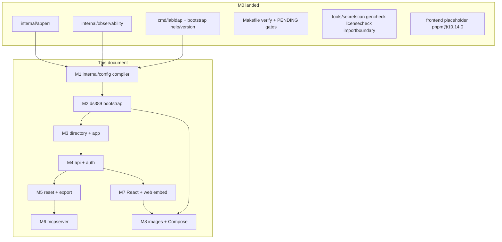
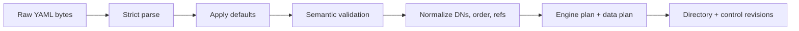
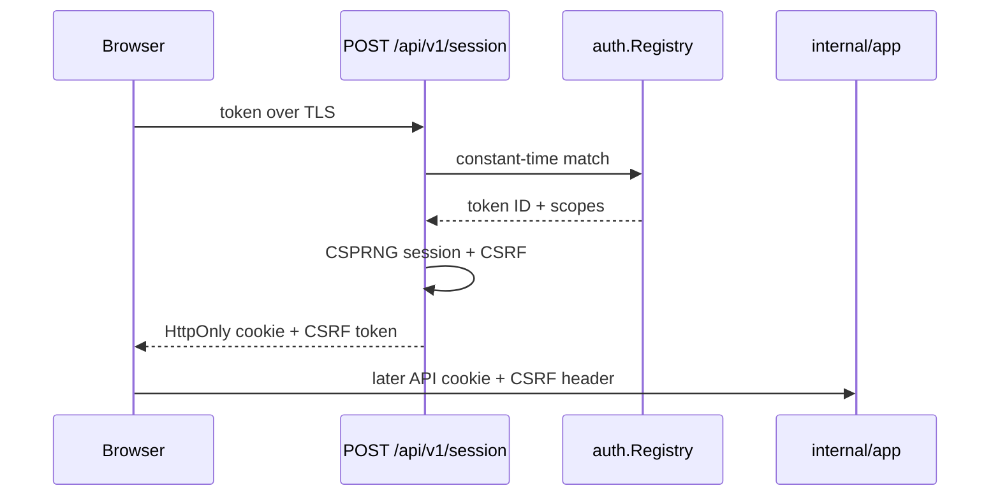
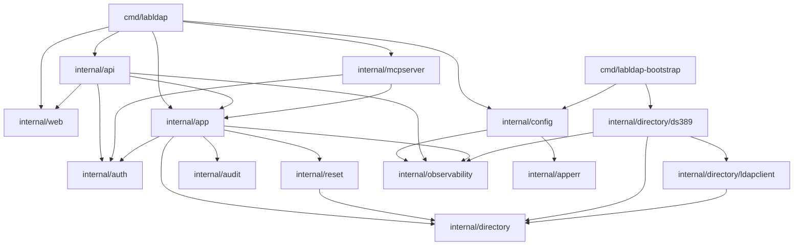
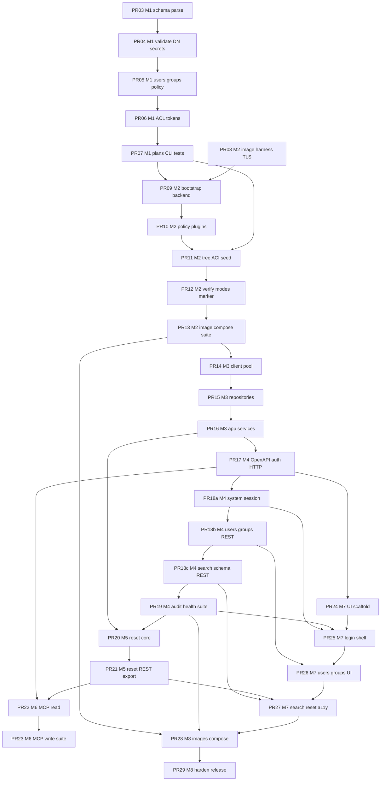

# LabLDAP Remaining-Work Implementation Design (M1–M8)

| Field | Value |
| --- | --- |
| Document title | LabLDAP Remaining-Work Implementation Design (T-009 through T-120) |
| Author | Design synthesis (remaining work after landed M0) |
| Date | 2026-08-12 |
| Status | Draft |
| Product | LabLDAP — disposable laboratory LDAP environment |
| Working names | LabLDAP / `labldap` / `labldap-bootstrap` (OD-001 default) |
| Implementation workspace | `/home/mbrewer/projects/go-lab-ldap-mcp` |
| Git remote | `https://github.com/hilather/go-lab-ldap-mcp.git` |
| Go module | `github.com/hilather/go-lab-ldap-mcp` |
| License | Privately owned; do **not** invent a LICENSE file (OD-003) |
| Local images | `labldap-control:dev`, `labldap-bootstrap:dev` (do not push; OD-004) |
| Predecessor | [`docs/design/labldap-implementation-design.md`](https://github.com/hilather/go-lab-ldap-mcp/blob/main/docs/design/labldap-implementation-design.md) |
| Specification baseline | MCP 2026-07-28; official MCP Go SDK v1.7.0+; Go 1.26 / toolchain go1.26.5; React 19.2; Node.js 22.12+; pnpm@10.14.0 |
| Target | **First usable release** = README definition + all P0 tasks + any P1 that a P0 `Depends on` range names. |

This document is the **implementation contract for remaining work** after M0. It does **not** re-derive the ten README non-negotiables, the three Compose roles, or the eighteen missing source-package documents. Those remain binding as recorded in the predecessor design and in `AGENTS.md`.

An execute-plan agent must be able to implement **M1 (T-009–T-023) immediately** from this document plus `TASKS.md` and the landed M0 packages, then continue M2–M8 in PR order, without waiting for recovered `docs/02`, `docs/03`, `docs/04`, or `docs/05`. T-023 includes the dated filter/cursor stand-in (§3.17); T-043 is remapped to TASKS acceptance plus the T-024 image contract, not the missing 03 file.

---

## Overview

M0 is complete on `main`. Commits `74a445f` (T-001) and `1d418db` (T-002–T-008) landed the module, both command skeletons, package stubs, `internal/apperr`, `internal/observability`, Makefile/CI, and security scans. `cmd/labldap` and `cmd/labldap-bootstrap` currently dispatch only `help` and `version`. `internal/config` is a one-file package comment. Integration, e2e, image, and Compose Make targets print explicit `PENDING:` gates.

The remaining work (T-009–T-120, milestones M1–M8) turns that scaffold into the first usable release: a deterministic YAML compiler, a privilege-separated 389 DS bootstrap, transport-neutral directory and application services, secured REST, soft reset and streaming export, official-SDK MCP, a React operator UI, and hardened Compose images.

The public configuration surface is a **dated `v1alpha1` stand-in** because `docs/02-configuration-and-domain-model.md` is absent. REST paths other than the architecture-named routes, and MCP tool names other than `ldap_search_entries`, are **proposed**. Do not add `rawEntries`. Do not start MCP or UI **features** before the M1 and M2 gates. Frontend **scaffold** (T-095) may start after the OpenAPI pipeline (PR17).

---

## Background & Motivation

### Why remaining work needs a second design

The predecessor design assumed an empty git repository and specified M0 in detail. That work is done. The next agent must not re-scaffold the module, re-invent `apperr.Code`, or redesign `observability.Secret`. It must extend the landed packages in place.

Pain this document removes:

- Guessing the `v1alpha1` Go types and file layout for T-009.
- Re-deciding secret handling when `observability.Secret` already exists.
- Blocking M1 on missing `docs/02` instead of locking a dated stand-in.
- Starting MCP or UI before compiler + 389 DS proof.
- Treating T-074 / T-093 / T-104 / T-116–T-118 as deferrable P1s.

### Current repository state (2026-08-12)

| Fact | Value |
| --- | --- |
| Branch | `main` |
| Landed commits | `74a445f` T-001; `1d418db` T-002–T-008 |
| TASKS status | T-001–T-008 `[x]`; T-009–T-120 `[ ]` |
| Module | `github.com/hilather/go-lab-ldap-mcp` (`go 1.26`, `toolchain go1.26.5`) |
| Commands | `labldap` / `labldap-bootstrap`: `help`, `version` only. `serve` / `apply` return exit 2 |
| `internal/config` | `doc.go` only — “must not connect to LDAP” |
| `internal/directory`, `ds389`, `ldapclient`, `app`, `api`, `mcpserver`, `auth`, `audit`, `reset`, `web` | package comments only |
| `internal/apperr` | `CodeConfiguration` / `Auth` / `Directory` / `Reset` / `Export` / `Bootstrap`; wrap-stable `*Error`; `Field`; `Assert`; `EqualGolden` |
| `internal/observability` | `Secret`, `RequestID`, `BuildInfo`, `StartupLogger`, JSON/text `slog` |
| Frontend | placeholder (`pnpm@10.14.0`); real React is T-095 |
| `api/openapi.yaml` | not present; `api/generated/` reserved |
| `config/schema`, `config/examples` | empty (`.gitkeep`) |
| Make pending gates | `test-integration` (T-025), `test-e2e` (T-107), `compose-*` (T-042 / T-110), `image` (T-041 / T-108) |
| Import-boundary test | `tools/importboundary/boundary_test.go` already forbids `internal/config` → directory / go-ldap / transports |
| Missing source-package docs | still 18 (`00`, `02`–`09`, `11`, `12`, ADR bodies) |

### Binding stack (unchanged)

1. README ten non-negotiables + `AGENTS.md` implementation rules.
2. `docs/01-system-architecture.md`.
3. `docs/13-open-decisions.md`.
4. `TASKS.md`, including remapped acceptance where `docs/02` / `04` / `05` checkboxes cannot be satisfied literally.
5. Predecessor design **proposed** contracts, refined by this document.

Title-only ADR stubs are **not** accepted ADRs. Proposed YAML keys, most REST paths, and most MCP names never outrank (1)–(4).

### What this document does not reopen

- The ten non-negotiables (KD-1–KD-10 in the predecessor).
- Owner defaults: LabLDAP name, no LICENSE, local `:dev` images, anonymous bind disabled.
- Three Compose roles; no Docker socket; no DM secret in control.
- Soft suffix reset only; empty `groupOfNames` rejected; no AD emulation.
- Static bearer tokens (lab mode); cookie sessions for UI.
- Official MCP Go SDK only; Streamable HTTP on `/mcp`.

---

## Goals & Non-Goals

### Goals (first usable release)

An operator can write one YAML scenario, run one Compose command, bind with a real LDAP client, mutate users and groups through UI / REST / MCP under one authz policy, reset the managed suffix to the compiled baseline, and export redacted LDIF. Architecturally:

- Configuration compiles deterministically with **no LDAP connection**.
- Bootstrap is the only process that sees Directory Manager credentials.
- REST, MCP, and UI call `internal/app` only.
- Runtime identity cannot write `cn=config` or escape the managed suffix.
- Every public contract is versioned, tested, and redacted.

### Non-goals (first release)

Unchanged from the predecessor: no LDAP wire protocol in Go; no in-memory directory SoT; no Docker socket; no DM in control; no raw LDAP modification API; no `rawEntries:` stand-in; no multiple suffixes; no AD emulation; no hard reset via REST/MCP; no OAuth as default; no public image push; no LICENSE invention; no large UI kit.

This document additionally refuses:

- Re-implementing M0 packages.
- Fabricating recovered `docs/02` / `04` / `05` as if they existed.
- Promoting the `v1alpha1` stand-in to an accepted ADR.

---

## Key Decisions

Predecessor KD-1–KD-18 remain binding. The decisions below lock remaining-work choices so M1 can start without further owner input.

### KD-R1 — Dated `v1alpha1` stand-in is the M1 public contract

**Decision:** Implement T-009–T-023 against `apiVersion: labldap.dev/v1alpha1` and `kind: LabScenario`. Commit `config/schema/v1alpha1-stand-in.md` stating invented 2026-08-12 because `docs/02` is absent; expected to churn if 02 is recovered; a rename requires a **new** ADR, not promotion of the stand-in note.

**Rationale:** TASKS requires types, schema, and a compiler now. Waiting for 02 blocks the critical path.

### KD-R2 — YAML keys are camelCase; no `rawEntries`

**Decision:** Public YAML uses camelCase (`passwordFile`, `secretFile`, `storageMode`) to match the predecessor stand-in skeleton. Do **not** add `rawEntries` or any operator LDIF passthrough. T-035 applies users, groups, memberships, and the marker only.

**Rationale:** One lock prevents schema-enum drift. The T-035 title word “raw entries” is unspecified in present files.

### KD-R3 — Secrets are `observability.Secret` plus a file resolver

**Decision:** `internal/config` resolves secret files into `observability.Secret`. Digests hash the revealed bytes after a single trailing-newline strip. Logs, `fmt`, JSON, and plan output never print revealed values. Errors name logical owner and path only.

**Rationale:** T-005 already proved `Secret` does not stringify. Do not invent a second redaction type.

### KD-R4 — ACI compiler is a small injection-safe emitter; runtime rights are compiler-owned

**Decision:** T-018 invents a five-field DSL (principal, target, permission, attributes, conditions) and a deterministic 389 DS ACI string emitter. No filter/DN/attribute concatenation of untrusted input. Raw ACI is a gated escape hatch that still cannot grant `cn=config`. The compiler **always** prepends a non-overridable `labldap:runtime-*` ACI set to `DataPlan.ACIs` so the restricted runtime account can perform the T-036 allow list (suffix read/search/compare; add/delete/write under people and groups containers; password modify on user entries) and is never granted `cn=config`. Operator ACLs cannot remove or weaken that set. Golden + injection tests are the stand-in contract.

**Rationale:** `docs/02` ACL grammar is missing. A tiny emitter is reviewable and replaceable. T-036 will fail on a fresh 389 DS if runtime rights are left to optional example ACLs.

### KD-R5 — Config never imports LDAP; DN logic lives in `internal/config`

**Decision:** Implement DN/RDN/attribute normalization inside `internal/config` without `go-ldap`. The existing import-boundary test already forbids `internal/config` → `internal/directory` and `github.com/go-ldap/ldap`. Runtime escaping stays in `internal/directory/ldapclient`.

**Rationale:** Compiler must be unit-testable offline. Sharing `go-ldap` types would couple M1 to M3.

### KD-R6 — Bootstrap phases emit `apperr.CodeBootstrap`

**Decision:** Every `labldap-bootstrap` phase returns `*apperr.Error` with `CodeBootstrap` (or `CodeConfiguration` for compile failures). Field `Path` is `phase.<name>`. Any failed phase → non-zero exit; verification failure prevents marker commit.

**Rationale:** T-006 already reserved `CodeBootstrap`. T-027/T-040 require stable codes and phase diagnostics.

### KD-R7 — `internal/directory` public types stay go-ldap-free; M2 may use a bootstrap-only DM client

**Decision:** Repository interfaces in `internal/directory` use project types only and must not import `go-ldap`. Passwords on those interfaces are `observability.Secret`. **M2 exception:** `internal/directory/ds389` may import `go-ldap` in PR09–PR12 for a **bootstrap-only** Directory Manager LDAP helper (`admin.go` or similar) used for wait/bind and data writes. T-046 (`internal/directory/ldapclient`, PR14) later owns **runtime** dial, TLS, pool, and escaping. Bootstrap may keep the small DM client or call shared unexported dial helpers without exposing T-045 types. `internal/api`, `internal/mcpserver`, and `internal/app` must not import the bootstrap helper or `go-ldap`. Extend `tools/importboundary` accordingly: `ds389` → `go-ldap` is allowed; public `internal/directory` and transports are not.

**Rationale:** T-028/T-033–T-035 need LDAP before T-045/T-046 exist. A second long-lived stack is worse than a named bootstrap-only helper that REST/MCP cannot see.

### KD-R8 — Transports call `internal/app` only

**Decision:** `internal/api` and `internal/mcpserver` decode/encode and map principals. They do not import each other, do not build LDAP filters, and do not call `ds389` or `ldapclient`. Authorization is re-checked inside `internal/app` (T-057).

**Rationale:** README non-negotiable 5; predecessor KD-5.

### KD-R9 — Binding vs proposed public names

**Decision:** Binding: `/api/v1`, `POST /api/v1/users`, `POST /api/v1/session`, `/mcp`, `/health`, `/metrics`, tool `ldap_search_entries`. Recovered scopes: `directory:write`, `directory:password`, `lab:reset`, `lab:export`, `schema:read`, `audit:read`. Proposed: `directory:read`, remaining REST paths, remaining MCP names. Mark proposed OpenAPI operations with `x-labldap-contract: proposed`.

**Rationale:** Architecture-named routes are recovered; `docs/04`/`05` are not.

### KD-R10 — Sequencing and the P1-on-P0 rule

**Decision:** No MCP tool registration or UI **features** before M1 + M2 gates. T-095 scaffold may start after PR17 (OpenAPI). T-074, T-093, T-104, T-116–T-118 are **not** deferrable without an ADR that rewrites the depending P0 `Depends on` lists.

**Rationale:** Implementation plan §13 and predecessor §19.

### KD-R11 — PR clustering starts at PR03

**Decision:** PR01 (T-001) and PR02 (T-002–T-008) are **done**. Remaining work is PR03–PR29 as clustered in this document. Do not reopen M0 as new PRs.

**Rationale:** Incremental reviewable merges; matches predecessor clustering.

### KD-R12 — Extend landed CLIs; no-args stays help; explicit `serve`

**Decision:** Keep stdlib dispatch in `cmd/labldap/run` and `cmd/labldap-bootstrap/run`. Add `validate` / `normalize` / `plan` (T-022) to `labldap`; add `apply` / `validate` / `plan` (T-027) to bootstrap. **No-args `labldap` remains help / exit 0** (M0 contract) even after T-063 — do not make bare `labldap` start the HTTP server. Require explicit `labldap serve`. T-042 lands a **placeholder** `labldap serve --placeholder` that stays up (liveness `/health`, readiness false, SIGTERM shutdown). T-063 replaces the placeholder body with the real `net/http` stack; `--placeholder` may remain as an alias for “no directory bind” in tests. HTTP remains `net/http` (OD-008). No third-party router or CLI framework.

**Rationale:** M0 scripts and tests treat no-args as help. The landed binary cannot be a Compose replica (`serve` today exits 2).

### KD-R13 — Dated search / filter / cursor stand-in

**Decision:** Search input is an LDAP **filter string** plus base, scope, attributes, page size, and optional cursor. Parse the filter to an AST in `internal/config` (no `go-ldap`). Enforce `maxFilterDepth` / `maxFilterLength`. Reject **over-broad** searches with the concrete rule in §3.17. Cursor is opaque HMAC over the canonical query + server page state + expiry; process-local key (restart invalidates) unless a later ADR adds a secret file. REST `POST /api/v1/search` and MCP `ldap_search_entries` share this field list. T-023 fuzzes `FuzzParseFilter` and `FuzzCursor` (codec only); HMAC wiring waits for T-053.

**Rationale:** T-023, T-050, T-069, T-088, and T-102 share one search command. `docs/02`/`04`/`05` do not define it.

### KD-R14 — `lifecycle.softReset` is the control user-seed switch (not the runtime bind secret)

**Decision:** v1alpha1 has `spec.lifecycle.softReset` (bool, **default true**).

- **Runtime-account `passwordFile`:** always required on bootstrap **and** control. Its digest is **always** in the directory revision. Control always binds as this account.
- **User seed `passwordFile`s:** bootstrap always resolves them in order to apply passwords. Control resolves them **iff** `softReset` is true. When `softReset` is false, control `Load` must not `Resolve` user seeds, must not retain those bytes, and the runtime soft-reset API fails closed (`lab:reset` / `disabled`).
- **Directory revision:** include **user** seed digests **iff** `softReset` is true. When `softReset` is false, **neither** bootstrap nor control mixes user seed digests into the hash — even if bootstrap resolved the files to apply them. T-021’s “seed password change changes directory revision” holds **only when `softReset` is true**. This keeps T-073 readiness matching across bootstrap (has files) and control (does not).
- `startupMode: reset` is **bootstrap-only** and must not be reused as this flag. Compose mounts **user** seed secrets on control if and only if `softReset` is true. Runtime-account secret is always mounted on both.

**Rationale:** Architecture says user seed files are on control “iff soft reset is enabled.” Hashing those digests unconditionally would make `softReset: false` deployments permanently not-ready.

---

## Proposed Design

### 1. Relationship to landed M0



Reuse, do not redesign:

| Landed symbol | Remaining-work use |
| --- | --- |
| `apperr.New(Code, public).WithField(...).Wrap(...)` | All compiler, bootstrap, directory, reset, export errors |
| `apperr.Assert` / `EqualGolden` | M1 goldens, CLI diagnostics |
| `observability.Secret` | Token values, passwords, session IDs, secret-file contents |
| `observability.NewRequestID` / `WithRequestID` | HTTP, MCP, LDAP, bootstrap phase logs |
| `observability.StartupLogger` / `WriteVersion` | Both binaries; keep stderr logs / stdout help+version |
| `tools/importboundary` | Remains the package-boundary gate; add cases only if new forbidden edges appear |
| Makefile `PENDING:` lines | Replace in the task that implements the real target, not earlier |

### 2. Target file layout after first usable release

Converge on the `AGENTS.md` tree. New files this remaining-work design introduces (not present today) are marked `*`.

```text
internal/config/                    # M1 — no LDAP
|-- doc.go                          # exists
|-- load.go *                       # Parse → Default → Validate → Normalize → Compile → Hash
|-- decode.go *                     # strict YAML (T-011)
|-- convert.go *                    # v1alpha1 → Input
|-- defaults.go *                   # T-012
|-- settings.go *                   # transport / lifecycle / limits / management
|-- dn.go *                         # T-013
|-- filter.go *                     # T-023 / T-050 filter AST (no go-ldap)
|-- cursor.go *                     # T-023 cursor codec; HMAC wiring T-053
|-- attr.go *                       # attribute names, operational deny list
|-- secret.go *                     # file resolver (T-014)
|-- user.go *                       # T-015
|-- group.go *                      # T-016
|-- policy.go *                     # T-017
|-- acl.go *                        # T-018 model + emitter
|-- token.go *                      # T-019
|-- plan.go *                       # T-020
|-- revision.go *                   # T-021
|-- v1alpha1/
|   |-- doc.go *
|   |-- file.go *                   # public YAML types
|   `-- enums.go *                  # constants for schema-enum drift
config/schema/v1alpha1.json *       # T-010
config/schema/v1alpha1-stand-in.md *
config/examples/*.yaml *

cmd/labldap/                        # extend existing run() switch
cmd/labldap-bootstrap/              # extend existing run() switch

internal/directory/                 # M3 interfaces, no go-ldap on public API
internal/directory/ldapclient/      # M3 runtime go-ldap adapter (PR14)
internal/directory/ds389/           # M2 bootstrap + M3 runtime mapping
|-- admin.go *                      # bootstrap-only DM LDAP helper (PR09; may import go-ldap)
internal/app/                       # M3–M5 use cases
internal/auth/                      # M4 tokens, sessions, scopes
internal/api/                       # M4 HTTP only
internal/mcpserver/                 # M6 MCP only
internal/audit/                     # M4 ring + sink
internal/reset/                     # M5 gate
internal/web/                       # M7 embed.FS only
```

Do **not** add a `LICENSE` file. Do **not** invent `docs/02`–`09` as if recovered.

---

### 3. M1 — Configuration compiler (`internal/config`)

This is the first product surface. **No LDAP dial, no `go-ldap` import, no Docker.** Both binaries will call the same `config.Load` / `config.Compile` API.

#### 3.1 Pipeline



Public entry points (lock names in T-009; signatures may grow options but not change meaning):

```go
package config

// Load is the offline compiler. It must not dial LDAP.
func Load(ctx context.Context, src []byte, origin string, opt LoadOptions) (*Compiled, error)

type LoadCaller int

const (
    CallerUnspecified LoadCaller = iota // treat as CLI
    CallerBootstrap
    CallerControl
    CallerCLI
)

type LoadOptions struct {
    Secrets SecretResolver // nil → default file resolver
    Caller  LoadCaller     // drives which secret files must Resolve
}

// After defaults: requireUserSeeds = spec.lifecycle.softReset || opt.Caller == CallerBootstrap
// Runtime-account password always Resolves. User seeds Resolve only when requireUserSeeds.
// User-seed *digests* enter the directory revision only when spec.lifecycle.softReset
// is true (KD-R14) — bootstrap apply still Resolves them when false, but does not hash them.

type Compiled struct {
    Source     SourceInfo
    Public     *v1alpha1.File // immutable copy of decoded public types
    Normalized *Normalized    // immutable
    Engine     EnginePlan
    Data       DataPlan
    Revisions  Revisions
}

type Revisions struct {
    Directory string // hex sha256
    Control   string
    Contract  string // compiler-contract version, also mixed into hashes
}
```

`cmd/labldap validate|normalize|plan` and `cmd/labldap-bootstrap apply|validate|plan` all start here. Bootstrap then applies plans; control later recompiles at process start for readiness.

#### 3.2 Version registry (T-009)

```go
package v1alpha1

const (
    APIVersion = "labldap.dev/v1alpha1" // proposed stand-in
    Kind       = "LabScenario"          // proposed stand-in
)

type File struct {
    APIVersion string   `json:"apiVersion" yaml:"apiVersion"`
    Kind       string   `json:"kind" yaml:"kind"`
    Metadata   Metadata `json:"metadata" yaml:"metadata"`
    Spec       Spec     `json:"spec" yaml:"spec"`
}
```

Dispatch in `internal/config/decode.go`:

- Empty / missing `apiVersion` or `kind` → `apperr.CodeConfiguration`, field path `apiVersion` / `kind`, field code `required`.
- Unknown version or kind → field code `unsupported_version` / `unsupported_kind`.
- Only `v1alpha1` + `LabScenario` convert in the first release. A later version gets a new package `internal/config/v1beta1` and an explicit converter; do not mutate `v1alpha1` types in a breaking way.

Public YAML types stay in `v1alpha1`. Immutable normalized types live in `internal/config` (not in `v1alpha1`) so the public package can change independently.

#### 3.3 Public types vs normalized types

| Layer | Mutability | Secrets | Used by |
| --- | --- | --- | --- |
| `v1alpha1.File` | decoded then treated read-only | `SecretRef` paths only | schema, examples, convert |
| `config.Input` | defaulted working copy | still paths | validate |
| `config.Normalized` | deep-immutable after freeze | `ResolvedSecret` (`observability.Secret` + digest) | plan, hash, CLI normalize |
| `EnginePlan` / `DataPlan` | immutable | redacted renderings only | bootstrap, reset reapply |

Freeze pattern: after normalize, copy slices/maps and store `frozen bool`; mutators panic in tests if someone writes after freeze. Export only value copies from getters.

#### 3.4 Locked stand-in field inventory

Commit this shape as `config/schema/v1alpha1.json` plus a worked example. Keys are **proposed** (camelCase). Binding recovered *concepts* are marked.

```yaml
# PROPOSED v1alpha1 stand-in (2026-08-12) — not recovered from docs/02
# Do not add rawEntries
apiVersion: labldap.dev/v1alpha1
kind: LabScenario
metadata:
  name: example-lab          # required; reset confirmation string (T-081)
spec:
  directory:
    suffix: "dc=example,dc=test"   # required; single managed suffix (binding concept)
    peopleRDN: "ou=people"         # default
    groupsRDN: "ou=groups"         # default
    nestedGroups: false            # T-016 flag
    allowRawACI: false             # T-018 raw-ACI gate
  lifecycle:
    storageMode: ephemeral         # ephemeral | persistent
    startupMode: merge             # validate | merge | reset (bootstrap-only)
    softReset: true                # control seed-file requirement + runtime reset API (KD-R14)
  transport:
    insecureLabMode: false         # required true to allow non-TLS
    ldap: { enabled: true, port: 3389 }
    ldaps: { enabled: true, port: 3636 }
    startTLS: true
    allowCleartextBind: false
    allowAnonymousBind: false      # OD-022 default off
  management:
    listen: "127.0.0.1:8443"
    tls:
      mode: generated              # generated | files | disabled
      certFile: ""
      keyFile: ""
    cors:
      allowedOrigins: []           # empty → same-origin only
    session:
      idleTimeout: 30m
      absoluteTimeout: 8h
      maxSessions: 64
    mcp:
      enabled: true
      registerMutations: false     # OD-016
      registerPassword: false
      registerReset: false
      registerExport: false
    metrics:
      enabled: true
      requireAuth: false           # document network policy at T-074
  limits:
    requestTimeout: 30s
    shutdownTimeout: 15s
    maxRequestBodyBytes: 1048576
    pageSizeDefault: 50
    pageSizeMax: 500
    searchTimeLimit: 10s
    searchSizeLimit: 1000
    maxFilterDepth: 16
    maxFilterLength: 4096
    exportMaxEntries: 20000
    exportMaxBytes: 67108864
    ldapPoolSize: 16
    ldapMaxIdle: 60s
    ldapMaxLifetime: 15m
    ldapDialTimeout: 5s
    concurrentMutations: 8
    rateLimit:
      requestsPerMinute: 600
      passwordPerMinute: 10
      bindTestPerMinute: 10
      resetPerHour: 6
  runtimeAccount:
    id: labldap-runtime
    passwordFile: /run/secrets/runtime-ldap
  users:
    - id: alice
      uid: alice
      passwordFile: /run/secrets/user-alice
      enabled: true
      attributes: {}
  groups:
    - id: staff
      members:
        - user: alice
  passwordPolicy:
    minLength: 12
    historyCount: 0
    maxAge: 0s
    warningAge: 0s
    lockout:
      enabled: false
      maxFailures: 0
      lockoutDuration: 0s
    storageScheme: PBKDF2-SHA256
  acls:
    # Operator ACLs only. Compiler always prepends labldap:runtime-* (KD-R4);
    # omitting them here is correct — T-023 fails if DataPlan.ACIs lacks that set.
    - id: staff-read
      principal: { kind: group, ref: staff }
      target: { kind: suffix }
      permissions: [read, search, compare]
      attributes: { allow: ["*"], deny: [userPassword] }
  tokens:
    - id: admin
      secretFile: /run/secrets/token-admin
      scopes:
        - directory:read          # proposed
        - directory:write         # recovered
        - directory:password      # recovered
        - lab:reset               # recovered
        - lab:export              # recovered
        - schema:read             # recovered
        - audit:read              # recovered
```

Secret fields are **path references**, never inline values. Types:

```go
// SecretRef is a filesystem path. The file content becomes observability.Secret.
type SecretRef struct {
    File string `json:"file" yaml:"file"`
}

// In YAML we accept the short form passwordFile: /path via an auxiliary
// string field on UserSpec / TokenSpec / RuntimeAccountSpec, converted
// into SecretRef during convert.go. Do not accept inline password: "..." .
```

User rules (T-015):

- Identity: at least `id`. Optional `uid`, `rdn`, `dn`. **Omitted `uid` defaults to `id`.** Generated DN = `uid=<escaped uid>,<peopleRDN>,<suffix>` unless explicit `dn`.
- Inconsistency among id / uid / rdn / dn → field error naming each path.
- Forbidden in `attributes`: `userPassword`, `memberOf`, operational attributes (`modifiersName`, `modifyTimestamp`, `entryUUID`, `nsUniqueId`, `createTimestamp`, `creatorsName`, `aci`, `pwdAccountLockedTime`, … — maintain an explicit deny list in `attr.go`).
- Required object classes in normalized user: `top`, `person`, `organizationalPerson`, `inetOrgPerson` (stand-in; adapter may add `nsAccountLock` mechanics later).
- Normalized users sorted by `id`; attributes sorted by canonical name.

Group rules (T-016, OD-018):

- Object class `groupOfNames`. Empty `members` **fails** (`field code empty_group`). No dummy member.
- Members: `{user: <id>}` or `{group: <id>}`. Missing ref → source path. Duplicate refs removed after resolve.
- Nesting cycle → field error. If `nestedGroups: false`, group-typed members fail.
- Generated DN = `cn=<escaped id>,<groupsRDN>,<suffix>`.

Password policy (T-017):

- `warningAge` ≤ `maxAge` when both > 0.
- If `lockout.enabled`, `maxFailures` and `lockoutDuration` required and positive.
- `storageScheme` allowlist: `PBKDF2-SHA256`, `SSHA512`, `PBKDF2_SHA256`. **Canonical token is `PBKDF2-SHA256`** (T-031 maps that spelling to 389 DS). `PBKDF2_SHA256` is accepted as an alias and rewritten to `PBKDF2-SHA256` during normalize. Unknown scheme → fail closed, never ignore.

#### 3.5 JSON Schema (T-010)

- Hand-write `config/schema/v1alpha1.json` as **JSON Schema 2020-12**. Pin that dialect in `config/schema/v1alpha1-stand-in.md`. Do not generate the first schema by reflection — unknown-field rejection must be explicit `additionalProperties: false` at every object.
- **TASKS remap (T-010 “validation command”):** T-010 delivers a **library** validate helper (`config.Validate` / schema fixture tests only). It does **not** add `cmd/labldap validate`. That subcommand is T-022 / PR07 only. Do not grow a CLI switch in PR03.
- Drift test: every Go enum in `v1alpha1/enums.go` (apiVersion, kind, storageMode, startupMode, tls.mode, scopes, ACL principal/target kinds, permissions, storageScheme including the canonical `PBKDF2-SHA256`, search scope) must appear in the schema `enum` arrays. Fail `make test-unit` on mismatch.
- Valid examples under `config/examples/` pass; invalid fixtures under `test/fixtures/config/invalid/` fail at expected JSON Pointer / YAML paths.

#### 3.6 Strict YAML parse (T-011)

Add `gopkg.in/yaml.v3` when this task lands (first Go dependency). Decode with `KnownFields(true)` **and** a `yaml.Node` pre-pass:

| Failure | Field code |
| --- | --- |
| Duplicate key | `duplicate_key` |
| Unknown field | `unknown_field` |
| Trailing document (`---`) | `trailing_document` |
| Empty file | `empty` |
| Multiple independent errors | accumulate; do not stop at first when cheap |

Diagnostics: path like `spec.users[0].passwordFile`. **Never** include file bytes or secret values. Tests feed a canary secret and scan `err.Error()` / `PublicMessage()` / fields.

#### 3.7 Transport, lifecycle, limits, management (T-012)

Defaults applied before semantic validation. Fail closed:

- `insecureLabMode: false` **and** (`ldaps.enabled` or `startTLS`) required. If both LDAP cleartext bind would be possible, `allowCleartextBind` must be false unless insecure mode is on.
- `tls.mode: disabled` on management requires `insecureLabMode: true`.
- `storageMode: ephemeral` + `startupMode: validate` is coherent (warn: nothing persists). `persistent` + `reset` is coherent but documented as destructive on every **bootstrap** start — emit a warning string on the compiled result, not an error. `startupMode` does **not** enable or disable runtime soft reset.
- `lifecycle.softReset` defaults **true**. `runtimeAccount.passwordFile` **always** resolves (bootstrap and control). User `passwordFile`s resolve at control start iff `softReset` is true (T-014 / T-078). When `softReset` is false, user seed files may be omitted on control; `POST /api/v1/reset` and MCP reset fail closed with a stable “soft reset disabled” error (`apperr.CodeReset`, field code `disabled`). Bootstrap still resolves user seeds in order to apply them.
- All durations, ports (1–65535), addresses, page/body/concurrency/rate values bounded. Zero page size or negative limits fail.
- Listen address parseable (`net.SplitHostPort`). Default published story is loopback (enforced later in Compose, not by rejecting `0.0.0.0` in the compiler — compiler may warn).

#### 3.8 DN, RDN, attributes (T-013)

Implement in `internal/config/dn.go` **without** `go-ldap`:

```go
type DN struct { /* parsed RDN sequence; unexported parts */ }

func ParseDN(s string) (DN, error)
func EscapeAttributeValue(s string) string // RFC 4514
func BuildRDN(attr, value string) (string, error)
func (d DN) String() string                 // canonical: lowercase attr names, escaped values, comma-join
func (d DN) Equal(o DN) bool
func (d DN) IsDescendantOf(ancestor DN) bool // structural, not strings.HasSuffix
```

Tests required by T-013: Unicode, escaped comma, plus, equals, leading space, NUL (reject NUL). Generated DNs must escape arbitrary valid IDs (`cn=foo,bar` → `cn=foo\,bar,...`). Descendant check compares RDN sequence from the root, not string suffix (`dc=test` is not an ancestor of `dc=contest`).

Operational-attribute deny list is used by user/group attribute validation and later by search allow/deny.

#### 3.9 File secret resolver (T-014)

```go
package config

type SecretResolver interface {
    Resolve(ctx context.Context, owner, path string) (ResolvedSecret, error)
}

type ResolvedSecret struct {
    Owner  string                 // e.g. spec.users[0].passwordFile
    Path   string
    Value  observability.Secret
    Digest string                 // hex sha256 of normalized bytes
}

// Trailing-newline rule: strip a single trailing '\n' or "\r\n".
// Do not strip internal whitespace. Empty after strip → error.
```

Default resolver: `os.ReadFile`, mode/permission not required to be 0600 in v1 but document 0600 as operator practice. Errors:

```go
apperr.New(apperr.CodeConfiguration, "secret file unreadable").
    WithField(apperr.Field{Path: owner, Code: "secret_unreadable", Message: "path " + path + " could not be read"})
```

No content in message. Duplicate token values: compare digests (or constant-time compare of revealed bytes in `token.go`) and fail with paths of both tokens, not the value. Logging a `ResolvedSecret` must go through `Value` (`observability.Secret`) so `String`/`GoString`/`LogValue`/`MarshalJSON` stay `[redacted]`.

Do **not** implement `fmt.Stringer` on `ResolvedSecret` that prints `Value.Reveal()`.

Token digests always enter the **control** revision. Runtime-account password digest always enters the **directory** revision. User seed digests enter the directory revision **only when `softReset` is true** (§3.13). Revealed user-seed bytes stay in process memory for bootstrap apply and, when `softReset` is true, for control reapply. When `softReset` is false, control must not `Resolve` user seed files and must not retain those bytes; bootstrap may still hold them for apply without hashing them.

#### 3.10 ACL DSL and ACI emitter (T-018)

Stand-in DSL (not a recovered grammar):

```go
type ACLSpec struct {
    ID          string     `yaml:"id"`
    Principal   Principal  `yaml:"principal"`
    Target      Target     `yaml:"target"`
    Permissions []string   `yaml:"permissions"`
    Attributes  AttrSel    `yaml:"attributes"`
    Conditions  []Condition `yaml:"conditions"`
    RawACI      string     `yaml:"rawACI"` // only if spec.directory.allowRawACI
}

// Principal.Kind: user | group | anyone | self | runtime
// Target.Kind:    suffix | users | groups | user | group | dn
// Permissions:    read | search | compare | add | delete | write | proxy
```

Emitter rules:

1. If `RawACI` set: require `allowRawACI`. **Parse** `target` / embedded DNs with the T-013 wrapper; reject any target that **is** `cn=config` (or an ancestor of the managed suffix that would include `cn=config`) or that is **not** a descendant of the managed suffix. If parse fails, fail closed. Keep a case-insensitive compact-whitespace `cn=config` substring check as an **extra** heuristic only — it is not the only gate. Still assign name `labldap:<id>`.
2. Else emit a single 389 DS ACI. **No** `fmt.Sprintf` of untrusted values into the ACI body. Use an `aciBuilder` that:
   - Validates `id` against `^[A-Za-z][A-Za-z0-9_-]{0,63}$`.
   - Validates attribute names against `^[A-Za-z][A-Za-z0-9-;]*$` (or `*`).
   - Inserts DNs only via `DN.String()` produced by T-013.
   - Inserts permissions from an allowlist map.
   - Quotes ACL name as `labldap:<id>`.
3. Runtime principal cannot be granted target `dn: cn=config` or any ancestor of `cn=config` through the DSL.
4. **Managed runtime set (always emitted, not overridable):** after operator ACLs, `Compile` prepends these named ACIs (exact strings locked by T-023 goldens):
   - `labldap:runtime-suffix-read` — principal `runtime`; target managed suffix; `read`, `search`, `compare`; attributes allow `*`, deny `userPassword`.
   - `labldap:runtime-people-write` — principal `runtime`; target people container (subtree); `add`, `delete`, `write`, `read`, `search`, `compare`.
   - `labldap:runtime-groups-write` — principal `runtime`; target groups container (subtree); same permissions as people-write.
   - `labldap:runtime-password` — principal `runtime`; target people container; permission needed for password modify (`write` on `userPassword` only, or the 389 DS password-change form recorded at T-034).
   - Never a `cn=config` target. Operator ACLs with the same IDs, or that attempt to deny the runtime principal these rights, fail at compile (`cn_config_grant` / `runtime_aci_override`).
5. Output is byte-identical across runs. Golden files under `test/fixtures/config/aci/` include the runtime set even when `spec.acls` is empty.
6. Injection tests: principal/group IDs containing `"`, `)`, `(`, `ldap:///`, newlines must not close the ACI clause.

Illustrative emitted form (exact spacing locked by goldens):

```text
(target="ldap:///dc=example,dc=test")(targetattr!="userPassword")(version 3.0; acl "labldap:staff-read"; allow (read,search,compare) groupdn="ldap:///cn=staff,ou=groups,dc=example,dc=test";)
```

#### 3.11 Tokens and scopes (T-019)

```go
var KnownScopes = []string{
    "directory:read",     // proposed — lock the string here
    "directory:write",
    "directory:password",
    "lab:reset",
    "lab:export",
    "schema:read",
    "audit:read",
}
```

`directory:write` does **not** imply password, reset, or export. Unknown scope → fail. Duplicate token `id` or duplicate resolved values → fail. Empty file → fail. Printable/normalized token metadata: `{id, scopes, secretDigest}` only.

#### 3.12 Plans (T-020)

```go
type EnginePlan struct {
    Suffix          string
    BackendName     string // deterministic: "userroot" stand-in unless T-024 observes otherwise
    TLS             EngineTLSPlan
    Auth            EngineAuthPlan
    PasswordPolicy  NormalizedPolicy
    Plugins         PluginPlan // memberOf, referential integrity, account disable
    Indexes         []IndexPlan
}

type DataPlan struct {
    Creates []DataOp // parents before children
    Updates []DataOp
    Deletes []DataOp // children before parents
    Preserve []string // DNs: runtime account, required containers, marker
    ServiceAccount ServiceAccountPlan
    Marker         MarkerPlan
    Users          []NormalizedUser
    Groups         []NormalizedGroup
    ACIs           []NamedACI // managed labldap:runtime-* first, then operator ACLs
}
```

Redacted plan JSON is deterministic (sorted maps, stable slice order). Repeated `Compile` → `bytes.Equal` on redacted JSON.

Runtime service account is **explicit** in the plan and **not** auto-added to application groups. `DataPlan.ACIs` always starts with the KD-R4 managed runtime set.

#### 3.13 Revisions (T-021)

```go
const CompilerContract = "labldap.config.v1alpha1.3"
```

Hash = SHA-256 of canonical JSON (sorted object keys, no insignificant whitespace) of:

| Revision | Inputs |
| --- | --- |
| Directory | `CompilerContract` + suffix + containers + nested flag + `softReset` + users (no secret bytes) + groups + ACLs + policy + **runtime-account password digest** + ACI emitter output + **user seed password digests iff `softReset` is true** |
| Control | Directory hash inputs + token IDs/scopes/**token digests** + management listen/tls/session/mcp/metrics + limits that affect control |

When `softReset` is false, omit the user-seed digest map entirely (do not hash empty strings or paths). Bootstrap `Load` that resolved user files for apply must still omit those digests so its Directory revision equals control’s.

Assertions:

- YAML map order does not change either hash.
- Changing alice’s password file changes Directory (and therefore Control) **only when `softReset` is true**. When `softReset` is false, a bootstrap `Load` with user secrets and a control `Load` without them produce the **same** Directory revision (T-021 / T-073 fixture).
- Changing the runtime-account password file always changes Directory.
- Changing a token file or scope changes Control only.
- Flipping `softReset` true→false (or the reverse) changes Directory because the flag and the digest set are hash inputs.

Marker stored later (T-039) contains directory revision, apply version, timestamp — **not** secret digests.

#### 3.14 CLI (T-022)

Extend `cmd/labldap/run` (do not replace the M0 dispatcher):

| Subcommand | Role | Exit |
| --- | --- | --- |
| `validate --config PATH` | Load; print OK or field errors | 0 / 1 |
| `normalize --config PATH` | Redacted normalized JSON | 0 / 1 |
| `plan --config PATH` | Redacted engine+data plan JSON | 0 / 1 |
| `help` / `version` | unchanged | 0 |

Flags: `--redact` **default on**. There is no `--show-secrets`. `--format json|human` (json default for `normalize`/`plan`). Invalid config prints **all** safe field diagnostics to stderr; stdout stays empty on failure so CI can distinguish. Logs stay on stderr via `StartupLogger`.

`labldap serve` remains unknown (exit 2) until T-042 lands `serve --placeholder`. No-args remains help. T-063 replaces the placeholder implementation; it does **not** change no-args behavior.

#### 3.15 Compiler test suite (T-023)

| Kind | Location |
| --- | --- |
| Valid / invalid YAML fixtures | `test/fixtures/config/` |
| Golden normalized JSON + ACI (including empty-`acls` runtime set) | `internal/config/testdata/` via `apperr.EqualGolden` |
| Property: shuffle YAML map order → same revisions; `softReset:false` bootstrap-vs-control Directory equality | `internal/config/revision_prop_test.go` |
| Fuzz: YAML decode, DN parse, ACI emit, filter AST, cursor codec | `FuzzDecode`, `FuzzParseDN`, `FuzzEmitACI`, `FuzzParseFilter`, `FuzzCursor` |
| Secret scan of test output | reuse `tools/secretscan` patterns in a helper; canary values must be absent |

`FuzzParseFilter` / `FuzzCursor` cover the parser and the cursor **codec** (canonical payload encode/decode + tamper detection with a test key). HMAC key wiring and process-local key lifetime wait for T-053. T-023 does not require a live 389 DS.

`make test-unit` already runs `go test ./...`; keep compiler tests there.

#### 3.16 M1 error codes (all `apperr.CodeConfiguration`)

Use `Field.Code` for the stable machine token:

`required`, `unsupported_version`, `unsupported_kind`, `unknown_field`, `duplicate_key`, `trailing_document`, `empty`, `invalid_dn`, `not_descendant`, `forbidden_attribute`, `empty_group`, `missing_member`, `cycle`, `policy_cross_field`, `unsupported_scheme`, `aci_injection`, `raw_aci_denied`, `cn_config_grant`, `runtime_aci_override`, `unknown_scope`, `duplicate_token`, `empty_secret`, `secret_unreadable`, `insecure_transport`, `limit_out_of_range`, `filter_invalid`, `filter_too_deep`, `filter_too_long`, `search_overbroad`, `cursor_invalid`.

#### 3.17 Search, filter, and cursor stand-in (T-023 / T-050 / T-069 / T-088 / T-102)

Dated 2026-08-12; not recovered from `docs/02`/`04`/`05`. Lock in `v1alpha1-stand-in.md`. Rename requires a new ADR.

**Request fields** (same for REST `POST /api/v1/search` and MCP `ldap_search_entries`):

```go
type SearchQuery struct {
    Base       string   // DN; empty defaults to managed suffix
    Scope      string   // base | one | sub  (default sub)
    Filter     string   // LDAP filter string; empty means (objectClass=*)
    Attributes []string // empty → adapter default allowlist; never userPassword
    PageSize   int      // default / max from spec.limits
    Cursor     string   // optional opaque token from a previous page
}
```

**Filter grammar (RFC 4515 subset):** `and` / `or` / `not`; equality, present, substring, `greaterOrEqual`, `lessOrEqual`. No extensible-match in this stand-in. Parse to an AST in `internal/config/filter.go` **without** `go-ldap`. Reject:

| Condition | Field code |
| --- | --- |
| Unparseable / unbalanced / NUL | `filter_invalid` |
| AST depth > `maxFilterDepth` | `filter_too_deep` |
| Raw length > `maxFilterLength` | `filter_too_long` |
| **Over-broad** | `search_overbroad` |

**Over-broad (concrete):** all of the following hold after defaults: (1) base is the managed suffix; (2) scope is `sub`; (3) the filter is a match-all — empty, `(objectClass=*)`, `(&(objectClass=*))`, or a single present-`objectClass` item. Suffix + `one` or a discriminating equality/substring is allowed. This is the T-050 “over-broad” rule; do not invent a different one in PR15/PR18c/PR22.

**Cursor:** opaque `base64url(payload || hmac-sha256)`. Payload is canonical JSON of `{base, scope, filterCanonical, attributesSorted, pageSize, serverPageState, exp}`. Process-local HMAC key generated at control start; restart invalidates all cursors. Do not add a cursor-key secret file in v1. Cursor is not reusable with a different query; tamper or expiry → `cursor_invalid`. T-053 attaches the live HMAC key; T-023 fuzzes encode/decode with a test key only.

Public messages are short and secret-free. Tests use `apperr.Assert`.

---

### 4. M2 — 389 DS bootstrap

#### 4.1 Command surface (T-027)

Extend `cmd/labldap-bootstrap/run`:

```text
labldap-bootstrap apply    --config PATH --directory-manager-password-file PATH
labldap-bootstrap validate --config PATH --directory-manager-password-file PATH
labldap-bootstrap plan     --config PATH [--directory-manager-password-file PATH]
```

DM password **only** via file → `observability.Secret`. Argv containing a password is a hard error if we ever see `--directory-manager-password` without `-file`.

Phase reporter: every phase logs `{phase, duration_ms, counts}` and contributes to a JSON summary on stdout at the end (redacted). Any failed phase → exit 1 with `apperr.CodeBootstrap` (or `CodeConfiguration` if Load failed).

#### 4.2 Phase list and `CodeBootstrap` field paths

**Startup mode is the control plane for data (and, for `validate`, engine) writes.** There is no write-capable `reconcile` phase after verify. `labldap-bootstrap validate` never writes. `apply` with `startupMode: validate` is the same no-write path (inspect + drift, exit 1 on drift, no marker).

```mermaid
sequenceDiagram
    participant D as 389 DS
    participant B as labldap-bootstrap
    participant O as Operator

    O->>D: Start directory container
    D-->>O: Process health
    O->>B: apply or validate --config --directory-manager-password-file
    B->>B: phase.load config.Load
    B->>D: phase.wait Root DSE + TLS + DM bind
    alt startupMode validate or validate subcommand
        B->>D: phase.inspect read backend tls policy plugins tree aci seed
        B->>B: phase.drift read-only compare vs plan
        B-->>O: exit 0 if match else 1 — no marker
    else apply + merge or reset
        B->>D: phase.backend dsconf backend
        B->>D: phase.tls auth settings
        B->>D: phase.pwpolicy dsconf pwpolicy
        B->>D: phase.plugins MemberOf RI disable
        B->>D: phase.tree suffix + runtime account
        B->>D: phase.aci apply generated ACIs including runtime set
        B->>D: phase.seed users groups memberships
        Note over B,D: merge upserts and preserves extras; reset deletes extras then applies
        B->>D: phase.verify_runtime allow or deny
        B->>D: phase.verify_app bind lockout memberOf
        B->>B: phase.drift read-only leftover report never mutates
        B->>D: phase.marker write last
        B-->>O: exit 0 JSON summary
    end
```

| Phase | Field path | Writes? | Typical `Field.Code` |
| --- | --- | --- | --- |
| load | `phase.load` | no | (usually `CodeConfiguration`) |
| wait | `phase.wait` | no | `timeout`, `tls`, `bind` |
| inspect | `phase.inspect` | **no** | `read_failed` (validate path only) |
| backend | `phase.backend` | merge/reset apply only | `conflict`, `create_failed` |
| tls | `phase.tls` | merge/reset apply only | `cleartext_enabled`, `sasl_missing` |
| pwpolicy | `phase.pwpolicy` | merge/reset apply only | `unsupported_field`, `readback_mismatch` |
| plugins | `phase.plugins` | merge/reset apply only | `plugin_missing`, `fixup_failed` |
| tree | `phase.tree` | merge/reset apply only | `account_bind`, `parent_failed` |
| aci | `phase.aci` | merge/reset apply only | `server_reject` (ACL id; DNs ok) |
| seed | `phase.seed` | merge/reset apply only | `password_set`, `partial` |
| verify_runtime | `phase.verify_runtime` | no (probes only) | `allow_failed`, `deny_failed` |
| verify_app | `phase.verify_app` | no (probes only; lockout test uses isolated state) | `lockout`, `memberof` |
| drift | `phase.drift` | **never** | `drift` |
| marker | `phase.marker` | apply merge/reset after successful verify only | `write_failed` |

Helper:

```go
func bootstrapErr(phase, code, public string) *apperr.Error {
    return apperr.New(apperr.CodeBootstrap, public).WithField(apperr.Field{
        Path:    "phase." + phase,
        Code:    code,
        Message: public,
    })
}
```

Verification failure **must not** write a new marker and **must not** exit 0 (T-036, T-039, T-040).

#### 4.3 Engine ops vs data ops

| Class | Tool | Identity |
| --- | --- | --- |
| Engine (backend, plugins, pwpolicy, indexes) | `dsconf` via `exec.CommandContext` + argv + password **file** | DM |
| Directory data (suffix root, OUs, service account, ACIs, users, groups, marker) | LDAP via **bootstrap-only** `ds389` DM helper (`admin.go`; may import `go-ldap` in M2). Not `ldapclient` (that is PR14). | DM |

Never `sh -c`. Never put DM password on argv. Parse `dsconf --json` where available; classify errors.

T-029: create backend with configured suffix; accept matching existing backend; **fail** on name/suffix conflict without repurposing.

#### 4.4 Image pin and harness (T-024–T-026)

- Select official `quay.io/389ds/dirsrv` release; pin **immutable digest**. Do not invent the digest in this document (OD-006).
- Commit `deploy/docker/dirsrv-image-contract.md` with digest, version, arch, entrypoint, ports, `/data`, CLI tools, UIDs, secret-input findings (`_FILE` vs thin entrypoint — OD-007).
- No floating tag in any release-oriented Compose file.
- Harness (`test/integration`): isolated network/state, random ports, log capture, cleanup; attach redacted directory logs on failure.
- Test CA helper: correct LDAPS works; wrong CA and wrong name fail closed; private keys never logged (`observability.Secret`).

`make test-integration` stops printing `PENDING:` in T-025.

#### 4.5 Startup modes (T-038)

| Mode | When | Behavior |
| --- | --- | --- |
| `validate` | `labldap-bootstrap validate`, or `apply` with `startupMode: validate` | **No writes** (no `dsconf` mutate, no LDAP add/mod/del, no marker). Inspect live engine + suffix vs compiled plan. Report drift on `phase.drift`. Exit 1 if applied revision or inventory differs. |
| `merge` | `apply` only | Engine then data **upserts**. Preserve unconfigured runtime entries and unknown unmanaged attributes. Then verify, read-only drift leftover report, marker last. |
| `reset` | `apply` only | Engine then data **replace**: delete extras in the managed containers (preserve runtime account + required OUs), apply tree/ACI/seed. Then verify, drift, marker last. Bootstrap-time only. |

`labldap-bootstrap validate` ignores a YAML `startupMode: merge|reset` for write purposes: the **subcommand** is always no-write. `startupMode` is not `lifecycle.softReset`.

Runtime soft reset (M5) uses the **restricted** identity, not DM, and is gated by `lifecycle.softReset`.

#### 4.6 Seed apply (T-035)

Users, groups, memberships, marker only. **No** raw-entry/LDIF passthrough. Password-set failure → compensation or explicit partial failure (`phase.seed` / `password_set`); never exit 0.

#### 4.7 Marker (T-039, OD-012)

Protected entry under the managed suffix, e.g. `cn=labldap-baseline,<suffix>` (exact RDN locked in T-039 after image inspection). Attributes: expected revision, applied revision, apply version, timestamp. **No secret digests.** If standard attributes cannot represent this safely, prototype with namespaced names and record an OD-012 verification note; private OID before stable release if needed.

#### 4.8 Compose topology (T-042)

Dev Compose: directory healthy → bootstrap one-shot exit 0 → control starts. Bootstrap failure leaves control not ready.

**Do not run the landed M0 `labldap` as the control replica.** No-args exits 0 after help; `serve` exits 2. PR13 must land a process that **stays up**:

```text
labldap serve --placeholder
```

Contract:

- Listens on `spec.management.listen` (or a Compose-overridden address).
- `GET /health` → 200 (liveness; no LDAP).
- Readiness subdivision (`GET /health/ready` or equivalent) → 503 / not-ready.
- SIGTERM / SIGINT → graceful shutdown (idle timeout honored).
- Does not bind LDAP, does not require seed files, does not load a token registry.
- Compose `depends_on` bootstrap `service_completed_successfully`; control `healthcheck` uses `/health` only.

T-063 replaces the placeholder handler with the real mux. `make compose-up` / `compose-down` become real in T-042; `compose-reset` waits for T-110.

#### 4.9 Bootstrap image (T-041)

Multi-stage: build static `labldap-bootstrap` and copy **onto** the pinned 389 DS image so `dsconf` remains available. Secrets only via mounts. Smoke: apply a minimal scenario to a **separate** directory container.

---

### 5. M3 — Runtime directory and application services

#### 5.1 Interfaces stay go-ldap-free (T-045)

```go
package directory

type UserRepository interface {
    List(ctx context.Context, q UserListQuery) (UserPage, error)
    Get(ctx context.Context, id UserID) (User, error)
    Add(ctx context.Context, u UserSpec) (User, error)
    Modify(ctx context.Context, id UserID, patch UserPatch) (User, error)
    SetEnabled(ctx context.Context, id UserID, enabled bool, rev Revision) (User, error)
    Delete(ctx context.Context, id UserID, rev Revision) error
    SetPassword(ctx context.Context, id UserID, password observability.Secret, rev Revision) error
}

type GroupRepository interface { /* List Get Add Modify Delete AddMembers RemoveMembers ReplaceMembers */ }
type SearchRepository interface {
    Search(ctx context.Context, q SearchQuery) (SearchPage, error) // fields = §3.17
}
type BindTester interface {
    BindTest(ctx context.Context, identity string, password observability.Secret, t Transport) (BindTestResult, error)
}
type SchemaRepository interface { RootDSE(ctx context.Context) (RootDSE, error); Schema(ctx context.Context) (Schema, error) }
type ResetSupport interface {
    Inventory(ctx context.Context) (ManagedInventory, error)
    Export(ctx context.Context, w io.Writer, opts ExportOptions) error
}
type CapabilityInspector interface {
    Capabilities(ctx context.Context) (Capabilities, error)
}
```

Rules:

- No `github.com/go-ldap/ldap/v3`, `net/http`, or MCP SDK types on these signatures.
- Structured errors via `apperr.CodeDirectory` with field codes: `not_found`, `conflict`, `invalid_credentials`, `constraint`, `unavailable` (retryable), `forbidden`.
- `CapabilityInspector` is shaped by the T-044 measured report — **T-045 depends on T-044** (PR14 after PR13).

#### 5.2 LDAP client (T-046, T-047)

`internal/directory/ldapclient` is the **runtime** package that imports `go-ldap`. M2 bootstrap may already import `go-ldap` from `ds389` (KD-R7); T-046 does not delete that helper — it owns pool, runtime TLS, and escaping used by T-045 repositories. Transports still must not import either.

- LDAPS / StartTLS; CA + name verification; fail closed.
- Simple bind **never** before configured TLS protection.
- Bounded pool: max connections, idle/lifetime, wait queue, broken eviction, shutdown, metrics hooks (no DN labels).
- Context cancel invalidates blocked connections.
- Filter/DN escaping; no concatenation of untrusted strings.
- Every search: base-DN boundary + server size/time limits.

Bind-test (T-051): **disposable** connection, never returned to the pool. Unknown user vs wrong password **not** distinguished. Password absent from logs and errors.

#### 5.3 Repositories (T-048–T-052)

Implemented in `ds389` against the **restricted** runtime account on real 389 DS.

- Users: paged list, get by safe id, add/modify/enable/disable/delete/password, filter operational/secret attrs, never return passwords.
- Groups: reject empty `groupOfNames`; idempotent membership summaries; verify MemberOf + RI after writes.
- Search: cannot escape configured roots; apply §3.17 (`filter_invalid` / `filter_too_deep` / `filter_too_long` / `search_overbroad`); server size/time limits always applied. Same `SearchQuery` fields as REST/MCP.
- Schema/Root DSE: TTL cache; no forbidden server secrets.

#### 5.4 Revisions and cursors (T-053)

Canonical revision hash over user/group attributes that the API exposes. Unchanged read → same revision. Cursor HMAC uses the §3.17 codec plus a process-local key (T-053). Investigate LDAP assertion control; if unsupported, document residual race (do not fake atomicity).

#### 5.5 Application services (T-054–T-058)

`internal/app` owns use cases. Unit-testable with directory fakes. **Must not** import `internal/api` or `internal/mcpserver`.

```go
package app

type Principal struct {
    Kind   string // "token" | "session"
    ID     string // non-secret token ID or session ID
    Scopes ScopeSet
}

type UserService interface {
    List(ctx context.Context, p Principal, q UserListQuery) (UserPage, error)
    Get(ctx context.Context, p Principal, id directory.UserID) (directory.User, error)
    Create(ctx context.Context, p Principal, spec CreateUser) (directory.User, error)
    // Update, Delete, SetEnabled, SetPassword ...
}
```

Rules:

- Every mutation calls the authorizer **inside** the service (T-057), even if HTTP middleware also checked.
- Password failure after create → documented compensation (delete the incomplete user or mark failed; never leave a no-password bindable account silently).
- Same-group membership: keyed lock **or** optimistic revision (T-058).
- Audit hook: request ID, actor (non-secret), action, target, result, revisions — no secrets.
- Global mutation-gate interface for M5 (reset blocks ordinary writes).

Scope matrix (lock in T-019 / T-057):

| Scope | Status | Grants |
| --- | --- | --- |
| `directory:read` | proposed | list/get/search/baseline/capabilities |
| `directory:write` | recovered | user/group/membership mutations **except** password/reset/export |
| `directory:password` | recovered | set password, bind-test |
| `lab:reset` | recovered | soft reset |
| `lab:export` | recovered | LDIF export |
| `schema:read` | recovered | Root DSE / schema |
| `audit:read` | recovered | audit query |

Missing-scope errors name the required scope; they do not name token IDs.

#### 5.6 M3 gate (T-059)

Every supported operation: success, validation, conflict, forbidden, unavailable where applicable. Direct LDAP mutation appears in a fresh service read. Test logs contain none of the generated passwords or management tokens.

---

### 6. M4 — REST, authentication, security

#### 6.1 Transport rules

- OpenAPI-first `api/openapi.yaml`; generated Go (+ later TS) committed; `make generate` becomes real; `tools/gencheck` grows to include OpenAPI drift (T-060, OD-009).
- `net/http` only. Middleware as `http.Handler`. Timeouts: read-header, read, write, idle, shutdown.
- Strict JSON: unknown fields and trailing content fail.
- Same-origin default. Wildcard credentialed CORS is **impossible**.
- Problem Details; request ID on every error (`observability.RequestID`).
- ETag + `If-Match` for user/group/membership mutations.
- Protected cursors (T-053 / T-065).
- Rate limits, especially password and bind-test (per-IP and per-actor).
- Sensitive responses: `Cache-Control: no-store`.
- Bind-test / password bodies **excluded** from logs.

`internal/api` maps HTTP → `app` commands. No LDAP filters. No `mcpserver` import.

#### 6.2 REST surface

**Binding** (architecture): `/api/v1`, `POST /api/v1/users`, `POST /api/v1/session`, `/mcp`, `/health`, `/metrics`.

`/health` is a **prefix**. Implement liveness vs readiness as a subdivision (e.g. `GET /health` live, `GET /health/ready` ready). Do not treat `/health/live` as a recovered path.

**TASKS remap (04 absent):** T-060 item 1 is satisfied by implementing binding routes plus the proposed table, each non-architecture operation marked `x-labldap-contract: proposed`. If `docs/04` arrives, diff and ADR.

| Method | Path | Contract | Task | Min scope |
| --- | --- | --- | --- | --- |
| GET | `/health` (+ ready subresource) | binding prefix | T-064, T-073 | none |
| GET | `/metrics` | binding prefix | T-074 | network / optional auth |
| GET | `/api/v1/version` | proposed | T-064 | prefer authenticated |
| GET | `/api/v1/capabilities` | proposed | T-064 | `directory:read` |
| GET | `/api/v1/baseline` | proposed | T-064 | `directory:read` |
| POST | `/api/v1/session` | **binding** | T-062, T-064 | token in body |
| GET/DELETE | `/api/v1/session` | proposed siblings | T-064 | session |
| POST | `/api/v1/users` | **binding** | T-066 | `directory:write` |
| GET | `/api/v1/users` | proposed | T-066 | read |
| GET/PATCH/DELETE | `/api/v1/users/{id}` | proposed | T-066 | read / write |
| POST | `/api/v1/users/{id}/password` | proposed | T-067 | `directory:password` |
| POST | `/api/v1/users/{id}/enable` | proposed | T-067 | `directory:write` |
| POST | `/api/v1/users/{id}/disable` | proposed | T-067 | `directory:write` |
| GET | `/api/v1/users/{id}/groups` | proposed | T-067 | `directory:read` |
| GET/POST | `/api/v1/groups` | proposed | T-068 | read / write |
| GET/PATCH/DELETE | `/api/v1/groups/{id}` | proposed | T-068 | read / write |
| POST/DELETE/PUT | `/api/v1/groups/{id}/members` | proposed | T-068 | `directory:write` |
| POST | `/api/v1/search` | proposed | T-069 | `directory:read` (body = §3.17 `SearchQuery`) |
| POST | `/api/v1/auth-tests` | proposed | T-069 | `directory:password` |
| GET | `/api/v1/rootdse` | proposed | T-070 | `schema:read` |
| GET | `/api/v1/schema` | proposed | T-070 | `schema:read` |
| GET | `/api/v1/schema/objectclasses/{name}` | proposed | T-070 | `schema:read` |
| GET | `/api/v1/schema/attributes/{name}` | proposed | T-070 | `schema:read` |
| GET | `/api/v1/audit` | proposed | T-071 | `audit:read` |
| POST/GET | `/api/v1/reset` | proposed | T-081 | `lab:reset` |
| GET | `/api/v1/export` | proposed | T-083 | `lab:export` |
| GET | `/api/v1/diagnostics` | proposed | T-073 | restricted |

Create user → `201` + `Location` + `ETag`. Empty group → field error. Bind-test invalid credentials → **authorized diagnostic result**, not HTTP 401.

#### 6.3 Tokens and sessions (T-061, T-062)



- High-entropy token files; keep derived lookup + minimum comparison material; constant-time compare; expose non-secret token ID only.
- Missing/malformed/invalid bearer → 401 **without** token IDs.
- Session: opaque CSPRNG ID; `HttpOnly`; `Secure` when TLS; `SameSite=Strict`; idle 30m + absolute 8h (configurable); count limit; in-memory only (lost on restart).
- Login rotates session and **never** returns the raw token.
- Cookie-authenticated mutations require CSRF + Origin.
- Conservative lab defaults locked in T-012 schema.

#### 6.4 HTTP foundation (T-063)

`labldap serve` (explicit; no-args stays help) replaces the T-042 placeholder body. Wire: request ID → auth → mux (`/api/v1`, `/health`, `/metrics`, later `/mcp`, later UI). Panic recovery. Liveness **independent of LDAP**. `Load` uses `CallerControl`. Runtime-account `passwordFile` must always resolve or `serve` refuses readiness. User seed files must resolve only when `lifecycle.softReset` is true. Directory revision compared at T-073 is the §3.13 hash (user seed digests omitted when `softReset` is false) so it matches the bootstrap marker.

#### 6.5 Audit, redaction, health, metrics (T-071–T-074)

- Audit taxonomy: authenticate, session create/destroy, user/group/membership/password, bind-test (generic result), reset, export, authz deny. Bounded in-memory ring + structured log. Actor = non-secret token/session ID.
- T-072: typed wrappers (`observability.Secret`), header sanitizer, test-run log scanner, **deliberate leak fixture that fails the scan**.
- T-073: LDAP outage → live healthy, ready unhealthy; revision mismatch blocks readiness per mode; diagnostics have no secret paths/values.
- T-074 is **P1 but not deferrable** (T-075, T-108 depend). Bounded Prometheus text: HTTP by route **template** + status class; MCP by tool + outcome; LDAP pool gauges; auth success/fail by reason class; reset/export; build info. **No** DN, user ID, request ID, token ID, session, filter, or password labels.

#### 6.6 M4 gate (T-075)

Every operation: positive and negative authn/authz. Read-only token cannot mutate any route. Contract + secret scans pass in CI.

---

### 7. M5 — Soft reset and LDIF export

```text
Ready -> PreparingReset -> Resetting -> Verifying -> Ready
                         \-> Failed
```

Once mutation begins, directory reads and writes return `503` / `reset_in_progress` (`apperr.CodeReset`, retryable).

Soft reset sequence (restricted identity, **not** DM, **not** Docker):

1. Authorize `lab:reset` + expected baseline revision + exact `metadata.name` confirmation.
2. Acquire exclusive gate (`internal/reset`).
3. Inventory managed suffix; never delete outside managed containers; preserve runtime account + required OUs.
4. Delete groups/users in safe order (children first).
5. Reapply baseline with seed password files. `lifecycle.softReset: true` already forced those files to be readable at control start; if a file disappears after start, refuse the reset with `secret_unreadable` (no partial delete). `softReset: false` never reaches this step (API fails closed).
6. Verify canonical baseline + service-account access.
7. Commit marker **last**.
8. Audit summary (counts, revisions — no secrets).

Partial failure: no new marker; readiness false; bootstrap `reset` mode recovers supported partial states (T-080). Hard engine reset remains `make compose-reset` (T-110).

Export (T-082, T-083):

- Deterministic streaming LDIF (RFC-compatible, base64, folding, sorted DN/attrs).
- Omit password/secret attributes by default.
- Do not load all entries into memory.
- Byte and entry limits; abort with `apperr.CodeExport` — never silent partial success.
- Client disconnect cancels directory reads.
- Requires `lab:export`.

MCP-ready application path exists before MCP tools (T-084 tests app + REST + direct LDAP).

---

### 8. M6 — MCP

Do **not** start until M1 + M2 gates pass and application services exist. T-085 depends on T-063 (HTTP foundation).

#### 8.1 Transport (T-085, T-086)

- Official SDK `github.com/modelcontextprotocol/go-sdk` v1.7.0+; protocol record 2026-07-28.
- Streamable HTTP at `/mcp`. **No** legacy unauthenticated HTTP+SSE.
- Every HTTP MCP request requires valid bearer.
- Host/Origin checks, body limits, cancellation → context.
- Request ID in app logs and tool results.
- MCP 2026-07-28 is **stateless**; T-085 “initializes” means “SDK client connects,” not a 2025 handshake reimplementation.

`internal/mcpserver` maps tools → `app` commands. No REST client. No LDAP.

#### 8.2 Catalog (T-087)

Table-driven. Every tool: unique name, description, input/output schema, scopes, read-only vs destructive hints, redaction coverage.

**TASKS remap (05 absent):** binding name `ldap_search_entries` plus proposed siblings in `internal/mcpserver/catalog.go` comments (`binding` | `proposed`). Do not mark T-087 blocked.

| Tool | Contract | Task | Default registered | Scope |
| --- | --- | --- | --- | --- |
| `ldap_search_entries` | **binding** | T-088 | yes | `directory:read` |
| `ldap_get_capabilities` | proposed | T-088 | yes | `directory:read` |
| `ldap_get_baseline` | proposed | T-088 | yes | `directory:read` |
| `ldap_get_entry` | proposed | T-088 | yes | `directory:read` |
| `ldap_create_user` / `update` / `delete` / `set_password` | proposed | T-089 | if mutations/password enabled | write / password |
| `ldap_create_group` / `update` / `delete` / `add_members` / `remove_members` / `replace_members` | proposed | T-090 | if mutations enabled | write |
| `ldap_bind_test` | proposed | T-091 | if password tools enabled | `directory:password` |
| `ldap_reset_suffix` / `ldap_export_ldif` | proposed | T-092 | if enabled | `lab:reset` / `lab:export` |

Destructive tools require confirmation + accurate metadata. User created via MCP must be visible via REST and direct LDAP.

T-092 export: prefer authenticated REST stream for large exports; allow a small byte-capped inline LDIF for tiny labs.

**MCP resources (T-088; proposed — lock in the T-087 catalog comment):**

| URI | Scope | Sibling tool |
| --- | --- | --- |
| `labldap://capabilities` | `directory:read` | `ldap_get_capabilities` |
| `labldap://baseline` | `directory:read` | `ldap_get_baseline` |
| `labldap://rootdse` | `schema:read` | (schema tools / T-070) |
| `labldap://schema` | `schema:read` | (schema tools / T-070) |
| `labldap://schema/objectclass/{name}` | `schema:read` | (schema tools / T-070) |
| `labldap://schema/attribute/{name}` | `schema:read` | (schema tools / T-070) |
| `labldap://entry?dn={url-encoded-dn}` | `directory:read` | `ldap_get_entry` |

Resources are **optional but specified**: register them when the corresponding read tools are registered. Same attribute/redaction rules as tools. Mark `x-labldap-contract: proposed`. If `docs/05` arrives, diff and ADR. Do not invent a second URI scheme.

#### 8.3 Stdio (T-093)

P1 **not deferrable** (T-094 depends on T-085–T-093). Protocol **only** on stdout; logs on stderr; same scopes as HTTP. Implement or ADR-rewrite T-094.

---

### 9. M7 — Web UI

Feature UI waits for REST contracts. **Scaffold** (T-095) may start after PR17.

Stack: React 19.2, TypeScript strict, Vite, TanStack Query, React Router, React Hook Form, Zod, generated OpenAPI client, `pnpm@10.14.0` (already pinned). Go `embed` of `frontend/dist` in `internal/web`. SPA-fallback routing in `internal/api` / `cmd/labldap`. `internal/web` **must not** import `internal/app` (already enforced).

Proposed routes (`docs/07` missing; lock in T-095–T-105):

| Route | Task |
| --- | --- |
| `/login` | T-096 |
| `/` dashboard | T-097 |
| `/users`, `/users/new`, `/users/:id` | T-098, T-099 |
| `/groups`, `/groups/new`, `/groups/:id` | T-100, T-101 |
| `/search` | T-102 |
| `/auth-test`, `/schema` | T-103 |
| `/audit` | T-104 (P1, not deferrable — T-106 depends) |
| `/reset`, `/export`, `/diagnostics` | T-105 |

UI rules: token absent from all browser storage after login; password inputs cleared; search does not auto-run; mutations send revision; conflicts offer refresh; delete user requires exact ID; reset requires scenario name + revision + `lab:reset`; server strings as text; production CSP with no unsafe-inline script; status not by color alone.

T-107 Playwright against release-like Compose + real 389 DS. Failure artifacts must not contain entered passwords or tokens. `make test-e2e` becomes real here.

---

### 10. M8 — Deployment and release

| Task | Outcome |
| --- | --- |
| T-108 | Hardened control image: multi-stage frontend+Go, non-root, read-only root, dropped caps, no-new-privileges, no DM secret, no Docker socket, no source/cache. Depends on T-074 and T-107. |
| T-109 | Matching bootstrap image on pinned 389 DS digest. |
| T-110 | Ephemeral Compose: tmpfs `/data`, loopback ports, secret mounts. Runtime entries vanish on recreate. `make compose-reset` becomes the operator hard reset. |
| T-111 | Persistent named-volume profile; restart preserves runtime entries; soft reset restores baseline. |
| T-112 | Secret generator: entropy, 0600, no overwrite, no print by default, gitignore. |
| T-113 | Lab CA + SAN certs; private CA key not mounted into runtime after signing. |
| T-114 | Automated inspect: no DM, no socket, no privileged, loopback ports. |
| T-115 | `ldapsearch` / `ldapwhoami` / paging / password modify / independent Go + Python clients. |
| T-116 | amd64 + arm64 where upstream 389 DS supports both. P1, not deferrable for T-119. |
| T-117 | Soak / leak / medium-profile measurements. P1, not deferrable for T-119. |
| T-118 | SBOM, vuln, provenance, checksums. P1, not deferrable for T-119. |
| T-119 | Operator package: Compose, examples, schemas, OpenAPI, MCP catalog, tmpfs swap caveat, AD non-goal. |
| T-120 | `make verify` from clean checkout; REST+MCP+UI+LDAP acceptance on pinned artifacts; ephemeral + persistent; no unapproved high/critical findings. |

Images: `labldap-control:dev`, `labldap-bootstrap:dev`. Do not push (OD-004). Release manifests reference **digests only**.

---

### 11. Sequencing

```text
T-009 -> T-014 -> T-020 -> T-024 -> T-029 -> T-034 -> T-041
      -> T-045 -> T-049 -> T-054 -> T-060 -> T-064 -> T-069 -> T-076
      -> T-080 -> T-085 -> T-089 -> T-095 -> T-099 -> T-108 -> T-120
```

| Rule | Meaning |
| --- | --- |
| M1 gate | Deterministic plans/revisions; examples validate; unknown fields fail; ACI golden + injection; filter/cursor codec fuzz; managed runtime ACIs present even if `spec.acls` is empty |
| M2 gate | Fresh container → working directory; idempotent re-apply; runtime CRUD allowed; `cn=config` denied; marker after verify |
| No MCP features before M1+M2 | T-085+ wait for compiler + engine proof + HTTP foundation |
| No UI features before REST | T-096+ wait for T-064 and T-073 |
| T-095 after PR17 | Scaffold against generated/mock OpenAPI only |
| Do not parallelize user semantics | REST / MCP / UI share `internal/app` after PR16 |

Parallel that **is** allowed after PR07 (M1):

- PR08 image pin/harness (does not need compiler output).
- T-095 scaffold after PR17.
- Docs and setup-helper *design* (implementation still waits for T-014/T-019/T-110).

---

### 12. How later packages stay thin



`tools/importboundary/boundary_test.go` already enforces: no package except `cmd/labldap` imports both transports; `internal/web` ↛ `internal/app`; `internal/config` ↛ directory / go-ldap / transports; transports do not import each other. **Add (PR09):** `internal/directory` (the parent package only) ↛ `go-ldap`; `internal/api` / `internal/mcpserver` / `internal/app` ↛ `go-ldap` and ↛ `ds389` admin helper. `internal/directory/ds389` **may** import `go-ldap`. Keep that test green.

---

## API / Interface Changes

Greenfield contracts, introduced in this order. M0 already locked the module path and `--help`/`version` surfaces.

| Contract | When locked | Notes |
| --- | --- | --- |
| `v1alpha1` Go types + JSON Schema | T-009, T-010 | Dated stand-in; §3.4 |
| Config CLI JSON | T-022 | Redact by default |
| Directory repository interfaces | T-045 | No LDAP/HTTP/MCP types; after T-044 |
| OpenAPI 3.x `/api/v1` | T-060 | Binding routes + proposed table |
| Session cookie/CSRF | T-062 | Not a bearer-in-JS contract |
| Search / filter / cursor | T-023 (codec), T-050 / T-053 | Dated stand-in §3.17 |
| MCP tool + resource catalog | T-087 / T-088 | Binding `ldap_search_entries` + proposed names/URIs |
| Image/Compose | T-041, T-108–T-111 | Digests only |
| Scope strings | T-019 | `directory:read` proposed |

Change management (`AGENTS.md`):

- Backward-compatible config additions may stay on `v1alpha1`.
- Breaking config → new `apiVersion`.
- Breaking REST → new URL version.
- Breaking MCP tool → new tool name or documented transition.
- Security defaults may tighten; insecure behavior must never become the silent default.

First dependency additions (when first needed, not unused requires):

| Dependency | First task |
| --- | --- |
| `gopkg.in/yaml.v3` | T-011 |
| `github.com/go-ldap/ldap/v3` | T-028 / PR09 bootstrap DM helper; T-046 later owns runtime `ldapclient` |
| `github.com/modelcontextprotocol/go-sdk` v1.7.0+ | T-085 |
| OpenAPI generator (OD-009) | T-060 |

---

## Data Model Changes

No application SQL schema. Authoritative models:

### 389 DS (runtime SoT)

- One backend / one suffix.
- Suffix root, `ou=people`, `ou=groups`, runtime service account, generated ACIs.
- Users (`inetOrgPerson` stand-in set); enable/disable via adapter-selected mechanism (T-032).
- Groups as `groupOfNames` with ≥1 `member`.
- Membership via `member`; `memberOf` via plugin; referential integrity enabled.
- Password policy in engine config (bootstrap only in v1).
- Metadata marker: revisions, apply version, timestamp; no secret digests.
- **No** raw-entry object.

### Control process (ephemeral)

- Compiled baseline + both revisions.
- Token comparison material (`observability.Secret`).
- In-memory sessions + CSRF.
- Audit ring.
- LDAP pool + schema/capability TTL cache.
- Reset gate state.

### Secret files

| Secret | Bootstrap | Control |
| --- | --- | --- |
| Directory Manager password | yes (file) | **no** |
| Runtime LDAP password | yes | yes |
| Seed user passwords | yes | yes iff `lifecycle.softReset` is true (default true) |
| Management tokens | no | yes |

### Migration

Empty of application data today. Persistent volume across versions: T-120 upgrade test. Additive config stays `v1alpha1`. Soft reset restores baseline; it is not a config migrator.

---

## Alternatives Considered

Predecessor A1–A7 (LDAP-in-Go, DM-in-control, memory overlay, Docker-socket reset, unofficial MCP SDK, OAuth-only, dummy empty groups) stay **rejected**. Remaining-work alternatives:

### R-A1 — Generate JSON Schema by reflecting Go structs

| | |
| --- | --- |
| Approach | `invopop/jsonschema` (or similar) from `v1alpha1` types. |
| Pros | Single source of enums. |
| Cons | Easy to emit `additionalProperties: true`; yaml-only tags drift; extra dependency before M1 is proven. |
| Outcome | **Rejected for T-010.** Hand-written schema + enum drift test. Revisit only with an ADR. |

### R-A2 — Put DN parsing in `internal/directory` and import it from config

| | |
| --- | --- |
| Approach | One DN type for compiler and runtime. |
| Pros | No duplicate RFC 4514 code. |
| Cons | Violates “config must not import directory”; pulls future go-ldap leakage risk into M1. |
| Outcome | **Rejected.** Duplicate a small DN helper in `internal/config`. Runtime keeps escaping in `ldapclient`. If duplication hurts, extract a leaf `internal/ldapdn` **via ADR**. |

### R-A3 — Defer T-074 / T-093 / T-104 / T-116–T-118 as “just P1”

| | |
| --- | --- |
| Approach | Ship first usable release without metrics, stdio MCP, audit UI, multi-arch, soak, SBOM. |
| Pros | Shorter path. |
| Cons | P0 tasks T-075, T-094, T-106, T-119 depend on those ranges. Skipping without rewriting TASKS is a false gate. |
| Outcome | **Rejected** unless a new ADR rewrites the P0 `Depends on` lists. |

### R-A4 — MCP handlers call REST internally

| | |
| --- | --- |
| Approach | One HTTP implementation; MCP is a REST client. |
| Pros | Fewer handlers. |
| Cons | Violates non-negotiable 5 / KD-R8; doubles auth and error mapping. |
| Outcome | **Rejected.** Both call `internal/app`. |

---

## Security & Privacy Considerations

Full STRIDE lives in missing `docs/06`. Executable controls already required:

| Control | Remaining-work application |
| --- | --- |
| Privilege separation | Compose inspect (T-114); no DM mount on control; no Docker socket |
| Secret I/O | Password-file options; `observability.Secret`; T-014 / T-072 |
| Comparison | Constant-time token match (T-061) |
| Injection | Config DN escape; ACI emitter goldens + fuzz (T-018, T-023); ldapclient escape |
| Logging | Never tokens, passwords, session IDs, full Authorization, secret-file bytes |
| HTTP | Timeouts, body limits, same-origin CORS, CSRF, Host/Origin |
| LDAP writes | Runtime cannot escape suffix or write `cn=config` (T-036) |
| Destructive ops | `lab:reset` + revision + exact scenario (T-081) |
| Metrics | No identity labels (T-074, OD-021) |
| Images | Non-root, read-only, digest pins (T-108–T-114) |
| Anonymous bind | Off in default example (OD-022) |
| Ephemeral | Document host-swap caveat |

Residual: if `docs/06` is recovered, gap-review before M8. Session default durations (30m / 8h) are conservative lab picks at T-012; change via config, not code forks.

---

## Observability

### Logging

Keep M0 `slog` setup. Component + version fields already emitted by `StartupLogger`. Propagate `observability.WithRequestID` from HTTP/MCP into `app` and `ldapclient`. Bootstrap phases: duration + safe counts only.

### Scale target (non-binding lab NFR)

Predecessor §14, restated for T-047 / T-117 soak sizing: **one** control replica, **one** 389 DS instance, reference profile up to **~10,000 users and ~1,000 groups**, paginated lists, bounded pool and exports. Not an HA promise. T-117 documents measured first-page and stability numbers against this profile or records an explicit shortfall.

### Metrics (T-074)

Bounded Prometheus at `/metrics`. Disable-able. Document auth vs network restriction. No identity labels.

### Health

| Endpoint | Meaning |
| --- | --- |
| Liveness (`/health` prefix) | Process + HTTP listener |
| Readiness | Config + bind + marker + revision + capabilities + not resetting |
| Diagnostics | Component status, pool, marker match; no secret paths/values |

### Audit (T-071)

Structured log + bounded ring. Actor = non-secret ID. `AuditSink` remains the extension point; no persistent DB in v1.

---

## Rollout Plan

No production users. Rollout = milestone gates + PR03–PR29.

| Switch | Default |
| --- | --- |
| Storage | ephemeral (persistent profile separate) |
| Startup reconcile | documented per profile |
| Insecure lab transport | off |
| Anonymous bind | off |
| MCP mutation/password/reset/export tools | off |
| Metrics | on, disable-able |
| Soft reset | `lifecycle.softReset` default true; control requires seed files when true |

No flag to put DM in control. No flag to expose hard reset over REST/MCP.

Rollback:

- Ephemeral: recreate Compose; bootstrap reapplies; runtime entries gone.
- Persistent: roll back image digests; `validate` reports drift. Soft reset restores data baseline, not engine-config rollback.
- Interrupted reset: not-ready; operator runs bootstrap `reset` or Compose recreate.

Release gate: T-120 / `make verify` from a clean checkout.

---

## Open Questions

**No open question blocks M1.** Owner defaults (name, LICENSE, `:dev` images, anonymous bind) are not re-asked.

### Verification decisions (agent records in OD format when the task runs)

| ID | What | When |
| --- | --- | --- |
| OD-006 | Exact `quay.io/389ds/dirsrv` digest | T-024, T-108 |
| OD-007 | `_FILE` vs thin entrypoint | T-024–T-027 |
| OD-009 | OpenAPI generator | T-060 |
| OD-012 | Marker attributes vs private OID | T-021, T-039; ADR before stable release if needed |
| OD-015 | MCP SDK/protocol pin | T-085–T-094 |
| OD-017 | Generated vs operator PKI | T-029–T-033, T-113 |
| OD-018 | Empty-group rejection on real 389 DS | T-016 (compiler), T-049 (engine) |
| OD-020 | Min Docker/Compose versions | T-108–T-111 |

### Residual design gaps (do not fabricate missing docs)

| Gap | How to proceed |
| --- | --- |
| `docs/02` YAML/ACL grammar | Dated stand-in in §3; expect churn; ADR on rename |
| T-035 “raw entries” | Unspecified — **no** key, **no** apply path |
| `docs/03` dsconf / adapter tests | Observe pinned image in T-024; **T-043 remap:** suite = TASKS acceptance bullets (fresh, idempotent, merge, reset, conflict, TLS, policy, plugin, ACI) + image-contract file; tag cases `observed` / `proposed`. Do not require `docs/03`. If 03 arrives, diff and ADR. |
| `docs/04` REST | Binding routes + proposed table + `x-labldap-contract` |
| `docs/05` MCP | Binding `ldap_search_entries` + proposed tools **and** resource URIs in the T-087 lock note |
| `docs/00`/`12` requirement IDs | TASKS acceptance is the PRD stand-in for first usable release |
| Assertion control | Investigate in T-053; document residual race if absent |
| MCP export shape | T-092: prefer REST stream; allow tiny inline cap |

If `docs/02`/`03`/`04`/`05` arrive, **diff and ADR** — do not silently rename. Search/filter/cursor and runtime ACIs are dated stand-ins in this document; they do not block M1.

---

## Risks

| Risk | Severity | Mitigation |
| --- | --- | --- |
| Stand-in schema disagrees with later `docs/02` | Medium | Dated note; ADR on rename; enum drift tests |
| Non-deterministic compiler → reset never converges | High | Canonical JSON; T-021/T-023 properties |
| ACI injection | High | Emitter allowlists; fuzz; T-036 deny suite |
| Overbroad runtime ACIs | High | Allow/deny probes; marker last |
| 389 DS image lacks assumed `dsconf`/`_FILE` | High | T-024 first; OD-007 wrapper |
| Partial reset corruption | High | T-080; readiness false |
| Secret leakage | High | `observability.Secret`; T-072 canary |
| Agent “defers” blocking P1 | Medium | KD-R10 |
| MCP/UI started before M2 proof | Medium | Sequencing rule; PR dependencies |
| Host swap retains tmpfs | Medium | Operator warning (non-negotiable 7) |
| Duplicate DN code drifts | Low | Shared tests; optional later `ldapdn` ADR |

---

## References

### In-repo (authoritative)

| Path | Role |
| --- | --- |
| `docs/design/labldap-implementation-design.md` | Predecessor implementation contract (M0-era) |
| `docs/01-system-architecture.md` | Topology, sequences, readiness |
| `docs/10-implementation-plan.md` | Milestone exit criteria |
| `docs/13-open-decisions.md` | OD-001–OD-022 |
| `TASKS.md` | T-001–T-120 acceptance |
| `AGENTS.md` | Package boundaries, DoD |
| `docs/toolchain.md` | Pins (Go 1.26.5, Node 22.14.0, pnpm 10.14.0) |
| `docs/generated-files.md` | OpenAPI generation policy |
| `docs/security/dependency-policy.md` | Vuln / license / secret scan |
| `internal/apperr` | Error taxonomy to extend |
| `internal/observability` | `Secret`, request IDs, slog |
| `tools/importboundary/boundary_test.go` | Import rules already enforced |

### Missing inventoried documents (do not fabricate)

`docs/00`, `02`–`09`, `11`, `12`, ADR 0001–0007 bodies. Stubs under `docs/adr/*.stub.md` are titles only.

### Upstream

- 389 DS: https://www.port389.org/docs/389ds/documentation.html
- Official MCP Go SDK: https://github.com/modelcontextprotocol/go-sdk
- MCP Streamable HTTP 2026-07-28: https://modelcontextprotocol.io/specification/2026-07-28/basic/transports/streamable-http
- `go-ldap`: https://github.com/go-ldap/ldap

---

## PR Plan

PR01 (T-001) and PR02 (T-002–T-008) are **done** on `main` (`74a445f`, `1d418db`). Do not re-open them. Remaining work is PR03–PR29.



### PR03 — M1: Configuration types, JSON Schema, strict parser

- **Title:** M1: v1alpha1 types, JSON Schema, and strict YAML parser
- **Tasks:** T-009, T-010, T-011
- **Depends on:** landed PR01/PR02 (T-006)
- **Files/components:** `internal/config`, `internal/config/v1alpha1`, `config/schema/v1alpha1.json`, `config/schema/v1alpha1-stand-in.md`, `test/fixtures/config/`, `gopkg.in/yaml.v3` in `go.mod`
- **Description:** Public YAML types vs immutable normalized stubs; proposed `labldap.dev/v1alpha1` / `LabScenario` recorded in the dated stand-in note — **not** an ADR. Secret-reference field types (paths only). JSON Schema **2020-12** with `additionalProperties: false` and enum drift test. Strict YAML: duplicate keys, unknown fields, trailing documents fail; no secrets in diagnostics. No `rawEntries` key. **T-010 remap:** library validate + schema fixtures only — do **not** add `cmd/labldap validate` here (T-022). Extend import-boundary tests if new files appear.

### PR04 — M1: Transport/lifecycle validation, DN normalization, secret resolver

- **Title:** M1: settings validation, DN helpers, and file secret resolver
- **Tasks:** T-012, T-013, T-014
- **Depends on:** PR03
- **Files/components:** `internal/config/{settings,dn,attr,secret}.go` and tests
- **Description:** Bounded limits; secure-transport-unless-explicit-insecure; coherent storage/startup modes. Lock `lifecycle.softReset` (default true) and `LoadOptions.Caller` (user seeds required for bootstrap always, for control iff `softReset`). Canonical DN wrapper, safe RDN builder, structural descendant checks, operational-attribute deny list — **no go-ldap**. File secrets with trailing-newline rule, stable digest, `observability.Secret` wrapping. Errors show owner + path, never content. Runtime-account secret always resolves.

### PR05 — M1: Users, groups, password policy

- **Title:** M1: user, group, and password-policy normalization
- **Tasks:** T-015, T-016, T-017
- **Depends on:** PR04
- **Files/components:** `internal/config/{user,group,policy}.go`, examples
- **Description:** Generated DNs; omitted `uid` defaults to `id`. Forbid `userPassword` / `memberOf` / operational attrs; ordered immutable users. Resolve member refs; reject empty `groupOfNames`; detect cycles; honor `nestedGroups`. Portable password-policy model with cross-field validation; canonical storage scheme `PBKDF2-SHA256`.

### PR06 — M1: ACL DSL compiler and management tokens

- **Title:** M1: injection-safe ACI emitter and token/scope registry
- **Tasks:** T-018, T-019
- **Depends on:** PR05
- **Files/components:** `internal/config/{acl,token}.go`, `test/fixtures/config/aci/`, `v1alpha1/enums.go` scopes
- **Description:** Small five-field DSL + deterministic ACI emitter; golden + injection tests. **Always emit** non-overridable `labldap:runtime-*` ACIs (T-036 allow list; never `cn=config`). Raw-ACI gate parses DNs with T-013 (substring check is extra only). Token validation; recovered scopes plus proposed `directory:read`; `directory:write` does not imply password/reset/export; printable config never contains raw tokens.

### PR07 — M1: Plans, revisions, config CLI, compiler test suite

- **Title:** M1: engine/data plans, revisions, CLI, and compiler suite
- **Tasks:** T-020, T-021, T-022, T-023
- **Depends on:** PR06
- **Files/components:** `internal/config/{plan,revision,filter,cursor}.go`, `cmd/labldap` `validate|normalize|plan`, fuzz corpora, `config/examples/`
- **Description:** Engine+data plans with parent/child ordering, explicit service-account/marker handling, and prepended runtime ACIs. Directory vs control revisions per KD-R14: user seed digests hashed **only when `softReset` is true**; runtime-account digest always hashed. Fixture: bootstrap Load (user secrets present) and control Load (user secrets absent) yield the same Directory revision when `softReset` is false. Redact-by-default CLI (this is the first `validate` subcommand). Filter AST + cursor codec; `FuzzParseFilter` / `FuzzCursor` (HMAC wiring waits for T-053). **M1 gate.** Update README status from “M0 in progress” to M1 complete when this merges. No-args `labldap` stays help.

### PR08 — M2: Pin 389 DS image, integration harness, test CA

- **Title:** M2: pin 389 DS digest, integration harness, and test CA
- **Tasks:** T-024, T-025, T-026
- **Depends on:** landed PR02 (T-003, T-007)
- **Files/components:** `deploy/docker/dirsrv-image-contract.md`, `test/integration/`, Makefile `test-integration`
- **Description:** Select and pin `quay.io/389ds/dirsrv` digest (OD-006). Harness starts the image, captures redacted logs, leaks no containers. LDAPS works with correct trust; wrong CA/name fail; keys never logged. Replace `PENDING:test-integration`.

### PR09 — M2: Bootstrap command, wait/bind, backend/suffix

- **Title:** M2: bootstrap apply/validate/plan, wait, and backend reconcile
- **Tasks:** T-027, T-028, T-029
- **Depends on:** PR07, PR08
- **Files/components:** `cmd/labldap-bootstrap`, `internal/directory/ds389` CLI runner + **bootstrap-only** `admin.go` DM LDAP helper (`go-ldap` allowed here)
- **Description:** Subcommands with phase reporting and password-file DM auth. Every phase uses `apperr.CodeBootstrap` + `phase.*` fields. **Mode gates writes:** `validate` subcommand (and `apply` + `startupMode: validate`) is inspect + drift only. Bounded wait + TLS + DM bind via the bootstrap helper (not `ldapclient`). `dsconf` via argv; create or verify backend; conflict fails closed. Extend import-boundary: `ds389` may import `go-ldap`; transports/`app`/parent `directory` must not.

### PR10 — M2: Engine TLS/auth, password policy, plugins

- **Title:** M2: TLS/auth, password policy, and plugin reconcile
- **Tasks:** T-030, T-031, T-032
- **Depends on:** PR09
- **Files/components:** `internal/directory/ds389` policy/plugin adapters, real-engine tests
- **Description:** Verify configured transports; reject cleartext bind when disabled. Apply/read-back password policy without logging passwords. MemberOf, referential integrity, account disablement proven on real 389 DS.

### PR11 — M2: Base tree, service account, ACIs, seed data

- **Title:** M2: base tree, ACIs, and baseline seed
- **Tasks:** T-033, T-034, T-035
- **Depends on:** PR10, PR07
- **Files/components:** `internal/directory/ds389` data reconciler
- **Description:** Idempotent containers; runtime account binds over TLS and is not auto-grouped. Deterministic ACI apply + read-back **including the compiler-owned `labldap:runtime-*` set**. Seed users can bind; groups match plan; password-set failure is explicit. **Do not** invent a raw-entry path. Tree/ACI/seed run only on merge/reset apply, never on validate.

### PR12 — M2: Runtime allow/deny, modes, marker, recovery

- **Title:** M2: verify, reconcile modes, marker, and recovery
- **Tasks:** T-036, T-037, T-038, T-039, T-040
- **Depends on:** PR11
- **Files/components:** verifier, marker writer, mode planner, phase diagnostics
- **Description:** Runtime can do required CRUD (because of managed ACIs) and cannot touch `cn=config`. `validate` is read-only drift; `merge` upserts; `reset` replaces. `phase.drift` never mutates. Marker written last after successful verify, no secret material. Failure injection per **write** phase; later reset-mode recoverability.

### PR13 — M2: Bootstrap image, Compose topology, capability report, engine suite

- **Title:** M2: bootstrap image, Compose topology, and engine suite
- **Tasks:** T-041, T-042, T-043, T-044
- **Depends on:** PR12
- **Files/components:** `deploy/docker` bootstrap Dockerfile, `deploy/compose` dev topology, capability JSON, `test/integration` suite, Makefile `compose-up`/`down`/`image` (bootstrap)
- **Description:** Bootstrap image contains `dsconf` + static binary. Compose: directory healthy → bootstrap zero → **`labldap serve --placeholder`** stays up (liveness `/health`, readiness 503, SIGTERM). Do **not** use the M0 help/exit-2 binary as control. **T-043 remap:** real-engine suite covers TASKS acceptance (fresh, idempotent, merge, reset, conflict, TLS, policy, plugin, ACI) plus the T-024 contract file; tag cases `observed`/`proposed`; do not require `docs/03`. T-044 capability report from inspection. **M2 gate.** T-044’s TASKS `Depends on` is only T-030–T-039; it is clustered here for one M2-gate merge. A later split (PR12 or PR13a) is allowed but not required; PR14 still waits for T-044.

### PR14 — M3: Domain interfaces, LDAP dialer, connection pool

- **Title:** M3: directory interfaces, TLS dialer, and LDAP pool
- **Tasks:** T-045, T-046, T-047
- **Depends on:** PR13 (T-044 is a hard prerequisite of T-045)
- **Files/components:** `internal/directory`, `internal/directory/ldapclient`, `go-ldap` require
- **Description:** Transport-neutral interfaces and error taxonomy (no `go-ldap` on public types), including `CapabilityInspector` shaped by T-044. Runtime TLS dial/bind/pool in `ldapclient` (T-046); do not delete the M2 bootstrap DM helper. Bounded pool, reconnect, leak protection, metrics hooks. Passwords are `observability.Secret`. Search uses §3.17 `SearchQuery`.

### PR15 — M3: User, group, search, bind-test, schema repositories

- **Title:** M3: 389 DS repositories for users, groups, search, bind-test, schema
- **Tasks:** T-048, T-049, T-050, T-051, T-052
- **Depends on:** PR14
- **Files/components:** `internal/directory/ds389` runtime repos
- **Description:** Restricted-account CRUD on real 389 DS. Empty groups rejected. Constrained search using the §3.17 over-broad rule (do not invent a second definition). Disposable bind-test. Schema/Root DSE with TTL cache.

### PR16 — M3: Revisions, application services, authz model, runtime suite

- **Title:** M3: application services, authorization, and runtime suite
- **Tasks:** T-053, T-054, T-055, T-056, T-057, T-058, T-059
- **Depends on:** PR15
- **Files/components:** `internal/app`, `internal/auth` policy types, `internal/audit` hooks, `internal/reset` gate interface
- **Description:** Entry revisions + protected cursors; assertion-control investigation. Transport-neutral services with in-service authz. Keyed locks + audit hooks. Full unit + real-engine suite. **M3 gate.** Prefer three stacked commits: (1) T-053, (2) T-054–T-056, (3) T-057–T-059.

### PR17 — M4: OpenAPI pipeline, tokens, sessions, HTTP foundation

- **Title:** M4: OpenAPI, token/session auth, and net/http foundation
- **Tasks:** T-060, T-061, T-062, T-063
- **Depends on:** PR16
- **Files/components:** `api/openapi.yaml`, `api/generated/`, `internal/auth`, `internal/api`, `cmd/labldap serve`, `docs/generated-files.md`, Makefile `generate`
- **Description:** OpenAPI + generator pin (OD-009) + drift CI. T-060 remap: architecture-named routes plus proposed paths marked `x-labldap-contract: proposed`. Static token registry + bearer middleware. In-memory sessions, CSRF, Origin. `net/http` timeouts, limits, recovery, same-origin CORS. Liveness independent of LDAP. **T-095 may start after this PR.**

### PR18a — M4: System, session, and HTTP helpers

- **Title:** M4: health, version, capabilities, baseline, session, Problem Details
- **Tasks:** T-064, T-065
- **Depends on:** PR17
- **Files/components:** `internal/api` system/session handlers, Problem Details / ETag / cursor helpers
- **Description:** Version, capabilities, baseline, session create/get/delete. Problem Details, pagination, ETag/`If-Match`. `/health` prefix with live/ready subdivision. Required before UI login (T-096).

### PR18b — M4: User and group REST handlers

- **Title:** M4: user and group REST handlers
- **Tasks:** T-066, T-067, T-068
- **Depends on:** PR18a
- **Files/components:** `internal/api` user/group handlers
- **Description:** Users, password/enable/disable, groups/memberships. Proposed paths as locked in T-060. Scope mapping matches §5.5. Real-engine handler tests. Empty group create → field error.

### PR18c — M4: Search, bind-test, and schema REST handlers

- **Title:** M4: search, bind-test, and schema REST handlers
- **Tasks:** T-069, T-070
- **Depends on:** PR18b
- **Files/components:** `internal/api` search/schema handlers
- **Description:** Constrained search body = §3.17 `SearchQuery` (same fields as `ldap_search_entries`). Bind-test is an authorized diagnostic, not 401. Root DSE/schema. Request bodies excluded from logs.

### PR19 — M4: Audit, redaction, health, metrics, REST security suite

- **Title:** M4: audit, redaction, readiness, metrics, and REST suite
- **Tasks:** T-071, T-072, T-073, T-074, T-075
- **Depends on:** PR18c
- **Files/components:** `internal/audit`, `internal/observability` metrics, health/diagnostics, leak scanner
- **Description:** Audit taxonomy + ring + query endpoint. Full-log leak tests with failing canary. Liveness vs readiness vs degraded. **T-074 is not deferrable.** Bounded Prometheus, no identity labels. **M4 gate.**

### PR20 — M5: Reset gate, inventory, reapply, verify, failure recovery

- **Title:** M5: mutation gate, inventory, baseline reapply, and recovery
- **Tasks:** T-076, T-077, T-078, T-079, T-080
- **Depends on:** PR16, PR19
- **Files/components:** `internal/reset`, `internal/app` reset coordinator
- **Description:** Exclusive state machine; `503 reset_in_progress`. Dependency-safe delete plan; preserve runtime account. Reapply with seed passwords (`observability.Secret`). Marker last. Failure injection + recovery.

### PR21 — M5: Reset REST, streaming LDIF export, cross-interface tests

- **Title:** M5: reset REST, streaming LDIF export, and cross-interface tests
- **Tasks:** T-081, T-082, T-083, T-084
- **Depends on:** PR20, PR18c
- **Files/components:** reset/export handlers, LDIF encoder
- **Description:** Reset requires `lab:reset` + revision + exact confirmation. Deterministic streaming LDIF; omit passwords; memory-bounded. Export requires `lab:export`. Cross-interface tests (app, REST, direct LDAP). **M5 gate.**

### PR22 — M6: MCP SDK, auth, catalog, read tools

- **Title:** M6: official SDK Streamable HTTP, catalog, and read tools
- **Tasks:** T-085, T-086, T-087, T-088
- **Depends on:** PR17, PR21
- **Files/components:** `internal/mcpserver`, `go.mod` SDK v1.7.0+, `/mcp` mount
- **Description:** Streamable HTTP `/mcp`; no legacy SSE. Every request authorized. Table-driven catalog. T-087 remap: binding `ldap_search_entries` plus proposed sibling **tools and resource URIs** (`labldap://…`) in a lock note. Read tools (and matching resources) registered by default. Tools call `internal/app` only. Search fields match §3.17.

### PR23 — M6: MCP mutation tools, stdio, protocol suite

- **Title:** M6: mutation tools, stdio, and protocol suite
- **Tasks:** T-089, T-090, T-091, T-092, T-093, T-094
- **Depends on:** PR22
- **Files/components:** `internal/mcpserver` tools, stdio in `cmd/labldap`
- **Description:** User/group/bind-test/reset/export tools; mutations only when enabled (OD-016). MCP user visible via REST and LDAP. Scope matrix matches REST. **T-093 is not deferrable.** Stdio: protocol on stdout only. **M6 gate.**

### PR24 — M7: React scaffold, generated client, Go embed

- **Title:** M7: React 19 scaffold, generated client, and embed.FS
- **Tasks:** T-095 only
- **Depends on:** PR17
- **Files/components:** `frontend/` (replace placeholder), `internal/web`, generated TS client
- **Description:** React 19.2 + Vite + pnpm@10.14.0 + TanStack Query + Router + RHF + Zod. Go embed + SPA-fallback routing in `cmd/labldap` / `internal/api`. **Scaffold only** — no login, shell, or dashboard. `internal/web` still must not import `internal/app`.

### PR25 — M7: Login, session, application shell, degraded dashboard

- **Title:** M7: login, session security, and degraded dashboard
- **Tasks:** T-096, T-097
- **Depends on:** PR24, PR18a (T-064), PR19 (T-073)
- **Files/components:** `frontend/src` login + shell
- **Description:** Session login/logout; token never in browser storage. Dashboard + degraded state + scope-aware actions. Do not start before T-064 and T-073 exist.

### PR26 — M7: User and group workflows

- **Title:** M7: user and group operator workflows
- **Tasks:** T-098, T-099, T-100, T-101
- **Depends on:** PR25, PR18b (not PR23)
- **Files/components:** `frontend/src` user/group routes
- **Description:** List/create/detail/edit/enable/disable/password/delete users; revision conflicts; exact-ID delete confirm. Groups require initial member; membership add/remove/replace with summaries and cycle errors. **Merge gate is REST + shell only.** Do not wait for MCP mutation/stdio (PR23). Review caution: do not fork user/group DTOs — consume the generated OpenAPI client from PR17/PR18b. PR23 still proves an MCP-created user is visible via REST.

### PR27 — M7: Search, bind-test, schema, audit, reset/export, a11y, Playwright

- **Title:** M7: remaining UI, accessibility, and Playwright acceptance
- **Tasks:** T-102, T-103, T-104, T-105, T-106, T-107
- **Depends on:** PR26, PR21, PR18c
- **Files/components:** remaining UI pages, `test/e2e`, Makefile `test-e2e`
- **Description:** Search console (no auto-run; form fields = §3.17). Bind-test + schema browser. **T-104 is not deferrable.** Reset/export/diagnostics with confirmations. CSP-safe build; a11y checks. Playwright product-acceptance + outage suite against real 389 DS Compose. **M7 gate.**

### PR28 — M8: Hardened images, Compose profiles, secret/TLS helpers

- **Title:** M8: hardened images, ephemeral/persistent Compose, secret and TLS helpers
- **Tasks:** T-108, T-109, T-110, T-111, T-112, T-113
- **Depends on:** PR13, PR19 (T-074), PR27
- **Files/components:** `deploy/docker/*`, `deploy/compose/*`, `tools/` setup helpers, Makefile `image` / `compose-reset`
- **Description:** Non-root read-only control image; pinned bootstrap image. Ephemeral tmpfs `/data` and persistent volume profiles. Secret generator (no overwrite, no print by default). Lab CA/TLS helper. Control has no DM secret and no Docker socket. Document tmpfs swap caveat.

### PR29 — M8: Hardening proof, compatibility, release package

- **Title:** M8: inspect tests, compatibility, SBOM, operator package, release verify
- **Tasks:** T-114, T-115, T-116, T-117, T-118, T-119, T-120
- **Depends on:** PR28 and all P0 work
- **Files/components:** inspect tests, compatibility report, SBOM/scan workflow, operator docs, release notes
- **Description:** Automated mount/env/user/cap/port checks. LDAP client matrix. **T-116–T-118 are not deferrable for T-119** unless an ADR rewrites T-119. T-120 already allows “accepted deferrals” for its own depends-on clause only. Operator guide including AD-emulation non-goal. `make verify` release run. **M8 / first usable release.**

### Parallelism notes

After PR07 merges: PR08 may proceed in parallel; PR24 scaffold may start after PR17; do not implement T-096/T-097 in PR24. Do **not** parallelize user/group **domain** semantics across REST, MCP, and UI **before PR16**. After PR16, PR26 (UI users/groups) may merge without PR23; keep DTO discipline via the generated client. PR23 remains the MCP write + stdio + visibility-test gate, not a UI merge gate.

---

*End of LabLDAP Remaining-Work Implementation Design. Implement from this document, `AGENTS.md`, `TASKS.md`, and the landed M0 packages. Do not re-derive the ten non-negotiables. Do not fabricate missing package documents. Do not treat ADR stubs or proposed tables as accepted ADRs. Do not start MCP or UI features before M1 and M2 gates pass. No open question blocks M1.*
