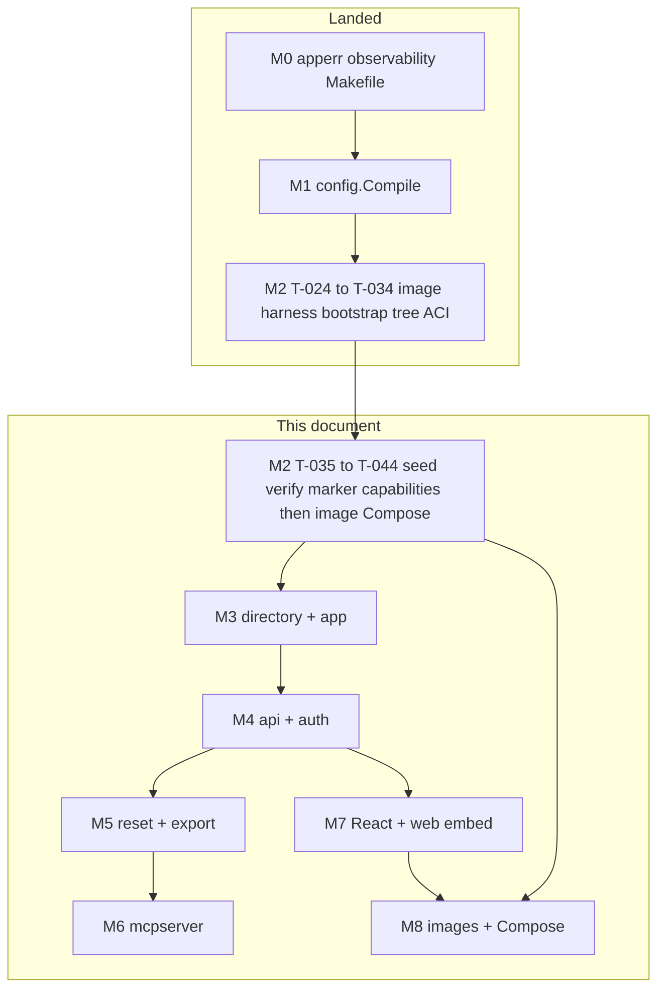
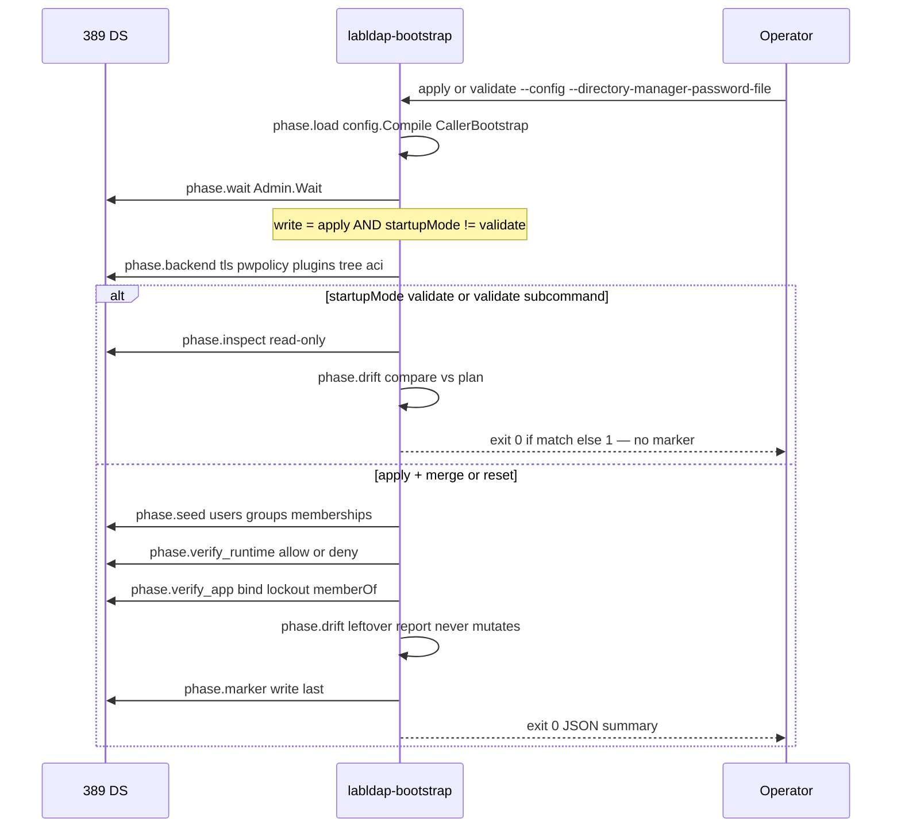
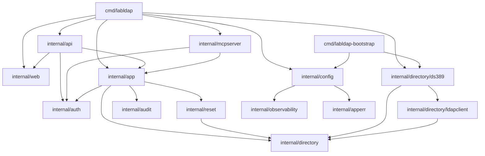
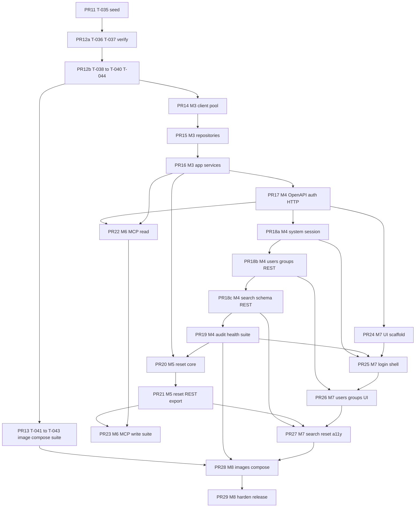

# LabLDAP Remaining-Work Implementation Design (T-035 through T-120)

| Field | Value |
| --- | --- |
| Document title | LabLDAP Remaining-Work Implementation Design (T-035 through T-120) |
| Author | Design synthesis (remaining work after landed M1 + partial M2) |
| Date | 2026-08-13 |
| Status | Draft (revised after review 2026-08-13) |
| Product | LabLDAP — disposable laboratory LDAP environment |
| Working names | LabLDAP / `labldap` / `labldap-bootstrap` (OD-001 default) |
| Implementation workspace | `/home/mbrewer/projects/go-lab-ldap-mcp` |
| Git remote | `https://github.com/hilather/go-lab-ldap-mcp.git` |
| Go module | `github.com/hilather/go-lab-ldap-mcp` |
| License | Privately owned; do **not** invent a LICENSE file (OD-003) |
| Local images | `labldap-control:dev`, `labldap-bootstrap:dev` (do not push; OD-004) |
| Predecessor (M0-era) | [docs/design/labldap-implementation-design.md](https://github.com/hilather/go-lab-ldap-mcp/blob/main/docs/design/labldap-implementation-design.md) |
| Predecessor (post-M0, now stale) | [docs/design/remaining-work-m1-m8.md](https://github.com/hilather/go-lab-ldap-mcp/blob/main/docs/design/remaining-work-m1-m8.md) |
| Specification baseline | MCP 2026-07-28; official MCP Go SDK v1.7.0+; Go 1.26 / toolchain go1.26.5; React 19.2; Node.js 22.12+; pnpm@10.14.0 |
| Target | **First usable release** = README definition + all P0 tasks + any P1 that a P0 `Depends on` range names. |

This document is the **implementation contract for remaining work** after M1 and the completed M2 slice (T-024–T-034). It does **not** re-design M0/M1, does **not** re-implement T-024–T-034, does **not** invent the eighteen missing source-package documents, and does **not** add a LICENSE, public registry, or anonymous-bind default (OD-001–OD-004, OD-022).

An execute-plan agent must be able to implement **T-035 through T-120** from this document plus [`TASKS.md`](https://github.com/hilather/go-lab-ldap-mcp/blob/main/TASKS.md) and the landed packages, without waiting for recovered `docs/02`–`docs/09`, `docs/11`, `docs/12`, or ADR bodies.

Proposed REST paths, MCP tool names, and resource URIs that are not recovered from architecture are marked `x-labldap-contract: proposed`. Binding names from [`docs/01-system-architecture.md`](https://github.com/hilather/go-lab-ldap-mcp/blob/main/docs/01-system-architecture.md) are unmarked.

---

## Overview

LabLDAP is a control plane around 389 Directory Server. Three Compose roles keep Directory Manager privileges out of the long-running service: `directory` (pinned 389 DS), `bootstrap` (one-shot `labldap-bootstrap` with the DM secret file), and `control` (`labldap`, restricted runtime account, no Docker socket).

M0 (T-001–T-008) and M1 (T-009–T-023) are complete. M2 is **in progress**: T-024–T-034 landed the image pin, integration harness, TLS fixtures, bootstrap CLI, wait/bind, backend, TLS/auth, password policy, plugins, base tree, runtime account, and ACI apply. Bootstrap `Run` currently stops after `phase.aci` and reports `remaining: [inspect, seed, verify_runtime, verify_app, drift, marker]`. `labldap` exposes `help`, `version`, `validate`, `normalize`, and `plan`; `serve` is still unknown (exit 2).

The remaining 86 tasks (T-035–T-120) finish M2 (seed, verify, modes, marker, image, Compose, capability report), then implement transport-neutral directory/application services, secured REST, soft reset and streaming export, official-SDK MCP, a React operator UI, and hardened Compose images.

Two M2 gates: **M2 data/capability = PR12b** (unblocks M3 / T-045); **M2 packaging = PR13** (unblocks T-107 Playwright Compose and T-108 release images only). MCP/UI **features** may start after PR16+PR17. Frontend **scaffold** (T-095) may start after PR17.

---

## Background & Motivation

### Why this document exists

[`docs/design/remaining-work-m1-m8.md`](https://github.com/hilather/go-lab-ldap-mcp/blob/main/docs/design/remaining-work-m1-m8.md) was written after M0 and assumes T-009–T-120 remain. Its KD-R1–KD-R14, search/filter/cursor stand-in, runtime ACI set, no-`rawEntries` rule, placeholder `serve`, and PR clustering from PR11 onward remain valid. Its “current state” tables that claim `internal/config` is `doc.go`-only are **wrong**. This document rebases those decisions on the landed M1 + partial-M2 code so an implementer extends existing types instead of reinventing them.

Pain this document removes:

- Guessing how to hang seed/verify/marker off the existing `bootstrap.Run` phase runner.
- Re-deciding the marker DN when `config.buildDataPlan` already emits `cn=labldap-baseline,<suffix>`.
- Re-emitting runtime ACIs that `config.managedRuntimeACIs` already prepends.
- Treating T-033/T-034 as still open (they are `[x]`).
- Blocking M3 on missing `docs/03`/`04`/`05` instead of remapped TASKS acceptance.
- Treating T-074 / T-093 / T-104 / T-116–T-118 as deferrable P1s.

### Current repository state (verified 2026-08-13)

| Fact | Value |
| --- | --- |
| Workspace | `/home/mbrewer/projects/go-lab-ldap-mcp` |
| Module | `github.com/hilather/go-lab-ldap-mcp` (`go 1.26`, `toolchain go1.26.5`) |
| TASKS status | T-001–T-044 `[x]`; T-045–T-120 `[ ]` remaining |
| Milestones | M0 complete; M1 complete; M2 complete (T-024–T-044); M3–M8 not started |
| `cmd/labldap` | `help`, `version`, `validate`, `normalize`, `plan`, `serve --placeholder`. No-args is help/exit 0 |
| `cmd/labldap-bootstrap` | `apply` / `validate` / `plan` via `bootstrap.ParseArgs` + `bootstrap.Run`; wires `ds389.Admin` and `ds389.Engine` |
| `internal/config` | Full compiler: `Load` → `*Parsed`; `Compile` → `*Compiled` (Normalized, EnginePlan, DataPlan, Revisions) |
| Compiler contract | `labldap.config.v1alpha1.3` (`config.CompilerContract`) |
| Marker DN (compiled) | `cn=labldap-baseline,` + suffix (`config.buildDataPlan`) |
| Runtime ACIs | `labldap:runtime-suffix-read`, `labldap:runtime-people-write`, `labldap:runtime-groups-write`, `labldap:runtime-password` |
| `internal/bootstrap` | Phases through `aci`; `laterPhases` reserved for remaining M2 |
| `internal/directory/ds389` | Bootstrap DM helper (`Admin`, `Engine`); imports `go-ldap/v3` v3.4.14 |
| `internal/directory`, `ldapclient`, `app`, `api`, `mcpserver`, `auth`, `audit`, `reset`, `web` | package comments / stubs only |
| `internal/apperr` | `CodeConfiguration` / `Auth` / `Directory` / `Reset` / `Export` / `Bootstrap` |
| `internal/observability` | `Secret`, `RequestID`, `BuildInfo`, `StartupLogger` |
| 389 DS pin | `quay.io/389ds/dirsrv@sha256:f2851654c5df545cd893d84bea8d08c28dc25f0930493fbfed1d8a6eacf657f7` |
| Container ports | **3389** LDAP, **3636** LDAPS (not 389/636) |
| Frontend | placeholder `pnpm@10.14.0`; React is T-095 |
| `api/openapi.yaml` | not present; `api/generated/` reserved |
| Make pending | `test-e2e` (T-107), `compose-reset` (T-110), `image` (T-108). `compose-up`/`down` and `image-bootstrap` are real |
| Import-boundary | `internal/config` ↛ directory / go-ldap / transports; only `ds389` may import go-ldap today; only `cmd/labldap-bootstrap` + tests may import `ds389` |
| Missing source-package docs | still 18 (`00`, `02`–`09`, `11`, `12`, ADR bodies). Title-only stubs are **not** accepted ADRs |

### Binding stack (unchanged)

1. README ten non-negotiables + [`AGENTS.md`](https://github.com/hilather/go-lab-ldap-mcp/blob/main/AGENTS.md) implementation rules.
2. [`docs/01-system-architecture.md`](https://github.com/hilather/go-lab-ldap-mcp/blob/main/docs/01-system-architecture.md).
3. [`docs/13-open-decisions.md`](https://github.com/hilather/go-lab-ldap-mcp/blob/main/docs/13-open-decisions.md).
4. [`TASKS.md`](https://github.com/hilather/go-lab-ldap-mcp/blob/main/TASKS.md), including remapped acceptance where `docs/03` / `04` / `05` checkboxes cannot be satisfied literally.
5. This design’s **proposed** contracts. Proposed YAML keys, most REST paths, and most MCP names never outrank (1)–(4).

### What this document does not reopen

- The ten non-negotiables (predecessor KD-1–KD-10).
- Owner defaults: LabLDAP name, module path already `github.com/hilather/go-lab-ldap-mcp`, no LICENSE, local `:dev` images, anonymous bind disabled.
- Three Compose roles; no Docker socket; no DM secret in control.
- Soft suffix reset only; empty `groupOfNames` rejected; no AD emulation.
- Static bearer tokens (lab mode); cookie sessions for UI.
- Official MCP Go SDK only; Streamable HTTP on `/mcp`.
- Landed M1 public contract (`labldap.dev/v1alpha1` / `LabScenario`) and compiler pipeline.
- Landed M2 engine mappings recorded in [`deploy/docker/dirsrv-image-contract.md`](https://github.com/hilather/go-lab-ldap-mcp/blob/main/deploy/docker/dirsrv-image-contract.md).

---

## Goals & Non-Goals

### Goals (first usable release)

An operator can write one YAML scenario, run one Compose command, bind with a real LDAP client, mutate users and groups through UI / REST / MCP under one authz policy, reset the managed suffix to the compiled baseline, and export redacted LDIF. Architecturally:

- Configuration compiles deterministically with **no LDAP connection** (already landed; do not regress).
- Bootstrap is the only process that sees Directory Manager credentials.
- REST, MCP, and UI call `internal/app` only.
- Runtime identity cannot write `cn=config` or escape the managed suffix.
- Every public contract is versioned, tested, and redacted.

### Non-goals (first release)

Unchanged: no LDAP wire protocol in Go; no in-memory directory SoT; no Docker socket; no DM in control; no raw LDAP modification API; no `rawEntries:` stand-in; no multiple suffixes; no AD emulation; no hard reset via REST/MCP; no OAuth as default; no public image push; no LICENSE invention; no large UI kit.

This document additionally refuses:

- Re-implementing M0, M1, or T-024–T-034.
- Fabricating recovered `docs/02`–`09` as if they existed.
- Promoting the `v1alpha1` stand-in or this remaining-work contract to an accepted ADR.
- Changing `config.CompilerContract` unless hash inputs actually change (they must not for T-035–T-120 unless an ADR says so).

---

## Key Decisions

Predecessor KD-1–KD-18 remain binding. KD-R1–KD-R14 from the post-M0 remaining-work design remain binding; notes below rebase them onto landed code. KD-R15–KD-R24 lock remaining-work choices so implementers do not invent competing answers.

### KD-R1 — Dated `v1alpha1` stand-in is the public config contract (landed)

**Decision:** Keep `apiVersion: labldap.dev/v1alpha1` and `kind: LabScenario` as committed in `internal/config/v1alpha1` and [`config/schema/v1alpha1-stand-in.md`](https://github.com/hilather/go-lab-ldap-mcp/blob/main/config/schema/v1alpha1-stand-in.md). Do not invent a second schema. A rename requires a **new** ADR.

**Rationale:** T-009–T-023 already shipped this stand-in. Remaining work consumes `config.Compile`.

### KD-R2 — YAML keys are camelCase; no `rawEntries`

**Decision:** Public YAML stays camelCase. Do **not** add `rawEntries` or any operator LDIF passthrough. T-035 applies users, groups, and memberships only (plus later the marker in T-039). The T-035 title word “raw entries” is unspecified in present files.

**Rationale:** One lock prevents schema-enum drift. Compiler and schema already omit the key.

### KD-R3 — Secrets are `observability.Secret` plus the landed file resolver

**Decision:** Continue using `config.SecretResolver`, `config.FileSecretResolver`, `config.DirSecretResolver`, and `observability.Secret`. Digests hash revealed bytes after a single trailing-newline strip. Logs, `fmt`, JSON, and plan output never print revealed values.

**Rationale:** T-014 already proved this path. Do not invent a second redaction type.

### KD-R4 — Runtime ACIs are compiler-owned and already prepended

**Decision:** Do **not** re-id the managed runtime set. IDs, targets, and the suffix-read / password ACI `targetattr` stay landed. People/groups write `targetattr` is **KD-R23** (deny `aci`), applied in PR12a — that is a same-ID string replace, not a new ACI. `config.managedRuntimeACIs` already prepends:

| ACI ID | Target | Permissions | Attrs |
| --- | --- | --- | --- |
| `labldap:runtime-suffix-read` | managed suffix | read, search, compare | allow `*`, deny `userPassword` |
| `labldap:runtime-people-write` | people container subtree | add, delete, write, read, search, compare | `*` except `aci` (KD-R23) |
| `labldap:runtime-groups-write` | groups container subtree | same | `*` except `aci` (KD-R23) |
| `labldap:runtime-password` | people container | write | `userPassword` only |

T-036 verifies this set on a real engine. Operator ACLs cannot use `runtime-*` IDs (`runtime_aci_override`). Never grant `cn=config`. Do not add a marker-write ACI (KD-R18).

**Rationale:** T-034 already applies these names. KD-R23 tightens people/groups `targetattr` to deny `aci` (landed strings used `*`). T-036 fails if seed/verify invents a competing set.

### KD-R5 — Config never imports LDAP; DN logic stays in `internal/config`

**Decision:** Keep DN/RDN/attribute/filter helpers in `internal/config` without `go-ldap`. Runtime escaping lands in `internal/directory/ldapclient` (T-046).

**Rationale:** Import-boundary test already forbids `internal/config` → directory / go-ldap / transports.

### KD-R6 — Bootstrap phases emit `apperr.CodeBootstrap` via `bootstrap.PhaseError`

**Decision:** Every new phase uses `bootstrap.PhaseError(phase, code, public)` (`Path: phase.<name>`). Failed phase → non-zero exit. Verification failure prevents marker commit.

**Rationale:** T-027 already reserved the helper. Do not invent a second bootstrap error type.

### KD-R7 — `internal/directory` public types stay go-ldap-free; M2 DM helper stays in `ds389`

**Decision:** Repository interfaces in `internal/directory` use project types only. Passwords on those interfaces are `observability.Secret`. Keep the bootstrap-only DM helper (`ds389.Admin`, `Engine.TreeDial`, `defaultTreeDial`) for seed/verify/marker. T-046 owns **runtime** dial, TLS, pool, and escaping in `ldapclient`. `internal/api`, `internal/mcpserver`, and `internal/app` must not import the bootstrap helper or `go-ldap`.

**Rationale:** T-035–T-040 need DM LDAP before T-045/T-046 exist. A second long-lived stack is worse than extending the named helper.

### KD-R8 — Transports call `internal/app` only

**Decision:** `internal/api` and `internal/mcpserver` decode/encode and map principals. They do not import each other, do not build LDAP filters, and do not call `ds389` or `ldapclient`. Authorization is re-checked inside `internal/app` (T-057).

**Rationale:** README non-negotiable 5.

### KD-R9 — Binding vs proposed public names

**Decision:** Binding: `/api/v1`, `POST /api/v1/users`, `POST /api/v1/session`, `/mcp`, `/health`, `/metrics`, tool `ldap_search_entries`. Recovered scopes: `directory:write`, `directory:password`, `lab:reset`, `lab:export`, `schema:read`, `audit:read`. Proposed: `directory:read` (already in `v1alpha1.ScopeDirectoryRead`), remaining REST paths, remaining MCP names. Mark proposed OpenAPI operations with `x-labldap-contract: proposed`.

**Rationale:** Architecture-named routes are recovered; `docs/04`/`05` are not.

### KD-R10 — Sequencing and the P1-on-P0 rule

**Decision:** Two named M2 gates (do not conflate them):

| Gate | PR | Unblocks |
| --- | --- | --- |
| **M2 data/capability** | PR12b | M3 (T-045 / PR14) |
| **M2 packaging** | PR13 | T-107 Playwright Compose; T-108 release images |

MCP/UI **features** may start after PR16+PR17 (TASKS: T-085 → T-063; T-095 → T-060/T-063). T-095 scaffold may start after PR17. T-074, T-093, T-104, T-116–T-118 are **not** deferrable without an ADR that rewrites the depending P0 `Depends on` lists.

**Rationale:** Implementation plan §13. T-075 depends on T-074; T-094 depends on T-093; T-106 depends on T-104; T-119 depends on T-116–T-118.

### KD-R11 — PR clustering starts at PR11 remainder

**Decision:** PR01–PR10 and the T-033/T-034 half of predecessor PR11 are **done**. Remaining work is PR11 (T-035 only), then PR12a/PR12b (verify + modes/marker/T-044), then PR13 (image/Compose/suite **without** T-044), then PR14–PR29. Large later boxes stay one PR **only** with mandatory stacked commits (called out in the PR Plan).

**Rationale:** Incremental reviewable merges. T-044 must not wait on packaging (KD-R21). Do not re-cluster T-033/T-034.

### KD-R12 — Extend landed CLIs; no-args stays help; explicit `serve`

**Decision:** Keep stdlib dispatch in `cmd/labldap/run` and `cmd/labldap-bootstrap/run`. **No-args `labldap` remains help / exit 0.** Require explicit `labldap serve`. T-042 lands `labldap serve --placeholder` (liveness `/health`, readiness 503, SIGTERM) listening **only** on `LABLDAP_LISTEN` (KD-R19). T-063 replaces the placeholder body with the real `net/http` stack. HTTP remains `net/http` (OD-008). No third-party router or CLI framework.

**Rationale:** M0/M1 tests treat no-args as help. The landed binary cannot be a Compose replica today.

### KD-R13 — Dated search / filter / cursor stand-in (rebased on landed parsers)

**Decision:** Search input is an LDAP **filter string** plus base, scope, attributes, page size, and optional cursor. REST `POST /api/v1/search` and MCP `ldap_search_entries` share the field list in **§3.3**. Reuse landed `config.ParseFilter` and `config.EncodeCursor` / `DecodeCursor`. Do not replace them.

**Empty vs over-broad (lock):** empty filter string → field code `empty` (same as landed `ParseFilter`; do not remap to `over_broad`). Suffix + scope `sub` + match-all filter (`(objectClass=*)`, `objectClass=*`, `*`, `(&(objectClass=*))`) → `over_broad` in T-050. Extend `isOverBroad` for the `(&…)` form in T-050; do **not** change the empty-string code. Suffix + `one` or a discriminating equality/substring is allowed.

**Cursor:** opaque token. T-023 codec already exists (`EncodeCursor` / `DecodeCursor`). T-053 wraps it with process-local HMAC-SHA256 + expiry. Restart invalidates cursors. No cursor-key secret file in v1.

**Rationale:** One search command across compiler fuzz, repositories, REST, MCP, and UI.

### KD-R14 — `lifecycle.softReset` is the control user-seed switch (landed)

**Decision:** Keep the landed hash and resolve rules in `config.normalizeAll` / `hashRevisions`:

- Runtime-account `passwordFile` always resolves; digest always in Directory revision.
- User seeds resolve for bootstrap always; for control iff `softReset` is true (default true).
- User-seed digests enter Directory revision **only when `softReset` is true**.
- `startupMode: reset` is bootstrap-only and is not this flag.

**Rationale:** Already implemented. T-073 readiness and T-078 reapply depend on it.

### KD-R15 — Import-boundary must grow two exceptions for M3/M4

**Decision:** Today `tools/importboundary` allows `go-ldap` **only** in `internal/directory/ds389`, and allows `ds389` imports only from `cmd/labldap-bootstrap`, `ds389` itself, and `test/`. Remaining work **must** extend that test:

| New allowed edge | First task | Why |
| --- | --- | --- |
| `internal/directory/ldapclient` → `go-ldap` | T-046 | runtime dial/pool |
| `cmd/labldap` → `internal/directory/ds389` | T-063 / T-048 wiring | composition root constructs runtime repos |

Still **forbidden:** `internal/directory` (parent), `internal/app`, `internal/api`, `internal/mcpserver`, `internal/auth`, `internal/audit`, `internal/reset`, `internal/web` → `go-ldap` or `ds389`.

**Rationale:** Landed boundary would otherwise block the designed M3/M4 wiring. Do not loosen further.

### KD-R16 — Extend `bootstrap.Run`; do not replace it

**Decision:** T-035–T-040 add reconcilers on `bootstrap.Options` (`Seed`, `VerifyRuntime`, `VerifyApp`, `Drift`, `Marker`) and implement the reserved `laterPhases`. Keep existing phase gating: `write := command == "apply" && startupMode != validate`. `labldap-bootstrap validate` (and `apply` + `startupMode: validate`) never writes. Marker is last and only after successful verify. **`Summary.Remaining` is the not-yet-run suffix of the planned phase list for this command**, not the static `laterPhases` slice. After a phase runs, drop it from Remaining. On successful apply+merge/reset, Remaining is **empty** (`inspect` is validate-only and must not appear as leftover work). On successful validate, Remaining is empty after inspect+drift.

**Rationale:** T-027–T-034 already own the runner, reporter, and JSON summary. Leaving the static slice would list `inspect` forever on apply.

### KD-R17 — Marker DN is already compiled; T-039 only maps attributes

**Decision:** Use `compiled.Data.Marker` / `cn=labldap-baseline,<suffix>`. Do not invent a different RDN. Preferred attribute mapping (OD-012 default, verify on the pinned image at T-039):

| Attribute | Value | Notes |
| --- | --- | --- |
| `objectClass` | `top`, `device` | standard; no private OID in v1 unless verification fails |
| `cn` | `labldap-baseline` | RDN |
| `serialNumber` | applied Directory revision (hex) | no secret digests |
| `owner` | `labldap-bootstrap/<build version>` | apply version |
| `description` | RFC3339 UTC timestamp | apply time |
| `destinationIndicator` | expected Directory revision | equals `serialNumber` after successful apply |

If any of these attributes is rejected or truncated by 389 DS, record an OD-012 verification note and switch to namespaced `description` JSON only. Private OID registration is **before stable release**, not a T-039 blocker. Runtime may **read** the marker (suffix-read ACI) and must **not** be able to modify it (T-036 deny).

**Rationale:** `DataPlan.Marker` and `Preserve` already name this DN. Changing it would desync plan JSON, reset inventory, and readiness.

### KD-R18 — Soft reset does not write the marker

**Decision:** The long-running control process **never** writes `cn=labldap-baseline,<suffix>`. Soft reset (M5 / T-079) **reads** the marker, inventories, deletes, reapplies users/groups/memberships, and verifies — matching architecture §9.5. It does **not** update `serialNumber`, `destinationIndicator`, or any other marker attribute.

**T-079 remap:** “marker update last” is satisfied by: on success, **leave the bootstrap marker unchanged**; on verify failure, **never write a new revision** (trivially true). Successful reset still reports expected vs applied Directory revision **equality** by comparing `compiled.Revisions.Directory` to the **unchanged** marker `serialNumber` and to a live inventory checksum of configured objects. Readiness (T-073) still works because soft reset restores the same compiled baseline; the Directory revision does not change unless YAML/secrets change, which requires a **bootstrap** re-apply to update the marker.

Do **not** move the marker under people/groups. Do **not** grant the ordinary runtime account marker write (that would falsify T-036). Do **not** add a second reset-only LDAP identity in v1.

**Rationale:** Marker writes are bootstrap / Directory Manager operations (architecture §6). A stolen runtime LDAP password is indistinguishable from `lab:reset` at the LDAP layer; a marker-write ACI would let that password rewrite baseline provenance.

### KD-R19 — T-042 placeholder: `LABLDAP_LISTEN` only; thin non-release control image

**Decision:** T-042 Compose `control` does **not** call `config.Compile`. It listens **only** on `LABLDAP_LISTEN`, default `127.0.0.1:8443` (the landed compiler default). Packaging is a **thin, non-release** control image (`labldap-control:placeholder` or bind-mounted `labldap` binary from the Go build) that is **not** T-108. T-108 replaces it with `labldap-control:dev`. T-041 does **not** make `make image` fully real.

**Rationale:** Without compiling YAML, `spec.management.listen` is unavailable. T-108 is the hardened control image and depends on T-074, T-095, and T-107.

### KD-R20 — Directory first-boot DM secret is Compose `env_file`, not a control/bootstrap `_FILE` wrapper

**Decision:** The pinned dirsrv image accepts `DS_DM_PASSWORD` only (image contract; T-027 landed without a file-to-env wrapper). Lock one inject path:

- T-112 (and T-042’s interim secret files) write a **gitignored** Compose `env_file` containing `DS_DM_PASSWORD=…` with mode 0600. The **directory** service references that `env_file`.
- `labldap-bootstrap` continues to use `--directory-manager-password-file` only.
- `labldap` / control **never** receive the DM value (no env, no mount).
- Do **not** put the password on `docker run` argv in release docs. Do **not** add a thin directory entrypoint unless `env_file` fails on the pinned Compose versions — then record OD-007 and add a reviewed wrapper that reads `/run/secrets` into the environment without logging.

**Rationale:** One default. Mixing entrypoint-or-env_file would fork T-042/T-110.

### KD-R21 — T-044 is `Engine.Capabilities()`; no new phase; not blocked on packaging

**Decision:** Implement `ds389.Engine.Capabilities(ctx, req)` returning the locked `Capabilities` struct. Call it from `phase.verify_app` (apply) and `phase.inspect` (validate). Attach secret-free JSON to `Summary.capabilities`. **Do not** add `phase.capabilities`. Required-capability absence fails the calling phase (`verify_app` / `inspect`). T-044 lives in **PR12b** (depends on T-030–T-039 only). PR14 / T-045 wait on PR12b, **not** PR13.

**Rationale:** TASKS T-044 does not depend on T-041–T-043. Serializing M3 behind image/Compose is a false critical path.

### KD-R22 — `GET /api/v1/version` requires `directory:read`

**Decision:** Unauthenticated callers receive 401. Scope `directory:read`. Same Problem Details as other `/api/v1` routes. Liveness remains `GET /health` (no auth).

**Rationale:** “Prefer authenticated” is not implementable. Version is not a health probe.

### KD-R23 — Runtime people/groups write ACIs deny `aci`

**Decision:** In PR12a, tighten landed `namedRuntime` for `runtime-people-write` and `runtime-groups-write` to `targetattr!="aci"` (deny `aci`, allow other attributes). Same ACI IDs; `ds389.replaceACI` already replaces same-ID text on re-apply. **Do not bump `CompilerContract`.** Directory revision **will** change because `hashRevisions` includes ACI text — update every fixture that embeds those strings or hashes:

| Fixture class | Typical path |
| --- | --- |
| Compiler ACI goldens | `internal/config/testdata/` / `test/fixtures/config/aci/` |
| Directory revision hash fixtures / property tests | `internal/config` revision tests |
| `ds389` ACI unit tests that assert people/groups `targetattr="*"` | `internal/directory/ds389/aci_test.go` |

T-036 probes: modify `aci` on people, groups, and the marker/probe-marker **deny**. If 389 DS cannot deny `aci` separately from `*`, keep the compiler deny, record the residual in the image-contract file, and still treat a successful ACI rewrite as `deny_failed`.

**Rationale:** `targetattr="*"` plus `write` typically includes `aci`. A compromised runtime password must not widen its own rights inside the suffix.

### KD-R24 — Membership mutations require a keyed lock **and** a revision

**Decision:** T-058 implements **both**: a process-local keyed lock per group DN (and per user DN for user mutations that race) **and** revision / `If-Match` checks. If T-044 `Controls` lists assertion-control OID `1.3.6.1.1.12`, also send the LDAP assertion on modify and add a real-engine atomic test. If the OID is absent, document the residual TOCTOU race — do not fake atomicity. Remove any “lock **or** revision” wording.

**Rationale:** T-049/T-055 forbid silent lost updates. One mechanism is not enough when two writers interleave read-modify-write.

---

## Proposed Design

### 1. Relationship to landed M1 + partial M2



Reuse, do not redesign:

| Landed symbol | Remaining-work use |
| --- | --- |
| `config.Load` / `config.Compile` / `config.Compiled` | Bootstrap apply, control startup, reset reapply |
| `config.NormalizedUser` / `NormalizedGroup` / `NamedACI` | Seed apply and runtime repos |
| `config.DataPlan.Marker` / `Preserve` / `ACIs` | Marker, reset inventory, ACI verify |
| `config.ParseFilter` / `EncodeCursor` | Search repository + REST/MCP |
| `config.DirSecretResolver` | Both binaries; control `CallerControl` |
| `bootstrap.Run` / `PhaseError` / `Summary` | Remaining phases |
| `bootstrap.TreeRequest` / `ds389.Engine` / `defaultTreeDial` | Seed, verify, marker reuse the same DM LDAP session shape |
| `ds389.createAttrs` (uid → inetOrgPerson) | Seed users follow the same object-class set |
| `apperr.New(Code, public).WithField(...).Wrap(...)` | All new errors |
| `observability.Secret` | Passwords, tokens, session IDs |
| `test/integration/dirsrv.Start` | All real-engine tests |
| Import-boundary test | Extend per KD-R15 only |

### 2. Target file layout after first usable release

Converge on the [`AGENTS.md`](https://github.com/hilather/go-lab-ldap-mcp/blob/main/AGENTS.md) tree. Files that **already exist** are unmarked. New files this remaining-work design introduces are marked `*`.

```text
internal/bootstrap/
|-- run.go                         # extend laterPhases
|-- seed.go *                      # SeedReconciler types
|-- verify.go *                    # runtime + app probes
|-- marker.go *                    # marker read/write types
|-- inspect.go *                   # validate-path inspect
internal/directory/                # T-045 interfaces *
internal/directory/ldapclient/     # T-046/T-047 runtime go-ldap *
internal/directory/ds389/
|-- admin.go                       # keep bootstrap DM helper
|-- tree.go / aci.go / ...         # keep
|-- seed.go *                      # T-035
|-- verify.go *                    # T-036/T-037
|-- marker.go *                    # T-039
|-- users.go groups.go search.go * # T-048–T-052 runtime repos
internal/app/                      # T-054–T-058 *
internal/auth/                     # T-061/T-062 *
internal/api/                      # T-060–T-075 *
internal/mcpserver/                # T-085–T-094 *
internal/audit/                    # T-071 *
internal/reset/                    # T-076 *
internal/web/                      # T-095 embed.FS *
```

Do **not** add a `LICENSE` file. Do **not** invent `docs/02`–`09` as if recovered.

---

### 3. Locked contracts (implementers must not invent competing ones)

#### 3.1 Runtime ACI set

IDs, targets, and the suffix-read / password ACI `targetattr` stay as landed (`labldap:runtime-suffix-read`, `labldap:runtime-people-write`, `labldap:runtime-groups-write`, `labldap:runtime-password`). **Do not re-id.**

People/groups write `targetattr` is **not** frozen as landed `*`. **KD-R23** (PR12a) changes those two strings only to `targetattr!="aci"`. Update compiler ACI goldens, Directory revision hash fixtures, and `internal/directory/ds389/aci_test.go` in the same PR. T-034 already applies by ID; T-036 probes the tightened set.

#### 3.2 Marker DN and attributes

See KD-R17. DN = `compiled.Data.Marker`. Written last by **bootstrap only**. Soft reset never writes it (KD-R18). Absent or stale marker → control not ready (T-073).

#### 3.3 Search, filter, and cursor (T-023 / T-050 / T-069 / T-088 / T-102)

Dated 2026-08-12; refined 2026-08-13 against landed parsers. Rename requires a new ADR.

**Request fields** (same for REST `POST /api/v1/search` and MCP `ldap_search_entries`):

```go
// Own this type in internal/directory (T-045). config.ParseFilter validates Filter.
type SearchQuery struct {
    Base       string   // DN; empty defaults to managed suffix
    Scope      string   // base | one | sub | children  (default sub; children = v1alpha1.SearchSubordinate)
    Filter     string   // LDAP filter string; empty → field code empty (not over_broad)
    Attributes []string // empty → adapter default allowlist; never userPassword
    PageSize   int      // default / max from spec.limits
    Cursor     string   // optional opaque token from a previous page
}
```

**Filter:** call `config.ParseFilter(s, maxDepth, maxLen)` for syntax/depth/length/NUL/unbalanced. Landed field codes on `apperr.CodeConfiguration`:

| Condition | Field path | Field code |
| --- | --- | --- |
| Empty string | `filter` | `empty` |
| Raw length > `maxFilterLength` | `filter` | `too_long` |
| AST/paren depth > `maxFilterDepth` | `filter` | `too_deep` |
| Unbalanced parentheses | `filter` | `unbalanced` |
| NUL | `filter` | `invalid` |
| Simple match-all (`(objectClass=*)`, `objectClass=*`, `*`, and T-050 `(&(objectClass=*))`) | `filter` | `over_broad` |
| Suffix + `sub` + match-all (T-050 conjunction; empty filter is **not** this row) | `filter` | `over_broad` |
| Tampered / expired / query-mismatched cursor | `cursor` | `invalid` |

Public REST/MCP problem `code` may prefix these (`filter_too_deep`) only if OpenAPI documents the prefix; prefer the landed field codes so compiler and runtime stay one matrix.

**Cursor (T-053):** HMAC-wrap the landed codec payload `{q, p}` plus `exp` and canonical query. Process-local key at control start. Cursor not reusable with a different query.

#### 3.4 REST surface

**Binding** (architecture): `/api/v1`, `POST /api/v1/users`, `POST /api/v1/session`, `/mcp`, `/health`, `/metrics`.

`/health` is a **prefix**. Implement `GET /health` (liveness; no LDAP) and `GET /health/ready` (readiness). Do not treat `/health/live` as a recovered path.

**TASKS remap (04 absent):** T-060 item 1 is satisfied by implementing binding routes plus the proposed table, each non-architecture operation marked `x-labldap-contract: proposed`. If `docs/04` arrives, diff and ADR.

| Method | Path | Contract | Task | Min scope |
| --- | --- | --- | --- | --- |
| GET | `/health` | binding prefix | T-064, T-073 | none |
| GET | `/health/ready` | proposed subdivision | T-064, T-073 | none |
| GET | `/metrics` | binding prefix | T-074 | network / optional auth (`spec.management.metrics.requireAuth`) |
| GET | `/api/v1/version` | proposed | T-064 | `directory:read` (KD-R22) |
| GET | `/api/v1/capabilities` | proposed | T-064 | `directory:read` |
| GET | `/api/v1/baseline` | proposed | T-064 | `directory:read` |
| POST | `/api/v1/session` | **binding** | T-062, T-064 | token in body |
| GET/DELETE | `/api/v1/session` | proposed siblings | T-064 | session |
| POST | `/api/v1/users` | **binding** | T-066 | `directory:write` |
| GET | `/api/v1/users` | proposed | T-066 | `directory:read` |
| GET/PATCH/DELETE | `/api/v1/users/{id}` | proposed | T-066 | read / write |
| POST | `/api/v1/users/{id}/password` | proposed | T-067 | `directory:password` |
| POST | `/api/v1/users/{id}/enable` | proposed | T-067 | `directory:write` |
| POST | `/api/v1/users/{id}/disable` | proposed | T-067 | `directory:write` |
| GET | `/api/v1/users/{id}/groups` | proposed | T-067 | `directory:read` |
| GET/POST | `/api/v1/groups` | proposed | T-068 | read / write |
| GET/DELETE | `/api/v1/groups/{id}` | proposed | T-068 | read / write |
| POST/DELETE/PUT | `/api/v1/groups/{id}/members` | proposed | T-068 | `directory:write` |
| POST | `/api/v1/search` | proposed | T-069 | `directory:read` (body = §3.3 `SearchQuery`) |
| POST | `/api/v1/auth-tests` | proposed | T-069 | `directory:password` |
| GET | `/api/v1/rootdse` | proposed | T-070 | `schema:read` |
| GET | `/api/v1/schema` | proposed | T-070 | `schema:read` |
| GET | `/api/v1/schema/objectclasses/{name}` | proposed | T-070 | `schema:read` |
| GET | `/api/v1/schema/attributes/{name}` | proposed | T-070 | `schema:read` |
| GET | `/api/v1/audit` | proposed | T-071 | `audit:read` |
| POST/GET | `/api/v1/reset` | proposed | T-081 | `lab:reset` |
| GET | `/api/v1/export` | proposed | T-083 | `lab:export` |
| GET | `/api/v1/diagnostics` | proposed | T-073 | authenticated; no secrets |

Create user → `201` + `Location: /api/v1/users/{id}` + `ETag`. Empty group → field error `empty_group`. Bind-test invalid credentials → **authorized diagnostic result**, not HTTP 401.

**TASKS remap (T-068 / T-090 / T-055):** v1 has **no** `PATCH /api/v1/groups/{id}`, **no** `ldap_update_group`, and **no** `GroupRepository.Modify`. Group metadata (id/DN) is immutable after create. Membership add/remove/replace **is** the group update path (`PUT /api/v1/groups/{id}/members` / MCP member tools). If `docs/04` later requires group attribute patch, ADR + new field on a new type — do not invent `GroupPatch` in v1.

#### 3.5 MCP tool and resource catalog

**TASKS remap (05 absent):** binding name `ldap_search_entries` plus proposed siblings in `internal/mcpserver/catalog.go` comments (`binding` | `proposed`). Do not mark T-087 blocked.

| Tool | Contract | Task | Default registered | Scope |
| --- | --- | --- | --- | --- |
| `ldap_search_entries` | **binding** | T-088 | yes | `directory:read` |
| `ldap_get_capabilities` | proposed | T-088 | yes | `directory:read` |
| `ldap_get_baseline` | proposed | T-088 | yes | `directory:read` |
| `ldap_get_entry` | proposed | T-088 | yes | `directory:read` |
| `ldap_create_user` | proposed | T-089 | if `registerMutations` | `directory:write` |
| `ldap_update_user` | proposed | T-089 | if mutations | `directory:write` |
| `ldap_delete_user` | proposed | T-089 | if mutations | `directory:write` |
| `ldap_set_password` | proposed | T-089 | if `registerPassword` | `directory:password` |
| `ldap_create_group` | proposed | T-090 | if mutations | `directory:write` |
| `ldap_delete_group` | proposed | T-090 | if mutations | `directory:write` |
| `ldap_add_members` | proposed | T-090 | if mutations | `directory:write` |
| `ldap_remove_members` | proposed | T-090 | if mutations | `directory:write` |
| `ldap_replace_members` | proposed | T-090 | if mutations | `directory:write` |
| `ldap_bind_test` | proposed | T-091 | if `registerPassword` | `directory:password` |
| `ldap_reset_suffix` | proposed | T-092 | if `registerReset` | `lab:reset` |
| `ldap_export_ldif` | proposed | T-092 | if `registerExport` | `lab:export` |

Registration flags are landed YAML: `spec.management.mcp.registerMutations` / `registerPassword` / `registerReset` / `registerExport` (all default false). Read tools register when `spec.management.mcp.enabled` is true (default true).

**MCP resources (proposed):**

| URI | Scope | Sibling tool |
| --- | --- | --- |
| `labldap://capabilities` | `directory:read` | `ldap_get_capabilities` |
| `labldap://baseline` | `directory:read` | `ldap_get_baseline` |
| `labldap://rootdse` | `schema:read` | T-070 |
| `labldap://schema` | `schema:read` | T-070 |
| `labldap://schema/objectclass/{name}` | `schema:read` | T-070 |
| `labldap://schema/attribute/{name}` | `schema:read` | T-070 |
| `labldap://entry?dn={url-encoded-dn}` | `directory:read` | `ldap_get_entry` |

Do not invent a second URI scheme. Register resources when the corresponding read tools are registered.

#### 3.6 Scope matrix (lock in T-019 / T-057)

| Scope | Status | Grants |
| --- | --- | --- |
| `directory:read` | proposed (already in enums) | list/get/search/baseline/capabilities |
| `directory:write` | recovered | user/group/membership mutations **except** password/reset/export |
| `directory:password` | recovered | set password, bind-test |
| `lab:reset` | recovered | soft reset |
| `lab:export` | recovered | LDIF export |
| `schema:read` | recovered | Root DSE / schema |
| `audit:read` | recovered | audit query |

`directory:write` does **not** imply password, reset, or export (`config.impliedByWrite` already documents this). Missing-scope errors name the required scope; they do not name token IDs.

#### 3.7 UI routes (proposed; `docs/07` missing)

| Route | Task |
| --- | --- |
| `/login` | T-096 |
| `/` dashboard | T-097 |
| `/users`, `/users/new`, `/users/:id` | T-098, T-099 |
| `/groups`, `/groups/new`, `/groups/:id` | T-100, T-101 |
| `/search` | T-102 |
| `/auth-test`, `/schema` | T-103 |
| `/audit` | T-104 (P1, not deferrable — T-106 depends) |
| `/reset`, `/export`, `/diagnostics` | T-105 |

#### 3.8 v1 payload stand-in (`x-labldap-contract: proposed`)

Dated 2026-08-13. These types are the T-045 / T-060 / T-087 contract. MCP tool input/output schemas **are** the OpenAPI request/response schemas for the sibling REST operation — not a second model. JSON field names are camelCase. Passwords never appear on output types.

```go
// internal/directory — domain types (no go-ldap / HTTP / MCP)

type UserID string
type GroupID string
type Revision string // lowercase hex sha256 of API-exposed attributes; never a password

type AttrKV struct { Name, Value string } // reuse config.AttrKV shape

type User struct {
    ID            string
    UID           string
    DN            string
    Enabled       bool
    ObjectClasses []string
    Attributes    []AttrKV // ForbiddenUserAttr and userPassword stripped
    Groups        []GroupID // present on Get; optional/empty on List
    Revision      Revision
}

type UserSpec struct { // create
    ID         string
    UID        string            // empty → default to ID
    Enabled    *bool             // nil → true
    Password   observability.Secret // required on create
    Attributes map[string]string // ForbiddenUserAttr rejected
}

type UserPatch struct { // modify (not password)
    Enabled    *bool
    Attributes map[string]string // replace named attrs only; omit = leave
}

type UserListQuery struct {
    PageSize int
    Cursor   string
    Q        string // optional substring on id/uid
}

type UserPage struct {
    Items      []User
    NextCursor string // empty = last page
}

type MemberRef struct {
    Kind string // user | group
    ID   string
    DN   string // filled by service; clients may omit
}

type Group struct {
    ID       string
    DN       string
    Members  []MemberRef
    Revision Revision
}

type GroupSpec struct {
    ID      string
    Members []MemberRef // required; empty → empty_group
}

// No GroupPatch in v1. Do not add an empty patch type.

type GroupListQuery struct {
    PageSize int
    Cursor   string
    Q        string
}

type GroupPage struct {
    Items      []Group
    NextCursor string
}

type MembershipSummary struct {
    Added, Removed, Unchanged, Rejected []MemberRef
    Revision                            Revision
}

type SearchPage struct {
    Entries    []SearchEntry
    NextCursor string
}

type SearchEntry struct {
    DN         string
    Attributes []AttrKV
}

type Transport string // ldap | ldaps | starttls

type BindTestResult struct {
    Outcome string // success | invalid_credentials | locked | disabled | unavailable
    // unknown user and wrong password both → invalid_credentials
}

type RootDSE struct {
    NamingContexts    []string
    VendorName        string
    VendorVersion     string
    SupportedControls []string
    SupportedSASL     []string
}

type ObjectClass struct {
    Name, OID, Kind string
    Must, May       []string
    Sup             []string
}

type AttributeType struct {
    Name, OID, Syntax string
    SingleValue       bool
}

type Schema struct {
    ObjectClasses []ObjectClass
    Attributes    []AttributeType
}

type ManagedInventory struct {
    Users    []string // DNs under people, excluding Preserve
    Groups   []string
    Extra    []string // unconfigured DNs under people/groups
    Preserve []string
}

type ExportOptions struct {
    OmitSecrets bool  // default true
    MaxEntries  int   // default compiled exportMaxEntries
    MaxBytes    int64 // default compiled exportMaxBytes
}

type BaselineMarker struct {
    DN               string
    AppliedRevision  string
    ExpectedRevision string
    ApplyVersion     string
    AppliedAt        string
}

type ScopeSet struct { /* Has(scope string) bool; from token/session */ }
```

`app.CreateUser` / `UpdateUser` are aliases of `UserSpec` / `UserPatch`. `Capabilities` is the T-044 struct in §4.11.

**HTTP envelope and headers (lock):**

| Item | Value |
| --- | --- |
| Session login body | `{ "token": "<secret>" }` only. Not `{id, secret}`. |
| Session cookie | `labldap_session` — `HttpOnly`, `SameSite=Strict`, `Secure` when TLS, `Path=/` |
| CSRF header | `X-CSRF-Token` (cookie-authenticated mutations). Login response body `{ "csrfToken": "..." }` plus `Cache-Control: no-store`. |
| List/search envelope | `{ "items": [...], "nextCursor": "" }` |
| ETag | `"` + revision hex + `"` (quoted). Mutations send `If-Match` with that value or `412`. |
| Problem Details | `application/problem+json`; `type` = `https://labldap.dev/problems/{apperr.Code}` (`configuration`, `auth`, `directory`, `reset`, `export`, `bootstrap`); `title` = public message; `status`; `instance` unused; `errors[]` = `{ "path", "code", "message" }`; request ID in `X-Request-ID` **and** `extensions.requestId`. |
| Pagination query | `pageSize`, `cursor` on GET lists. POST search uses the §3.3 body. |
| `POST /api/v1/reset` | body `{ "name": "<metadata.name>", "expectedRevision": "<hex>" }`. Starts reset. Duplicate in-progress → `409` with current operation. |
| `GET /api/v1/reset` | current/last operation `{ "phase", "state", "counts", "expectedRevision", "appliedRevision", "error" }` — no secrets. |
| `GET /api/v1/export` | query `omitSecrets=true` (default); response `Content-Type: text/plain` (LDIF), `Content-Disposition: attachment; filename="labldap-export.ldif"`, `Cache-Control: no-store`. |
| Password body | `{ "password": "<secret>", "revision": "<hex>" }` on `POST /api/v1/users/{id}/password`. |
| Bind-test body | `{ "identity": "<uid or dn>", "password": "<secret>", "transport": "ldaps" }`. |
| `GET /api/v1/version` | `observability.BuildInfo` JSON, camelCase: `{ "version", "revision", "time", "component" }`. Requires `directory:read` (KD-R22). |
| `GET /api/v1/session` | `{ "id": "<non-secret session id>", "kind": "session", "scopes": ["directory:read", ...], "expiresAt": "<RFC3339 UTC>" }`. No token, no CSRF secret. |
| `DELETE /api/v1/session` | `204` empty body; cookie cleared. |
| `GET /api/v1/diagnostics` | `{ "ready": bool, "markerMatch": bool, "pool": { "active": int, "idle": int, "max": int }, "reset": { "state": "Ready\|PreparingReset\|Resetting\|Verifying\|Failed" } }`. No paths, DNs, or secrets. |
| `GET /api/v1/audit` | List envelope `{ "items": [AuditEvent], "nextCursor" }`. Query: `action`, `actor`, `cursor`, `pageSize`. `AuditEvent` = `{ "time": "<RFC3339 UTC>", "action", "actor", "target", "result", "requestId", "revisions": { "before", "after" } }`. Actor/target are non-secret IDs. No passwords/tokens/cookies. |

MCP tools use the same JSON objects as the corresponding REST request/response (search → `SearchQuery`/`SearchPage`, create user → `UserSpec`/`User`, reset → reset body / status). Destructive MCP tools add `confirm: true` (boolean) where REST uses the exact `name` confirmation.

---

### 4. M2 remainder — T-035 through T-044

#### 4.1 Phase runner extension

Landed `bootstrap.Run` executes `load → wait → backend → tls → pwpolicy → plugins → tree → aci` and then sets `Summary.Remaining = laterPhases` (`inspect`, `seed`, `verify_runtime`, `verify_app`, `drift`, `marker`) and `OK: true`. That early success **must end** in T-035+: remaining phases actually run, and `OK` is true only when required phases succeed. `Remaining` follows KD-R16 (not-yet-run phases only; empty on full success).



Add to `bootstrap.Options` (same style as `Tree` / `ACIs`):

```go
type SeedReconciler interface {
    ReconcileSeed(ctx context.Context, req SeedRequest) (SeedResult, error)
}
type RuntimeVerifier interface {
    VerifyRuntime(ctx context.Context, req VerifyRequest) (VerifyResult, error)
}
type AppVerifier interface {
    VerifyApp(ctx context.Context, req VerifyRequest) (VerifyResult, error)
}
type DriftInspector interface {
    Inspect(ctx context.Context, req DriftRequest) (DriftReport, error)
}
type MarkerWriter interface {
    ReadMarker(ctx context.Context, req MarkerRequest) (Marker, error)
    WriteMarker(ctx context.Context, req MarkerRequest) error
}
```

Wire them in `cmd/labldap-bootstrap/cli.go` on `ds389.Engine` (keep `Admin` for wait). All DM LDAP uses the existing `TreeDial` / `defaultTreeDial` / `TreeRequest` shape. Do not put the DM password on argv. Do not use a shell.

#### 4.2 T-035 — Seed users, groups, memberships (no raw entries)

**Depends on:** T-020, T-033, T-034 (all complete).

`SeedRequest` carries `TreeRequest` plus `compiled.Normalized.Users`, `Groups`, `StartupMode`, and `Preserve` DNs.

**User add/update** (DM identity). Same **objectClass set** as the landed `createAttrs` uid branch (`top`, `person`, `organizationalPerson`, `inetOrgPerson` = `config.RequiredUserObjectClasses`). **Do not** copy `sn: runtime` from `createAttrs` (that literal is only for the runtime service account).

- `uid`, `cn` = UID.
- Default `sn` = `NormalizedUser.ID`; override if `Attributes` contains `sn`.
- `userPassword` = `NormalizedUser.Password.Value.Reveal()` (bootstrap always resolved seeds).
- `nsAccountLock: true` when `Enabled == false` (T-032 observed disablement).
- Extra attributes from `NormalizedUser.Attributes` after `ForbiddenUserAttr` (already enforced at compile).
- Never write `memberOf`, operational attrs, or `aci` on user entries.

**Group add/update:**

- `objectClass`: `top`, `groupOfNames`.
- `cn` = group id (escaped via `config.BuildRDN` already baked into `NormalizedGroup.DN`).
- `member` = resolved member DNs (`MemberRef.DN`). Empty members cannot occur (compiler `empty_group`).
- Apply memberships as part of group replace of the `member` attribute for configured groups.

**Modes (seed portion; full mode matrix is T-038):**

| Mode | Seed behavior |
| --- | --- |
| `merge` | Upsert configured users/groups. Preserve unconfigured entries under people/groups (except do not skip password/attr update for configured IDs). |
| `reset` | Delete extra people/groups entries not in plan and not in `Preserve` (runtime account DN is preserved). Then upsert configured objects. Children-before-parents: delete groups that only contain extra users first if needed; safe order is groups-with-only-extra-members, then extra users, then extra groups, then apply. |
| `validate` | Do **not** run write seed. Count-inspect configured user/group DNs vs plan only (no drift exit-code, no drift JSON). T-038 owns the mode matrix and drift exit codes. T-039 owns marker attributes and the JSON drift document. |

**Password-set failure:** if add succeeds and password modify fails, **delete** the incomplete user and return `phase.seed` / `password_set`. Never exit 0 with a bindable no-password account. If delete compensation also fails, return `phase.seed` / `partial` (still non-zero).

**Idempotency:** second identical apply matches all configured entries (counts in `SeedResult`: created / updated / matched / deleted). Bind each configured enabled user with the seed password on a disposable connection (same TLS path as `defaultRuntimeBind`).

**Tests:** real-engine in `test/integration/dirsrv/` using `dirsrv.Start`. Canary passwords must be absent from logs (`dirsrv` redact helper). No `rawEntries` fixture.

#### 4.3 T-036 — Runtime allow / deny verification

**Depends on:** T-034, T-035.

Bind as `compiled.Normalized.Runtime` over LDAPS/StartTLS (reuse `RuntimeBind`). Probes:

| Probe | Expected |
| --- | --- |
| Search managed suffix (size/time limited) | allow |
| Read marker DN (base-scope search) | **skip/pass** on `noSuchObject` (first apply runs before `phase.marker`). When the entry exists (re-apply / merge), require the entry and readable non-secret attrs |
| Add / modify / delete a temporary user under people | allow |
| Add / modify / delete a temporary group under groups (non-empty) | allow |
| Password modify on a temporary user | allow |
| Schema / Root DSE read | allow |
| LDAP modify of a `cn=config` child (e.g. replace `nsslapd-listenhost` on `cn=config`) as the runtime bind | **deny** (`insufficientAccess` / LDAP 50). This is the `cn=config` probe |
| Optional: `dsconf -D <runtimeDN> -y <runtime-password-file> backend list` | exit non-zero (`auth` / `insufficientAccess` / tool refuse). Not a substitute for the LDAP `cn=config` modify |
| Add `cn=labldap-probe-outside,<suffix>` is **in-suffix**; for outside-suffix, add `cn=labldap-probe-outside` under an **existing unmanaged** parent if the image has one (e.g. `cn=config` already covered). If no unmanaged data parent exists, attempt `cn=labldap-probe,dc=unmanaged` and treat `noSuchObject` / `namingViolation` / `insufficientAccess` as **pass**. Do not require a synthetic `dc=unmanaged` tree |
| Modify `aci` on people, groups, and marker/probe-marker | **deny** (KD-R23) |
| Modify marker attributes | **deny** — as DM, add temporary `cn=labldap-probe-marker,<suffix>` (or use the real marker if present), bind as runtime, attempt modify, expect `insufficientAccess`. First-apply absence is **not** proof of deny. Always delete the probe |
| Read `userPassword` via suffix-read | **deny** or empty (deny `userPassword` on runtime-suffix-read) |

Temporary probe objects use reserved RDNs `uid=labldap-probe-` / `cn=labldap-probe-` / `cn=labldap-probe-marker` and **must be deleted** even on failure. Verification failure → `phase.verify_runtime` / `allow_failed` or `deny_failed`. **Do not write the real marker. Do not exit 0.**

#### 4.4 T-037 — Application bind, policy, and group behavior

**Depends on:** T-031, T-032, T-035.

Probes (passwords never logged):

1. Each enabled seed user binds successfully.
2. Wrong password and unknown user produce generic invalid-credentials; do not distinguish.
3. If compiled lockout is enabled: use an **isolated** throwaway user (not alice). Fail binds until lockout; confirm lock; clean up (delete or unlock via DM). If lockout is disabled (example-lab default), skip the lockout sequence and record `skipped_lockout: 1` in counts.
4. Disable via `nsAccountLock: true` → bind returns LDAP 53 (observed T-032); re-enable.
5. Group search finds configured groups; `member` matches plan; `memberOf` on a member user is present after MemberOf fix-up (T-032 already ran `fixup --wait`).

Failure → `phase.verify_app` / `lockout` | `memberof` | `bind`. No passwords in `Summary` or logs.

#### 4.5 T-038 — `validate`, `merge`, `reset` modes

**Depends on:** T-035–T-037.

Landed write gate already exists. T-038 fills seed/inspect/drift semantics and adds tests:

| Mode | Writes | Behavior |
| --- | --- | --- |
| `validate` (subcommand **or** `apply` + `startupMode: validate`) | **none** | Engine phases already run with `Write: false` (read-back). Seed is inspect-only. `phase.drift` reports inventory vs plan. Exit 1 on any difference. No marker write. `validate` subcommand ignores YAML `startupMode: merge\|reset` for write purposes. |
| `merge` | yes | Upsert configured objects; **preserve** an unconfigured runtime user/group and unknown unmanaged attributes on configured entries (do not clobber extra `description` etc. that are not in the normalized attr set). Then verify, read-only drift leftover report, marker last. |
| `reset` | yes | Delete extras in people/groups (preserve runtime account + required OUs + marker DN until rewrite). Reapply tree/ACI/seed. Then verify, drift, marker last. |

Acceptance fixtures (real engine):

1. Validate on a matching directory → exit 0, no modifyTimestamp change on users.
2. Validate on a drifted directory → exit 1, `phase.drift` / `drift`.
3. Merge: add `uid=runtime-extra,...` via DM, add extra `description` on alice, re-apply merge → extra user remains, extra description remains, alice password still matches seed.
4. Reset: extra user gone; alice restored; configured groups match plan.

`startupMode` is **not** `lifecycle.softReset`. Runtime soft reset is M5, uses the restricted identity, and does **not** write the marker (KD-R18).

#### 4.6 T-039 — Metadata marker and drift (OD-012)

**Depends on:** T-021, T-036–T-038.

Implement `ReadMarker` / `WriteMarker` on `ds389.Engine` using KD-R17 attributes. `WriteMarker` is **bootstrap-only** (DM). Control and soft reset call `ReadMarker` only (KD-R18). `phase.marker` runs only on apply + merge/reset after **both** verify phases succeed.

Rules:

- Marker contains **no** secret digests or password material.
- Partial apply / verify failure leaves the prior marker (or none) — never a new committed revision that pretends success.
- Drift report (secret-free JSON on `Summary` or a sibling field): expected vs live user/group DNs, ACI name set, marker revision vs `compiled.Revisions.Directory`. `phase.drift` **never** mutates.
- Record OD-012 verification in the image-contract file or a short note under `docs/` **only if** the preferred attributes fail; otherwise a test comment is enough.

#### 4.7 T-040 — Failure recovery and phase diagnostics

**Depends on:** T-027–T-039.

- Failure injection at each **write** phase (`backend`, `tls`, `pwpolicy`, `plugins`, `tree`, `aci`, `seed`, `marker`) produces `Summary.phases[].code` and `phase.<name>` field path.
- A later `startupMode: reset` apply recovers supported partial states (missing users, extra users, missing ACIs, missing marker, half-seeded groups).
- Bootstrap never reports `OK: true` after verification failure.
- Public messages stay secret-free. Reuse `bootstrap.WriteSummary`.

#### 4.8 T-041 — Bootstrap container image

**Depends on:** T-024, T-027–T-040.

- Multi-stage: build static `labldap-bootstrap` (CGO off) and copy **onto** the pinned 389 DS image so `dsconf` / `dsctl` remain available.
- Image name: `labldap-bootstrap:dev` (OD-004). Do not push. Pin the `FROM` digest (read `deploy/docker/dirsrv.digest`).
- Secrets only via mounts. Do not bake example secrets.
- Smoke: apply `test/fixtures/config/valid/minimal.yaml` (or `config/examples/example-lab.yaml` with generated secrets) to a **separate** directory container.
- Add `make image-bootstrap`. Keep `make image` printing `PENDING:control-image` until T-108. **Do not** claim `make image` is fully real at T-041.

Directory first-boot DM secret follows KD-R20 (`env_file`, not a `_FILE` wrapper). Integration harness may keep `-e DS_DM_PASSWORD=` with redacted logs.

#### 4.9 T-042 — Compose directory → bootstrap → placeholder control

**Depends on:** T-041.

Dev Compose under `deploy/compose/`:

1. `directory` healthy (TCP 3389 accept + `/data/run/slapd-localhost.socket` or documented health).
2. `bootstrap` one-shot: `labldap-bootstrap apply --config … --directory-manager-password-file …`; `depends_on` directory healthy; `service_completed_successfully`.
3. `control`: **`labldap serve --placeholder`**. `depends_on` bootstrap completed successfully. Healthcheck = `GET /health` only.

**Placeholder contract (KD-R12, KD-R19):**

- Packaging: a **thin, non-release** image (`labldap-control:placeholder`) **or** a bind-mounted `labldap` binary built by `go build ./cmd/labldap`. This is **not** T-108 and must not be tagged `labldap-control:dev`.
- Listens **only** on `LABLDAP_LISTEN` (Compose sets `127.0.0.1:8443`). Does **not** call `config.Compile`. Does **not** read `spec.management.listen`.
- `GET /health` → 200 (liveness; no LDAP).
- `GET /health/ready` → 503.
- SIGTERM / SIGINT → graceful shutdown.
- Does **not** bind LDAP, does not require seed files, does not load tokens.
- Bootstrap failure leaves control not started / not ready.

`make compose-up` / `compose-down` become real. `compose-reset` stays pending until T-110. Directory `env_file` follows KD-R20.

#### 4.10 T-043 — Engine suite remap (do not require `docs/03`)

**Depends on:** T-030–T-042.

**TASKS remap:** the deliverable “comprehensive real-engine tests from `docs/03-389ds-engine-adapter.md`” is satisfied by a suite that covers TASKS acceptance bullets plus the T-024 image-contract file. Tag cases `observed` (behavior seen on the pinned image) or `proposed` (stand-in). Do **not** block on missing `docs/03`. If 03 arrives, diff and ADR.

Required cases: fresh apply, idempotent second apply, merge preserve, reset replace, backend name/suffix conflict, TLS/require-secure-binds, password policy read-back, MemberOf + RI + `nsAccountLock`, ACI apply/read-back including runtime set, seed bind, runtime allow/deny, marker last, secret-scan of test logs. CI runs against the pinned digest.

#### 4.11 T-044 — Measured capability report

**Depends on:** T-030–T-039 only (PR12b). **Does not depend on T-041–T-043.** T-045 / PR14 wait on this task, not on PR13.

Inspect Root DSE, schema, vendor/version, plugin enablement, transports, password scheme, and optional controls via `ds389.Engine.Capabilities` (KD-R21). Attach secret-free JSON to `Summary.capabilities`. Call from `phase.verify_app` / `phase.inspect`. No new phase. Required-capability absence fails the calling phase.

Lock the v1 capability object (proposed):

```go
type Capabilities struct {
    EngineVendor   string   // from Root DSE
    EngineVersion  string
    AdapterVersion string   // labldap build
    Transports     []string // ldap, ldaps, starttls as observed
    Plugins        []string // memberof, referint, account-disable as observed
    PasswordScheme string
    Controls       []string // e.g. assertion OID if present
    RequiredOK     bool
}
```

No engine-name assumptions without inspection. T-045 shapes `CapabilityInspector` from this type.

#### 4.12 Two M2 gates (do not conflate)

| Gate | When | Exit criteria | Unblocks |
| --- | --- | --- | --- |
| **M2 data/capability** | PR12b | Fresh apply works; idempotent re-apply; runtime CRUD allowed; `cn=config` denied; marker after verify; T-044 `Capabilities()` present | M3 (PR14 / T-045) |
| **M2 packaging** | PR13 | Bootstrap image; Compose directory → bootstrap → placeholder control; T-043 suite | T-107 Playwright Compose; T-108 release images |

MCP/UI **features** wait for PR16+PR17, not for PR13.

---

### 5. M3 — Runtime directory and application services (T-045–T-059)

#### 5.1 T-045 — go-ldap-free interfaces

Package `internal/directory`. No `go-ldap`, `net/http`, or MCP types on signatures.

```go
package directory

type UserRepository interface {
    List(ctx context.Context, q UserListQuery) (UserPage, error)
    Get(ctx context.Context, id UserID) (User, error)
    Add(ctx context.Context, u UserSpec) (User, error)
    Modify(ctx context.Context, id UserID, patch UserPatch) (User, error)
    SetEnabled(ctx context.Context, id UserID, enabled bool, rev Revision) (User, error)
    Delete(ctx context.Context, id UserID, rev Revision) error
    SetPassword(ctx context.Context, id UserID, password observability.Secret, rev Revision) error
}

type GroupRepository interface {
    List(ctx context.Context, q GroupListQuery) (GroupPage, error)
    Get(ctx context.Context, id GroupID) (Group, error)
    Add(ctx context.Context, g GroupSpec) (Group, error)
    Delete(ctx context.Context, id GroupID, rev Revision) error
    AddMembers(ctx context.Context, id GroupID, members []MemberRef, rev Revision) (MembershipSummary, error)
    RemoveMembers(ctx context.Context, id GroupID, members []MemberRef, rev Revision) (MembershipSummary, error)
    ReplaceMembers(ctx context.Context, id GroupID, members []MemberRef, rev Revision) (MembershipSummary, error)
    // No Modify/GroupPatch in v1.
}

type SearchRepository interface {
    Search(ctx context.Context, q SearchQuery) (SearchPage, error)
}

type BindTester interface {
    BindTest(ctx context.Context, identity string, password observability.Secret, t Transport) (BindTestResult, error)
}

type SchemaRepository interface {
    RootDSE(ctx context.Context) (RootDSE, error)
    Schema(ctx context.Context) (Schema, error)
}

type ResetSupport interface {
    Inventory(ctx context.Context) (ManagedInventory, error)
    Export(ctx context.Context, w io.Writer, opts ExportOptions) error
}

type CapabilityInspector interface {
    Capabilities(ctx context.Context) (Capabilities, error) // T-044 shape
}

type MarkerReader interface {
    ReadMarker(ctx context.Context) (BaselineMarker, error)
}
```

Structured errors: `apperr.CodeDirectory` with field codes `not_found`, `conflict`, `invalid_credentials`, `constraint`, `unavailable` (retryable), `forbidden`. Map LDAP result codes in `ldapclient`, not in `app`.

User/group IDs are the compiled `id` strings (not DNs) at the application boundary. Repositories may accept DN only internally.

#### 5.2 T-046 / T-047 — Runtime `ldapclient`

`internal/directory/ldapclient` is the **runtime** package that imports `go-ldap`. Do not delete the M2 DM helper.

- LDAPS / StartTLS; CA + name verification; fail closed. Ports 3389/3636 as compiled.
- Simple bind **never** before configured TLS protection (`allowCleartextBind` / `insecureLabMode` already compiled).
- Bounded pool: `spec.limits.ldapPoolSize` (default 16), idle `ldapMaxIdle`, lifetime `ldapMaxLifetime`, dial `ldapDialTimeout`, wait queue, broken eviction, shutdown, metrics hooks (no DN labels).
- Context cancel invalidates blocked connections.
- Filter/DN escaping; no concatenation of untrusted strings.
- Every search: base-DN boundary + server size/time limits from compiled limits.
- Bind-test (T-051): **disposable** connection, never returned to the pool.

Extend import-boundary (KD-R15). Pin stays `github.com/go-ldap/ldap/v3 v3.4.14` unless a CVE forces a bump (record in `docs/toolchain.md`).

T-047 acceptance “soak test shows no growing leak” is a **short** concurrent leak test in PR14 (bounded duration, connection/FD/goroutine delta). Medium-profile soak evidence lives in **T-117**, not PR14.

#### 5.3 T-048–T-052 — Repositories on the restricted account

Implemented in `ds389` using `ldapclient` against the runtime account on real 389 DS.

- **Users:** paged list, get by safe id, add/modify/enable/disable (`nsAccountLock`)/delete/password, filter operational/secret attrs, never return passwords. Object classes = `RequiredUserObjectClasses`. Forbidden attrs = `ForbiddenUserAttr`.
- **Groups:** reject empty `groupOfNames`; idempotent membership summaries (`added` / `removed` / `unchanged` / `rejected`); verify MemberOf + RI after writes.
- **Search:** cannot escape configured roots; apply §3.3; server size/time limits always applied.
- **Schema/Root DSE:** TTL cache (default 60s); no forbidden server secrets.
- **Bind-test:** unknown user vs wrong password **not** distinguished. Password absent from logs and errors.

#### 5.4 T-053 — Revisions, cursors, assertion control

- Canonical revision hash over user/group attributes the API exposes (not passwords, not operational secrets). Unchanged read → same revision.
- Cursor HMAC uses the §3.3 codec plus a process-local key.
- Investigate LDAP assertion control (OID `1.3.6.1.1.12`). If present in T-044 `Controls`, use it for If-Match updates and add a real-engine atomic test. If unsupported, document residual race in the capability report / T-053 comment — do not fake atomicity. v1 guarantee is revision check **and** keyed lock (KD-R24).

#### 5.5 T-054–T-058 — Application services

`internal/app` owns use cases. Unit-testable with directory fakes. **Must not** import `internal/api` or `internal/mcpserver`.

```go
package app

type Principal struct {
    Kind   string // "token" | "session"
    ID     string // non-secret token ID or session ID
    Scopes ScopeSet
}

type UserService interface {
    List(ctx context.Context, p Principal, q directory.UserListQuery) (directory.UserPage, error)
    Get(ctx context.Context, p Principal, id directory.UserID) (directory.User, error)
    Create(ctx context.Context, p Principal, spec CreateUser) (directory.User, error)
    Update(ctx context.Context, p Principal, id directory.UserID, patch UpdateUser) (directory.User, error)
    Delete(ctx context.Context, p Principal, id directory.UserID, rev directory.Revision) error
    SetEnabled(ctx context.Context, p Principal, id directory.UserID, enabled bool, rev directory.Revision) (directory.User, error)
    SetPassword(ctx context.Context, p Principal, id directory.UserID, pw observability.Secret, rev directory.Revision) error
}
```

Rules:

- Every mutation calls the authorizer **inside** the service (T-057), even if HTTP middleware also checked.
- Password failure after create → delete the incomplete user (same compensation as T-035). Never leave a no-password bindable account.
- Same-group membership: keyed per-group lock **and** revision / `If-Match` (KD-R24). Assertion control when T-044 lists OID `1.3.6.1.1.12`.
- Audit hook: request ID, actor (non-secret), action, target, result, revisions — no secrets.
- Global mutation-gate interface for M5 (`internal/reset`).

#### 5.6 T-059 — M3 gate

Every supported operation: success, validation, conflict, forbidden, unavailable where applicable. Direct LDAP mutation appears in a fresh service read. Test logs contain none of the generated passwords or management tokens.

---

### 6. M4 — REST, authentication, security (T-060–T-075)

#### 6.1 T-060 — OpenAPI and generation

- Hand-author `api/openapi.yaml` (OpenAPI 3.1 or a documented 3.0 compatible subset).
- OD-009 preferred generator: a maintained Go generator with deterministic output + TypeScript consumption. **Preferred default to verify at T-060:** `oapi-codegen` pinned in Makefile / `docs/generated-files.md`, plus a TS client at T-095 (`openapi-typescript` or the generator’s TS mode). If the chosen tool cannot do 3.1, emit a 3.0 subset and record the verification note.
- `make generate` becomes real. `tools/gencheck` grows OpenAPI drift.
- Examples contain no real credentials.
- Proposed operations carry `x-labldap-contract: proposed`.

#### 6.2 T-061 / T-062 — Tokens and sessions

- Load token files via `config.Compile` (`CallerControl`). Constant-time compare of `observability.Secret`. Expose non-secret token ID only.
- Missing/malformed/invalid bearer → 401 **without** token IDs.
- Session: opaque CSPRNG ID; cookie name `labldap_session`; `HttpOnly`; `Secure` when TLS; `SameSite=Strict`; idle 30m + absolute 8h from compiled `spec.management.session`; `maxSessions` 64; in-memory only.
- `POST /api/v1/session` body `{ "token": "<secret>" }`; response sets cookie + `{ "csrfToken": "..." }`; **never** returns the raw token. CSRF header `X-CSRF-Token` (§3.8).
- Cookie-authenticated mutations require CSRF header + Origin. Same-origin default. Wildcard credentialed CORS is **impossible**.

#### 6.3 T-063 — HTTP foundation

`labldap serve` (explicit) replaces the T-042 placeholder body. Wire: request ID → auth → mux (`/api/v1`, `/health`, `/health/ready`, `/metrics`, later `/mcp`, later UI). Panic recovery. Timeouts from compiled limits (`requestTimeout`, `shutdownTimeout`). Body limit `maxRequestBodyBytes`. Strict JSON (unknown fields and trailing content fail). Liveness **independent of LDAP**.

`Compile` uses `CallerControl`. Runtime-account `passwordFile` must always resolve or `serve` refuses readiness. User seed files resolve only when `lifecycle.softReset` is true.

Allow `cmd/labldap` to import `ds389` for constructing runtime repos (KD-R15).

#### 6.4 T-064–T-070 — Handlers

Thin HTTP → `app` commands. Bodies as §3.8 (including version, session GET, diagnostics). ETag + `If-Match` for user and membership mutations (not group PATCH — there is none). Protected cursors. Rate limits from compiled `rateLimit` (especially password and bind-test, per-IP and per-actor). Sensitive responses: `Cache-Control: no-store`. Bind-test / password bodies **excluded** from logs.

Problem Details (`application/problem+json`) with `observability.RequestID` on every error. Map `apperr.Code*` consistently (T-065).

#### 6.5 T-071–T-074 — Audit, redaction, health, metrics

- Audit taxonomy: authenticate, session create/destroy, user/group/membership/password, bind-test (generic result), reset, export, authz deny. Bounded in-memory ring + structured log. Actor = non-secret token/session ID. Event JSON and `GET /api/v1/audit` query = §3.8.
- T-072: typed wrappers (`observability.Secret`), header sanitizer, test-run log scanner, **deliberate leak fixture that fails the scan**.
- T-073: LDAP outage → live healthy, ready unhealthy; revision mismatch blocks readiness; diagnostics have no secret paths/values. Readiness requires: valid config, runtime bind, marker exists, applied revision matches expected Directory revision, required capabilities, no reset active.
- T-074 is **P1 but not deferrable**. Bounded Prometheus text: HTTP by route **template** + status class; MCP by tool + outcome; LDAP pool gauges; auth success/fail by reason class; reset/export; build info. **No** DN, user ID, request ID, token ID, session, filter, or password labels. Default `requireAuth: false` with documented loopback/network policy.

#### 6.6 T-075 — M4 gate

Every operation: positive and negative authn/authz. Read-only token cannot mutate any route. Contract + secret scans pass in CI.

---

### 7. M5 — Soft reset and LDIF export (T-076–T-084)

```text
Ready -> PreparingReset -> Resetting -> Verifying -> Ready
                         \-> Failed
```

Once mutation begins, directory reads and writes return `503` / `reset_in_progress` (`apperr.CodeReset`, retryable).

Soft reset (restricted identity, **not** DM, **not** Docker). **Does not write the marker** (KD-R18 / architecture §9.5):

1. Authorize `lab:reset` + expected baseline revision + exact `metadata.name` confirmation (`compiled.Normalized.Name`).
2. Acquire exclusive gate (`internal/reset`).
3. **Read** the current marker and inventory; never delete outside people/groups containers; preserve runtime account + required OUs **and** the marker DN.
4. Delete groups/users in safe order (children first).
5. Reapply baseline with seed password files. `softReset: true` already forced those files at control start; if a file disappears after start, refuse with `secret_unreadable` (no partial delete). `softReset: false` never reaches this step (`CodeReset` / `disabled`).
6. Verify canonical baseline + service-account access. Expected revision equals compiled Directory revision **and** the **unchanged** marker `serialNumber`.
7. Do **not** write or replace the marker. T-079 “marker update last” remaps to “leave bootstrap marker unchanged on success; never write a new revision on verify failure.”
8. Audit summary (counts, revisions — no secrets).

Partial failure: marker unchanged (so no new committed revision); readiness false if inventory no longer matches the marker; bootstrap `reset` mode recovers supported partial states (T-080). Hard engine reset remains `make compose-reset` (T-110).

Export (T-082, T-083):

- Deterministic streaming LDIF (RFC-compatible, base64, folding, sorted DN/attrs).
- Omit password/secret attributes by default (`userPassword` and `config` operational deny list).
- Do not load all entries into memory.
- Byte and entry limits from compiled `exportMaxEntries` / `exportMaxBytes`; abort with `apperr.CodeExport` — never silent partial success.
- Client disconnect cancels directory reads.
- Requires `lab:export`.

MCP-ready application path exists before MCP tools (T-084 tests app + REST + direct LDAP).

---

### 8. M6 — MCP (T-085–T-094)

Do **not** start until the **M2 data/capability** gate (PR12b), application services (PR16), and HTTP foundation (PR17 / T-063). Do **not** wait for the M2 packaging gate (PR13). T-085 depends on T-063.

- Official SDK `github.com/modelcontextprotocol/go-sdk` **v1.7.0 or later**; protocol record 2026-07-28. At T-085 pin a concrete 1.7.x in `go.mod` and set `StreamableHTTPOptions.Stateless = true` — without `Stateless`, v1.7.0 negotiates 2025-11-25 and fails T-085. Record OD-015 with that version **and** the Stateless flag.
- Streamable HTTP at `/mcp`. **No** legacy unauthenticated HTTP+SSE.
- Every HTTP MCP request requires valid bearer (same `auth.Registry` as REST).
- Host/Origin checks, body limits, cancellation → context.
- Request ID in app logs and tool results.
- MCP 2026-07-28 is **stateless**; T-085 “initializes” means “SDK client connects,” not a 2025 handshake reimplementation.
- `internal/mcpserver` maps tools → `app` commands. No REST client. No LDAP.
- Destructive tools require confirmation + accurate metadata.
- User created via MCP must be visible via REST and direct LDAP.
- T-092 export: prefer authenticated REST stream for large exports; allow a small byte-capped inline LDIF for tiny labs (cap = min(64KiB, `exportMaxBytes`)).
- T-093 stdio: P1 **not deferrable**. Protocol **only** on stdout; logs on stderr; same scopes as HTTP. `labldap mcp-stdio` (explicit; do not overload `serve`).

---

### 9. M7 — Web UI (T-095–T-107)

Feature UI waits for REST contracts. **Scaffold** (T-095) may start after PR17.

Stack: React 19.2, TypeScript strict, Vite, TanStack Query, React Router, React Hook Form, Zod, generated OpenAPI client, `pnpm@10.14.0` (already pinned). Go `embed` of `frontend/dist` in `internal/web`. SPA-fallback routing in `internal/api` / `cmd/labldap`. `internal/web` **must not** import `internal/app` (already enforced).

UI rules: token absent from all browser storage after login; password inputs cleared; search does not auto-run; mutations send revision; conflicts offer refresh; delete user requires exact ID; reset requires scenario name + revision + `lab:reset`; server strings as text; production CSP with no unsafe-inline script; status not by color alone.

T-107 Playwright against release-like Compose + real 389 DS. Failure artifacts must not contain entered passwords or tokens. `make test-e2e` becomes real here.

---

### 10. M8 — Deployment and release (T-108–T-120)

| Task | Outcome |
| --- | --- |
| T-108 | Hardened control image: multi-stage frontend+Go, non-root, read-only root, dropped caps, no-new-privileges, no DM secret, no Docker socket, no source/cache. **Depends on T-074, T-095, and T-107.** Image `labldap-control:dev`. Replaces the T-042 `labldap-control:placeholder` image. |
| T-109 | Matching bootstrap image on pinned 389 DS digest (evolve T-041). |
| T-110 | Ephemeral Compose: tmpfs `/data`, loopback ports, secret mounts. Runtime entries vanish on recreate. `make compose-reset` becomes the operator hard reset. Document host-swap caveat (non-negotiable 7). |
| T-111 | Persistent named-volume profile; restart preserves runtime entries; soft reset restores baseline. |
| T-112 | Secret generator: entropy, 0600, no overwrite, no print by default, gitignore. |
| T-113 | Lab CA + SAN certs; private CA key not mounted into runtime after signing. Prefer `dsctl tls import-*` after first boot (image-contract TLS import path). |
| T-114 | Automated inspect: no DM, no socket, no privileged, loopback ports. |
| T-115 | `ldapsearch` / `ldapwhoami` / paging / password modify / independent Go + Python clients. Ports 3389/3636. |
| T-116 | amd64 + arm64 where upstream 389 DS supports both. P1, not deferrable for T-119. **Preferred default:** advertise only architectures that the pinned dirsrv digest actually has; T-024 recorded `linux/amd64` — verify arm64 at T-116 and do not advertise it if the digest is amd64-only. |
| T-117 | Soak / leak / medium-profile measurements against architecture §14 (~10k users / ~1k groups) or record shortfall. |
| T-118 | SBOM, vuln, provenance, checksums. P1, not deferrable for T-119. |
| T-119 | Operator package: Compose, examples, schemas, OpenAPI, MCP catalog, tmpfs swap caveat, AD non-goal. |
| T-120 | `make verify` from clean checkout; REST+MCP+UI+LDAP acceptance on pinned artifacts; ephemeral + persistent; no unapproved high/critical findings. |

Images: `labldap-control:dev`, `labldap-bootstrap:dev`. Do not push (OD-004). Release manifests reference **digests only**.

**OD-020 preferred default (verify at T-108+):** Docker Engine 24+ and Compose v2.24+ (secrets, health dependencies, `tmpfs` uid/gid/mode, `service_completed_successfully`). Record actual minimums after preflight.

---

### 11. How later packages stay thin



`cmd/labldap-bootstrap` continues to import `ds389` (already allowed). `cmd/labldap` becomes the runtime composition root (KD-R15).

---

## API / Interface Changes

Greenfield contracts, introduced in this order. M1 already locked the config surface; M2 already locked bootstrap flags.

| Contract | When locked | Notes |
| --- | --- | --- |
| `v1alpha1` Go types + JSON Schema | landed T-009/T-010 | Do not change for remaining work without ADR |
| Config CLI JSON | landed T-022 | Redact by default |
| Bootstrap phases + `Summary` | extend T-035–T-040 | Add remaining phases; keep JSON shape additive |
| Directory repository interfaces + §3.8 payloads | T-045 | No LDAP/HTTP/MCP types; after T-044 / PR12b |
| OpenAPI 3.x `/api/v1` | T-060 | Binding routes + proposed table + §3.8 |
| Session cookie/CSRF | T-062 | Cookie `labldap_session`; header `X-CSRF-Token`; body `{token}` |
| Search / filter / cursor | T-023 (codec landed), T-050 / T-053 | §3.3 |
| MCP tool + resource catalog | T-087 / T-088 | Binding `ldap_search_entries` + proposed names/URIs; schemas = §3.8 |
| Image/Compose | T-041, T-108–T-111 | Digests only |
| Scope strings | landed T-019 | `directory:read` proposed but already in enums |

Change management ([`AGENTS.md`](https://github.com/hilather/go-lab-ldap-mcp/blob/main/AGENTS.md)):

- Backward-compatible config additions may stay on `v1alpha1`.
- Breaking config → new `apiVersion`.
- Breaking REST → new URL version.
- Breaking MCP tool → new tool name or documented transition.
- Security defaults may tighten; insecure behavior must never become the silent default.

First dependency additions still needed:

| Dependency | First task |
| --- | --- |
| `github.com/modelcontextprotocol/go-sdk` v1.7.0+ | T-085 |
| OpenAPI generator (OD-009) | T-060 |
| React 19.2 + Vite + TanStack Query + RHF + Zod | T-095 |

`gopkg.in/yaml.v3` and `github.com/go-ldap/ldap/v3` are **already** in `go.mod`.

---

## Data Model Changes

No application SQL schema. Authoritative models:

### 389 DS (runtime SoT)

- One backend `userroot` / one suffix (compiled `EnginePlan.BackendName` / `Suffix`).
- Suffix root (`domain`), `ou=people`, `ou=groups`, runtime `inetOrgPerson` (`uid=<id>,ou=people,<suffix>`), generated `labldap:*` ACIs.
- Users (`inetOrgPerson`); enable/disable via `nsAccountLock`.
- Groups as `groupOfNames` with ≥1 `member`.
- Membership via `member`; `memberOf` via plugin; referential integrity enabled.
- Password policy in engine config (bootstrap only in v1).
- Metadata marker at `cn=labldap-baseline,<suffix>`; no secret digests.
- **No** raw-entry object.

### Control process (ephemeral)

- Compiled baseline + both revisions (`config.Compiled`).
- Token comparison material (`observability.Secret`).
- In-memory sessions + CSRF.
- Audit ring.
- LDAP pool + schema/capability TTL cache.
- Reset gate state.

### Secret files

| Secret | Bootstrap | Control |
| --- | --- | --- |
| Directory Manager password | yes (file) | **no** |
| Runtime LDAP password | yes | yes |
| Seed user passwords | yes | yes iff `lifecycle.softReset` is true (default true) |
| Management tokens | no | yes |

### Migration

Persistent volume across versions: T-120 upgrade test. Additive config stays `v1alpha1`. Soft reset restores baseline; it is not a config migrator.

---

## Alternatives Considered

Predecessor A1–A7 (LDAP-in-Go, DM-in-control, memory overlay, Docker-socket reset, unofficial MCP SDK, OAuth-only, dummy empty groups) stay **rejected**. Remaining-work alternatives:

### R-A1 — New bootstrap orchestrator instead of extending `bootstrap.Run`

| | |
| --- | --- |
| Approach | Replace the phase runner for seed/verify/marker. |
| Pros | Cleaner mode matrix. |
| Cons | Rewrites T-027–T-034; duplicates `Summary` / `PhaseError`; breaks existing tests. |
| Outcome | **Rejected.** KD-R16: extend `Options` and `laterPhases`. |

### R-A2 — MCP handlers call REST internally

| | |
| --- | --- |
| Approach | One HTTP implementation; MCP is a REST client. |
| Pros | Fewer handlers. |
| Cons | Violates non-negotiable 5 / KD-R8; doubles auth and error mapping. |
| Outcome | **Rejected.** Both call `internal/app`. |

### R-A3 — Defer T-074 / T-093 / T-104 / T-116–T-118 as “just P1”

| | |
| --- | --- |
| Approach | Ship first usable release without metrics, stdio MCP, audit UI, multi-arch, soak, SBOM. |
| Pros | Shorter path. |
| Cons | P0 tasks T-075, T-094, T-106, T-119 depend on those ranges. Skipping without rewriting TASKS is a false gate. |
| Outcome | **Rejected** unless a new ADR rewrites the P0 `Depends on` lists. |

### R-A4 — Put runtime LDAP in the bootstrap `Admin` type

| | |
| --- | --- |
| Approach | Grow `ds389.Admin` into the long-lived pool. |
| Pros | One dial stack. |
| Cons | Mixes DM privilege with runtime; import-boundary and T-046 ownership blur; control might accidentally reuse DM helpers. |
| Outcome | **Rejected.** Keep DM helper bootstrap-only; `ldapclient` owns runtime (KD-R7). |

### R-A5 — Give the runtime account marker-write ACI so soft reset can commit T-079

| | |
| --- | --- |
| Approach | Add `labldap:runtime-marker-write` on `cn=labldap-baseline,<suffix>`. |
| Pros | Literal T-079 “marker update last” from control. |
| Cons | Stolen runtime LDAP password can rewrite baseline provenance; T-036 “modify marker deny” becomes false; contradicts architecture §6 / §9.5. |
| Outcome | **Rejected.** KD-R18: control never writes the marker. |

---

## Security & Privacy Considerations

Full STRIDE lives in missing `docs/06`. Executable controls already required:

| Control | Remaining-work application |
| --- | --- |
| Privilege separation | Compose inspect (T-114); no DM mount on control; no Docker socket |
| Secret I/O | Password-file options; `observability.Secret`; T-014 (landed) / T-072 |
| Comparison | Constant-time token match (T-061) |
| Injection | Config DN escape (landed); ACI emitter goldens (landed); ldapclient escape |
| Logging | Never tokens, passwords, session IDs, full Authorization, secret-file bytes |
| HTTP | Timeouts, body limits, same-origin CORS, CSRF, Host/Origin |
| LDAP writes | Runtime cannot escape suffix or write `cn=config` (T-036) |
| Destructive ops | `lab:reset` + revision + exact scenario (T-081) |
| Metrics | No identity labels (T-074, OD-021) |
| Images | Non-root, read-only, digest pins (T-108–T-114) |
| Anonymous bind | Off in default example (OD-022) |
| Ephemeral | Document host-swap caveat |

Residual: if `docs/06` is recovered, gap-review before M8. Session default durations (30m / 8h) are already compiled defaults; change via config, not code forks.

Directory container still receives `DS_DM_PASSWORD` at first boot (image limitation). Mitigate: generate into a file, inject via a reviewed Compose/env path, redact logs, never mount that file into `control`.

---

## Observability

### Logging

Keep M0 `slog` setup. Component + version fields already emitted by `StartupLogger`. Propagate `observability.WithRequestID` from HTTP/MCP into `app` and `ldapclient`. Bootstrap phases: duration + safe counts only (`reporter` already does this).

### Scale target (non-binding lab NFR)

Architecture §14, restated for T-047 / T-117: **one** control replica, **one** 389 DS instance, reference profile up to **~10,000 users and ~1,000 groups**, paginated lists, bounded pool and exports. Not an HA promise.

### Metrics (T-074)

Bounded Prometheus at `/metrics`. Disable-able. Document auth vs network restriction. No identity labels.

### Health

| Endpoint | Meaning |
| --- | --- |
| `GET /health` | Process + HTTP listener |
| `GET /health/ready` | Config + bind + marker + revision + capabilities + not resetting |
| `GET /api/v1/diagnostics` | Component status, pool, marker match; no secret paths/values |

### Audit (T-071)

Structured log + bounded ring. Actor = non-secret ID. `AuditSink` remains the extension point; no persistent DB in v1.

---

## Rollout Plan

No production users. Rollout = milestone gates + PR11–PR29.

| Switch | Default |
| --- | --- |
| Storage | ephemeral (persistent profile separate) |
| Startup reconcile | documented per profile (`merge` in example-lab) |
| Insecure lab transport | off |
| Anonymous bind | off |
| MCP mutation/password/reset/export tools | off |
| Metrics | on, disable-able |
| Soft reset | `lifecycle.softReset` default true; control requires seed files when true |

No flag to put DM in control. No flag to expose hard reset over REST/MCP.

Rollback:

- Ephemeral: recreate Compose; bootstrap reapplies; runtime entries gone.
- Persistent: roll back image digests; `validate` reports drift. Soft reset restores data baseline, not engine-config rollback.
- Interrupted reset: not-ready; operator runs bootstrap `reset` or Compose recreate.

Release gate: T-120 / `make verify` from a clean checkout.

---

## Risks

| Risk | Severity | Mitigation |
| --- | --- | --- |
| Stand-in schema disagrees with later `docs/02` | Medium | Dated note; ADR on rename; enum drift tests already exist |
| Partial seed leaves bindable no-password users | High | Compensation delete; `password_set` / `partial`; never exit 0 |
| Overbroad runtime ACIs | High | KD-R23 deny `aci`; T-036 allow/deny including ACI rewrite |
| Soft reset / stolen runtime password rewrites marker | High | KD-R18: control never writes the marker |
| 389 DS rejects preferred marker attributes | Medium | OD-012 fallback to `description` JSON; private OID only before stable release |
| Import-boundary blocks `ldapclient` / `cmd/labldap` | High | KD-R15; update test in the same PR as the import |
| Partial reset corruption | High | T-080; readiness false; bootstrap reset recovery |
| Secret leakage | High | `observability.Secret`; T-072 canary; dirsrv redact |
| Agent “defers” blocking P1 | Medium | KD-R10 |
| MCP/UI started before data/capability proof | Medium | Wait for PR12b + PR16+PR17; packaging (PR13) is not that gate |
| Host swap retains tmpfs | Medium | Operator warning (non-negotiable 7) |
| dirsrv lacks `DS_DM_PASSWORD_FILE` | Medium | KD-R20: directory `env_file` only; bootstrap password-file; never on control |
| Assertion control absent | Low | Document residual race; keyed lock + revision |
| Pinned dirsrv digest is amd64-only | Medium | T-116 verify; do not advertise arm64 if unsupported |

---

## Open Questions

**None.** Design choices that looked open are locked as Key Decisions: marker write identity (KD-R18), T-042 packaging/listen (KD-R19), DM `env_file` inject (KD-R20), T-044 phase attachment and PR placement (KD-R21), version-endpoint auth (KD-R22), runtime `aci` deny (KD-R23), membership lock+revision (KD-R24). Owner defaults (name, LICENSE, `:dev` images, anonymous bind) are not re-asked.

Verification items below are empirical checks, not product forks.

### Verification decisions (agent records in OD format when the task runs)

| ID | What | When | Locked default |
| --- | --- | --- | --- |
| OD-006 | Exact `quay.io/389ds/dirsrv` digest | T-024 done; re-check T-108 | Keep `sha256:f2851654c5df545cd893d84bea8d08c28dc25f0930493fbfed1d8a6eacf657f7` unless a CVE forces a new pin |
| OD-007 | Confirm Compose `env_file` works on pinned Compose | T-042 / T-110 | KD-R20: directory `env_file`; no entrypoint unless that fails |
| OD-009 | OpenAPI generator | T-060 | Pin `oapi-codegen` + TS consumer; 3.1 or documented 3.0 subset |
| OD-012 | Marker attributes vs private OID | T-039 | KD-R17 standard attrs; JSON `description` fallback; private OID only before stable release |
| OD-015 | MCP SDK/protocol pin | T-085 | Concrete 1.7.x in `go.mod` + `Stateless: true` + spec 2026-07-28 |
| OD-017 | Generated vs operator PKI | T-113 (engine TLS already T-030) | Generated lab CA + SAN; `dsctl tls import-*` after first boot |
| OD-018 | Empty-group rejection on real 389 DS | T-049 | Compiler already rejects; repository rejects empty replace |
| OD-020 | Min Docker/Compose versions | T-108–T-111 | Docker 24+ / Compose v2.24+ unless preflight proves lower |

### Residual design gaps (do not fabricate missing docs)

| Gap | How to proceed |
| --- | --- |
| `docs/02` YAML/ACL grammar | Landed stand-in; expect churn; ADR on rename |
| T-035 “raw entries” | Unspecified — **no** key, **no** apply path |
| `docs/03` dsconf / adapter tests | T-043 remap: TASKS bullets + image-contract; tag `observed` / `proposed` |
| `docs/04` REST | Binding routes + proposed table + §3.8 payloads + `x-labldap-contract` |
| `docs/05` MCP | Binding `ldap_search_entries` + proposed tools/URIs; schemas = §3.8 OpenAPI types |
| `docs/00`/`12` requirement IDs | TASKS acceptance is the PRD stand-in |
| Assertion control | Investigate in T-053; document residual race if absent |
| MCP export shape | T-092: prefer REST stream; allow tiny inline cap |

If `docs/02`/`03`/`04`/`05` arrive, **diff and ADR** — do not silently rename.

---

## References

### In-repo (authoritative)

| Path | Role |
| --- | --- |
| [docs/design/labldap-implementation-design.md](https://github.com/hilather/go-lab-ldap-mcp/blob/main/docs/design/labldap-implementation-design.md) | Predecessor implementation contract (M0-era) |
| [docs/design/remaining-work-m1-m8.md](https://github.com/hilather/go-lab-ldap-mcp/blob/main/docs/design/remaining-work-m1-m8.md) | Stale post-M0 remaining-work design (reuse KD-R* only) |
| [docs/01-system-architecture.md](https://github.com/hilather/go-lab-ldap-mcp/blob/main/docs/01-system-architecture.md) | Topology, sequences, readiness |
| [docs/10-implementation-plan.md](https://github.com/hilather/go-lab-ldap-mcp/blob/main/docs/10-implementation-plan.md) | Milestone exit criteria |
| [docs/13-open-decisions.md](https://github.com/hilather/go-lab-ldap-mcp/blob/main/docs/13-open-decisions.md) | OD-001–OD-022 |
| [TASKS.md](https://github.com/hilather/go-lab-ldap-mcp/blob/main/TASKS.md) | T-001–T-120 acceptance |
| [AGENTS.md](https://github.com/hilather/go-lab-ldap-mcp/blob/main/AGENTS.md) | Package boundaries, DoD |
| [docs/toolchain.md](https://github.com/hilather/go-lab-ldap-mcp/blob/main/docs/toolchain.md) | Pins |
| [docs/generated-files.md](https://github.com/hilather/go-lab-ldap-mcp/blob/main/docs/generated-files.md) | OpenAPI generation policy |
| [config/schema/v1alpha1-stand-in.md](https://github.com/hilather/go-lab-ldap-mcp/blob/main/config/schema/v1alpha1-stand-in.md) | Dated config stand-in |
| [deploy/docker/dirsrv-image-contract.md](https://github.com/hilather/go-lab-ldap-mcp/blob/main/deploy/docker/dirsrv-image-contract.md) | Observed 389 DS contract |
| `internal/config`, `internal/bootstrap`, `internal/directory/ds389` | Landed compiler and bootstrap |
| `tools/importboundary/boundary_test.go` | Import rules to extend (KD-R15) |

### Missing inventoried documents (do not fabricate)

`docs/00`, `02`–`09`, `11`, `12`, ADR 0001–0007 bodies. Stubs under `docs/adr/*.stub.md` are titles only.

### Upstream

- 389 DS: https://www.port389.org/docs/389ds/documentation.html
- Official MCP Go SDK: https://github.com/modelcontextprotocol/go-sdk
- MCP Streamable HTTP 2026-07-28: https://modelcontextprotocol.io/specification/2026-07-28/basic/transports/streamable-http
- `go-ldap`: https://github.com/go-ldap/ldap

---

## PR Plan

PR01–PR10 and predecessor PR11 (T-033/T-034) are **done**. Do not re-open them. Remaining work is **PR11 remainder (T-035 only)** through PR29. Large boxes stay independently reviewable via **mandatory stacked commits** named below.



### PR11 — M2: Baseline seed (users, groups, memberships)

- **Title:** M2: apply baseline users, groups, and memberships
- **Tasks:** T-035 only
- **Depends on:** landed T-020, T-033, T-034
- **Files/components:** `internal/bootstrap/seed.go`, `internal/bootstrap/run.go` (`phase.seed`), `internal/directory/ds389/seed.go`, `test/integration/dirsrv/` seed tests, `cmd/labldap-bootstrap` wiring
- **Description:** Implement `SeedReconciler` on `ds389.Engine`. Apply compiled users/groups/memberships only — **no** `rawEntries`. Same objectClass set as `createAttrs` uid branch; **do not** copy `sn: runtime`; default `sn` = `NormalizedUser.ID`. Reuse `TreeRequest` / `TreeDial`. Password-set failure compensates or returns `phase.seed` / `password_set`. Enabled seed users bind. Validate path = no writes + count inspect only. `Remaining` after seed = not-yet-run phases (`verify_*`, `drift`, `marker` on apply). Do not write the marker.

### PR12a — M2: Runtime allow/deny and application probes

- **Title:** M2: runtime allow/deny and application bind probes
- **Tasks:** T-036, T-037
- **Depends on:** PR11
- **Files/components:** `internal/bootstrap/verify.go`, `internal/directory/ds389/verify.go`, ACI goldens (`namedRuntime` deny `aci`, KD-R23)
- **Description:** Tighten people/groups write ACIs to deny `aci` (same IDs; KD-R23). Update compiler ACI goldens, Directory revision hash fixtures, and `ds389/aci_test.go`. Runtime CRUD allowed; `cn=config` LDAP modify denied; ACI rewrite denied; marker read skip-on-`noSuchObject`; marker/probe-marker modify deny via temporary probe. App bind / isolated lockout / MemberOf. Do not write the real marker.

### PR12b — M2: Modes, marker, recovery, capability report

- **Title:** M2: reconcile modes, marker, recovery, and capabilities
- **Tasks:** T-038, T-039, T-040, T-044
- **Depends on:** PR12a
- **Files/components:** `internal/bootstrap/{marker,inspect}.go`, `internal/directory/ds389/{marker,capabilities}.go`, failure-injection tests
- **Description:** T-038 owns mode matrix and drift exit codes. T-039 owns marker attrs (KD-R17) and the JSON drift document; bootstrap writes the marker last after verify. T-044 is `Engine.Capabilities()` on verify_app/inspect (KD-R21). Failure injection per write phase; later reset-mode recoverability. Record OD-012 if preferred attrs fail. **Unblocks PR14.**

### PR13 — M2: Bootstrap image, Compose topology, engine suite

- **Title:** M2: bootstrap image, Compose topology, and engine suite
- **Tasks:** T-041, T-042, T-043
- **Depends on:** PR12b
- **Files/components:** `deploy/docker` bootstrap Dockerfile + thin `labldap-control:placeholder`, `deploy/compose` dev topology, `cmd/labldap serve --placeholder`, `test/integration` suite, Makefile `compose-up`/`down`/`image-bootstrap`
- **Description:** Bootstrap image contains `dsconf` + static binary. `make image` stays `PENDING:control-image`. Compose: directory healthy → bootstrap zero → placeholder control (KD-R19: `LABLDAP_LISTEN` only, no `Compile`). Directory `env_file` (KD-R20). **T-043 remap:** TASKS acceptance plus T-024 contract; tag `observed`/`proposed`; do not require `docs/03`. **M2 packaging gate.** Does **not** block PR14.

### PR14 — M3: Domain interfaces, LDAP dialer, connection pool

- **Title:** M3: directory interfaces, TLS dialer, and LDAP pool
- **Tasks:** T-045, T-046, T-047
- **Depends on:** PR12b (T-044), not PR13
- **Files/components:** `internal/directory` (types = §3.8), `internal/directory/ldapclient`, import-boundary (KD-R15), short pool leak tests
- **Description:** Transport-neutral interfaces and error taxonomy (no `go-ldap` on public types), including `CapabilityInspector` shaped by T-044. Runtime TLS dial/bind/pool in `ldapclient`. Do not delete the M2 bootstrap DM helper. Bounded pool, reconnect, leak protection, metrics hooks. Passwords are `observability.Secret`. Search uses §3.3 `SearchQuery`. T-047 soak evidence is T-117; PR14 ships a short leak test only.

### PR15 — M3: User, group, search, bind-test, schema repositories

- **Title:** M3: 389 DS repositories for users, groups, search, bind-test, schema
- **Tasks:** T-048, T-049, T-050, T-051, T-052
- **Depends on:** PR14
- **Files/components:** `internal/directory/ds389` runtime repos
- **Description:** Restricted-account user CRUD and group list/get/add/delete + membership on real 389 DS. **No** group attribute `Modify`. Empty groups rejected. Constrained search using the §3.3 over-broad rule (do not invent a second definition). Disposable bind-test. Schema/Root DSE with TTL cache. Enable/disable via `nsAccountLock`.

### PR16 — M3: Revisions, application services, authz model, runtime suite

- **Title:** M3: application services, authorization, and runtime suite
- **Tasks:** T-053, T-054, T-055, T-056, T-057, T-058, T-059
- **Depends on:** PR15
- **Files/components:** `internal/app`, `internal/auth` policy types, `internal/audit` hooks, `internal/reset` gate interface
- **Description:** Entry revisions + protected cursors; assertion-control investigation. Transport-neutral services with in-service authz. **Keyed lock and revision** (KD-R24). Full unit + real-engine suite. **M3 gate.** **Mandatory stacked commits:** (1) T-053, (2) T-054–T-056, (3) T-057–T-059.

### PR17 — M4: OpenAPI pipeline, tokens, sessions, HTTP foundation

- **Title:** M4: OpenAPI, token/session auth, and net/http foundation
- **Tasks:** T-060, T-061, T-062, T-063
- **Depends on:** PR16
- **Files/components:** `api/openapi.yaml`, `api/generated/`, `internal/auth`, `internal/api`, `cmd/labldap serve`, `docs/generated-files.md`, Makefile `generate`, import-boundary for `cmd/labldap` → `ds389`
- **Description:** OpenAPI + generator pin (OD-009) + drift CI. Schemas = §3.8 stand-in. T-060 remap: architecture-named routes plus proposed paths marked `x-labldap-contract: proposed`. Static token registry + bearer middleware. Session body `{token}`, cookie `labldap_session`, CSRF `X-CSRF-Token`. `net/http` timeouts, limits, recovery, same-origin CORS. Liveness independent of LDAP. **T-095 may start after this PR.**

### PR18a — M4: System, session, and HTTP helpers

- **Title:** M4: health, version, capabilities, baseline, session, Problem Details
- **Tasks:** T-064, T-065
- **Depends on:** PR17
- **Files/components:** `internal/api` system/session handlers, Problem Details / ETag / cursor helpers
- **Description:** Version = `BuildInfo` JSON (KD-R22 / §3.8). Capabilities, baseline, session create/get/delete (`GET` body `{id,kind,scopes,expiresAt}`). Problem Details (`https://labldap.dev/problems/{code}`), list envelope `{items, nextCursor}`, ETag = quoted revision. `/health` prefix with `/health/ready`. Required before UI login (T-096).

### PR18b — M4: User and group REST handlers

- **Title:** M4: user and group REST handlers
- **Tasks:** T-066, T-067, T-068
- **Depends on:** PR18a
- **Files/components:** `internal/api` user/group handlers
- **Description:** Users, password/enable/disable, groups/memberships. **No** `PATCH /groups/{id}`. Proposed paths as locked in §3.4. Scope mapping matches §3.6. Real-engine handler tests. Empty group create → field error.

### PR18c — M4: Search, bind-test, and schema REST handlers

- **Title:** M4: search, bind-test, and schema REST handlers
- **Tasks:** T-069, T-070
- **Depends on:** PR18b
- **Files/components:** `internal/api` search/schema handlers
- **Description:** Constrained search body = §3.3 `SearchQuery` (same fields as `ldap_search_entries`). Bind-test is an authorized diagnostic, not 401. Root DSE/schema. Request bodies excluded from logs.

### PR19 — M4: Audit, redaction, health, metrics, REST security suite

- **Title:** M4: audit, redaction, readiness, metrics, and REST suite
- **Tasks:** T-071, T-072, T-073, T-074, T-075
- **Depends on:** PR18c
- **Files/components:** `internal/audit`, `internal/observability` metrics, health/diagnostics, leak scanner
- **Description:** Audit taxonomy + ring + `GET /api/v1/audit` using §3.8 `AuditEvent` + `action`/`actor`/`cursor` query. Diagnostics body as §3.8. Full-log leak tests with failing canary. Liveness vs readiness vs degraded. **T-074 is not deferrable.** Bounded Prometheus, no identity labels. **M4 gate.** **Mandatory stacked commits:** (1) T-071–T-072, (2) T-073–T-075.

### PR20 — M5: Reset gate, inventory, reapply, verify, failure recovery

- **Title:** M5: mutation gate, inventory, baseline reapply, and recovery
- **Tasks:** T-076, T-077, T-078, T-079, T-080
- **Depends on:** PR16, PR19
- **Files/components:** `internal/reset`, `internal/app` reset coordinator
- **Description:** Exclusive state machine; `503 reset_in_progress`. Dependency-safe delete plan; preserve runtime account **and marker**. Reapply with seed passwords (`observability.Secret`). **Do not write the marker** (KD-R18 / T-079 remap). Failure injection + recovery. Honor `lifecycle.softReset`.

### PR21 — M5: Reset REST, streaming LDIF export, cross-interface tests

- **Title:** M5: reset REST, streaming LDIF export, and cross-interface tests
- **Tasks:** T-081, T-082, T-083, T-084
- **Depends on:** PR20, PR18c
- **Files/components:** reset/export handlers, LDIF encoder
- **Description:** Reset requires `lab:reset` + revision + exact `metadata.name` confirmation. Deterministic streaming LDIF; omit passwords; memory-bounded. Export requires `lab:export`. Cross-interface tests (app, REST, direct LDAP). **M5 gate.**

### PR22 — M6: MCP SDK, auth, catalog, read tools

- **Title:** M6: official SDK Streamable HTTP, catalog, and read tools
- **Tasks:** T-085, T-086, T-087, T-088
- **Depends on:** PR17 and PR16 only (T-085 → T-063; T-088 → T-056+T-087). Does **not** wait for PR21.
- **Files/components:** `internal/mcpserver`, `go.mod` SDK 1.7.x, `/mcp` mount
- **Description:** Streamable HTTP `/mcp` with `Stateless: true`; no legacy SSE. Every request authorized. Table-driven catalog. Tool schemas = §3.8 OpenAPI types. Binding `ldap_search_entries` plus proposed tools/URIs. Read tools registered by default. Tools call `internal/app` only. Record OD-015 (version + Stateless).

### PR23 — M6: MCP mutation tools, stdio, protocol suite

- **Title:** M6: mutation tools, stdio, and protocol suite
- **Tasks:** T-089, T-090, T-091, T-092, T-093, T-094
- **Depends on:** PR22 and PR21 (T-092 needs M5)
- **Files/components:** `internal/mcpserver` tools, `labldap mcp-stdio`
- **Description:** User/group/bind-test/reset/export tools; mutations only when enabled (OD-016). MCP user visible via REST and LDAP. Scope matrix matches REST. **T-093 is not deferrable.** Stdio: protocol on stdout only. **M6 gate.** **Mandatory stacked commits:** (1) T-089–T-091, (2) T-092–T-094.

### PR24 — M7: React scaffold, generated client, Go embed

- **Title:** M7: React 19 scaffold, generated client, and embed.FS
- **Tasks:** T-095 only
- **Depends on:** PR17
- **Files/components:** `frontend/` (replace placeholder), `internal/web`, generated TS client
- **Description:** React 19.2 + Vite + pnpm@10.14.0 + TanStack Query + Router + RHF + Zod. Go embed + SPA-fallback routing in `cmd/labldap` / `internal/api`. **Scaffold only** — no login, shell, or dashboard. `internal/web` still must not import `internal/app`.

### PR25 — M7: Login, session, application shell, degraded dashboard

- **Title:** M7: login, session security, and degraded dashboard
- **Tasks:** T-096, T-097
- **Depends on:** PR24, PR18a (T-064), PR19 (T-073)
- **Files/components:** `frontend/src` login + shell
- **Description:** Session login/logout; token never in browser storage. Dashboard + degraded state + scope-aware actions. Do not start before T-064 and T-073 exist.

### PR26 — M7: User and group workflows

- **Title:** M7: user and group operator workflows
- **Tasks:** T-098, T-099, T-100, T-101
- **Depends on:** PR25, PR18b (not PR23)
- **Files/components:** `frontend/src` user/group routes
- **Description:** List/create/detail/edit/enable/disable/password/delete users; revision conflicts; exact-ID delete confirm. Groups require initial member; membership add/remove/replace with summaries and cycle errors. **No group-attribute edit form** (no PATCH). **Merge gate is REST + shell only.** Do not wait for MCP mutation/stdio (PR23). Consume the generated OpenAPI client — do not fork DTOs.

### PR27 — M7: Search, bind-test, schema, audit, reset/export, a11y, Playwright

- **Title:** M7: remaining UI, accessibility, and Playwright acceptance
- **Tasks:** T-102, T-103, T-104, T-105, T-106, T-107
- **Depends on:** PR26, PR21, PR18c
- **Files/components:** remaining UI pages, `test/e2e`, Makefile `test-e2e`
- **Description:** Search console (no auto-run; form fields = §3.3). Bind-test + schema browser. **T-104 is not deferrable.** Reset/export/diagnostics with confirmations. CSP-safe build; a11y checks. Playwright product-acceptance + outage suite against real 389 DS Compose. **M7 gate.** **Mandatory stacked commits:** (1) T-102–T-105, (2) T-106–T-107.

### PR28 — M8: Hardened images, Compose profiles, secret/TLS helpers

- **Title:** M8: hardened images, ephemeral/persistent Compose, secret and TLS helpers
- **Tasks:** T-108, T-109, T-110, T-111, T-112, T-113
- **Depends on:** PR13, PR19 (T-074), PR24 (T-095), PR27 (T-107)
- **Files/components:** `deploy/docker/*`, `deploy/compose/*`, `tools/` setup helpers, Makefile `image` / `compose-reset`
- **Description:** Hardened `labldap-control:dev` **replaces** T-042 placeholder (T-108 depends on T-074, T-095, T-107). Pinned bootstrap image. Ephemeral tmpfs `/data` and persistent volume profiles. Secret generator (no overwrite, no print by default) writes directory `env_file` (KD-R20). Lab CA/TLS helper using observed `dsctl tls import-*`. Control has no DM secret and no Docker socket. Document tmpfs swap caveat. Record OD-020. **Mandatory stacked commits:** (1) T-108–T-109, (2) T-110–T-113.

### PR29 — M8: Hardening proof, compatibility, release package

- **Title:** M8: inspect tests, compatibility, SBOM, operator package, release verify
- **Tasks:** T-114, T-115, T-116, T-117, T-118, T-119, T-120
- **Depends on:** PR28 and all P0 work
- **Files/components:** inspect tests, compatibility report, SBOM/scan workflow, operator docs, release notes
- **Description:** Automated mount/env/user/cap/port checks. LDAP client matrix (3389/3636). **T-116–T-118 are not deferrable for T-119** unless an ADR rewrites T-119. T-117 includes the medium-profile soak deferred from T-047. T-120 already allows “accepted deferrals” for its own depends-on clause only. Operator guide including AD-emulation non-goal. `make verify` release run. **M8 / first usable release.** **Mandatory stacked commits:** (1) T-114–T-118, (2) T-119–T-120.

### Parallelism notes

- After **M2 data/capability (PR12b)**: PR14 (M3) may start **in parallel** with PR13 (M2 packaging).
- MCP/UI **features** may start after PR16+PR17. Do **not** wait for PR13.
- Playwright (T-107) and release images (T-108) **do** wait for PR13 (M2 packaging).
- PR24 scaffold may start after PR17; do not implement T-096/T-097 in PR24.
- Do **not** parallelize user/group **domain** semantics across REST, MCP, and UI **before PR16**.
- After PR16, PR26 (UI users/groups) may merge without PR23; keep DTO discipline via the generated client.
- PR22 (MCP read) does **not** wait for PR21. PR23 (MCP write/reset/export + stdio) waits for PR21.
- PR23 remains the MCP write + stdio + visibility-test gate, not a UI merge gate.

---

*End of LabLDAP Remaining-Work Implementation Design (T-035–T-120). Implement from this document, `AGENTS.md`, `TASKS.md`, and the landed M1 + T-024–T-034 packages. Do not re-derive the ten non-negotiables. Do not fabricate missing package documents. Do not treat ADR stubs or proposed tables as accepted ADRs. MCP/UI features may start after PR16+PR17; Playwright and release images wait for the M2 packaging gate (PR13). No open question blocks implementation.*
